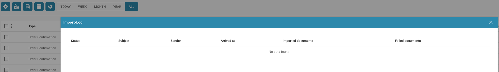

# Journal d'importation

Si vous souhaitez voir un journal détaillé de tous les documents importés dans votre environnement DocBits, suivez ces étapes.

Depuis votre tableau de bord DocBits, sélectionnez l'option Paramètres avancés.

<figure><figcaption></figcaption></figure>

Après l'apparition de la barre Paramètres avancés, sélectionnez le bouton Journal d'importation.

<figure><figcaption></figcaption></figure>

Un tableau apparaîtra alors avec tous les documents récemment importés ainsi que d'autres informations pertinentes les concernant.

<figure><figcaption></figcaption></figure>
