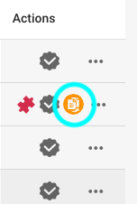
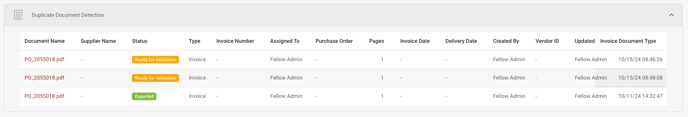

# Visualizando Documentos Duplicados

Nesta seção, você pode visualizar documentos que foram marcados como duplicados. Para começar, basta clicar no botão à direita, conforme indicado abaixo:

<figure><figcaption></figcaption></figure>

Uma vez que você pressione o botão, uma tabela aparecerá na parte inferior da página exibindo todos os duplicados identificados.

<figure><figcaption></figcaption></figure>
