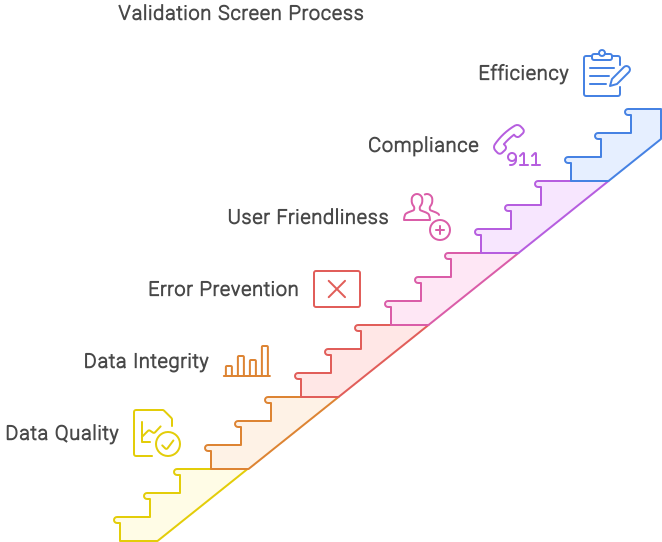

# Propósito y uso

## Descripción General:

La pantalla de validación en DocBits está diseñada para verificar la exactitud y la integridad de los datos contenidos en los documentos antes de que sean procesados o guardados. Esta funcionalidad es crucial para asegurar que todos los datos sean leídos y procesados correctamente, manteniendo así la integridad y calidad de los datos.

<figure><figcaption></figcaption></figure>

## Descripción Detallada del Propósito y Uso de la Pantalla de Validación

### Propósito de la Pantalla de Validación

* **Asegurar la Calidad de los Datos**: La pantalla de validación verifica la exactitud y la integridad de los datos extraídos para prevenir la entrada de información incorrecta o incompleta.
* **Integridad de los Datos**: Asegura que los datos cumplan con los requisitos y estándares especificados.
* **Prevención de Errores**: Al facilitar la detección y corrección temprana de errores, la pantalla de validación ayuda a mitigar posibles problemas durante el procesamiento de datos posterior.
* **Amigabilidad para el Usuario**: El sistema proporciona retroalimentación inmediata a los usuarios cuando se detectan errores o inconsistencias, permitiendo correcciones rápidas.
* **Cumplimiento**: La pantalla de validación ayuda a asegurar la adherencia a las regulaciones y estándares legales y organizacionales.
* **Eficiencia**: Reduce el esfuerzo requerido para futuras correcciones y minimiza la necesidad de revisiones manuales.

### Uso de la Pantalla de Validación

* **Extracción Automática de Datos**:
  * **Reconocimiento Óptico de Caracteres (OCR)**: Lee automáticamente texto de documentos escaneados o imágenes.
  * **Datos Estructurados y No Estructurados**: Procesa datos de varios tipos de documentos, incluyendo formularios, facturas y contratos.
* **Verificación y Validación de Datos**:
  * **Validación de Formato**: Asegura que los datos estén en los formatos correctos (por ejemplo, formatos de fecha, números de teléfono, direcciones de correo electrónico).
  * **Campos Requeridos**: Confirma que todos los campos obligatorios estén completos.
  * **Verificación de Rango**: Valida datos numéricos para asegurar que estén dentro de los límites especificados.
  * **Verificación de Consistencia**: Verifica que los campos de datos relacionados contengan información consistente (por ejemplo, asegurando que las fechas de inicio y fin coincidan).
* **Interacción del Usuario y Solución de Problemas**:
  * **Mensajes de Error**: Muestra mensajes de error claros y accionables cuando los datos no cumplen con los requisitos de validación.
  * **Revisión y Corrección Manual**: Permite a los usuarios revisar y corregir manualmente los datos cuando las validaciones automáticas fallan.
* **Limpieza y Estandarización de Datos**:
  * **Corrección Automática**: Sugiere o realiza correcciones automáticas cuando se detectan errores.
  * **Formateo de Datos**: Estandariza los formatos de datos para asegurar la consistencia entre conjuntos de datos.
* **Seguridad y Derechos de Acceso**:
  * **Filtros de Entrada**: Protege contra entradas maliciosas mediante mecanismos robustos de validación y filtrado.
  * **Control de Acceso**: Asegura que solo los usuarios autorizados puedan acceder y modificar datos sensibles.
* **Consistencia de Datos**:
  * **Validación Cruzada**: Verifica la consistencia entre campos de datos relacionados (por ejemplo, validando que las fechas de inicio y fin coincidan).
  * **Entradas Duplicadas**: Previene entradas duplicadas dentro de la base de datos.
* **Guía para el Usuario**:
  * **Mensajes de Error**: Proporciona mensajes de error específicos y comprensibles cuando las entradas no cumplen con los requisitos.
  * **Ayuda y Consejos**: Ofrece textos de ayuda o consejos para asistir a los usuarios en la correcta entrada de datos.

En resumen, la pantalla de validación en DocBits es fundamental para asegurar la calidad de los datos extraídos, facilitar la detección y corrección temprana de errores, y mejorar la eficiencia general de los flujos de trabajo de procesamiento de datos.
