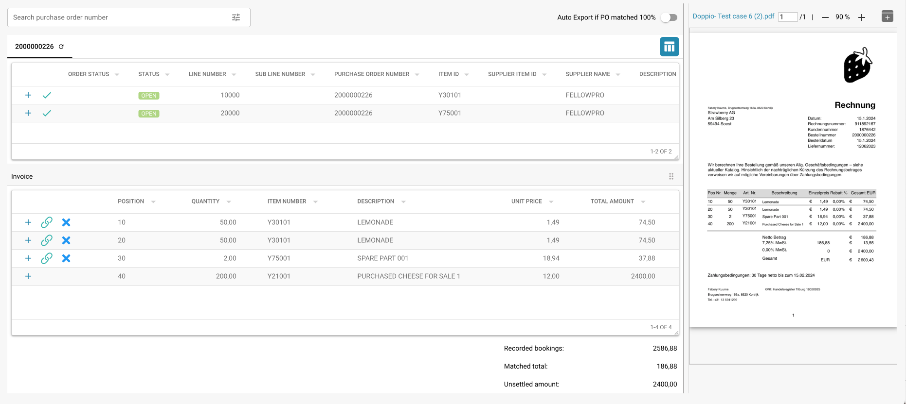

# Appariement des Bons de Commande

## Introduction

Ce document fournit un guide complet sur la façon d'utiliser le système de Correspondance des bons de commande au sein de votre plateforme ERP. Le système de correspondance des bons de commande automatise la réconciliation des bons de commande avec les factures entrantes, garantissant que les transactions financières sont précises et que les écarts sont traités rapidement.

## Pour Commencer

Pour commencer à utiliser le système de Correspondance des bons de commande, assurez-vous d'avoir les autorisations nécessaires définies par votre administrateur système. Vous aurez besoin d'accéder à la fois aux données des bons de commande et aux données des factures correspondantes dans le système.

## Exigences du Système

* Accès aux modules des bons de commande et des factures dans le système ERP.
* Autorisations utilisateur appropriées pour visualiser et faire correspondre des documents financiers.

## Fonctionnalités Clés

* **Extraction Automatique des Données :** Extrait et interprète automatiquement les données des factures numériques.
* **Comparaison des Données :** Compare les données extraites des factures avec les données des bons de commande existants.
* **Vérification des Correspondances :** Vérifie les correspondances en fonction de règles prédéfinies et de tolérances.
* **Signalement des** É**carts :** Identifie et signale les écarts entre les factures et les bons de commande.
* **Journal d'Audit :** Conserve un journal de toutes les actions à des fins de conformité et de révision.

<figure><figcaption></figcaption></figure>

## Interface Utilisateur

L'interface du système de Correspondance des bons de commande comprend généralement les composants suivants :

* **Tableau de Bord :** Aperçu de l'état des correspondances et des activités récentes.
* **Outils de Recherche et de Filtrage :** Capacités de recherche et de filtrage des bons de commande et des factures.
* **Enregistrements Correspondants :** Section affichant les enregistrements correspondants avec succès.
* **Écarts :** Section montrant les enregistrements avec des écarts nécessitant une révision ou une action.
* **Rapports :** Accès à des rapports détaillés et des options d'exportation.

## Guide **É**tape par **É**tape pour Utiliser la Correspondance des Bons de Commande

### 1. Accéder au Module de Correspondance des Bons de Commande

Accédez au module de Correspondance des bons de commande à partir du menu principal de votre système ERP.

### 2. Importer ou Accéder aux Factures

* **Importation automatisée :** Si votre système est configuré pour la capture automatique des données, les factures seront importées automatiquement dans le système.
* **Téléchargement manuel :** Si nécessaire, téléchargez manuellement les fichiers de factures dans le système en utilisant l'interface fournie.

### 3. Examiner les Factures Automatiquement Appariées

* Examinez les factures qui ont été automatiquement appariées avec les bons de commande.
* Vérifiez les détails de la correspondance, y compris les numéros d'article, les quantités et les prix.

### 4. Gérer les **É**carts

* Accédez à la section des écarts pour examiner les factures qui n'ont pas pu être appariées automatiquement.
* Ajustez manuellement les quantités ou les prix si nécessaire, ou signalez la facture pour une révision ultérieure.

### 5. Appariement Manuel

Pour les factures non appariées automatiquement :

* Utilisez les outils de recherche et de filtrage pour trouver le bon de commande correspondant.
* Vérifiez et appariez manuellement la facture avec le bon de commande.
