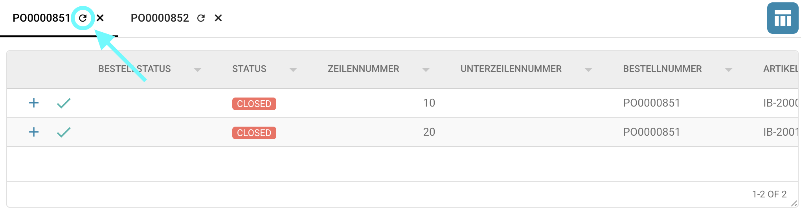

# Bestellnummer Abgleich Bildschirm

## Übersicht

Im **Bestellnummer Abgleich** Bildschirm können Sie die Positionen, die aus Ihrem Dokument extrahiert wurden, mit denen vergleichen, die im **Infor-System** gespeichert sind, wobei die Bestellnummer als Referenz dient.

Sie können:

* **Unterschiede** zwischen extrahierten und gespeicherten Daten sofort erkennen
* **Toleranzen festlegen**, um akzeptable Abweichungen zuzulassen
* **Bestimmte Status** von Infor ignorieren, falls erforderlich
* Das Dokument nach einem erfolgreichen Abgleich **genehmigen und exportieren**
* Das Dokument **ablehnen**, wenn die Daten die erforderlichen Validierungskriterien nicht erfüllen

Diese Seite führt Sie durch den Prozess des Bestellnummer Abgleichs und erklärt alle verwandten Funktionen, die in diesem Abschnitt verfügbar sind.

## Werkzeuge im Bestellnummer Abgleich Bildschirm

Oben im Bestellnummer Abgleich Bildschirm finden Sie mehrere Werkzeuge – wie **Speichern**, **Automatischer Abgleich**, **Exportieren** und andere –, die den Abgleichsprozess unterstützen.\
Eine detaillierte Beschreibung jedes Werkzeugs und seiner Funktionalität finden Sie [hier](../../end-user-and-partner-section/end-user-section/purchase-order-matching/purchase-order-matching-tools.md).


## Filter und Hinzufügen von Bestellnummern

Sie können nach bestimmten Bestellnummern suchen, indem Sie die Nummer in das Suchfeld eingeben.\
Für eine verfeinerte Filterung klicken Sie auf das Symbol auf der rechten Seite der Suchleiste, um spezifische Kriterien für Ihre Suche auszuwählen.


Die folgenden Filteroptionen stehen zur Verfügung, um Ihnen bei der Verfeinerung Ihrer Suche nach Bestellungen zu helfen:

* **Schlüsselwort** – Nach Bestellnummern filtern.
* **Lieferant** – Nach Lieferantennamen oder -ID filtern.
* **Nach Datum** – Bestellungen anzeigen, die nach einem bestimmten Datum erstellt wurden.
* **Vor Datum** – Bestellungen anzeigen, die vor einem bestimmten Datum erstellt wurden.
* **Mindestbestellwert** – Nach Mindestbestellwert filtern.
* **Maximaler Bestellwert** – Nach maximalem Bestellwert filtern.
* **Sortieren nach** – Attribut auswählen, nach dem die Ergebnisse sortiert werden sollen (z. B. Datum, Betrag).
* **Richtung sortieren** – Sortierreihenfolge wählen: aufsteigend oder absteigend.
* **Anzahl der anzuzeigenden Datensätze** – Definieren, wie viele Ergebnisse pro Seite angezeigt werden sollen.
* **Mehr** – Zusätzliche Filteroptionen umfassen:
  * **Nummer der Lieferung**
  * **Packzettel-Nummer**
  * **Artikel-ID**

Nachdem Sie Ihre Filter konfiguriert haben, klicken Sie auf **Anwenden**, um sie anzuwenden, oder auf **Löschen**, um alle Filtereinstellungen zurückzusetzen.

Die übereinstimmenden Bestellungen werden basierend auf den angewendeten Filtern angezeigt.\
Sie können entweder:

* Die Filter anpassen und erneut suchen oder
* Doppelklicken Sie auf einen Bestellposten, um ihn zum Bestellnummer Abgleich Bildschirm hinzuzufügen.


## Bestellnummern auswählen und Spalten anordnen

Sie können zwischen einzelnen Bestellungen wechseln, um deren jeweilige Positionen anzuzeigen, indem Sie auf die Bestellnummer oben in der Tabelle klicken.

Sie können auch die Spalten innerhalb jeder Bestellansicht anordnen, indem Sie sie einfach per Drag & Drop in Ihre bevorzugte Reihenfolge ziehen.


Um bestimmte Spalten dauerhaft auszublenden, verwenden Sie die [**Spalten der PO-Tabelle für die Organisation festlegen**](./#spalten-der-po-tabelle-fur-organisationen-festlegen) Funktion.

## Spalten der PO-Tabelle für Organisationen festlegen

Sie haben die Möglichkeit, bestimmte Spalten in der Bestelltabelle auszublenden oder anzuzeigen, indem Sie auf das Spalteneinstellungs-Symbol (siehe unten) klicken.\
Diese Einstellung ist sowohl im **Bestellnummer Abgleich** Bildschirm als auch im Menü **Erweiterte Bestellsuche** verfügbar.

.png>)

Zusätzliche Details finden Sie [hier](../../end-user-and-partner-section/end-user-section/purchase-order-matching/purchase-order-matching-tools.md#spalten-der-po-tabelle-fur-die-organisation-festlegen).

## Bestellnummer mit Infor neu synchronisieren

Um die Daten in **DocBits** mit den Daten von **Infor** zu synchronisieren, klicken Sie auf die **Aktualisieren**-Schaltfläche neben der Bestellnummer über der Tabelle.



Wenn Ihr Abgleichprozess auf dem Attribut **Empfangene Lieferung Offene Menge** basiert, haben Sie auch die Möglichkeit, eine **manuelle Synchronisierung** durchzuführen, wie im Detail [hier](../../end-user-and-partner-section/end-user-section/purchase-order-matching/purchase-order-matching-tools.md#daten-synchronisieren) beschrieben.


## Wie abgleichen?

Um einen Bestellposten mit einem aus dem Dokument extrahierten Posten abzugleichen, haben Sie drei Optionen:

1. **Drag and Drop**\
   Ziehen Sie den gewünschten Bestellposten und lassen Sie ihn auf den entsprechenden Posten in der extrahierten Tabelle fallen.
2. **Rechtsklick und Verbinden**
   * Klicken Sie mit der rechten Maustaste auf den Bestellposten, den Sie abgleichen möchten, und wählen Sie **Für Abgleich auswählen**.
   * Klicken Sie dann mit der rechten Maustaste auf den entsprechenden Posten in der extrahierten Tabelle und wählen Sie **Verbinden**.
3.  **Automatischer Abgleich**

    Klicken Sie auf die Schaltfläche **Automatischer Abgleich**, um das System automatisch zu versuchen, alle Posten basierend auf den extrahierten und Bestelldaten abzugleichen.

    

Sie können auch **mehrere Bestellposten** auswählen und diese mit einem **einzelnen Posten** in der extrahierten Tabelle abgleichen.

## Welche Spalten werden abgeglichen?

Der Bestellnummer Abgleich Prozess gleicht nur bestimmte Spalten ab. Die folgende Liste zeigt, welche Spalten abgeglichen werden, sofern verfügbar. Wenn keine [Toleranz](./#toleranzen-akzeptieren) festgelegt ist, werden die Spalten nur abgeglichen, wenn sie eine exakte (100%) Übereinstimmung aufweisen.

* [Menge](./#menge) (Menge | Empfangene Menge | Empfangene Lieferung Offene Menge)
* Einzelpreis
* Bestellnummer
* Artikelnummer/Lieferantenartikel-ID
* Bestätigtes Lieferdatum

### Menge

Sie haben drei Optionen für den Abgleich der Menge.

* Menge
* Empfangene Menge
* Empfangene Lieferung Offene Menge

Sie können diese Option in **Einstellungen → Globale Einstellungen → Dokumenttypen → Weitere Einstellungen → Bestellabschnitt → Bestellnummer** festlegen.

Die ausgewählte Mengenoption bestimmt, welche **Spalte für die Bestellmenge** während des Abgleichprozesses verwendet wird.

## **Status der verbrauchten Bestellposition**

Diese Funktion fügt den Bestellpositionen Farbcodierungen hinzu, um ihren Abgleichstatus auf einen Blick einfacher identifizieren zu können. Weitere Informationen finden Sie auf der [**Seite zum Status der verbrauchten Bestellposition**](../../administration-and-setup/settings/global-settings/document-types/more-settings/purchase-order/consumed-po-line-status.md).


## **Abschnitt** Versandauftrag

Dieser Abschnitt bietet einen visuellen Überblick darüber, wie viel für jedes Bestellposition geliefert und in Rechnung gestellt wurde. Es hilft, den Rechnungsfortschritt mithilfe von Mengenwerten und einer Fortschrittsleiste zu verfolgen.


Weitere Details finden Sie auf der [**Seite zur Versandauftrags-Einstellung**](../../administration-and-setup/settings/document-processing/module/po-shipment-order-setting.md).

## Toleranzen akzeptieren

Sie können akzeptable Toleranzniveaus während des Abgleichprozesses festlegen.\
Standardmäßig werden nur exakte (100%) Übereinstimmungen als gültig betrachtet.

Wenn Toleranzen in den Systemeinstellungen konfiguriert sind, können Sie diese für die zulässigen Attribute direkt in der **Extrahierten Tabelle** unter der Spalte **Aktionen** anpassen.


Für weitere Informationen zur Konfiguration und Verwendung von Toleranzen siehe die [detaillierte Dokumentation](../../administration-and-setup/settings/global-settings/document-types/more-settings/purchase-order/purchase-order-tolerance-settings-additional-purchase-order-tolerance.md).

## Status deaktivieren

Sie können bestimmte Zeilen mit bestimmten Status vom Abgleich ausschließen. Für weitere Informationen siehe die [detaillierte Dokumentation](../../administration-and-setup/settings/global-settings/document-types/more-settings/purchase-order/purchase-order-disable-statuses.md).

## Abgeglichene Zeilen überprüfen

Mehrere Indikatoren stehen zur Verfügung, um Ihnen zu helfen zu überprüfen, ob ein Posten erfolgreich abgeglichen wurde oder nicht.

### Bestelltabelle


* Dieses Symbol zeigt an, dass der Bestellposten erfolgreich abgeglichen wurde.


* Dieses Symbol zeigt an, dass der Bestellposten eine Abweichung enthält.


### Extrahierte Tabelle aus dem Dokument

*   Dieses Symbol zeigt an, dass der Posten erfolgreich abgeglichen wurde. Sie können über das Symbol fahren, um den entsprechenden Bestellposten hervorzuheben.

    
*   Dieses Symbol zeigt an, dass der Posten eine Abweichung enthält. Sie können über das Symbol fahren, um den entsprechenden Bestellposten hervorzuheben und die Spalten anzuzeigen, in denen Abweichungen auftreten.

    

## Mehrfachabgleiche

Wenn ein einzelner Posten mit mehreren Zeilen abgeglichen wird, können Sie detaillierte Informationen anzeigen, indem Sie auf das Plus (+) Symbol neben dem jeweiligen Posten klicken.

Dies erweitert die Ansicht, um alle abgeglichenen Einträge anzuzeigen, und hilft Ihnen, mehrere Abgleiche effektiv zu überprüfen und zu verwalten.


## PO-Verbindungen entfernen

Um eine Verbindung zwischen einem Bestellposten und einem extrahierten Posten zu entfernen, klicken Sie einfach auf das **X**-Symbol neben dem abgeglichenen Paar.\
Sobald entfernt, wird die Verbindung aufgehoben und der Posten wird wieder für den Abgleich verfügbar.


## Berechnung

Unter der Tabelle mit den Informationen, die aus Ihrem Dokument extrahiert wurden, finden Sie einfache Berechnungen, um zu überprüfen, ob die Gesamterfassungen übereinstimmen.

.png>)

### Erfasste Buchungen:

Der Wert der erfassten Buchungen ergibt sich aus dem Nettobetrag, der aus dem Dokument extrahiert wurde.

```
Erfasste Buchungen = Nettobetrag insgesamt (aus dem Dokument extrahiert)
```

### Abgestimmte Summe:

Dieser Wert wird berechnet, indem der **Einzelpreis** × **Menge** für alle Posten summiert wird, die erfolgreich mit den Posten aus der Bestellnummer abgeglichen wurden.

```
 Abgestimmte Summe = Summe von (Einzelpreis × Menge) für alle abgeglichenen Posten
```

### **Gebühren:**

Alle anfallenden Gebühren werden in diesem Abschnitt aufgeführt, falls vorhanden.\
Für weitere Details siehe die [detaillierte Dokumentation](../../admin-section/settings/document-processing/classification-and-extraction/table-extraction-for-costing-element.md).

```
Gebühren = Kostenelement
```

### Offener Betrag:

Die resultierende Differenz wird hier angezeigt und wie folgt berechnet:

```
Offener Betrag = Erfasste Buchungen - Abgestimmte Summe - Kostenelement
```

## Dokument zur Validierung anzeigen

Auf der rechten Seite des **Bestellnummer Abgleich** Bildschirms können Sie das Dokument zur Unterstützung bei der Validierung anzeigen.


**Funktionen der Dokumentenansicht Toolbar:**

* Durchblättern der Dokumentseiten, um den Inhalt zu überprüfen.
* Klicken Sie auf den Dateinamen, um den vollständigen Validierungsbildschirm zu öffnen.
* Geben Sie eine Seitenzahl ein und drücken Sie die Eingabetaste, um direkt zu dieser Seite zu springen.
* Verwenden Sie die Plus (+) und Minus (–) Tasten, um in das Dokument hinein- oder herauszuzoomen.
*   Klicken Sie auf die Schaltfläche ganz rechts, um das Dokument in einem separaten Fenster zu öffnen, was besonders nützlich ist, wenn Sie mit mehreren Bildschirmen arbeiten.

    

## Änderungen speichern:

Um Ihre Änderungen zu speichern, klicken Sie auf die Schaltfläche **Speichern** in der Toolbar.\
Wenn Sie die Seite ohne Speichern verlassen, gehen alle Fortschritte, die während des Abgleichprozesses gemacht wurden, verloren.

.png>)

## Dokument exportieren

Nachdem Sie alle Positionen abgeglichen und deren Richtigkeit validiert haben, können Sie das Dokument exportieren, indem Sie auf die Schaltfläche **Exportieren** in der Toolbar klicken.

* Ein Klick auf den kleinen Pfeil neben der Schaltfläche **Exportieren** zeigt alle verfügbaren Exportoptionen an.
* Ein Klick auf **Exportieren** direkt löst die Standard-Exportoption aus (die erste in der Liste).

.png>)
