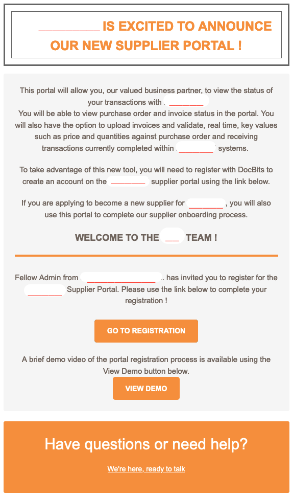
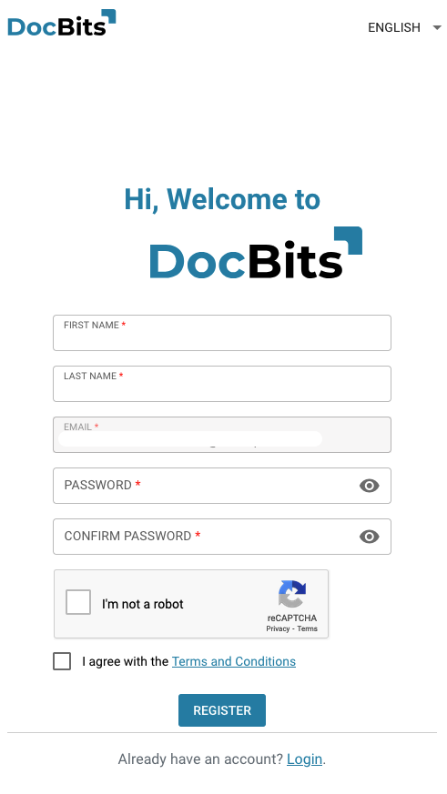
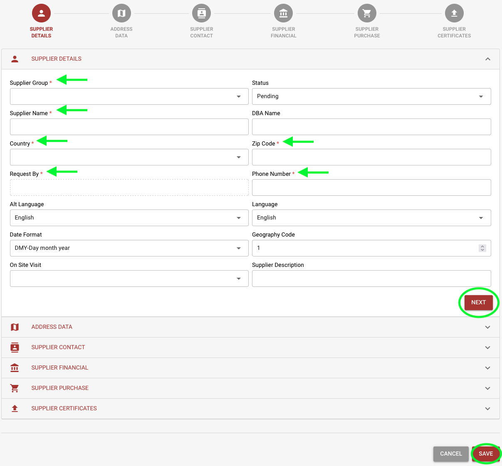
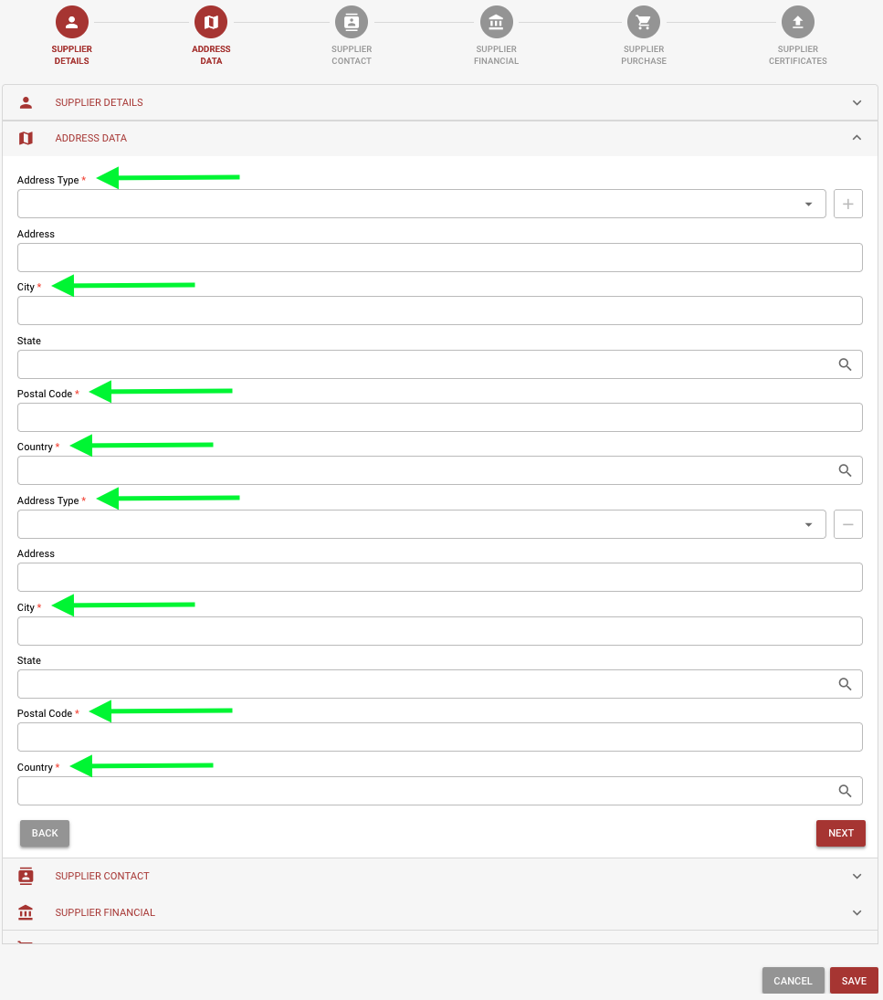
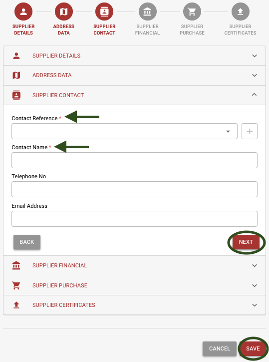
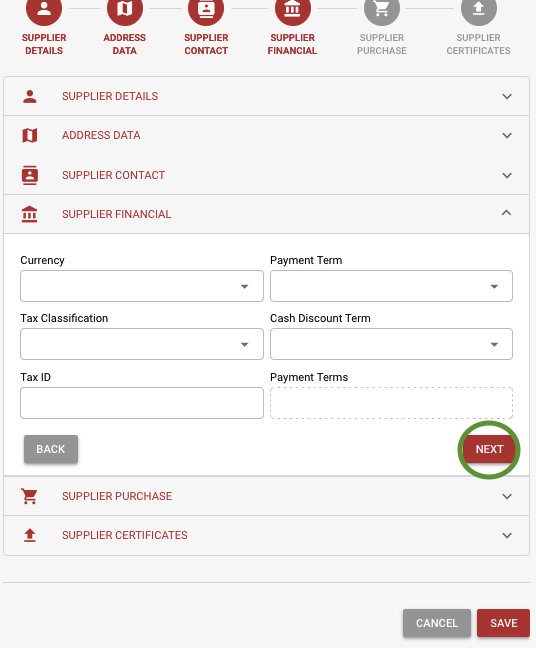
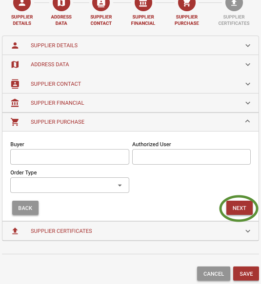
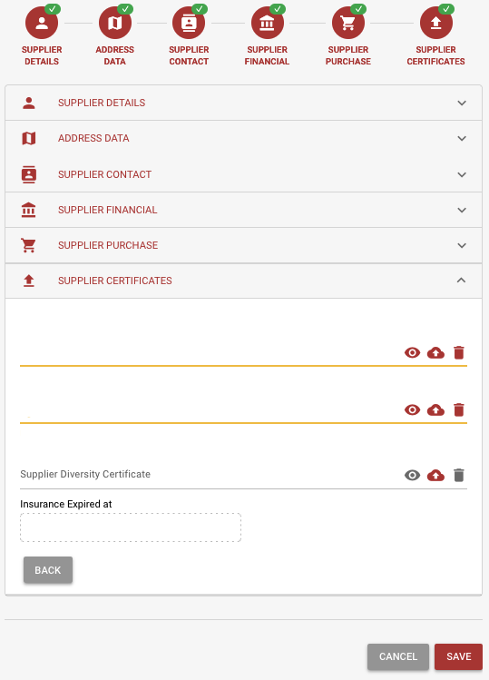
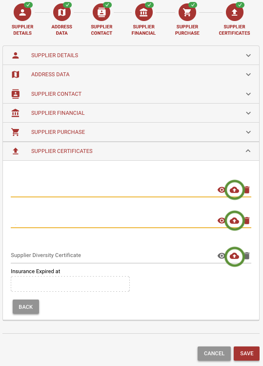
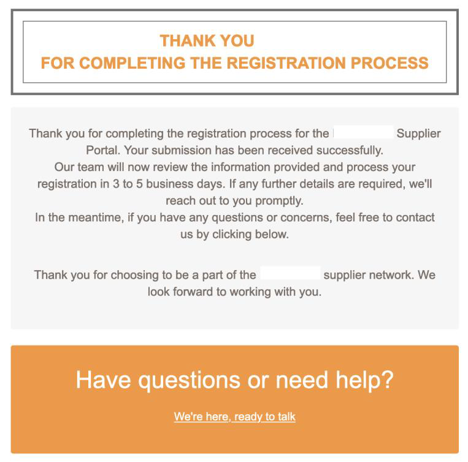

# Inscription du Fournisseur

1.  Vous recevrez une invitation avec un lien par E-mail pour commencer le processus d'inscription. Veuillez cliquer sur « Aller à l'inscription », soumettre les informations requises et accepter les termes et conditions pour commencer. \

    
<figure><figcaption></figcaption></figure> <figure><figcaption></figcaption></figure>

2.  **Détails du Fournisseur**

    Veuillez vérifier que le nom du Fournisseur est correct. C'est un détail critique pour des raisons d'identité et légales qui ne peut pas être modifié. Veuillez fournir toutes les informations applicables, y compris les champs requis. Une fois terminé, cliquez sur « Suivant » pour continuer vers la section Données d'Adresse. Pour enregistrer vos progrès et continuer plus tard, cliquez sur « Enregistrer ».\

    <figure><figcaption></figcaption></figure>
3.  **Données d'Adresse** Veuillez fournir toutes les informations applicables, y compris les champs requis. Une fois terminé, cliquez sur « Suivant » pour continuer vers la section Contact du Fournisseur. Pour enregistrer vos progrès et continuer plus tard, cliquez sur « Enregistrer ».\

    <figure><figcaption></figcaption></figure>
4.  **Contact du Fournisseur** Veuillez fournir toutes les informations applicables, y compris les champs requis. Une fois terminé, cliquez sur « Suivant » pour continuer vers la section Financière du Fournisseur. Pour enregistrer vos progrès et continuer plus tard, cliquez sur « Enregistrer ».\

    <figure><figcaption></figcaption></figure>
5.  **Financier du Fournisseur** Veuillez fournir toutes les informations applicables. Une fois terminé, cliquez sur « Suivant » pour continuer vers la section Achats du Fournisseur. Pour enregistrer vos progrès et continuer plus tard, cliquez sur « Enregistrer ».\

    <figure><figcaption></figcaption></figure>
6.  **Achats du Fournisseur** Veuillez fournir toutes les informations applicables. Une fois terminé, cliquez sur « Suivant » pour continuer vers la section Certificats du Fournisseur. Pour enregistrer vos progrès et continuer plus tard, cliquez sur « Enregistrer ».\

    <figure><figcaption></figcaption></figure>
7.  **Certificats du Fournisseur** Veuillez télécharger tous les certificats requis (Fiscal, Assurance, Diversification des Fournisseurs). Veuillez enregistrer vos progrès si vous devez revenir pour compléter le processus d'inscription plus tard. Une fois terminé, cliquez sur « Envoyer pour approbation ».\

    <figure><figcaption></figcaption></figure>
8.  Veuillez télécharger tous les certificats requis (Fiscal, Assurance, Diversification des Fournisseurs). Veuillez enregistrer vos progrès si vous devez revenir pour compléter le processus d'inscription plus tard. Une fois terminé, cliquez sur « Envoyer pour approbation ».\

    <figure><figcaption></figcaption></figure>
9.  Veuillez vérifier votre E-mail pour une confirmation que vous avez complété le processus d'inscription.\

    <figure><figcaption></figcaption></figure>
