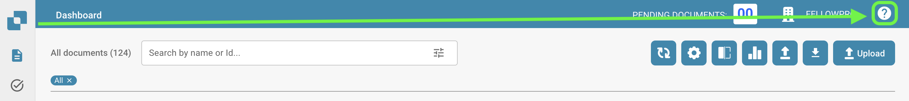

# Help Icons

Help icons have been placed all around DocBits in order to assist you in learning and understanding what a feature really does and how it can assist you with your document processing.

These help icons look as follows

<figure><figcaption></figcaption></figure>

