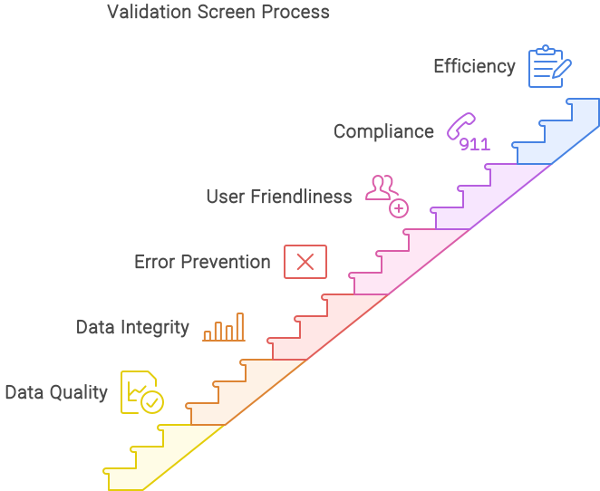

# Zweck und Verwendung

## Übersicht:

Der Validierungsbildschirm in DocBits ist darauf ausgelegt, die Genauigkeit und Vollständigkeit der in Dokumenten enthaltenen Daten zu überprüfen, bevor sie verarbeitet oder gespeichert werden. Diese Funktionalität ist entscheidend, um sicherzustellen, dass alle Daten korrekt gelesen und verarbeitet werden, wodurch die Datenintegrität und -qualität erhalten bleibt.

<figure><figcaption></figcaption></figure>

## Detaillierte Beschreibung des Zwecks und der Verwendung des Validierungsbildschirms

### Zweck des Validierungsbildschirms

* **Sicherstellung der Datenqualität**: Der Validierungsbildschirm überprüft die Genauigkeit und Vollständigkeit der extrahierten Daten, um die Eingabe falscher oder unvollständiger Informationen zu verhindern.
* **Datenintegrität**: Er stellt sicher, dass die Daten den festgelegten Anforderungen und Standards entsprechen.
* **Fehlervermeidung**: Durch die frühzeitige Erkennung und Korrektur von Fehlern hilft der Validierungsbildschirm, potenzielle Probleme während der nachfolgenden Datenverarbeitung zu mindern.
* **Benutzerfreundlichkeit**: Das System bietet sofortiges Feedback an Benutzer, wenn Fehler oder Inkonsistenzen erkannt werden, sodass schnelle Korrekturen möglich sind.
* **Einhaltung von Vorschriften**: Der Validierungsbildschirm hilft, die Einhaltung gesetzlicher und organisatorischer Vorschriften und Standards sicherzustellen.
* **Effizienz**: Er reduziert den Aufwand für zukünftige Korrekturen und minimiert die Notwendigkeit manueller Überprüfungen.

### Verwendung des Validierungsbildschirms

* **Automatische Datenerfassung**:
  * **Optische Zeichenerkennung (OCR)**: Liest automatisch Text aus gescannten Dokumenten oder Bildern.
  * **Strukturierte und unstrukturierte Daten**: Verarbeitet Daten aus verschiedenen Dokumenttypen, einschließlich Formularen, Rechnungen und Verträgen.
* **Überprüfung und Validierung von Daten**:
  * **Formatvalidierung**: Stellt sicher, dass Daten in den richtigen Formaten vorliegen (z.B. Datumsformate, Telefonnummern, E-Mail-Adressen).
  * **Erforderliche Felder**: Bestätigt, dass alle Pflichtfelder ausgefüllt sind.
  * **Bereichsprüfung**: Validiert numerische Daten, um sicherzustellen, dass sie innerhalb festgelegter Grenzen liegen.
  * **Konsistenzprüfung**: Überprüft, ob verwandte Datenfelder konsistente Informationen enthalten (z.B. Sicherstellung, dass Start- und Enddaten übereinstimmen).
* **Benutzerinteraktion und Fehlerbehebung**:
  * **Fehlermeldungen**: Zeigt klare und umsetzbare Fehlermeldungen an, wenn Daten die Validierungsanforderungen nicht erfüllen.
  * **Manuelle Überprüfung und Korrektur**: Ermöglicht Benutzern, Daten manuell zu überprüfen und zu ändern, wenn automatische Validierungen fehlschlagen.
* **Datenbereinigung und Standardisierung**:
  * **Automatische Korrektur**: Schlägt automatische Korrekturen vor oder führt sie durch, wenn Fehler erkannt werden.
  * **Datenformatierung**: Standardisiert Datenformate, um Konsistenz über Datensätze hinweg sicherzustellen.
* **Sicherheit und Zugriffsrechte**:
  * **Eingabefilter**: Schützt vor bösartigen Eingaben durch robuste Validierungs- und Filtermechanismen.
  * **Zugriffskontrolle**: Stellt sicher, dass nur autorisierte Benutzer auf sensible Daten zugreifen und diese ändern können.
* **Datenkonsistenz**:
  * **Kreuzvalidierung**: Überprüft die Konsistenz zwischen verwandten Datenfeldern (z.B. Validierung, dass Start- und Enddaten übereinstimmen).
  * **Doppelte Einträge**: Verhindert doppelte Einträge in der Datenbank.
* **Benutzerführung**:
  * **Fehlermeldungen**: Bietet spezifische und verständliche Fehlermeldungen, wenn Eingaben nicht den Anforderungen entsprechen.
  * **Hilfe und Hinweise**: Bietet Hilfetexte oder Tooltips, um Benutzern bei der korrekten Dateneingabe zu helfen.

Zusammenfassend ist der Validierungsbildschirm in DocBits entscheidend für die Sicherstellung der Qualität der extrahierten Daten, die frühzeitige Fehlererkennung und -korrektur sowie die Verbesserung der Gesamteffizienz von Datenverarbeitungsabläufen.
