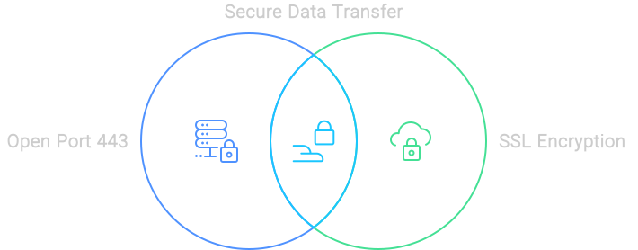
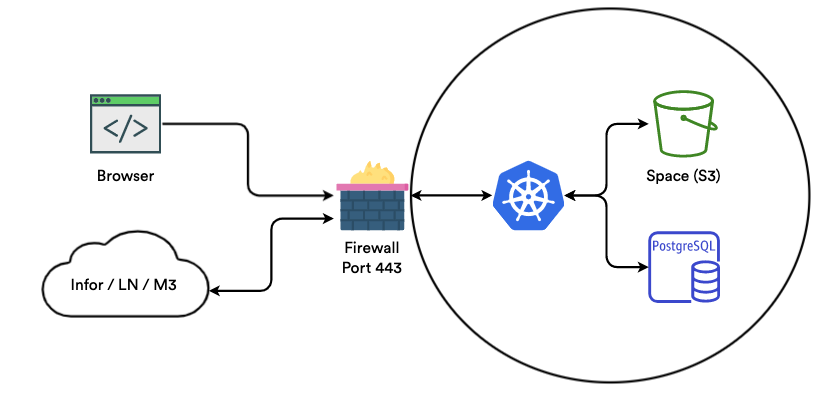
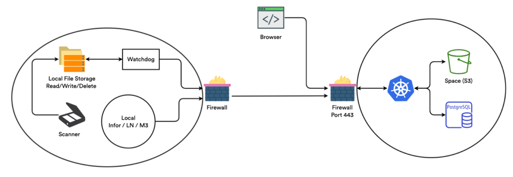

# Infor Infrastructure

### Open Port 443 & Secure Communication

We understand the importance of secure data transfer. That’s why we use open port 443, the standard port for HTTPS, ensuring that all data transferred is encrypted and secure. Our SSL-secured connections guarantee that your data is safe during every step of the process.

<figure><figcaption>
Secure Data Transfer
</figcaption></figure>

### Communication With The Database

When it comes to database communication, we don’t take any chances. Our Kubernetes setup and databases reside within the same Virtual Private Cloud (VPC). This means we only access the database via local IP, ensuring that the transmitted data never leaves the local network. It’s like having a private highway just for your data.

### Spaces

Document handling is a breeze with Docbits. All uploaded documents are securely stored in a dedicated ‘Space’. We use SSL encryption for data traffic and require multiple keys for file access, making sure your documents are as secure as a vault.

### Traffic Security

We only allow HTTPS-secured connections for communicating with our servers. This ensures that all data transferred is encrypted, keeping your sensitive information safe and sound. It’s like having a security guard for your data, 24/7.

### Infor Cloud

<figure><figcaption></figcaption></figure>

### Infor On-Prem

Flexibility is key, and we offer both cloud and on-premise solutions. With our on-premise option, there’s no need to open any ports, ensuring that your network security remains uncompromised. Whether you’re in the cloud or keeping things in-house, we’ve got you covered.

<figure><figcaption></figcaption></figure>
