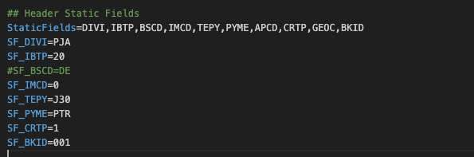

# Export to M3 Mapping (API)

### Sections

M3 export mapping file is divided in 5 sections and each section is further divided into 2 sections

* Header
  * Header Static Fields
  * Header Fields
* Tax Lines
  * Tax Line Static Fields
  * Tax Line Fields
* Receipt Lines
  * Receipt Line Static Fields
  * Receipt Line Fields
* Order Charge Lines (Additional Amounts)
  * Order Charge Static Fields
  * Order Charge Fields
* Cost Lines
  * Cost Line Static Fields
  * Cost Line Fields

### Adding and Removing Fields

Adding New Field:

* First we need to add the **M3 api field name** to the relevant section’s fields list property (e.g. StaticFields, HeaderFields, InvoiceTaxFields)
* Define the static value or document field name for the api field with appropriate prefix for the section
  * Example 1: To define a static value of **AAA** for the M3 api field **DIVI.** First we added DIVI to **StaticFields** property. Then we add a line **SF\_DIVI = AAA** as SF\_ is the prefix for static fields
  * Example2: To map header field **IVDT (invoice data)** to invoice\_date field of DocBits. First we add IVDT to **HeaderFields** property. Then we add a line HF\_IVDT = invoice\_date as HF\_ is the prefix for header fields

Removing Field:

* Just remove the field from section’s field list property and remove the line defining value for the field.

#### **Available M3 Api Fields:**

* Available M3 fields can be checked by opening appropriate screen in M3.

<figure><figcaption></figcaption></figure>

<figure><figcaption></figcaption></figure>

* Similarly you can get field names for lines

### Header:

<figure><figcaption></figcaption></figure>

Fields List Property: StaticFields

Section Fields Prefix: SF\_

Available Fields: You can map any M3 api field with any static value

#### **Header Fields**

Fields List Property: HeaderFields

Section Fields Prefix: HF\_

Available Fields: You can map any DocBits field to any M3 api field

### Tax Line:

#### Tax Line Static Fields:

Fields List Property: InvoiceTaxStaticFields

Section Fields Prefix: IT\_SF\_

Available M3 Fields: Please check M3 API or UI

Available DocBits Fields: You can put any value as they are static fields

#### Tax Line Fields:

Fields List Property: InvoiceTaxFields

M3 Fields Prefix: ITF\_

DocBits Table Field Prefix: TF\_

Available M3 Fields: Please check M3 API or UI

Available DocBits Fields: line\_number, tax\_amount, tax\_rate, net\_amount, gross\_amount, tax\_code\_full, tax\_code, tax\_country

### Receipt Line:

#### Receipt Line Static Fields:

Fields List Property: InvoiceReceiptStaticFields

Section Fields Prefix: IR\_SF\_

Available M3 Fields: Please check M3 API or UI

Available DocBits Fields: You can put any value as they are static fields

#### Receipt Line Fields:

Fields List Property: InvoiceReceiptFields

M3 Fields Prefix: IRF\_

DocBits Table Field Prefix: TF\_

Available M3 Fields: Please check M3 API or UI

Available DocBits Fields: packing\_slip, purchase\_order, line\_number, line\_sequence, delivery\_number, delivery\_line, amount, quantity, total\_net\_amount

### Order Charge Line:

#### Order Charge Static Fields:

Fields List Property: OrderChargeStaticFields

Section Fields Prefix: OC\_SF\_

Available M3 Fields: Please check M3 API or UI

Available DocBits Fields: You can put any value as they are static fields

#### Order Charge Fields:

Fields List Property: OrderChargeFields

M3 Fields Prefix: OCF\_

DocBits Table Field Prefix: TF\_

Available M3 Fields: Please check M3 API or UI

Available DocBits Fields: ledger\_account, dimension\_2-7, amount, quantity, quantity2, position

### Cost Line:

#### Cost Line Static Fields:

Fields List Property: InvoiceCostStaticFields

Section Fields Prefix: IC\_SF\_

Available M3 Fields: Please check M3 API or UI

Available DocBits Fields: You can put any value as they are static fields

#### Cost Line Fields:

Fields List Property: InvoiceCostFields

M3 Fields Prefix: ICF\_

DocBits Table Field Prefix: TF\_

Available M3 Fields: Please check M3 API or UI

Available DocBits Fields: ledger\_account, dimension\_1-12, amount, quantity, quantity2, position

New update

```
###########################
# Header
###########################

## Header Static Fields
StaticFields=DIVI,IBTP,BSCD,IMCD,TEPY,PYME,APCD,CRTP,GEOC,CONO,BKID
SF_DIVI=AAA
SF_IBTP=20
SF_CONO=780
#SF_BSCD=DE
SF_IMCD=0
SF_TEPY=N00
SF_PYME=SCT
SF_APCD=FABCEO
SF_CRTP=1
SF_GEOC=60290522

## Header Fields
HeaderFields=SUNO,IVDT,SINO,SPYN,CUCD,CUAM,VTAM,ACDT,SERS,FTCO,BSCD,PUNO,TXAP,CORI,PAIN,BKID
HF_SUNO=supplier_id
HF_IVDT=invoice_date
HF_SINO=invoice_id
HF_SPYN=supplier_id
HF_CUCD=currency
HF_CUAM=total_net_amount
#HF_VTAM=total_tax_amount
HF_ACDT=invoice_date
#HF_SERS=invoice_sub_type
HF_FTCO=supplier_country_code
HF_PUNO=purchase_order
HF_TXAP=tax_country_1
HF_CORI = correlation_id
HF_PAIN = sqr_field_esr_reference
HF_BKID = custom_field_1


###########################
# Tax Line
###########################

# ## Tax Line Static Fields
# InvoiceTaxStaticFields=RDTP,DIVI,VTCD,CONO
# IT_SF_RDTP=3
# IT_SF_DIVI=AAA
# IT_SF_CONO=780

# ## Tax Line Fields
# InvoiceTaxFields=VTCD,VTA1,VTP1,CLAM
# ITF_VTCD=TF_tax_code
# ITF_VTA1=TF_tax_amount
# ITF_VTP1=TF_tax_rate
# ITF_CLAM=TF_gross_amount

###########################
# Receipt Line
###########################

InvoiceReceipt=invoice_table

## Receipt Line Static Fields
InvoiceReceiptStaticFields=RDTP,DIVI,SERS,RELP,VTCD,CONO
IR_SF_RDTP=1
IR_SF_DIVI=AAA
IR_SF_SERS=0
IR_SF_RELP=1
#IR_SF_VTCD=52
IR_SF_CONO=780

## Receipt Line Fields
InvoiceReceiptFields=IVQA,PUUN,PUNO,PNLI,ITNO,POPN,SUDO,NEPR,GRPR,PPUN,NLAM,GLAM
IRF_IVQA = TF_quantity
IRF_PUUN = TF_unit
IRF_PUNO = TF_purchase_order
IRF_PNLI = TF_line_number
IRF_ITNO = TF_item_number
IRF_POPN = TF_item_number
IRF_SUDO = TF_packing_slip
#IRF_NEPR = TF_net_unit_price
IRF_GRPR = TF_gross_unit_price
IRF_PPUN = TF_unit
#IRF_NLAM = TF_net_amount
IRF_GLAM = TF_total_amount

###########################
# Order Charge Line
###########################

OrderCharge=order_charges

## Order Charge Static Fields
OrderChargeStaticFields=RDTP,DIVI,CONO
OC_SF_RDTP=2
OC_SF_DIVI=AAA
OC_SF_CONO=780

## Order Charge Fields
OrderChargeFields=NLAM,CHGT,CEID
OCF_NLAM=TF_amount
OCF_CHGT=TF_voucher_text
OCF_CEID=TF_ledger_account


###########################
# Cost Line
###########################

InvoiceCost=cost_lines

## Cost Line Static Fields
InvoiceCostStaticFields=RDTP,DIVI,CONO
IC_SF_RDTP=8
IC_SF_DIVI=AAA
IC_SF_CONO=780

## Cost Line Fields
InvoiceCostFields=NLAM,VTXT,AO01,AO02,AO03,AO04,AO05,AO06,AO07,VTCD,AIT1,AIT2,AIT3,AIT4,AIT5,AIT6,AIT7,VTP1,VTP2
ICF_NLAM=TF_amount
ICF_VTXT=TF_voucher_text
ICF_AIT1=TF_ledger_account
ICF_AIT2=TF_dimension_2
ICF_AIT3=TF_dimension_3
ICF_AIT4=TF_dimension_4
ICF_AIT5=TF_dimension_5
ICF_AIT6=TF_dimension_6
ICF_AIT7=TF_dimension_7
ICF_AO01=TF_accounting_object_1
ICF_AO02=TF_accounting_object_2
ICF_AO03=TF_accounting_object_3
ICF_AO04=TF_accounting_object_4
ICF_AO05=TF_accounting_object_5
ICF_AO06=TF_accounting_object_6
ICF_AO07=TF_accounting_object_7
```

### For US Customer we update this mapping to V3

````
```
# Changes from Version 2 to Version 3:# -StaticFields=DIVI,IBTP,BSCD,IMCD,TEPY,PYME,APCD,CRTP,GEOC,BKID
# -SF_DIVI=PJA
# +StaticFields=DIVI,IBTP,BSCD,IMCD,TEPY,PYME,APCD,CRTP,CONO,GEOC
# +SF_DIVI=RFP
# +SF_CONO=001
# -SF_TEPY=J30
# -SF_PYME=PTR
# +#SF_TEPY=N00
# +#SF_PYME=CSH
# +#SF_APCD=MHIDALGO
# -SF_BKID=001
# +SF_GEOC=999999999
# +#SF_BKID=DJ1
# -HeaderFields=SUNO,IVDT,SINO,SPYN,CUCD,CUAM,VTAM,ACDT,SERS,FTCO,BSCD,PUNO,TXAP,CORI,PAIN
# +HeaderFields=SUNO,IVDT,SINO,SPYN,CUCD,CUAM,VTAM,ACDT,SERS,FTCO,BSCD,PUNO,TXAP,CORI,PAIN,TCHG,CDC1,APCD,TEPY,PYME,BKID
# -HF_CUAM=total_net_amount
# +HF_CUAM=total_net_amount_us
# -HF_ACDT=invoice_date
# +#HF_ACDT=invoice_date
# -HF_CORI = correlation_id
# -HF_PAIN = sqr_field_esr_reference
# -
# +HF_CORI=correlation_id
# +HF_PAIN=sqr_field_esr_reference
# +HF_TCHG=additional_amount
# +HF_CDC1=negative_amount
# +HF_APCD=buyer_id
# +HF_TEPY=payment_terms
# +HF_PYME=payment_method
# +HF_BKID=bank_id
# +#HF_GEOC=supplier_geoc
# -## Tax Line Static Fields
# -InvoiceTaxStaticFields=RDTP,DIVI,VTCD
# -IT_SF_RDTP=3
# -IT_SF_DIVI=PJA
# +# ## Tax Line Static Fields
# +# InvoiceTaxStaticFields=RDTP,DIVI,VTCD,CONO
# +# IT_SF_RDTP=3
# +# IT_SF_DIVI=AAA
# +# IT_SF_CONO=780
# -## Tax Line Fields
# -InvoiceTaxFields=VTCD,VTA1,VTP1,CLAM
# -ITF_VTCD=TF_tax_code
# -ITF_VTA1=TF_tax_amount
# -ITF_VTP1=TF_tax_rate
# -ITF_CLAM=TF_gross_amount
# +# ## Tax Line Fields
# +# InvoiceTaxFields=VTCD,VTA1,VTP1,CLAM
# +# ITF_VTCD=TF_tax_code
# +# ITF_VTA1=TF_tax_amount
# +# ITF_VTP1=TF_tax_rate
# +# ITF_CLAM=TF_gross_amount
# -InvoiceReceiptStaticFields=RDTP,DIVI,SERS,RELP,VTCD
# +InvoiceReceiptStaticFields=RDTP,DIVI,SERS,RELP,VTCD,CONO
# -IR_SF_DIVI=PJA
# -IR_SF_SERS=0
# +IR_SF_DIVI=RFP
# -IR_SF_VTCD=52
# +#IR_SF_VTCD=52
# +IR_SF_CONO=001
# -InvoiceReceiptFields=IVQA,PUUN,PUNO,PNLI,ITNO,POPN,SUDO,NEPR,GRPR,PPUN,NLAM,GLAM
# +InvoiceReceiptFields=IVQA,PUUN,PUNO,PNLI,ITNO,POPN,SUDO,NEPR,GRPR,PPUN,NLAM,GLAM,TCHG,CDC1
# -#IRF_PUNO = TF_purchase_order
# -#IRF_PNLI = TF_line_number
# +IRF_PUNO = TF_purchase_order
# +IRF_PNLI = TF_line_number
# -#IRF_NEPR = TF_net_unit_price
# +IRF_NEPR = TF_net_unit_price
# -IRF_PPUN = TF_unit
# -#IRF_NLAM = TF_net_amount
# +IRF_PPUN = TF_unit_code_price
# +IRF_NLAM = TF_net_amount
# +IRF_TCHG = TF_charges
# +IRF_CDC1 = TF_discount
# -OrderChargeStaticFields=RDTP,DIVI
# +OrderChargeStaticFields=RDTP,DIVI,CONO
# -OC_SF_DIVI=PJA
# +OC_SF_DIVI=RFP
# +OC_SF_CONO=001
# -InvoiceCostStaticFields=RDTP,DIVI
# +InvoiceCostStaticFields=RDTP,DIVI,CONO
# -IC_SF_DIVI=PJA
# +IC_SF_DIVI=RFP
# +IC_SF_CONO=001

###########################
# Header
###########################

## Header Static Fields
StaticFields=DIVI,IBTP,BSCD,IMCD,TEPY,PYME,APCD,CRTP,CONO,GEOC
SF_DIVI=RFP
SF_IBTP=20
SF_CONO=001
#SF_BSCD=DE
SF_IMCD=0
#SF_TEPY=N00
#SF_PYME=CSH
#SF_APCD=MHIDALGO
SF_CRTP=1
SF_GEOC=999999999
#SF_BKID=DJ1

## Header Fields
HeaderFields=SUNO,IVDT,SINO,SPYN,CUCD,CUAM,VTAM,ACDT,SERS,FTCO,BSCD,PUNO,TXAP,CORI,PAIN,TCHG,CDC1,APCD,TEPY,PYME,BKID
HF_SUNO=supplier_id
HF_IVDT=invoice_date
HF_SINO=invoice_id
HF_SPYN=supplier_id
HF_CUCD=currency
HF_CUAM=total_net_amount_us
#HF_VTAM=total_tax_amount
#HF_ACDT=invoice_date
#HF_SERS=invoice_sub_type
HF_FTCO=supplier_country_code
HF_PUNO=purchase_order
HF_TXAP=tax_country_1
HF_CORI=correlation_id
HF_PAIN=sqr_field_esr_reference
HF_TCHG=additional_amount
HF_CDC1=negative_amount
HF_APCD=buyer_id
HF_TEPY=payment_terms
HF_PYME=payment_method
HF_BKID=bank_id
#HF_GEOC=supplier_geoc

###########################
# Tax Line
###########################

# ## Tax Line Static Fields
# InvoiceTaxStaticFields=RDTP,DIVI,VTCD,CONO
# IT_SF_RDTP=3
# IT_SF_DIVI=AAA
# IT_SF_CONO=780

# ## Tax Line Fields
# InvoiceTaxFields=VTCD,VTA1,VTP1,CLAM
# ITF_VTCD=TF_tax_code
# ITF_VTA1=TF_tax_amount
# ITF_VTP1=TF_tax_rate
# ITF_CLAM=TF_gross_amount

###########################
# Receipt Line
###########################

InvoiceReceipt=invoice_table

## Receipt Line Static Fields
InvoiceReceiptStaticFields=RDTP,DIVI,SERS,RELP,VTCD,CONO
IR_SF_RDTP=1
IR_SF_DIVI=RFP
IR_SF_RELP=1
#IR_SF_VTCD=52
IR_SF_CONO=001

## Receipt Line Fields
InvoiceReceiptFields=IVQA,PUUN,PUNO,PNLI,ITNO,POPN,SUDO,NEPR,GRPR,PPUN,NLAM,GLAM,TCHG,CDC1
IRF_IVQA = TF_quantity
IRF_PUUN = TF_unit
IRF_PUNO = TF_purchase_order
IRF_PNLI = TF_line_number
IRF_ITNO = TF_item_number
IRF_POPN = TF_item_number
IRF_SUDO = TF_packing_slip
IRF_NEPR = TF_net_unit_price
IRF_GRPR = TF_gross_unit_price
IRF_PPUN = TF_unit_code_price
IRF_NLAM = TF_net_amount
IRF_GLAM = TF_total_amount
IRF_TCHG = TF_charges
IRF_CDC1 = TF_discount

###########################
# Order Charge Line
###########################

OrderCharge=order_charges

## Order Charge Static Fields
OrderChargeStaticFields=RDTP,DIVI,CONO
OC_SF_RDTP=2
OC_SF_DIVI=RFP
OC_SF_CONO=001

## Order Charge Fields
OrderChargeFields=NLAM,CHGT,CEID
OCF_NLAM=TF_amount
OCF_CHGT=TF_voucher_text
OCF_CEID=TF_ledger_account


###########################
# Cost Line
###########################

InvoiceCost=cost_lines

## Cost Line Static Fields
InvoiceCostStaticFields=RDTP,DIVI,CONO
IC_SF_RDTP=8
IC_SF_DIVI=RFP
IC_SF_CONO=001

## Cost Line Fields
InvoiceCostFields=NLAM,VTXT,AO01,AO02,AO03,AO04,AO05,AO06,AO07,VTCD,AIT1,AIT2,AIT3,AIT4,AIT5,AIT6,AIT7,VTP1,VTP2
ICF_NLAM=TF_amount
ICF_VTXT=TF_voucher_text
ICF_AIT1=TF_ledger_account
ICF_AIT2=TF_dimension_2
ICF_AIT3=TF_dimension_3
ICF_AIT4=TF_dimension_4
ICF_AIT5=TF_dimension_5
ICF_AIT6=TF_dimension_6
ICF_AIT7=TF_dimension_7
ICF_AO01=TF_accounting_object_1
ICF_AO02=TF_accounting_object_2
ICF_AO03=TF_accounting_object_3
ICF_AO04=TF_accounting_object_4
ICF_AO05=TF_accounting_object_5
ICF_AO06=TF_accounting_object_6
ICF_AO07=TF_accounting_object_7
```
````
