# Esporta Codici Fiscali in LN

## **Panoramica:**

\
Questa guida ti guiderà attraverso il processo di configurazione per garantire che i codici fiscali siano correttamente esportati da DocBits a LN.

## **Codici Fiscali Singoli**

### **Passo 1: Configura Elenco di Valori**

1.  Vai su **Impostazioni** -> **Elaborazione Documenti** -> **Elenco di Valori**.

    <figure>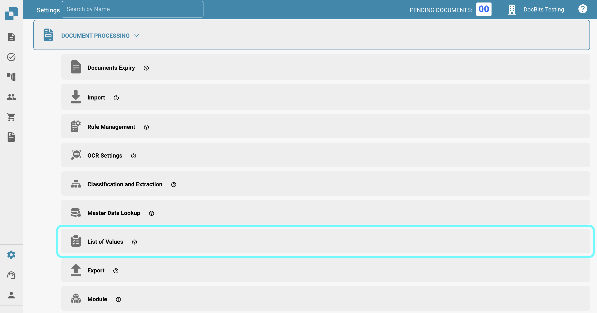<figcaption></figcaption></figure>
2.  Clicca su **Nuovo**.

    <figure>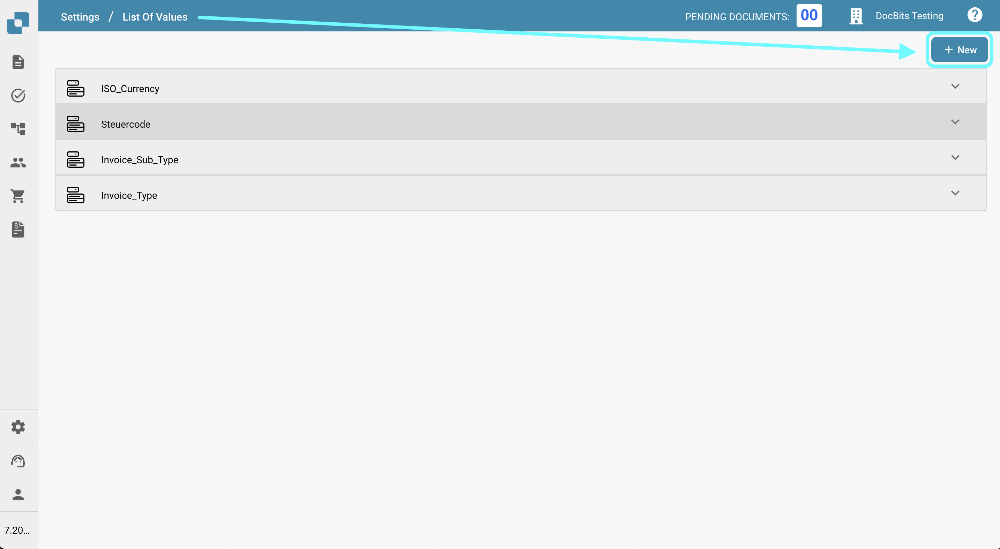<figcaption></figcaption></figure>
3.  Crea un elenco con il nome `Tax_Country` e clicca su **Salva**.

    <figure>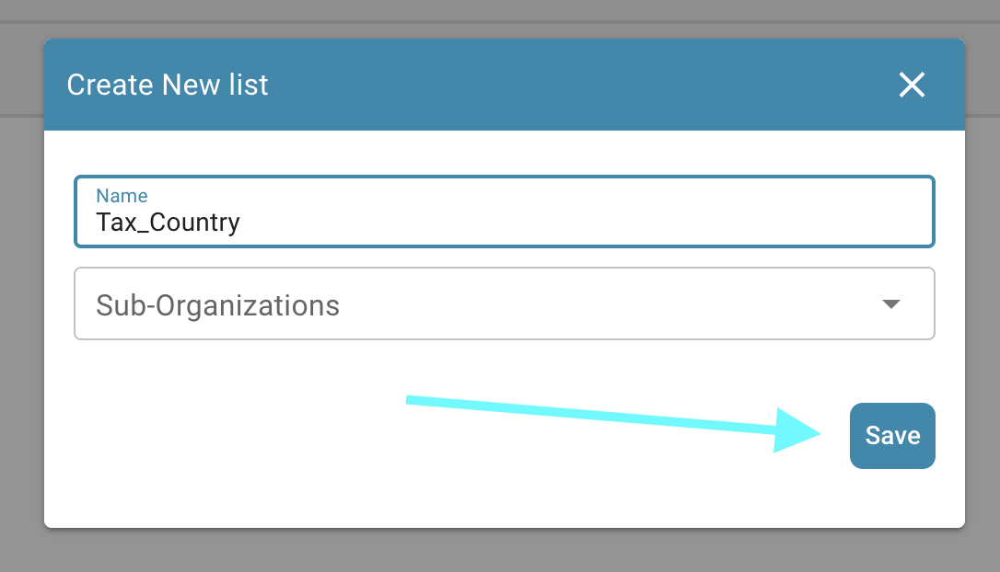<figcaption></figcaption></figure>
4.  Crea i seguenti tre elenchi aggiuntivi:

    * `Tax_Code_Full`
    * `Tax_Code_Reduced`
    * `Tax_Code_Free`

    
<figure>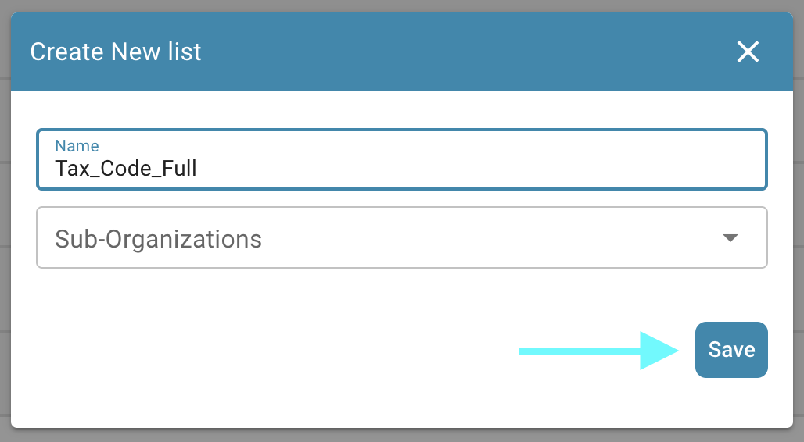<figcaption></figcaption></figure> <figure><figcaption></figcaption></figure> <figure><figcaption></figcaption></figure>

5.  Clicca su uno degli elenchi appena creati per aprirlo. Poi, premi il pulsante **Aggiungi riga** per aggiungere una nuova riga.

    <figure>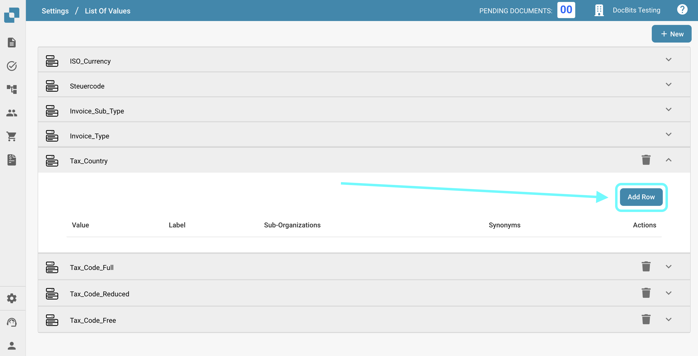<figcaption></figcaption></figure>
6.  Inserisci i valori rispettivi desiderati da **LN** e premi **Salva** per salvare le modifiche.

    * Se hai più valori, puoi cliccare su **Aggiungi altri valori** per aggiungerli.

    
<figure>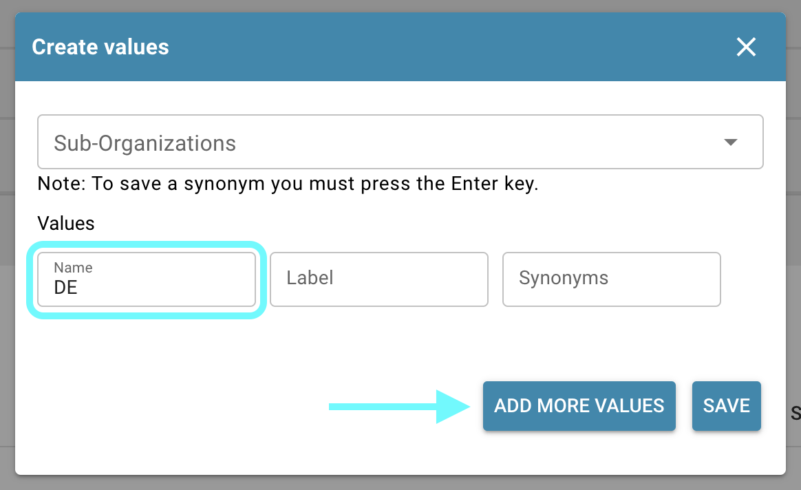<figcaption></figcaption></figure> <figure><figcaption></figcaption></figure>

    * **NOTA:** Puoi trovare i Codici Fiscali in LN sotto: **Common** → **Taxation** → **Master Data** → **Tax Codes** → **Tax Codes by Country**

    <figure>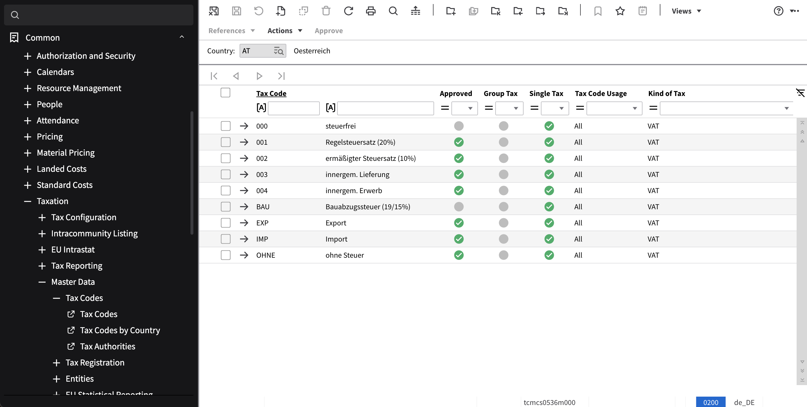<figcaption></figcaption></figure>

### **Passo 2: Aggiungi Campi in DocBits**

1.  Naviga su **Impostazioni** -> **Impostazioni Globali** -> **Tipi di Documento**.

    <figure>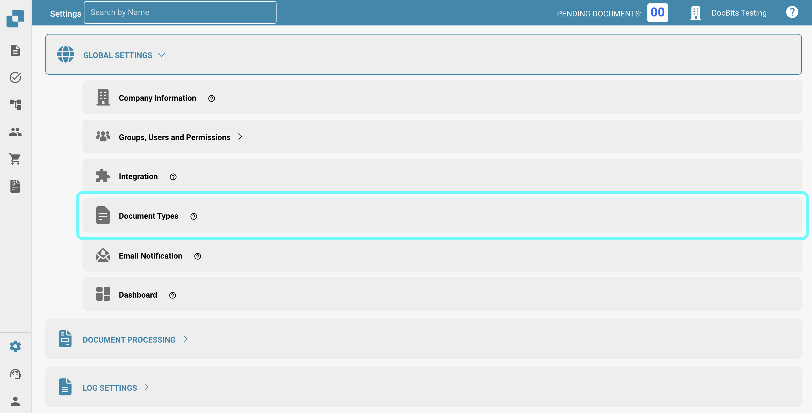<figcaption></figcaption></figure>
2.  Scegli il menu **Campi** corrispondente al Tipo di Documento dove desideri aggiungere i campi.

    <figure>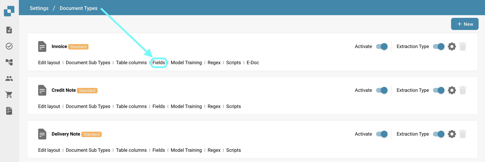<figcaption></figcaption></figure>
3.  Sotto **IVA & IMPORTI**, crea sei nuovi campi come segue:

    <figure>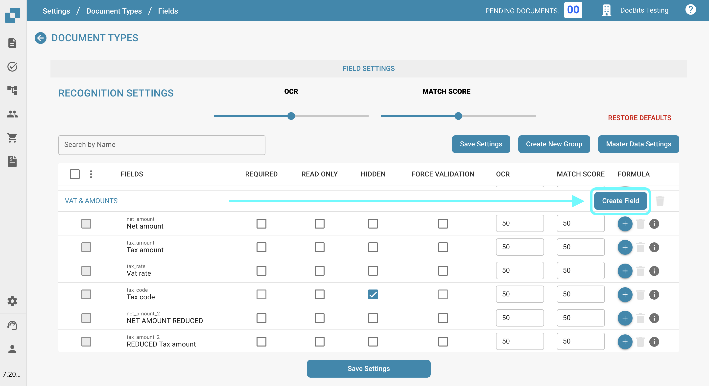<figcaption></figcaption></figure>

<table data-header-hidden><thead><tr><th width="306"></th><th width="139"></th><th width="119"></th><th></th></tr></thead><tbody><tr><td><strong>Nome</strong></td><td><strong>Titolo</strong></td><td><strong>Tipo di Campo</strong></td><td><strong>Elenco di Valori</strong></td></tr><tr><td><code>tax_country</code></td><td>Tax Country</td><td>Dropdown</td><td>Tax_Country</td></tr><tr><td><code>tax_country_2</code></td><td>Tax Country Reduced</td><td>Dropdown</td><td>Tax_Country</td></tr><tr><td><code>tax_country_3</code></td><td>Tax Country Free</td><td>Dropdown</td><td>Tax_Country</td></tr><tr><td><code>tax_code_without_country</code></td><td>Tax Code</td><td>Dropdown</td><td>Tax_Code_Full</td></tr><tr><td><code>tax_code_without_country_2</code></td><td>Tax Code Reduced</td><td>Dropdown</td><td>Tax_Code_Reduced</td></tr><tr><td><code>tax_code_without_country_3</code></td><td>Tax Code Free</td><td>Dropdown</td><td>Tax_Code_Free</td></tr></tbody></table>

<figure>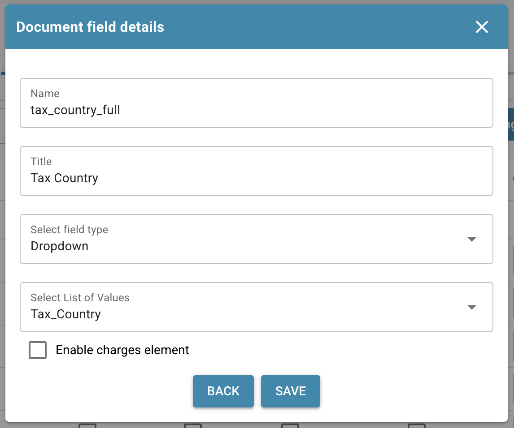<figcaption></figcaption></figure> <figure><figcaption></figcaption></figure> <figure>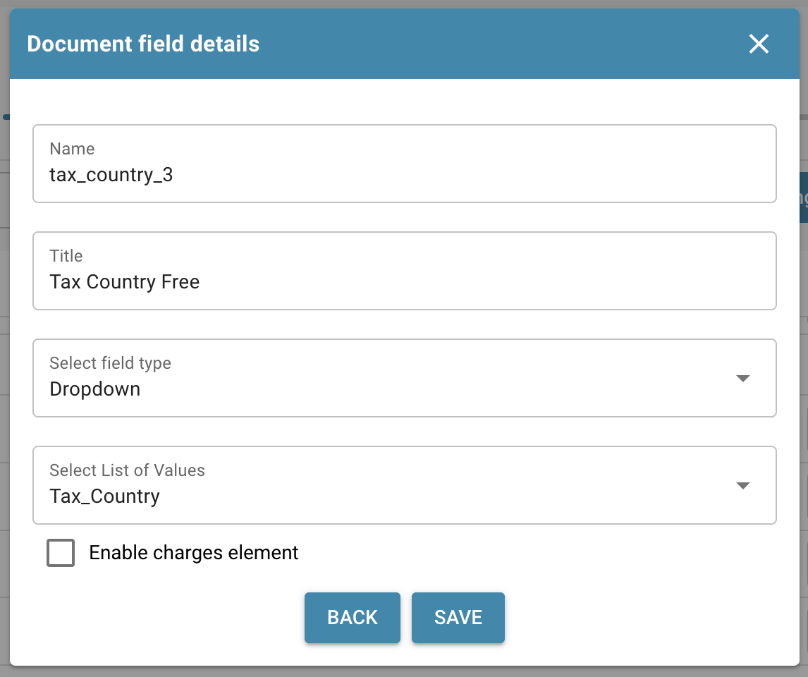<figcaption></figcaption></figure>

<figure>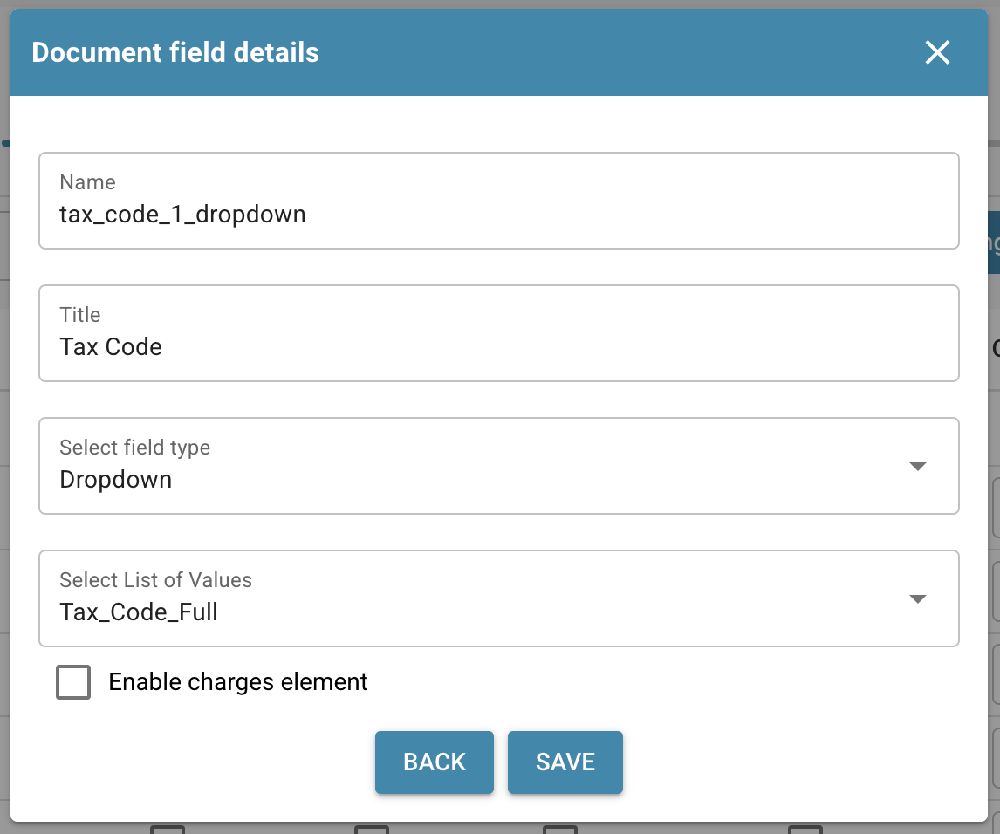<figcaption></figcaption></figure> <figure>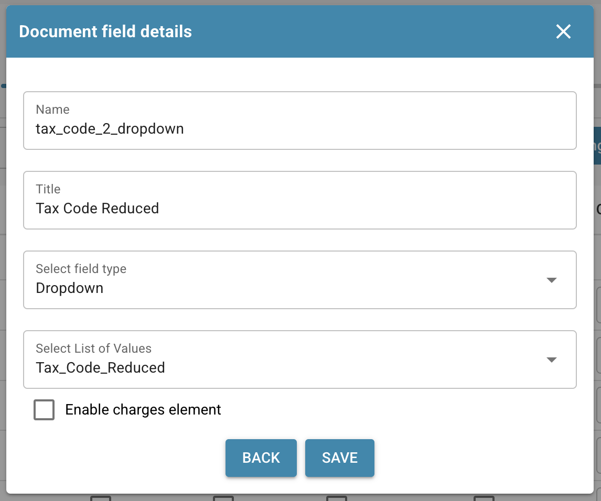<figcaption></figcaption></figure> <figure><figcaption></figcaption></figure>

4.  Dopo aver salvato ogni campo, clicca su **Salva Impostazioni** per applicare le modifiche.

    <figure>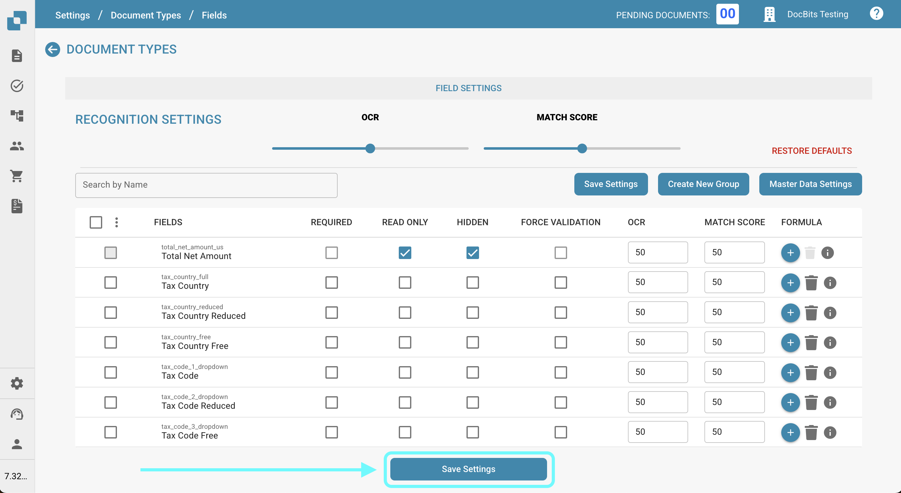<figcaption></figcaption></figure>

### **Passo 3: Modifica Layout**

1.  Vai su **Impostazioni** -> **Impostazioni Globali** -> **Tipi di Documento**.

    <figure><figcaption></figcaption></figure>
2.  Apri il menu **Modifica layout** per il Tipo di Documento che desideri modificare.

    <figure>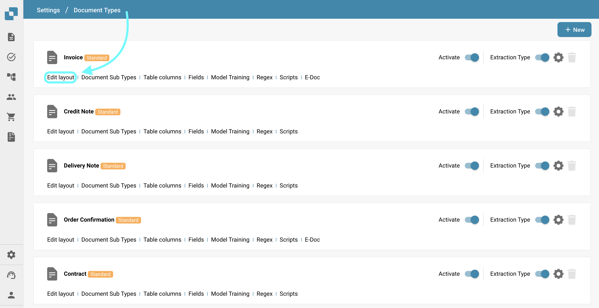<figcaption></figcaption></figure>
3.  Seleziona l'**Origine Documento** appropriata per la quale desideri applicare i Codici Fiscali

    <figure>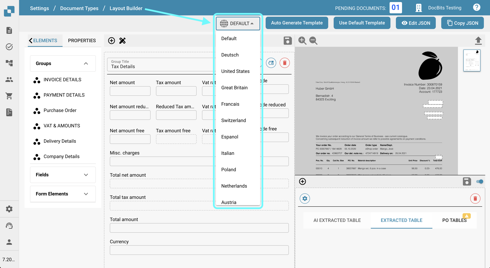<figcaption></figcaption></figure>
4.  Scorri verso il basso fino alla sezione **Tax Details**.

    <figure>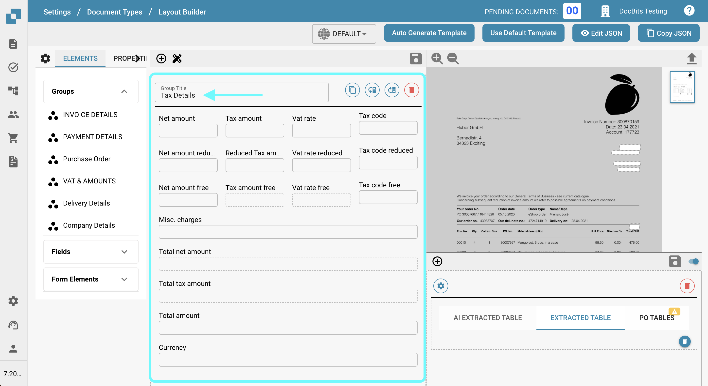<figcaption></figcaption></figure>
5. Espandi il menu a discesa **Elementi del modulo**.
6.  Nella sezione **Tax Details**, utilizza lo strumento **Horizontal Separator**. Trascinalo e rilascialo tra le sottosezioni all'interno della sezione fiscale per separarle chiaramente e ridurre la confusione.

    <figure>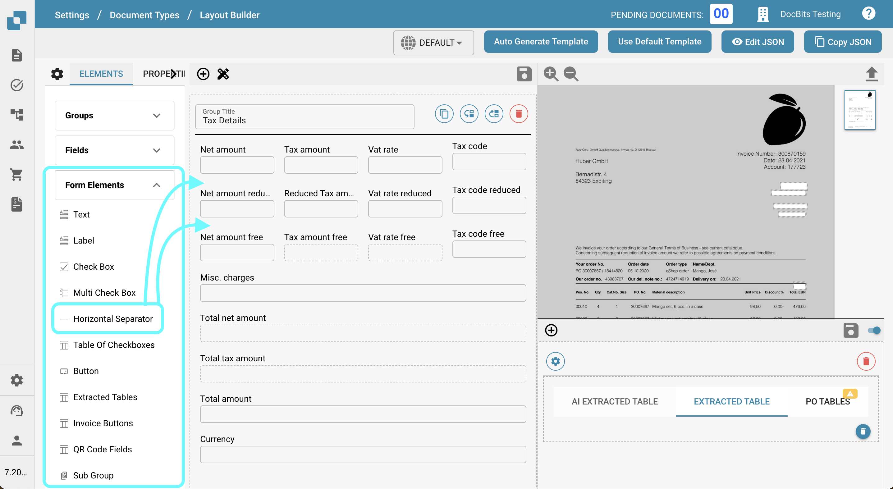<figcaption></figcaption></figure>
7. Espandi il menu a discesa **Campi**.
8.  Cerca **Tax Country** e trascina e rilascia il campo nella sua area rispettiva.

    <figure>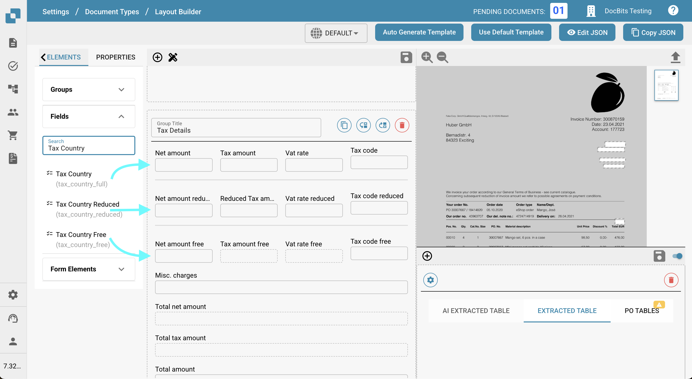<figcaption></figcaption></figure>
9.  Cerca **Tax Code** e trascina e rilascia il campo nella sua area corrispondente.

    <figure>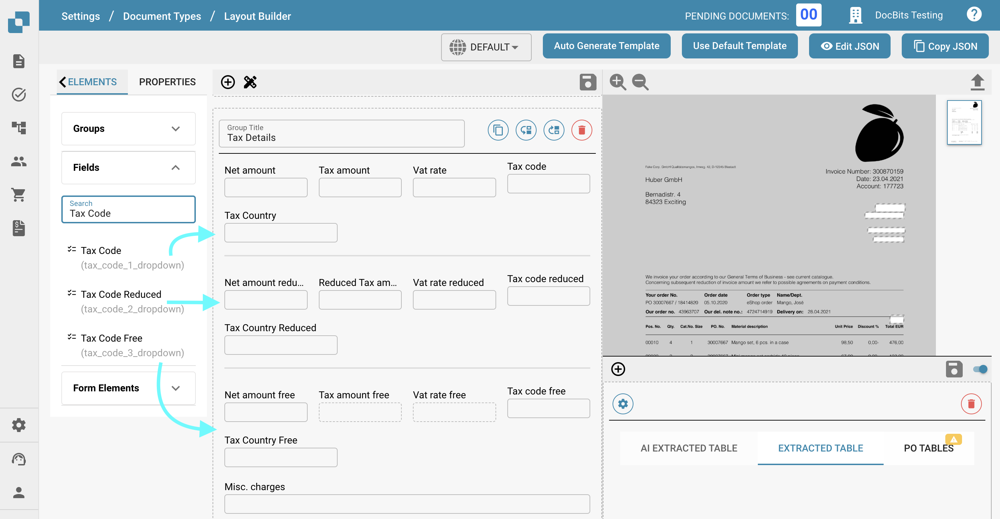<figcaption></figcaption></figure>
10. Salva il modello.

    <figure>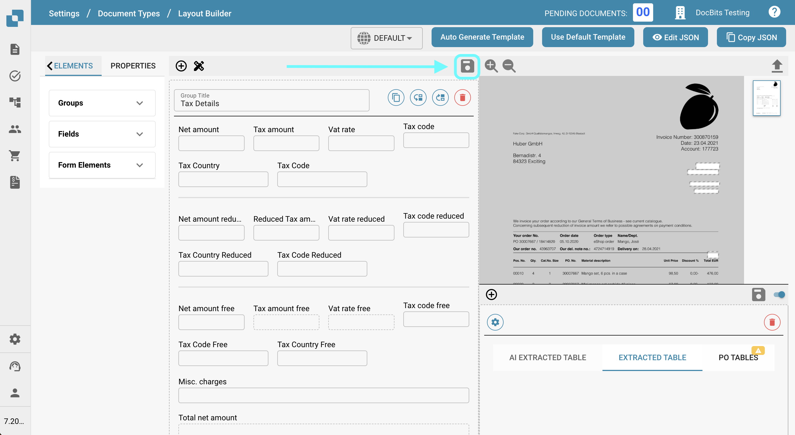<figcaption></figcaption></figure>

### Passo 4: Verifica che Tutto Funzioni

Dopo aver caricato un nuovo documento in DocBits con le impostazioni di documento corrette selezionate, ora dovresti essere in grado di selezionare i codici fiscali che hai aggiunto agli elenchi nel Passo 1.

<figure>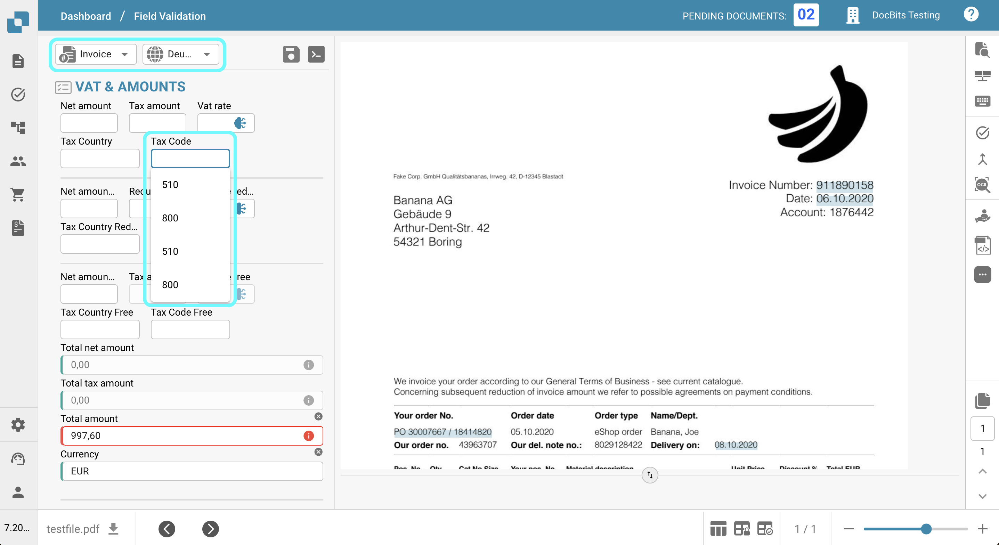<figcaption></figcaption></figure>

## Codice Fiscale Multiplo

### **Passo 1: Configura Elenco di Valori**

1.  Vai su **Impostazioni** -> **Elaborazione Documenti** -> **Elenco di Valori**.

    <figure><figcaption></figcaption></figure>
2.  Clicca su **Nuovo**.

    <figure><figcaption></figcaption></figure>
3.  Crea un elenco con il nome `Tax_Country` e clicca su **Salva**.

    <figure><figcaption></figcaption></figure>
4.  Crea i seguenti tre elenchi aggiuntivi:

    * `Tax_Code_Full`
    * `Tax_Code_Reduced`
    * `Tax_Code_Free`

    
<figure><figcaption></figcaption></figure> <figure><figcaption></figcaption></figure> <figure><figcaption></figcaption></figure>

5.  Clicca su uno degli elenchi appena creati per aprirlo. Poi, premi il pulsante **Aggiungi riga** per aggiungere una nuova riga.

    <figure><figcaption></figcaption></figure>
6.  Inserisci i valori rispettivi desiderati da **LN** e premi **Salva** per salvare le modifiche.

    * Se hai più valori, puoi cliccare su **Aggiungi altri valori** per aggiungerli.

    
<figure><figcaption></figcaption></figure> <figure><figcaption></figcaption></figure>

    * **NOTA:** Puoi trovare i Codici Fiscali in LN sotto: **Common** → **Taxation** → **Master Data** → **Tax Codes** → **Tax Codes by Country**

    <figure><figcaption></figcaption></figure>

### **Passo 2: Aggiungi Campi in DocBits**

1.  Naviga su **Impostazioni** -> **Impostazioni Globali** -> **Tipi di Documento**.

    <figure><figcaption></figcaption></figure>
2.  Scegli il menu **Campi** corrispondente al Tipo di Documento dove desideri aggiungere i campi.

    <figure><figcaption></figcaption></figure>
3.  Sotto **IVA & IMPORTI**, crea sei nuovi campi come segue:

    <figure><figcaption></figcaption></figure>

<table data-header-hidden><thead><tr><th width="306"></th><th width="139"></th><th width="119"></th><th></th></tr></thead><tbody><tr><td><strong>Nome</strong></td><td><strong>Titolo</strong></td><td><strong>Tipo di Campo</strong></td><td><strong>Elenco di Valori</strong></td></tr><tr><td><code>tax_country</code></td><td>Tax Country</td><td>Dropdown</td><td>Tax_Country</td></tr><tr><td><code>tax_country_2</code></td><td>Tax Country Reduced</td><td>Dropdown</td><td>Tax_Country</td></tr><tr><td><code>tax_country_3</code></td><td>Tax Country Free</td><td>Dropdown</td><td>Tax_Country</td></tr><tr><td><code>tax_code_without_country</code></td><td>Tax Code</td><td>Dropdown</td><td>Tax_Code_Full</td></tr><tr><td><code>tax_code_without_country_2</code></td><td>Tax Code Reduced</td><td>Dropdown</td><td>Tax_Code_Reduced</td></tr><tr><td><code>tax_code_without_country_3</code></td><td>Tax Code Free</td><td>Dropdown</td><td>Tax_Code_Free</td></tr></tbody></table>

<figure><figcaption></figcaption></figure> <figure><figcaption></figcaption></figure> <figure><figcaption></figcaption></figure>

<figure><figcaption></figcaption></figure> <figure><figcaption></figcaption></figure> <figure><figcaption></figcaption></figure>

4.  Dopo aver salvato ogni campo, clicca su **Salva Impostazioni** per applicare le modifiche.

    <figure><figcaption></figcaption></figure>

### **Passo 3: Modifica Layout**

1.  Vai su **Impostazioni** -> **Impostazioni Globali** -> **Tipi di Documento**.

    <figure><figcaption></figcaption></figure>
2.  Apri il menu **Modifica layout** per il Tipo di Documento che desideri modificare.

    <figure><figcaption></figcaption></figure>
3.  Seleziona l'**Origine Documento** appropriata per la quale desideri applicare i Codici Fiscali

    <figure><figcaption></figcaption></figure>
4.  Scorri verso il basso fino alla sezione **Tax Details**.

    <figure><figcaption></figcaption></figure>
5. Espandi il menu a discesa **Elementi del modulo**.
6.  Nella sezione Tax Details utilizza lo strumento **Sub Group**. Trascina e rilascia accanto a un campo esistente.

    <figure>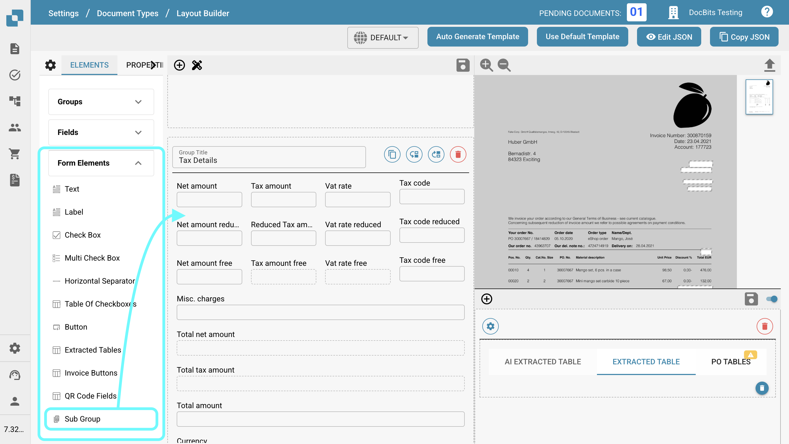<figcaption></figcaption></figure>
7.  Per nominare il tuo subgroup, clicca sul subgroup e inserisci il nome desiderato nel campo **Etichetta**.

    
<figure>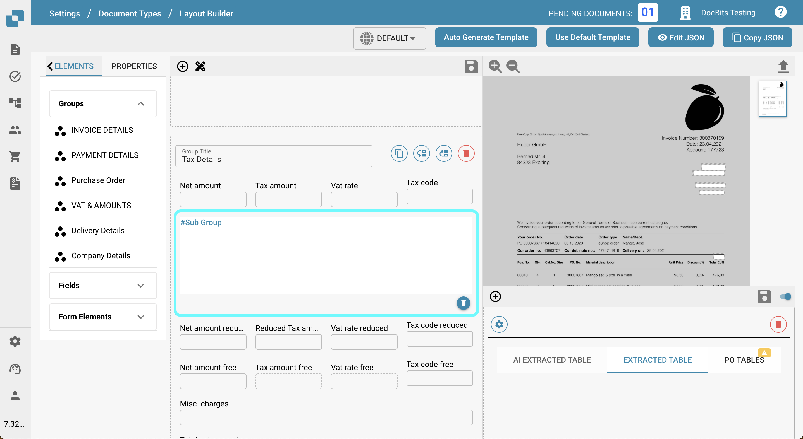<figcaption></figcaption></figure> <figure>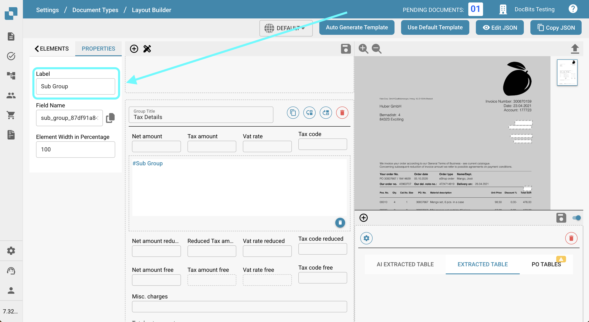<figcaption></figcaption></figure>

8.  Trascina e rilascia i campi che corrispondono a questo gruppo nel campo **Sub Group**.

    <figure>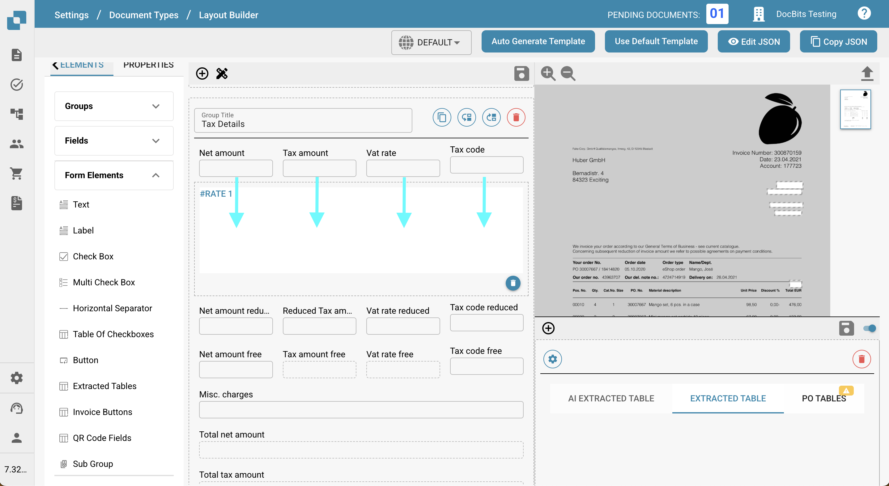<figcaption></figcaption></figure>
9. Espandi il menu a discesa **Campi**.
10. Cerca **Tax** e trascina e rilascia i campi rispettivi, come **Tax Country** e **Tax Code**, nel corrispondente subgroup.

    <figure>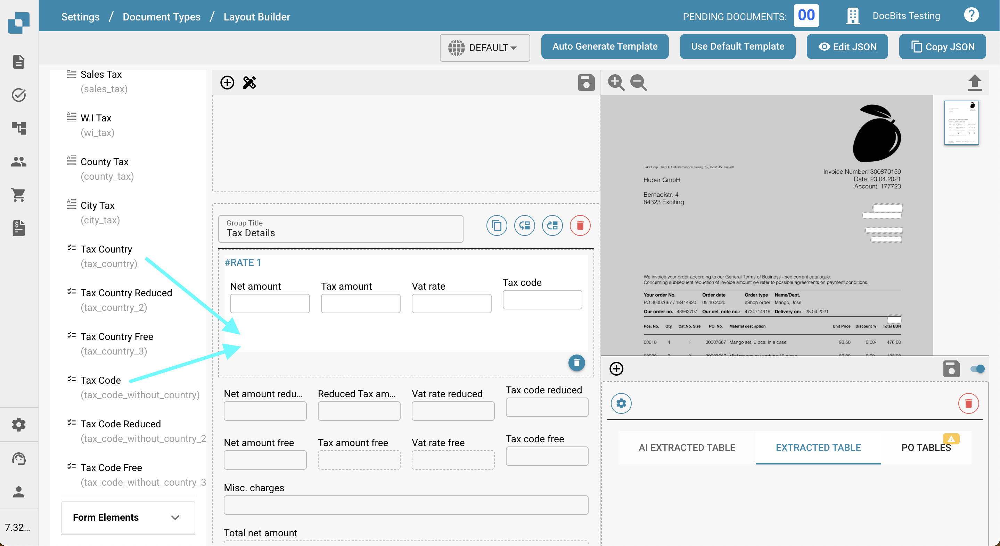<figcaption></figcaption></figure>
11. Ripeti i passaggi 5 fino a 10 2 volte per raggiungere il seguente stato:

    <figure>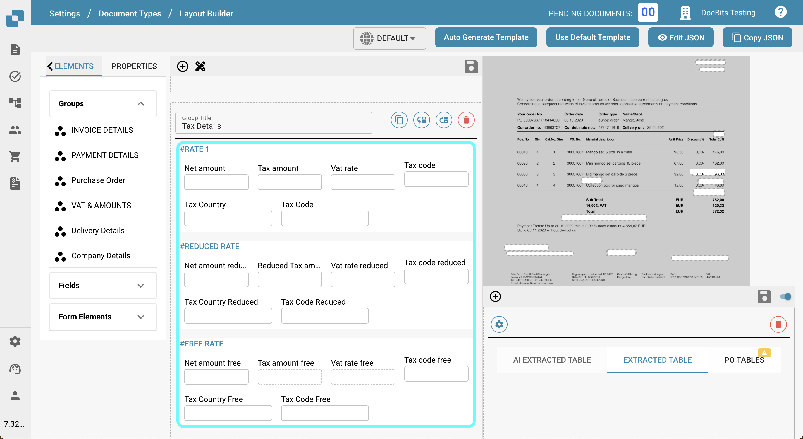<figcaption></figcaption></figure>
12. Salva il modello.

    <figure><figcaption></figcaption></figure>

### Passo 4: Verifica che Tutto Funzioni e le modifiche risultanti

Dopo aver caricato un nuovo documento in DocBits con le impostazioni di documento corrette selezionate, sarai in grado di selezionare i codici fiscali che hai aggiunto nel Passo 1 e aggiungere più codici fiscali configurati nel Passo 3.

* Il documento inizierà con tre sezioni distinte: una per gli importi Fiscali Completi, una per gli importi Fiscali Ridotti e una per gli importi Fiscali Esenti.
* Cliccando il pulsante più all'interno di una sezione verrà creato un duplicato, consentendo più invii alla tariffa fiscale selezionata.

<figure>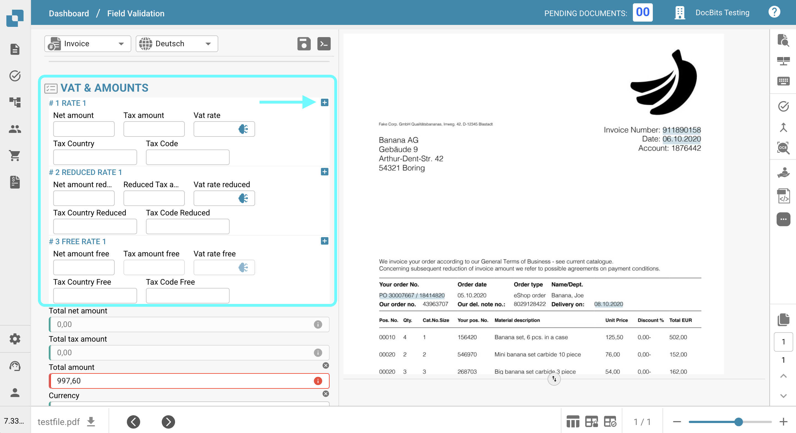<figcaption></figcaption></figure>

* Le sezioni possono essere eliminate cliccando il pulsante di rimozione.

<figure>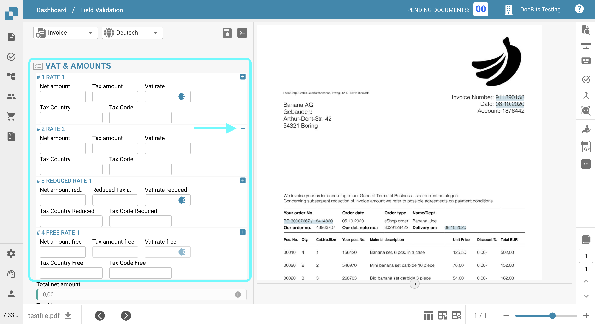<figcaption></figcaption></figure>

* Gli Importi Totali saranno calcolati come somma di tutte le sezioni
* La Validazione dell'Importo Totale sarà modificata in base a tutte le sezioni fiscali
* Gli script per le nuove sezioni possono essere applicati solo dopo che i campi sono stati aggiunti alla vista.

### Nota per LN:

In **LN** la posizione USt sarà compilata in base al numero di posizione dal menu a discesa Tax Code/Tax Country. Solo il numero di posizione sarà inviato per l'esportazione.

<figure>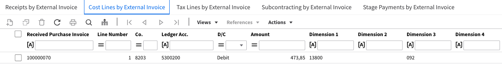<figcaption></figcaption></figure>

<figure>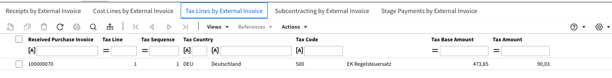<figcaption></figcaption></figure>

#### **Mappatura Esportazione**

Per collegare la Linea Fiscale con la Linea di Costo:

1. Aggiungi `TaxLine` all'elenco **InvoiceCostFields**.
2. Aggiungi la seguente voce, seguendo l'esempio qui sotto:\
   `ICF_TaxLine = TF_position`

<figure>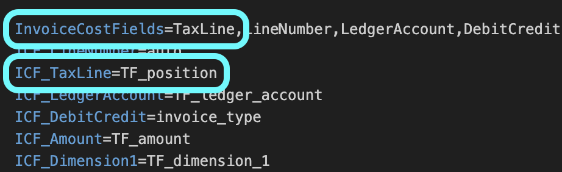<figcaption></figcaption></figure>
