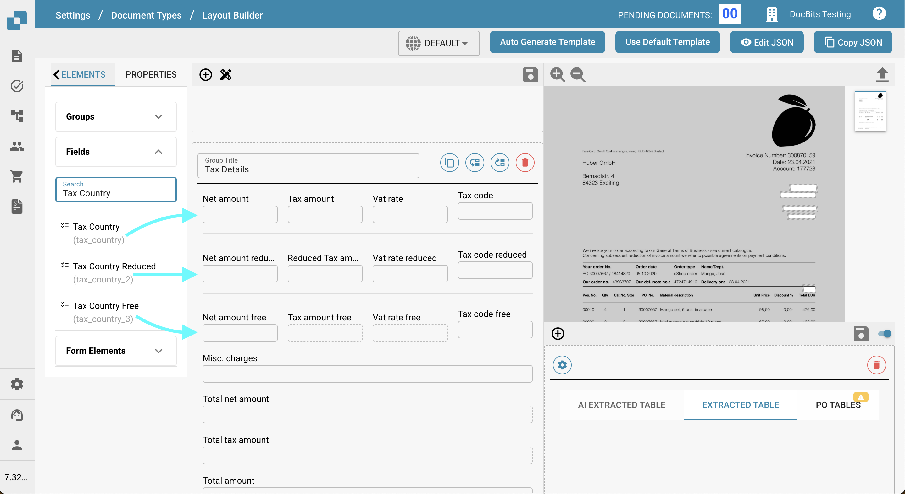
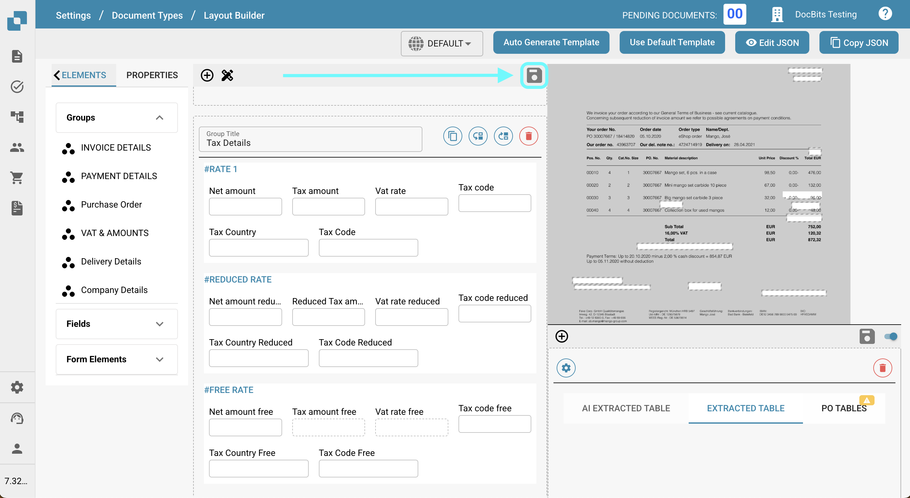

# Exportar Códigos de Impuestos a LN

## **Descripción general:**

\
Esta guía te guiará a través del proceso de configuración para asegurar que los códigos de impuesto se exporten correctamente de DocBits a LN.

## **Códigos de Impuesto Únicos**

### **Paso 1: Configurar Lista de Valores**

1.  Ve a **Ajustes** -> **Procesamiento de documentos** -> **Lista de valores**.

    <figure><figcaption></figcaption></figure>
2.  Haz clic en **Nuevo**.

    <figure><figcaption></figcaption></figure>
3.  Crea una lista con el nombre `Tax_Country` y haz clic en **Guardar**.

    <figure><figcaption></figcaption></figure>
4.  Crea las siguientes tres listas adicionales:

    * `Tax_Code_Full`
    * `Tax_Code_Reduced`
    * `Tax_Code_Free`

    
<figure><figcaption></figcaption></figure> <figure><figcaption></figcaption></figure> <figure><figcaption></figcaption></figure>

5.  Haz clic en una de las listas recién creadas para abrirla. Luego, presiona el botón **Añadir fila** para agregar una nueva fila.

    <figure><figcaption></figcaption></figure>
6.  Ingresa los valores respectivos deseados de **LN** y presiona **Guardar** para guardar los cambios.

    * Si tienes múltiples valores, puedes hacer clic en **Añadir más valores** para agregarlos.

    
<figure><figcaption></figcaption></figure> <figure><figcaption></figcaption></figure>

    * **NOTA:** Puedes encontrar los Códigos de Impuesto en LN bajo: **Common** → **Taxation** → **Master Data** → **Tax Codes** → **Tax Codes by Country**

    <figure><figcaption></figcaption></figure>

### **Paso 2: Agregar Campos en DocBits**

1.  Navega a **Ajustes** -> **Ajustes globales** -> **Tipos de documentos**.

    <figure><figcaption></figcaption></figure>
2.  Elige el menú **Campos** correspondiente al Tipo de Documento donde deseas agregar los campos.

    <figure><figcaption></figcaption></figure>
3.  Bajo **Desglose IVA y Base**, crea seis nuevos campos de la siguiente manera:

    <figure><figcaption></figcaption></figure>

<table data-header-hidden><thead><tr><th width="306"></th><th width="139"></th><th width="119"></th><th></th></tr></thead><tbody><tr><td><strong>Nombre</strong></td><td><strong>Título</strong></td><td><strong>Tipo de campo</strong></td><td><strong>Lista de valores</strong></td></tr><tr><td><code>tax_country</code></td><td>Tax Country</td><td>Dropdown</td><td>Tax_Country</td></tr><tr><td><code>tax_country_2</code></td><td>Tax Country Reduced</td><td>Dropdown</td><td>Tax_Country</td></tr><tr><td><code>tax_country_3</code></td><td>Tax Country Free</td><td>Dropdown</td><td>Tax_Country</td></tr><tr><td><code>tax_code_without_country</code></td><td>Tax Code</td><td>Dropdown</td><td>Tax_Code_Full</td></tr><tr><td><code>tax_code_without_country_2</code></td><td>Tax Code Reduced</td><td>Dropdown</td><td>Tax_Code_Reduced</td></tr><tr><td><code>tax_code_without_country_3</code></td><td>Tax Code Free</td><td>Dropdown</td><td>Tax_Code_Free</td></tr></tbody></table>

<figure><figcaption></figcaption></figure> <figure><figcaption></figcaption></figure> <figure><figcaption></figcaption></figure>

<figure><figcaption></figcaption></figure> <figure><figcaption></figcaption></figure> <figure><figcaption></figcaption></figure>

4.  Después de guardar cada campo, haz clic en **Guardar ajustes** para aplicar los cambios.

    <figure><figcaption></figcaption></figure>

### **Paso 3: Editar diseño**

1.  Ve a **Ajustes** -> **Ajustes globales** -> **Tipos de documentos**.

    <figure><figcaption></figcaption></figure>
2.  Abre el menú **Editar diseño** para el Tipo de Documento que deseas editar.

    <figure><figcaption></figcaption></figure>
3.  Selecciona el **Origen del documento** apropiado para el cual deseas aplicar los Códigos de Impuesto.

    <figure><figcaption></figcaption></figure>
4.  Desplázate hacia abajo hasta la sección **Tax Details**.

    <figure><figcaption></figcaption></figure>
5. Expande el menú desplegable **Elementos de formulario**.
6.  En la sección **Tax Details**, utiliza la herramienta **Horizontal Separator**. Arrástrala y suéltala entre las subsecciones dentro de la sección de impuestos para separarlas claramente y reducir la confusión.

    <figure><figcaption></figcaption></figure>
7. Expande el menú desplegable **Campos**.
8.  Busca **Tax Country** y arrastra y suelta el campo en su área respectiva.

    <figure><figcaption></figcaption></figure>
9.  Busca **Tax Code** y arrastra y suelta el campo en su área correspondiente.

    <figure><figcaption></figcaption></figure>
10. Guarda la plantilla.

    <figure><figcaption></figcaption></figure>

### Paso 4: Verifica que todo funcionó

Después de subir un nuevo documento a DocBits con la configuración de documento correcta seleccionada, ahora deberías poder seleccionar los códigos de impuesto que agregaste a las listas en el Paso 1.

<figure><figcaption></figcaption></figure>

## Código de Impuesto Múltiple

### **Paso 1: Configurar Lista de Valores**

1.  Ve a **Ajustes** -> **Procesamiento de documentos** -> **Lista de valores**.

    <figure><figcaption></figcaption></figure>
2.  Haz clic en **Nuevo**.

    <figure><figcaption></figcaption></figure>
3.  Crea una lista con el nombre `Tax_Country` y haz clic en **Guardar**.

    <figure><figcaption></figcaption></figure>
4.  Crea las siguientes tres listas adicionales:

    * `Tax_Code_Full`
    * `Tax_Code_Reduced`
    * `Tax_Code_Free`

    
<figure><figcaption></figcaption></figure> <figure><figcaption></figcaption></figure> <figure><figcaption></figcaption></figure>

5.  Haz clic en una de las listas recién creadas para abrirla. Luego, presiona el botón **Añadir fila** para agregar una nueva fila.

    <figure><figcaption></figcaption></figure>
6.  Ingresa los valores respectivos deseados de **LN** y presiona **Guardar** para guardar los cambios.

    * Si tienes múltiples valores, puedes hacer clic en **Añadir más valores** para agregarlos.

    
<figure><figcaption></figcaption></figure> <figure><figcaption></figcaption></figure>

    * **NOTA:** Puedes encontrar los Códigos de Impuesto en LN bajo: **Common** → **Taxation** → **Master Data** → **Tax Codes** → **Tax Codes by Country**

    <figure><figcaption></figcaption></figure>

### **Paso 2: Agregar Campos en DocBits**

1.  Navega a **Ajustes** -> **Ajustes globales** -> **Tipos de documentos**.

    <figure><figcaption></figcaption></figure>
2.  Elige el menú **Campos** correspondiente al Tipo de Documento donde deseas agregar los campos.

    <figure><figcaption></figcaption></figure>
3.  Bajo **Desglose IVA y Base**, crea seis nuevos campos de la siguiente manera:

    <figure><figcaption></figcaption></figure>

<table data-header-hidden><thead><tr><th width="306"></th><th width="139"></th><th width="119"></th><th></th></tr></thead><tbody><tr><td><strong>Nombre</strong></td><td><strong>Título</strong></td><td><strong>Tipo de campo</strong></td><td><strong>Valor</strong></td></tr><tr><td><code>tax_country</code></td><td>Tax Country</td><td>Dropdown</td><td>Tax_Country</td></tr><tr><td><code>tax_country_2</code></td><td>Tax Country Reduced</td><td>Dropdown</td><td>Tax_Country</td></tr><tr><td><code>tax_country_3</code></td><td>Tax Country Free</td><td>Dropdown</td><td>Tax_Country</td></tr><tr><td><code>tax_code_without_country</code></td><td>Tax Code</td><td>Dropdown</td><td>Tax_Code_Full</td></tr><tr><td><code>tax_code_without_country_2</code></td><td>Tax Code Reduced</td><td>Dropdown</td><td>Tax_Code_Reduced</td></tr><tr><td><code>tax_code_without_country_3</code></td><td>Tax Code Free</td><td>Dropdown</td><td>Tax_Code_Free</td></tr></tbody></table>

<figure><figcaption></figcaption></figure> <figure><figcaption></figcaption></figure> <figure><figcaption></figcaption></figure>

<figure><figcaption></figcaption></figure> <figure><figcaption></figcaption></figure> <figure><figcaption></figcaption></figure>

4.  Después de guardar cada campo, haz clic en **Guardar ajustes** para aplicar los cambios.

    <figure><figcaption></figcaption></figure>

### **Paso 3: Editar diseño**

1.  Ve a **Ajustes** -> **Ajustes globales** -> **Tipos de documentos**.

    <figure><figcaption></figcaption></figure>
2.  Abre el menú **Editar diseño** para el Tipo de Documento que deseas editar.

    <figure><figcaption></figcaption></figure>
3.  Selecciona el **Origen del documento** apropiado para el cual deseas aplicar los Códigos de Impuesto

    <figure><figcaption></figcaption></figure>
4.  Desplázate hacia abajo hasta la sección **Tax Details**.

    <figure><figcaption></figcaption></figure>
5. Expande el menú desplegable **Elementos de formulario**.
6.  En la sección Tax Details, utiliza la herramienta **Sub Group**. Arrástrala y suéltala junto a un campo existente.

    <figure><figcaption></figcaption></figure>
7.  Para nombrar tu subgrupo, haz clic en el subgrupo e ingresa el nombre deseado en el campo **Etiqueta**.

    
<figure><figcaption></figcaption></figure> <figure><figcaption></figcaption></figure>

8.  Arrastra y suelta los campos que correspondan a este grupo en el campo **Sub Group**.

    <figure><figcaption></figcaption></figure>
9. Expande el menú desplegable **Campos**.
10. Busca **Tax** y arrastra y suelta los campos respectivos, como **Tax Country** y **Tax Code**, en el subgrupo correspondiente.

    <figure><figcaption></figcaption></figure>
11. Repite los pasos 5 a 10 2 veces para alcanzar el siguiente estado:

    <figure><figcaption></figcaption></figure>
12. Guarda la plantilla.

    <figure><figcaption></figcaption></figure>

### Paso 4: Verifica que todo funcionó y los cambios resultantes

Después de subir un nuevo documento a DocBits con la configuración de documento correcta seleccionada, podrás seleccionar los códigos de impuesto que agregaste en el Paso 1 y agregar múltiples códigos de impuesto configurados en el Paso 3.

* El documento comenzará con tres secciones distintas: una para montos de Impuesto Completo, una para montos de Impuesto Reducido y una para montos de Impuesto Libre.
* Hacer clic en el botón más dentro de una sección creará un duplicado, permitiendo múltiples envíos a la tasa de impuesto seleccionada.

<figure><figcaption></figcaption></figure>

* Las secciones se pueden eliminar haciendo clic en el botón de eliminar.

<figure><figcaption></figcaption></figure>

* Los Montos Totales se calcularán como una suma de todas las secciones.
* La validación del Monto Total se modificará en función de todas las secciones de impuestos.
* Los scripts para nuevas secciones solo se pueden aplicar una vez que se hayan agregado campos a la vista.

### Nota para LN:

En **LN**, la posición USt se completará en función del número de posición del menú desplegable Tax Code/Tax Country. Solo se enviará el número de posición para exportar.

<figure><figcaption></figcaption></figure>

<figure><figcaption></figcaption></figure>

#### **Mapeo de Exportación**

Para vincular la Línea de Impuesto con la Línea de Costo:

1. Agrega `TaxLine` a la lista **InvoiceCostFields**.
2. Agrega la siguiente entrada, siguiendo el ejemplo a continuación:\
   `ICF_TaxLine = TF_position`

<figure><figcaption></figcaption></figure>
