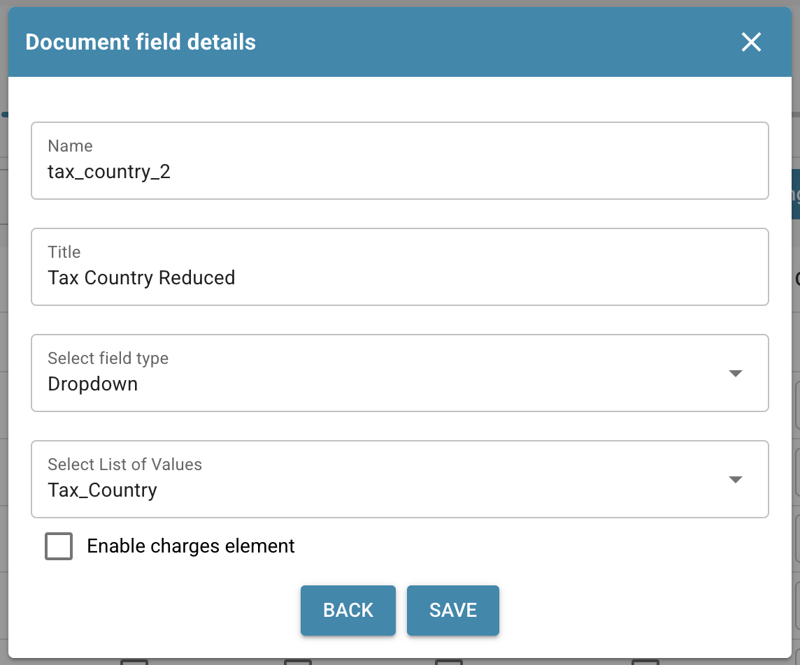
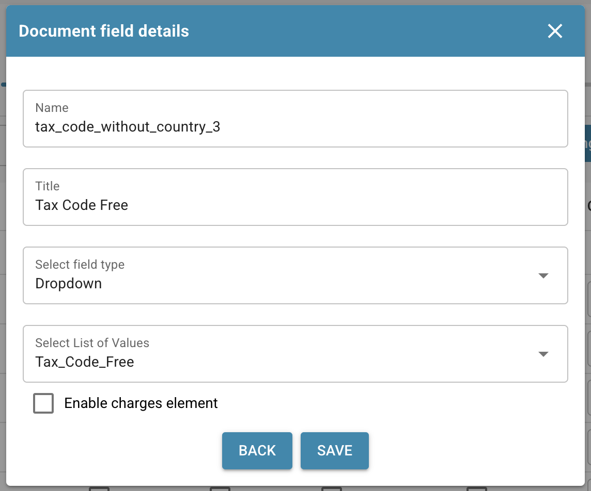

# Exporteer Belastingcodes naar LN

## **Overzicht:**

\
Deze gids leidt je door het installatieproces om ervoor te zorgen dat belastingcodes correct worden geëxporteerd van DocBits naar LN.

## **Enkele Belastingcodes**

### **Stap 1: Lijst met Waarden Instellen**

1.  Ga naar **Instellingen** -> **Documentverwerking** -> **Lijst met waarden**.

    
2.  Klik op **Nieuw**.

    
3.  Maak een lijst met de naam `Tax_Country` en klik op **Opslaan**.

    
4.  Maak de volgende drie extra lijsten aan:

    * `Tax_Code_Full`
    * `Tax_Code_Reduced`
    * `Tax_Code_Free`

    
<figure><figcaption></figcaption></figure> <figure><figcaption></figcaption></figure> <figure><figcaption></figcaption></figure>

5.  Klik op een van de nieuw aangemaakte lijsten om deze te openen. Druk vervolgens op de knop **Rij Toevoegen** om een nieuwe rij toe te voegen.

    
6.  Voer de gewenste respectieve waarden in van **LN** en druk op **Opslaan** om de wijzigingen op te slaan.

    * Als je meerdere waarden hebt, kun je op **Meer waarden toevoegen** klikken om ze toe te voegen.

    
 <figure><figcaption></figcaption></figure>

    * **OPMERKING:** Je kunt de belastingcodes in LN vinden onder: **Common** → **Taxation** → **Master Data** → **Tax Codes** → **Tax Codes by Country**

    

### **Stap 2: Velden Toevoegen in DocBits**

1.  Navigeer naar **Instellingen** -> **Algemene Instellingen** -> **Documenttypen**.

    
2.  Kies het menu **Velden** dat overeenkomt met het documenttype waarin je de velden wilt toevoegen.

    
3. Onder **Belastingdetails**, maak zes nieuwe velden aan als volgt:

<table data-header-hidden><thead><tr><th width="306"></th><th width="139"></th><th width="119"></th><th></th></tr></thead><tbody><tr><td><strong>Naam</strong></td><td><strong>Titel</strong></td><td><strong>Veldtype</strong></td><td><strong>Lijst met waarden</strong></td></tr><tr><td><code>tax_country</code></td><td>Tax Country</td><td>Dropdown</td><td>Tax_Country</td></tr><tr><td><code>tax_country_2</code></td><td>Tax Country Reduced</td><td>Dropdown</td><td>Tax_Country</td></tr><tr><td><code>tax_country_3</code></td><td>Tax Country Free</td><td>Dropdown</td><td>Tax_Country</td></tr><tr><td><code>tax_code_without_country</code></td><td>Tax Code</td><td>Dropdown</td><td>Tax_Code_Full</td></tr><tr><td><code>tax_code_without_country_2</code></td><td>Tax Code Reduced</td><td>Dropdown</td><td>Tax_Code_Reduced</td></tr><tr><td><code>tax_code_without_country_3</code></td><td>Tax Code Free</td><td>Dropdown</td><td>Tax_Code_Free</td></tr></tbody></table>

<figure><figcaption></figcaption></figure> <figure><figcaption></figcaption></figure> <figure><figcaption></figcaption></figure>

<figure><figcaption></figcaption></figure> <figure><figcaption></figcaption></figure> <figure><figcaption></figcaption></figure>

4.  Na het opslaan van elk veld, klik op **Instellingen Opslaan** om de wijzigingen toe te passen.

    

### **Stap 3: Lay-out Bewerken**

1.  Ga naar **Instellingen** -> **Algemene Instellingen** -> **Documenttypen**.

    
2.  Open het menu **Bewerk Lay-out** voor het documenttype dat je wilt bewerken.

    
3.  Selecteer de juiste **Document Oorsprong** waarvoor je de belastingcodes wilt toepassen.

    
4.  Scroll naar beneden naar de sectie **Tax Details**.

    
5. Vouw het dropdownmenu **Vormelementen** uit.
6.  In de sectie **Tax Details** gebruik je de **Horizontal Separator Tool**. Sleep en laat deze vallen tussen de subsecties binnen de belastingsectie om ze duidelijk te scheiden en verwarring te verminderen.

    
7. Vouw het dropdownmenu **Formuliervelden** uit.
8.  Zoek naar **Tax Country** en sleep het veld naar het bijbehorende gebied.

    
9.  Zoek naar **Tax Code** en sleep het veld naar het overeenkomstige gebied.

    
10. Sla de sjabloon op.

    

### Stap 4: Verifieer of Alles Werkt

Na het uploaden van een nieuw document in DocBits met de juiste documentinstellingen geselecteerd, zou je nu in staat moeten zijn om de belastingcodes te selecteren die je in Stap 1 aan de lijsten hebt toegevoegd.

## Meerdere Belastingcodes

### **Stap 1: Lijst met Waarden Instellen**

1.  Ga naar **Instellingen** -> **Documentverwerking** -> **Lijst met waarden**.

    
2.  Klik op **Nieuw**.

    
3.  Maak een lijst met de naam `Tax_Country` en klik op **Opslaan**.

    
4.  Maak de volgende drie extra lijsten aan:

    * `Tax_Code_Full`
    * `Tax_Code_Reduced`
    * `Tax_Code_Free`

    
<figure><figcaption></figcaption></figure> <figure><figcaption></figcaption></figure> <figure><figcaption></figcaption></figure>

5.  Klik op een van de nieuw aangemaakte lijsten om deze te openen. Druk vervolgens op de knop **Rij Toevoegen** om een nieuwe rij toe te voegen.

    
6.  Voer de gewenste respectieve waarden in van **LN** en druk op **Opslaan** om de wijzigingen op te slaan.

    * Als je meerdere waarden hebt, kun je op **Meer waarden toevoegen** klikken om ze toe te voegen.

    
 <figure><figcaption></figcaption></figure>

    * **OPMERKING:** Je kunt de belastingcodes in LN vinden onder: **Common** → **Taxation** → **Master Data** → **Tax Codes** → **Tax Codes by Country**

    

### **Stap 2: Velden Toevoegen in DocBits**

1.  Navigeer naar **Instellingen** -> **Algemene Instellingen** -> **Documenttypen**.

    
2.  Kies het menu **Velden** dat overeenkomt met het documenttype waarin je de velden wilt toevoegen.

    
3. Onder **Belastingdetails**, maak zes nieuwe velden aan als volgt:

<table data-header-hidden><thead><tr><th width="306"></th><th width="139"></th><th width="119"></th><th></th></tr></thead><tbody><tr><td><strong>Naam</strong></td><td><strong>Titel</strong></td><td><strong>Veldtype</strong></td><td><strong>Lijst met waarden</strong></td></tr><tr><td><code>tax_country</code></td><td>Tax Country</td><td>Dropdown</td><td>Tax_Country</td></tr><tr><td><code>tax_country_2</code></td><td>Tax Country Reduced</td><td>Dropdown</td><td>Tax_Country</td></tr><tr><td><code>tax_country_3</code></td><td>Tax Country Free</td><td>Dropdown</td><td>Tax_Country</td></tr><tr><td><code>tax_code_without_country</code></td><td>Tax Code</td><td>Dropdown</td><td>Tax_Code_Full</td></tr><tr><td><code>tax_code_without_country_2</code></td><td>Tax Code Reduced</td><td>Dropdown</td><td>Tax_Code_Reduced</td></tr><tr><td><code>tax_code_without_country_3</code></td><td>Tax Code Free</td><td>Dropdown</td><td>Tax_Code_Free</td></tr></tbody></table>

<figure><figcaption></figcaption></figure> <figure><figcaption></figcaption></figure> <figure><figcaption></figcaption></figure>

<figure><figcaption></figcaption></figure> <figure><figcaption></figcaption></figure> <figure><figcaption></figcaption></figure>

4.  Na het opslaan van elk veld, klik op **Instellingen Opslaan** om de wijzigingen toe te passen.

    

### **Stap 3: Lay-out Bewerken**

1.  Ga naar **Instellingen** -> **Algemene Instellingen** -> **Documenttypen**.

    
2.  Open het menu **Bewerk Lay-out** voor het documenttype dat je wilt bewerken.

    
3.  Selecteer de juiste **Document Oorsprong** waarvoor je de belastingcodes wilt toepassen.

    
4.  Scroll naar beneden naar de sectie **Tax Details**.

    
5. Vouw het dropdownmenu **Vormelementen** uit.
6.  In de sectie Tax Details gebruik je de **Sub Group** Tool. Sleep en laat deze vallen naast een bestaand veld.

    
7.  Om je subgroep een naam te geven, klik op de subgroep en voer je gewenste naam in het **Label** veld in.

    
 <figure><figcaption></figcaption></figure>

8.  Sleep en laat de velden die bij deze groep horen in het **Sub Group** veld vallen.

    
9. Vouw het dropdownmenu **Velden** uit.
10. Zoek naar **Tax** en sleep de respectieve velden, zoals **Tax Country** en **Tax Code**, naar de overeenkomstige subgroep.

    
11. Herhaal stappen 5 tot en met 10 2 keer om de volgende staat te bereiken:

    
12. Sla de sjabloon op.

    

### Stap 4: Verifieer of Alles Werkt en resulterende wijzigingen

Na het uploaden van een nieuw document in DocBits met de juiste documentinstellingen geselecteerd, ben je in staat om de belastingcodes te selecteren die je in Stap 1 hebt toegevoegd en meerdere belastingcodes toe te voegen die in Stap 3 zijn geconfigureerd.

* Het document begint met drie verschillende secties: één voor Belasting Volledige bedragen, één voor Belasting Verminderde bedragen, en één voor Belasting Vrije bedragen.
* Door op de plusknop binnen een sectie te klikken, wordt een duplicaat gemaakt, waardoor meerdere indieningen tegen het geselecteerde belastingtarief mogelijk zijn.

* Secties kunnen worden verwijderd door op de verwijderknop te klikken.

* Totale Bedragen worden berekend als een som van alle secties.
* Validatie van het Totale Bedrag zal worden aangepast op basis van alle belastingsecties.
* Scripts voor nieuwe secties kunnen alleen worden toegepast zodra velden aan de weergave zijn toegevoegd.

### Opmerking voor LN:

In **LN** zal de USt Positie worden ingevuld op basis van het positie nummer van het Tax Code/Tax Country dropdownmenu. Alleen het Positie nummer zal worden verzonden voor export.

#### **Export Mapping**

Om de Tax Line met de Cost Line te koppelen:

1. Voeg `TaxLine` toe aan de **InvoiceCostFields** lijst.
2. Voeg de volgende invoer toe, volgens het onderstaande voorbeeld:\
   `ICF_TaxLine = TF_position`

<figure><figcaption></figcaption></figure>
