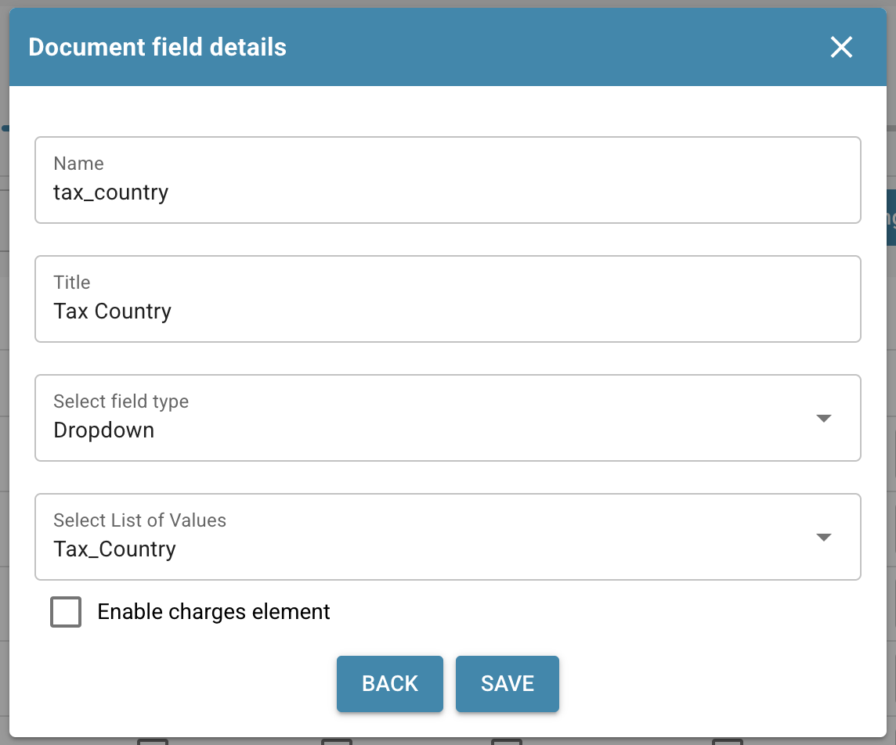
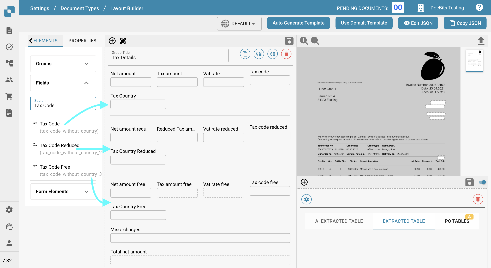

# Exportieren von Steuercodes nach LN

## **Übersicht:**

\
Dieser Leitfaden führt Sie durch den Einrichtungsprozess, um sicherzustellen, dass Steuercodes korrekt von DocBits nach LN exportiert werden.

## **Einzelne Steuercodes**

### **Schritt 1: Liste von Werten einrichten**

1.  Gehen Sie zu **Einstellungen** -> **Dokumentenverarbeitung** -> **Liste von Werten**.

    <figure><figcaption></figcaption></figure>
2.  Klicken Sie auf **Neu**.

    <figure><figcaption></figcaption></figure>
3.  Erstellen Sie eine Liste mit dem Namen `Tax_Country` und klicken Sie auf **Speichern**.

    <figure><figcaption></figcaption></figure>
4.  Erstellen Sie die folgenden drei zusätzlichen Listen:

    * `Tax_Code_Full`
    * `Tax_Code_Reduced`
    * `Tax_Code_Free`

    <div><figure><figcaption></figcaption></figure> <figure><figcaption></figcaption></figure> <figure><figcaption></figcaption></figure></div>
5.  Klicken Sie auf eine der neu erstellten Listen, um sie zu öffnen. Drücken Sie dann die Schaltfläche **Zeile hinzufügen**, um eine neue Zeile hinzuzufügen.

    <figure><figcaption></figcaption></figure>
6.  Geben Sie die gewünschten jeweiligen Werte aus **LN** ein und drücken Sie **Speichern**, um die Änderungen zu speichern.

    * Wenn Sie mehrere Werte haben, können Sie auf **Weitere Werte hinzufügen** klicken, um diese hinzuzufügen.

    <div><figure><figcaption></figcaption></figure> <figure><figcaption></figcaption></figure></div>

    * **HINWEIS:** Sie finden die Steuercodes in LN unter: **Common** → **Taxation** → **Master Data** → **Tax Codes** → **Tax Codes by Country**

    <figure><figcaption></figcaption></figure>

### **Schritt 2: Felder in DocBits hinzufügen**

1.  Navigieren Sie zu **Einstellungen** -> **Globale Einstellungen** -> **Dokumenttypen**.

    <figure><figcaption></figcaption></figure>
2.  Wählen Sie das Menü **Felder** für den Dokumenttyp, in dem Sie die Felder hinzufügen möchten.

    <figure><figcaption></figcaption></figure>
3.  Unter **Mehrwertsteuer & Beträge** erstellen Sie sechs neue Felder wie folgt:

    <figure><figcaption></figcaption></figure>

<table data-header-hidden><thead><tr><th width="306"></th><th width="139"></th><th width="119"></th><th></th></tr></thead><tbody><tr><td><strong>Name</strong></td><td><strong>Titel</strong></td><td><strong>Feldtyp</strong></td><td><strong>Liste von Werten</strong></td></tr><tr><td><code>tax_country</code></td><td>Tax Country</td><td>Dropdown</td><td>Tax_Country</td></tr><tr><td><code>tax_country_2</code></td><td>Tax Country Reduced</td><td>Dropdown</td><td>Tax_Country</td></tr><tr><td><code>tax_country_3</code></td><td>Tax Country Free</td><td>Dropdown</td><td>Tax_Country</td></tr><tr><td><code>tax_code_without_country</code></td><td>Tax Code</td><td>Dropdown</td><td>Tax_Code_Full</td></tr><tr><td><code>tax_code_without_country_2</code></td><td>Tax Code Reduced</td><td>Dropdown</td><td>Tax_Code_Reduced</td></tr><tr><td><code>tax_code_without_country_3</code></td><td>Tax Code Free </td><td>Dropdown</td><td>Tax_Code_Free</td></tr></tbody></table>

<div><figure><figcaption></figcaption></figure> <figure><figcaption></figcaption></figure> <figure><figcaption></figcaption></figure></div>

<div><figure><figcaption></figcaption></figure> <figure><figcaption></figcaption></figure> <figure><figcaption></figcaption></figure></div>

4.  Nach dem Speichern jedes Feldes klicken Sie auf **Einstellungen speichern**, um die Änderungen anzuwenden.

    <figure><figcaption></figcaption></figure>

### **Schritt 3: Layout bearbeiten**

1.  Gehen Sie zu **Einstellungen** -> **Globale Einstellungen** -> **Dokumenttypen**.

    <figure><figcaption></figcaption></figure>
2.  Öffnen Sie das Menü **Layout bearbeiten** für den Dokumenttyp, den Sie bearbeiten möchten.

    <figure><figcaption></figcaption></figure>
3.  Wählen Sie die entsprechende **Dokumentenherkunft** aus, für die Sie die Steuercodes anwenden möchten.

    <figure><figcaption></figcaption></figure>
4.  Scrollen Sie nach unten zum Abschnitt **Tax Details**.

    <figure><figcaption></figcaption></figure>
5. Erweitern Sie das Dropdown-Menü **Form-Elemente**.
6.  Verwenden Sie im Abschnitt Tax Details den **Horizontal Separator**. Ziehen Sie ihn zwischen die Unterabschnitte in Tax Details, um diese klar zu trennen und es übersichtlich zu halten.

    <figure><figcaption></figcaption></figure>
7. Erweitern Sie das Dropdown-Menü **Felder**.
8.  Suchen Sie nach **Tax Country** und ziehen Sie das Feld in den entsprechenden Bereich.

    <figure><figcaption></figcaption></figure>
9.  Suchen Sie nach  **Tax Code** und ziehen Sie das Feld in den entsprechenden Bereich.

    <figure><figcaption></figcaption></figure>
10. Speichern Sie die Vorlage.

    <figure><figcaption></figcaption></figure>

### Schritt 4: Überprüfen, ob alles funktioniert hat

Nachdem Sie ein neues Dokument in DocBits mit den ausgewählten korrekten Dokumenteneinstellungen hochgeladen haben, sollten Sie jetzt in der Lage sein, die Steuercodes auszuwählen, die Sie in Schritt 1 zu den Listen von Werten hinzugefügt haben.

<figure><figcaption></figcaption></figure>

## Mehrere Steuercodes

### **Schritt 1: Liste von Werten einrichten**

1.  Gehen Sie zu **Einstellungen** -> **Dokumentenverarbeitung** -> **Liste von Werten**.

    <figure><figcaption></figcaption></figure>
2.  Klicken Sie auf **Neu**.

    <figure><figcaption></figcaption></figure>
3.  Erstellen Sie eine Liste mit dem Namen `Tax_Country` und klicken Sie auf **Speichern**.

    <figure><figcaption></figcaption></figure>
4.  Erstellen Sie die folgenden drei zusätzlichen Listen:

    * `Tax_Code_Full`
    * `Tax_Code_Reduced`
    * `Tax_Code_Free`

    <div><figure><figcaption></figcaption></figure> <figure><figcaption></figcaption></figure> <figure><figcaption></figcaption></figure></div>
5.  Klicken Sie auf eine der neu erstellten Listen, um sie zu öffnen. Drücken Sie dann die Schaltfläche **Zeile hinzufügen**, um eine neue Zeile hinzuzufügen.

    <figure><figcaption></figcaption></figure>
6.  Geben Sie die gewünschten jeweiligen Werte aus **LN** ein und drücken Sie **Speichern**, um die Änderungen zu speichern.

    * Wenn Sie mehrere Werte haben, können Sie auf **Weitere Werte hinzufügen** klicken, um diese hinzuzufügen.

    <div><figure><figcaption></figcaption></figure> <figure><figcaption></figcaption></figure></div>

    * **HINWEIS:** Sie finden die Steuercodes in LN unter: **Common** → **Taxation** → **Master Data** → **Tax Codes** → **Tax Codes by Country**

    <figure><figcaption></figcaption></figure>

### **Schritt 2: Felder in DocBits hinzufügen**

1.  Navigieren Sie zu **Einstellungen** -> **Globale Einstellungen** -> **Dokumenttypen**.

    <figure><figcaption></figcaption></figure>
2.  Wählen Sie das Menü **Felder** für den Dokumenttyp, in dem Sie die Felder hinzufügen möchten.

    <figure><figcaption></figcaption></figure>
3.  Unter **Mehrwertsteuer & Beträge** erstellen Sie sechs neue Felder wie folgt:

    <figure><figcaption></figcaption></figure>

<table data-header-hidden><thead><tr><th width="306"></th><th width="139"></th><th width="119"></th><th></th></tr></thead><tbody><tr><td><strong>Name</strong></td><td><strong>Titel</strong></td><td><strong>Feldtyp</strong></td><td><strong>Liste von Werten</strong></td></tr><tr><td><code>tax_country</code></td><td>Tax Country</td><td>Dropdown</td><td>Tax_Country</td></tr><tr><td><code>tax_country_2</code></td><td>Tax Country Reduced</td><td>Dropdown</td><td>Tax_Country</td></tr><tr><td><code>tax_country_3</code></td><td>Tax Country Free</td><td>Dropdown</td><td>Tax_Country</td></tr><tr><td><code>tax_code_without_country</code></td><td>Tax Code</td><td>Dropdown</td><td>Tax_Code_Full</td></tr><tr><td><code>tax_code_without_country_2</code></td><td>Tax Code Reduced</td><td>Dropdown</td><td>Tax_Code_Reduced</td></tr><tr><td><code>tax_code_without_country_3</code></td><td>Tax Code Free</td><td>Dropdown</td><td>Tax_Code_Free</td></tr></tbody></table>

<div><figure><figcaption></figcaption></figure> <figure><figcaption></figcaption></figure> <figure><figcaption></figcaption></figure></div>

<div><figure><figcaption></figcaption></figure> <figure><figcaption></figcaption></figure> <figure><figcaption></figcaption></figure></div>

4.  Nach dem Speichern jedes Feldes klicken Sie auf **Einstellungen speichern**, um die Änderungen anzuwenden.

    <figure><figcaption></figcaption></figure>

### **Schritt 3: Layout bearbeiten**

1.  Gehen Sie zu **Einstellungen** -> **Globale Einstellungen** -> **Dokumenttypen**.

    <figure><figcaption></figcaption></figure>
2.  Öffnen Sie das Menü **Layout bearbeiten** für den Dokumenttyp, den Sie bearbeiten möchten.

    <figure><figcaption></figcaption></figure>
3.  Wählen Sie die entsprechende **Dokumentenherkunft** aus, für die Sie die Steuercodes anwenden möchten.

    <figure><figcaption></figcaption></figure>
4.  Scrollen Sie nach unten zum Abschnitt **Tax Details**.

    <figure><figcaption></figcaption></figure>
5. Erweitern Sie das Dropdown-Menü **Form-Elemente**.
6.  Verwenden Sie im Abschnitt Steuerdetails das **Sub Group** Werkzeug. Ziehen Sie es neben ein vorhandenes Feld.

    <figure><figcaption></figcaption></figure>
7.  Um Ihrer Sub Group einen Namen zu geben, klicken Sie auf die Sub Group und geben Sie den gewünschten Namen im Feld **Label** ein.

    <div><figure><figcaption></figcaption></figure> <figure><figcaption></figcaption></figure></div>
8.  Ziehen Sie die Felder, die zu dieser Gruppe gehören, in das **Sub Group** Feld.

    <figure><figcaption></figcaption></figure>
9. Erweitern Sie das Dropdown-Menü **Felder**.
10. Suchen Sie nach **Tax** und ziehen Sie die entsprechenden Felder, wie **Tax Country** und **Tax Code**, in die entsprechende Sub Group.

    <figure><figcaption></figcaption></figure>
11. Wiederholen Sie die Schritte 5 bis 10 zwei Mal, um den folgenden Zustand zu erreichen:

    <figure><figcaption></figcaption></figure>
12. Speichern Sie die Vorlage.

    <figure><figcaption></figcaption></figure>

### Schritt 4: Überprüfen, ob alles funktioniert hat und die resultierenden Änderungen

Nachdem Sie ein neues Dokument in DocBits mit den ausgewählten korrekten Dokumenteneinstellungen hochgeladen haben, können Sie die Steuercodes auswählen, die Sie in Schritt 1 hinzugefügt haben, und mehrere Steuercodes hinzufügen, die in Schritt 3 konfiguriert wurden.

* Das Dokument beginnt mit drei verschiedenen Abschnitten: einem für Steuerbeträge voll, einem für Steuerbeträge reduziert und einem für Steuerbeträge frei.
* Durch Klicken auf die Plus-Schaltfläche innerhalb eines Abschnitts wird eine Duplikation erstellt, die mehrere Einreichungen zum ausgewählten Steuersatz ermöglicht.

<figure><figcaption></figcaption></figure>

* Abschnitte können durch Klicken auf die Entfernen-Schaltfläche gelöscht werden.

<figure><figcaption></figcaption></figure>

* Gesamtbeträge werden als Summe aller Abschnitte berechnet.
* Die Validierung des Gesamtbetrags wird basierend auf allen Steuerabschnitten geändert.
* Skripte für neue Abschnitte können nur angewendet werden, nachdem Felder zur Ansicht hinzugefügt wurden.

### Hinweis für LN:

In **LN** wird die USt-Position basierend auf der Positionsnummer aus dem Dropdown-Menü Steuercode/Steuerland ausgefüllt. Nur die Positionsnummer wird zum Export gesendet.

#### **Export-Mapping**

Um die Steuerzeile mit der Kostenzeile zu verknüpfen:

1. Fügen Sie `TaxLine` zur Liste **InvoiceCostFields** hinzu.
2. Fügen Sie den folgenden Eintrag hinzu, der dem Beispiel unten folgt:\
   `ICF_TaxLine = TF_position`

**Beispiel:**

```
InvoiceCostFields=TaxLine,LineNumber,LedgerAccount,DebitCredit,Amount,TransactionReference,Dimension1,Dimension2,Dimension3,Dimension4,Dimension5,Dimension6,Dimension7,Dimension8,Dimension9,Dimension10,Dimension11,Dimension12
ICF_LineNumber=auto
ICF_TaxLine=TF_position
ICF_LedgerAccount=TF_ledger_account
ICF_DebitCredit=invoice_type
ICF_Amount=TF_amount
ICF_Dimension1=TF_dimension_1
ICF_Dimension2=TF_dimension_2
ICF_Dimension3=TF_dimension_3
ICF_Dimension4=TF_dimension_4
ICF_Dimension5=TF_dimension_5
ICF_Dimension6=TF_dimension_6
ICF_Dimension7=TF_dimension_7
ICF_Dimension8=TF_dimension_8
ICF_Dimension9=TF_dimension_9
ICF_Dimension10=TF_dimension_10
ICF_Dimension11=TF_dimension_11
ICF_Dimension12=TF_dimension_12
ICF_Quantity1=TF_quantity
ICF_Quantity2=TF_quantity2
ICF_TransactionReference=TF_Buchungsreferenz
```
