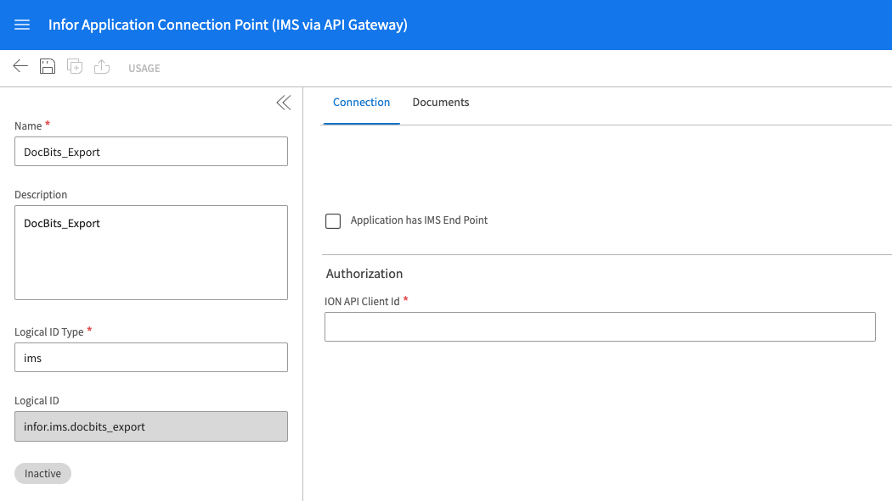
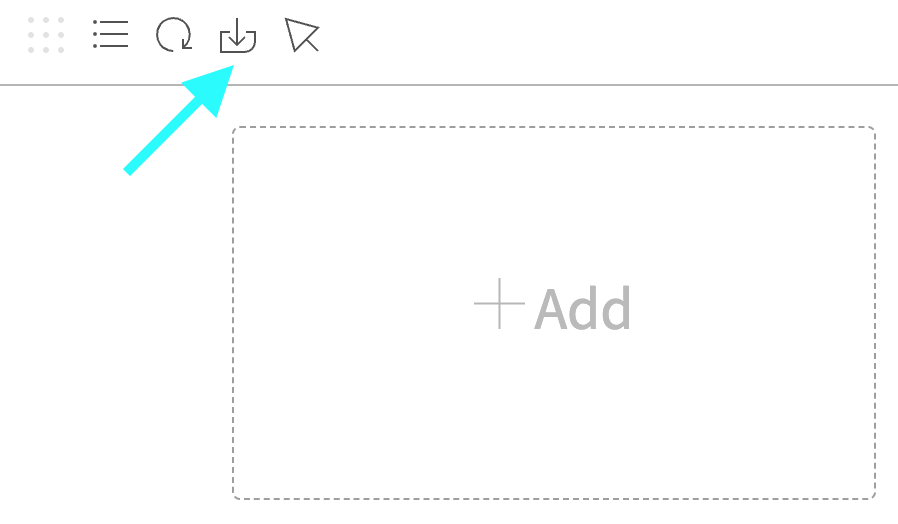
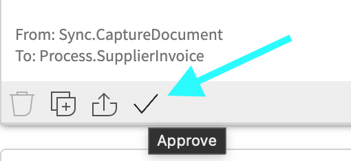
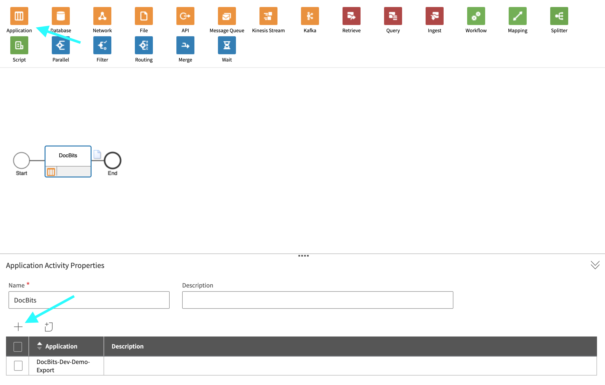
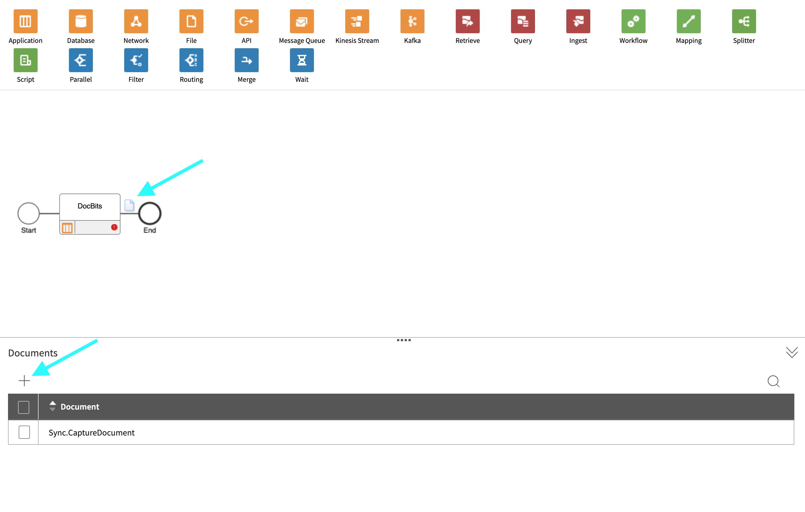
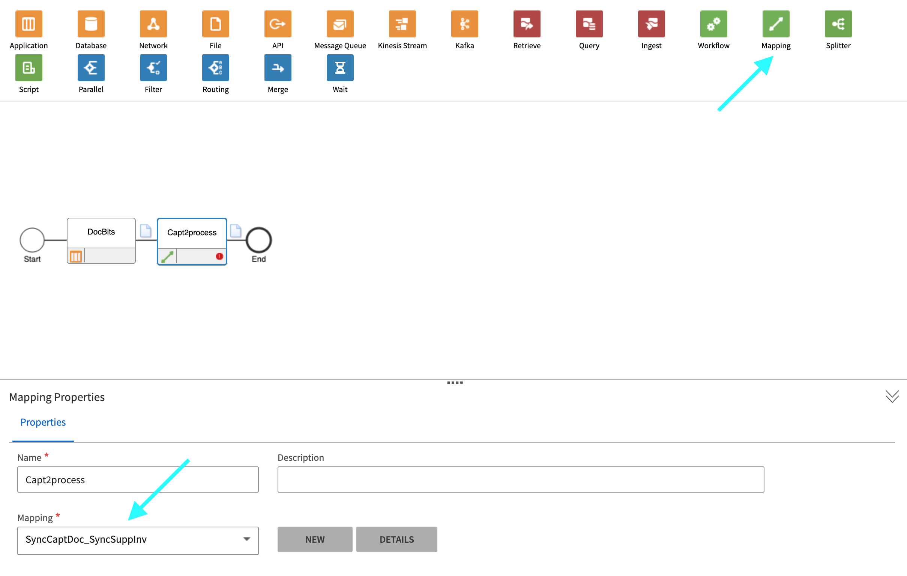
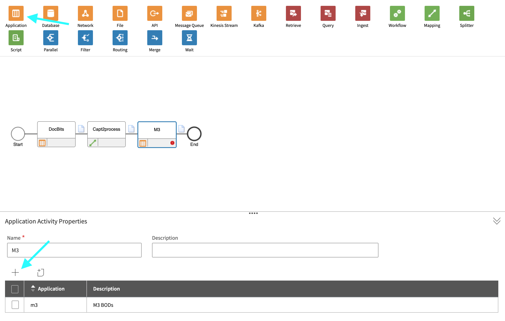
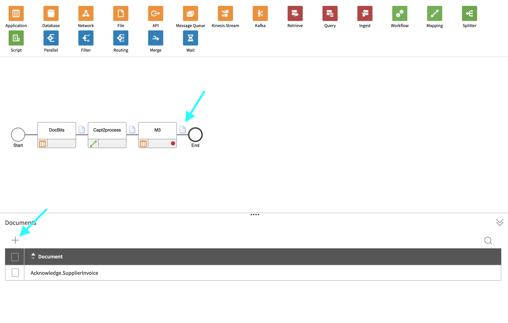
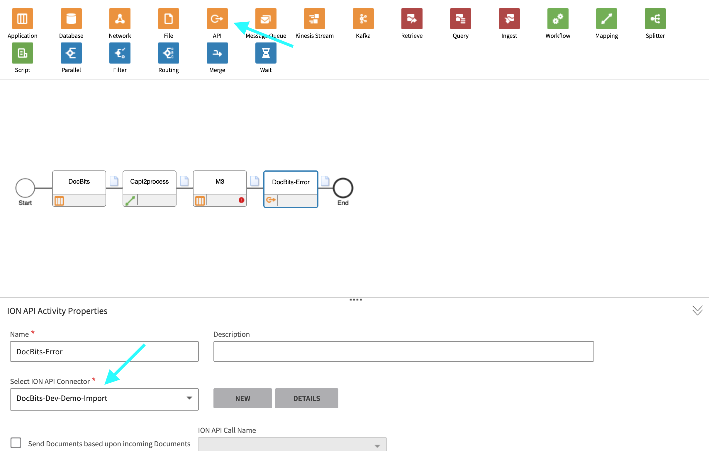

# M3

## Step 1: Create an Connection Point

1. Navigate to **OS > ION > Connect > Connection Points**
2. Click **Add** and select **IMS via API Gateway** as the connection type.
3. Configure the following settings:
   * **Name**: Set to `DocBits_Export`.
   * **Description**: Set to `DocBits_Export`.
   * **Uncheck**: _Application has IMS End Point_.
   * **ION API Client ID**:
     * Open the ION API file.
     * Search for `"ci"` within the file.
     * Copy the value inside the quotation marks (without the quotation marks).

<figure><figcaption></figcaption></figure>

4. Under **Documents**, add `Sync.CaptureDocument`.

<figure><figcaption></figcaption></figure>

5. Click **Save** to finalize the configuration.

## Step 2: Upload Mappings



1. Download the M3 Mapping File
2. Navigate to **Infor** > **OS** > **ION** > **Connect** > **Mappings**.
3. Click **Import** and select the appropriate mapping file for **M3**.

<figure><figcaption></figcaption></figure>

4. Once the files are imported, approve the mappings to activate them.

<figure><figcaption></figcaption></figure>

## Step 3: Create the Data Flow

1. Navigate to **OS** -> **ION** -> **Connect** -> **Data Flows**.
2. Click **Add** and select **Document Flow**.
3. Fill in the details:
   * **Name**: `DocBits_Export_to_M3`
4. Add nodes to the flow:

#### Application Node

1. Add an **Application Node** to the flow.
   * **Name**: `DocBits` or `DocBits-Export`.
2. Click **Add** and select the **Connection Point** created in Step 1.

<figure><figcaption></figcaption></figure>

3. Click on the **Document Icon** next to the application node.
   * Click **Add** and select `Sync.CaptureDocument`.

<figure><figcaption></figcaption></figure>

#### Mapping Node

1. Add a **Mapping Node** to the right of the application node.
   * **Name**: `Capt2process`.
   * **Mapping**: `CaptureDocument_to_ProcessSupplierInvoice`.

<figure><figcaption></figcaption></figure>

#### Application Node

1. Add an **Application Node** to the right of the previous mapping node.
   * **Name**: `M3`.
2. Click **Add** and select the **M3 Application** from the customer.

<figure><figcaption></figcaption></figure>

3. Click on the **Document Icon** next to the application node.
   * Click **Add** and select `Acknowledge.SupplierInvoice`.

<figure><figcaption></figcaption></figure>

#### API Node

1. Add an **API Node** to the right of the application node.
   * **Name**: `DocBits-Error`.
   * **ION API Connector**: `DocBits_Import`.
   * If `DocBits_Import` does not exist, refer to **Step 1** and **Step 2** of the Import from M3 documentation to create the connection point.

<figure><figcaption></figcaption></figure>

#### Save and Activate the Flow

* Once all nodes are added and configured, click **Save**.
* Activate the flow to complete the setup.

<figure><figcaption></figcaption></figure>

## Step 4: Configure Export in DocBits

### On-Premise:

1. Open **DocBits**.
2.  Navigate to **Settings > Document Processing > Export**.

    <figure><figcaption></figcaption></figure>
3. Create a new export:
   * **Select**: **Infor IDM + ION BOD**.
   * **Title**: Choose a meaningful title.
   * **Document Type**: Set to **Invoice**.
   * **Sub-Organization**: Can be left empty, or set to a specific sub-organization if needed.
4. Upload the required files:
   * **ION Mapping File**: This can be found in **Infor OS → API Gateway → Authorized Apps**. Look for the **DocBits** app, open it, and download the credentials.
   * **IDM Mapping File**: (Provide the relevant file path or location).
   * **BOD Mapping File**: (Provide the relevant file path or location).

### Cloud:

1. Open **DocBits**.
2.  Navigate to **Settings > Document Processing > Export**.

    <figure><figcaption></figcaption></figure>
3. Create a new export:
   * **Select**: **Infor IDM + M3 (API)**.
   * **Title**: Choose a meaningful title.
   * **Document Type**: Set to **Invoice**.
   * **Sub-Organization**: Can be left empty, or set to a specific sub-organization if needed.
4. Upload the required files:
   * **ION Mapping File**: This can be found in **Infor OS → API Gateway → Authorized Apps**. Look for the **DocBits** app, open it, and download the credentials.
   * **IDM Mapping File**: (Provide the relevant file path or location).
   * **M3 Mapping File**: (Provide the relevant file path or location).

### Cloud with toml:

1. Open **DocBits**.
2.  Navigate to **Settings > Document Processing > Export**.

    <figure><figcaption></figcaption></figure>
3. Create a new export:
   * **Select**: **Infor IDM + M3 (API)**.
   * **Title**: Choose a meaningful title.
   * **Document Type**: Set to **Invoice**.
   * **Sub-Organization**: Can be left empty, or set to a specific sub-organization if needed.
4. Upload the required files:
   * **ION Mapping File**: This can be found in **Infor OS → API Gateway → Authorized Apps**. Look for the **DocBits** app, open it, and download the credentials.
   * **IDM Mapping File**: (Provide the relevant file path or location).
   * **M3 toml Mapping File**: (Provide the relevant file path or location).
