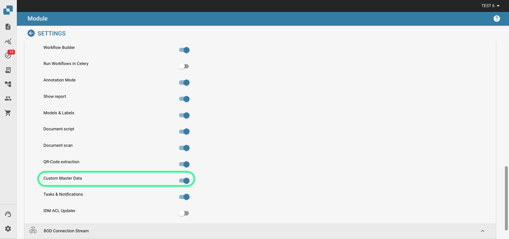
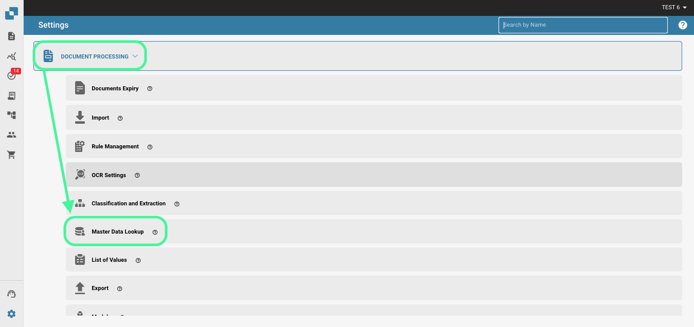
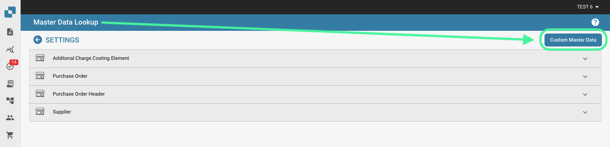
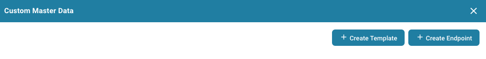
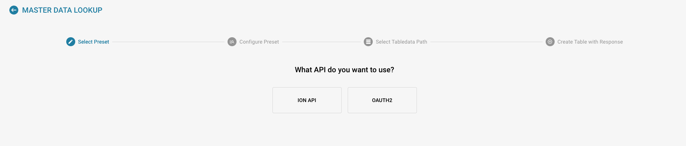
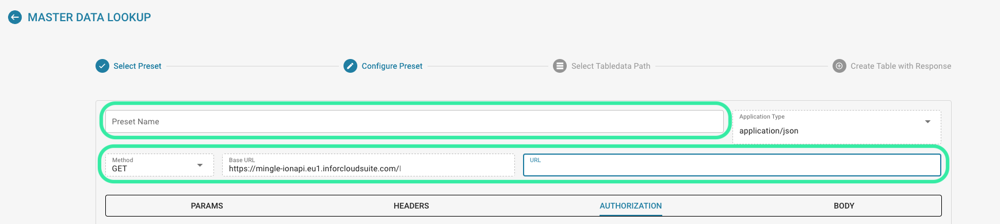
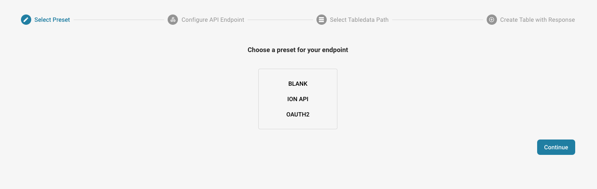
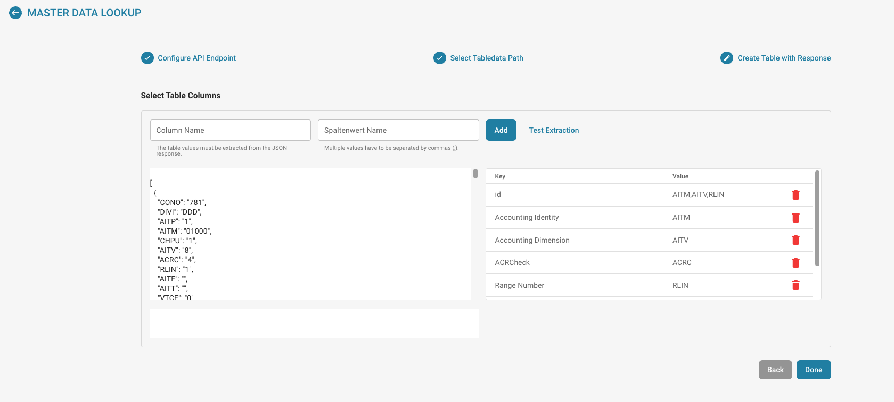

# Custom Master Data

#### Activating Custom Master Data 

From the Dashboard navigate to Settings → Document Processing → Module.

.png>)

<figure><figcaption></figcaption></figure>

In Module, activate Custom Master Data by pressing the slider as shown below.

<figure><figcaption></figcaption></figure>

#### Feature Overview 

In order to add your own master data into DocBits, navigate to Master Data Lookup in Settings.

<figure><figcaption></figcaption></figure>

Click on “Custom Master Data”

<figure><figcaption></figcaption></figure>

You then have the option to create a Template or an Endpoint.

<figure><figcaption></figcaption></figure>

#### Create a Template 

The first step is to choose between using your organizations ION API file or to use OAuth2 and enter the necessary data.

<figure><figcaption></figcaption></figure>

Next, we will configure the presets. Here you will enter the Master Data table name the API call URL.

<figure><figcaption></figcaption></figure>

You will then be required to enter the JSON path using dot notation, for more information on dot notation click [here](https://docs.hevodata.com/sources/engg-analytics/streaming/rest-api/writing-jsonpath-expressions/).

Lastly, you will need to map the data to the columns you would like to create like in the example below.

<figure><figcaption></figcaption></figure>

After you have done this, click on Done for your new master data to be created and populated .

#### Create an Endpoint 

The first step is to choose between using your organizations ION API file, to use OAuth2 or to leave this blank and enter the necessary data.

<figure><figcaption></figcaption></figure>

Next, we will configure the presets. Here you will enter the Master Data table name the API call URL.

<figure><figcaption></figcaption></figure>

You will then be required to enter the JSON path using dot notation, for more information on dot notation click [here](https://docs.hevodata.com/sources/engg-analytics/streaming/rest-api/writing-jsonpath-expressions/).

Lastly, you will need to map the data to the columns you would like to create like in the example below.

<figure><figcaption></figcaption></figure>

After you have done this, click on Done for your new master data to be created and populated .
