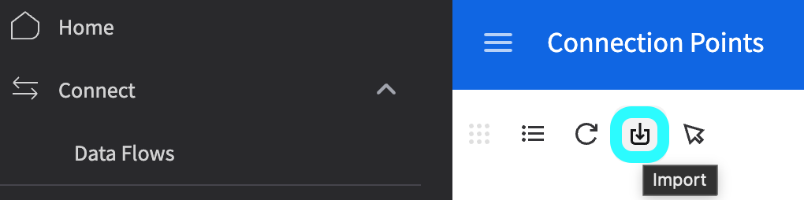
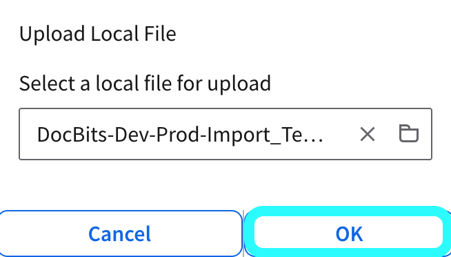
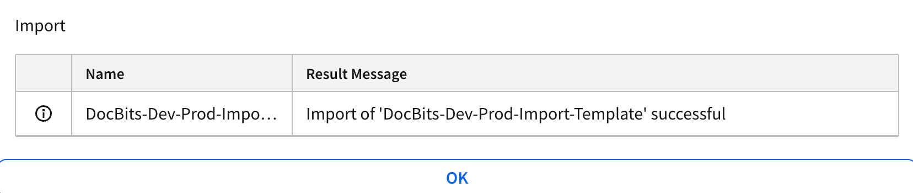
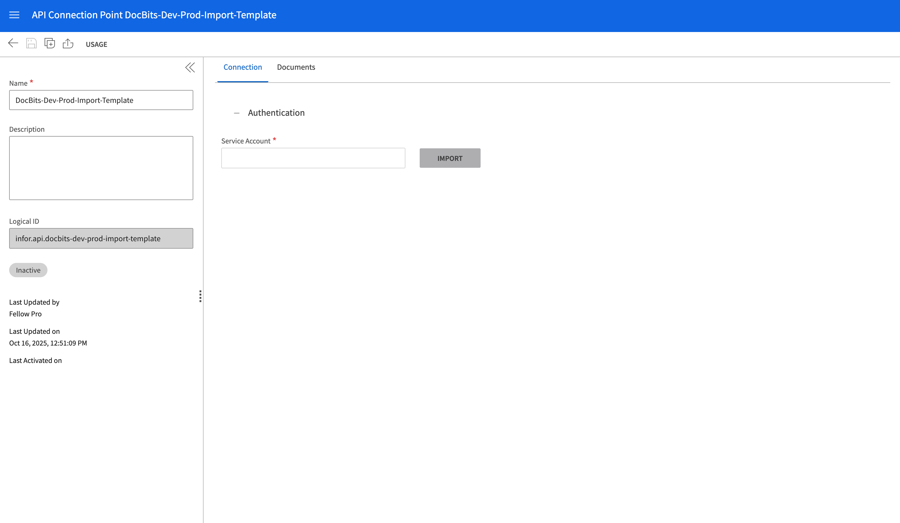

# M3

## Importing an API Connection Template in Infor M3

This guide explains how to import an API Connection Template to quickly configure key settings for integration with Infor M3. Using a template allows you to establish a predefined connection setup, simplifying the process and ensuring consistency.

<mark style="color:red;">**Note**</mark>: For detailed configuration of specific areas such as Auto Accounting, Supplier Integration, Purchase Orders, or Table Extraction for costing elements, refer to the corresponding documentation:

* [Auto Accounting](auto-accounting.md)
* [Suppliers and Purchase Order](suppliers-and-purchase-orders.md)
* [How to import all suppliers](how-to-import-all-suppliers.md)
* [Table Extraction for costing element](table-extraction-for-costing-element.md)

### **Download the Template**

Before importing, download the required connection template using the file below:



### Importing Template

#### Steps to Import a Connection Template

1. **Access Infor ION Desk:**
   *   Navigate to **InforOS** → **ION Desk** → **Connect** → **Connection Points**.

       
2. **Import the Template:**
   *   Click on the **Import** button.

       <figure><figcaption></figcaption></figure>
   * Select the appropriate **Template File** from your local system.
   *   Click **OK** to begin the import process.

       <figure><figcaption></figcaption></figure>
3. **Confirmation:**
   *   If the import is successful, a confirmation message will be displayed.

       <figure><figcaption></figcaption></figure>
4. **Post-Import Configuration:**
   * After importing the template, you can customize specific connection settings as needed.
   * Don’t forget to import or configure your **Service Account** for authentication and access control.

<figure><figcaption></figcaption></figure>

