# Import from Infor M3 to DocBits via API

## Step 1: Create an API

1. Open **Infor OS** and navigate to **API Gateway** > **Available APIs**.
2. Click **Add**, then select **Create New**.
3. Fill in the details for the API:

    * **Application Name**: `DocBits-Stage`, `DocBits-Sandbox`, `DocBits-Prod`, or `DocBits-Demo` (based on your environment).
    * **Suite Name**: Same as the application name.
    * **API Context**: Same as the application name.
    * **Description**: Same as the application name.
    * **Icon**: Select a blue document icon.


<figure>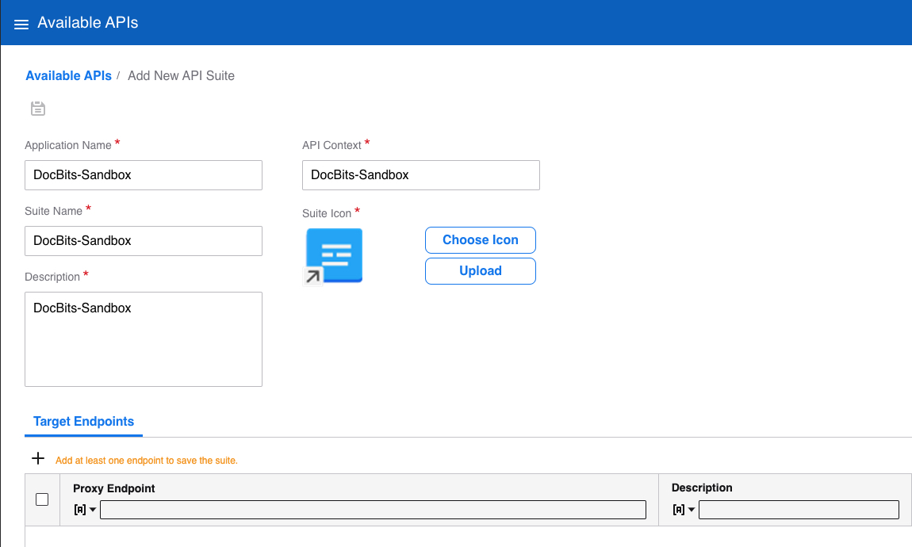<figcaption></figcaption></figure>

4. Add a **Target Endpoint**:

<figure>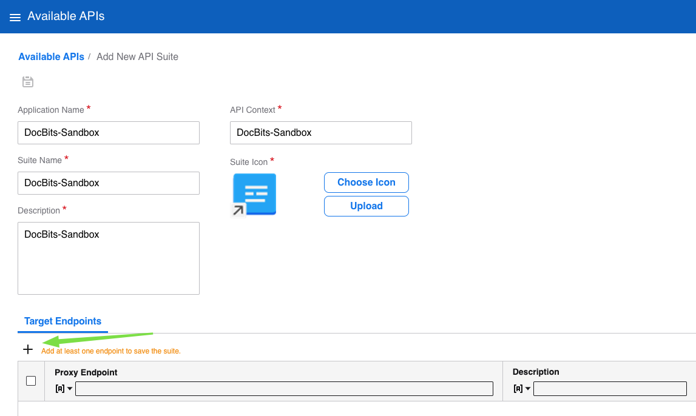<figcaption></figcaption></figure>

* **Target Endpoint URL**: Use the appropriate URL for your environment:

    * `https://stage.api.docbits.com`
    * `https://sandbox.api.docbits.com`
    * `https://api.docbits.com`
    * `https://demo.api.docbits.com`

* **Target Endpoint Description**: `Stage`, `Sandbox`, `Prod`, or `Demo` (matching the environment).
* **Proxy Context**: Same as the environment (`Stage`, `Sandbox`, `Prod`, or `Demo`).
* **Proxy Security**: Select **OAuth 2.0**.

<figure>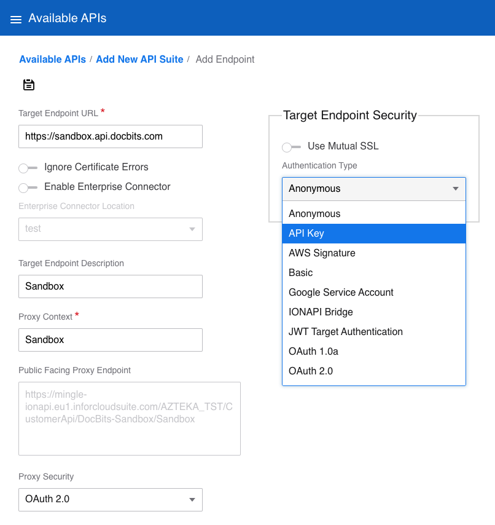<figcaption></figcaption></figure>

* **Target Endpoint Security**:

    * **Authentication Type**: API Key
    * **Key Mode**: Header
    * **Key Name**: `X-API-KEY`
    * **Key Value**: Retrieve the API key from **DocBits** by navigating to **Settings** > **Global Settings** > **Integration**, then copy the API key and paste it as the key value.

* Save the target endpoint configuration.

<figure>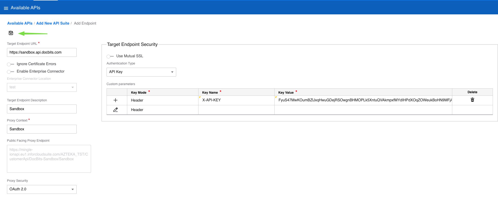<figcaption></figcaption></figure>

5. Add API Documentation:

* Return to the API documentation section by clicking **Documentation Icon** in the created Endpoint.

<figure>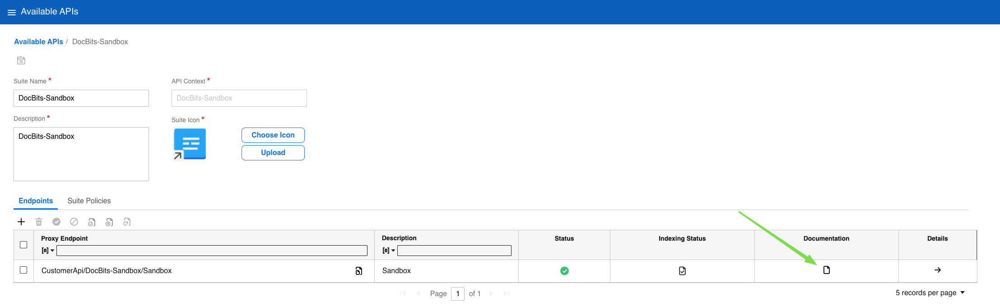<figcaption></figcaption></figure>

* Scroll down to the **Documentation** section and click **+ Add Documentation**.

    * **Name**: `DocBits-Stage`, `DocBits-Sandbox`, `DocBits-Prod`, or `DocBits-Demo` (matching the environment).
    * **Type**: Swagger
    * **Enter URL or Upload Swagger JSON/YAML**: Use the appropriate Swagger file URL for your environment:

        * `https://stage.api.docbits.com/openapi.json`
        * `https://sandbox.api.docbits.com/openapi.json`
        * `https://api.docbits.com/openapi.json`
        * `https://demo.api.docbits.com/openapi.json`

    * Ensure there is no trailing space at the end of the URL.

<figure><figcaption></figcaption></figure>


* The API documentation will automatically be added, and the metadata refresh will be triggered.


<figure>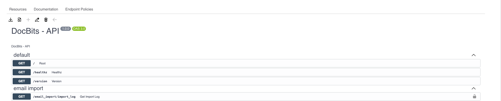<figcaption></figcaption></figure>

## Step 2: Create an API Connection Point

1. Navigate to **OS** > **ION** > **Connect** > **Connection Point**.
2. Click **Add** and select **API** as the connection type.
3. Fill in the required details:

    * **Name**: `DocBits_Import`
    * **Description**: `DocBits_Import`
    * **Service Account**: Upload the service account file that was created earlier.


### Step 2.1: Add and Configure Documents

* You don't need to add all documents—only the necessary ones.
* The documents **Sync.ChartOfAccounts** and **Sync.CodeDefinition** are required for auto-accounting.

## Sync.SupplierPartyMaster

1. Navigate to the **Documents** tab in the API Connection Point.

<figure>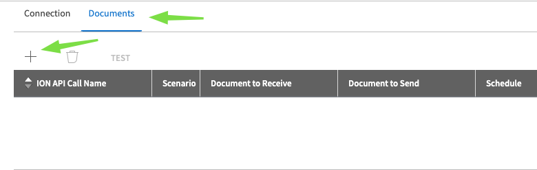<figcaption></figcaption></figure>

2. Click **Add New Document** and fill in the following details:

    * **Scenario**: `Send to API`
    * **Documents**: `Sync.SupplierPartyMaster`


<figure>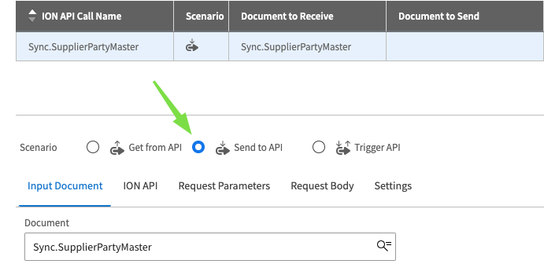<figcaption></figcaption></figure>

3. Configure the ION API:

    * **API Call Name**: `Sync.SupplierPartyMaster`
    * **Click on Select**
    * For **Product**, choose the API endpoint created in **Step 1: Create an API**.
    * Locate and select:

        ```
        CustomerApi/DocBits-Sandbox/Sandbox/import/supplier_bod
        ```
    * Click **OK** to confirm the selection.


<figure><figcaption></figcaption></figure>

4. Set the **Request Body**:

    * For **File**, select **Input Document = No Compression**.


<figure>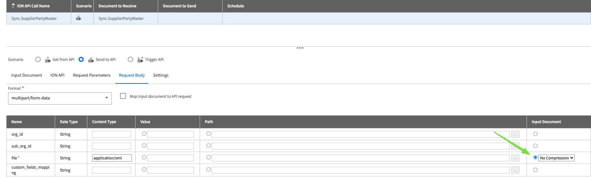<figcaption></figcaption></figure>

## Sync.RemitToPartyMaster

1. Navigate to the **Documents** tab in the API Connection Point.

<figure><figcaption></figcaption></figure>

2. **Click Add New Document** and fill in the following details:

    * **Scenario**: `Send to API`
    * **Documents**: `Sync.RemitToPartyMaster`


<figure>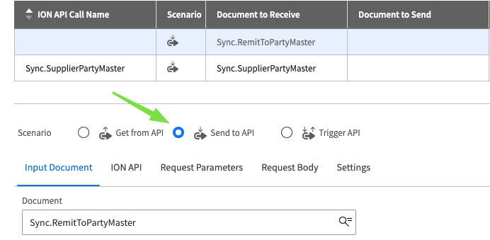<figcaption></figcaption></figure>

3. **Configure the ION API**:

    * **API Call Name**: `Sync.RemitToPartyMaster`
    * **Click on Select**
    * For **Product**, select the API endpoint created in **Step 1: Create an API**.
    * Locate and select:

        ```
        CustomerApi/DocBits-Sandbox/Sandbox/import/supplier_bod
        ```
    * **Click OK** to confirm the configuration.


<figure>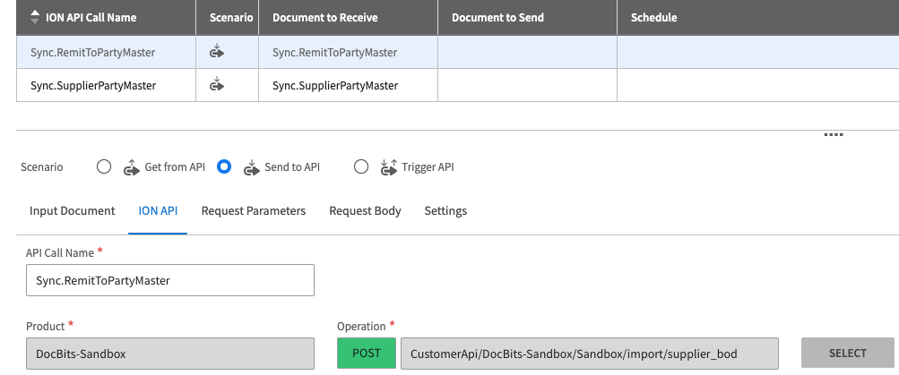<figcaption></figcaption></figure>

4. **Configure the Request Body**:

    * For **File**, select **Input Document = No Compression**.


<figure>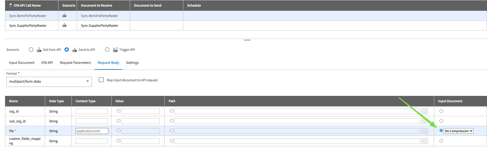<figcaption></figcaption></figure>

## Acknowledge.SupplierInvoice

1. Navigate to the **Documents** tab in the API Connection Point.

<figure><figcaption></figcaption></figure>

2. **Click Add New Document** and fill in the following details:

    * **Scenario**: `Send to API`
    * **Documents**: `Acknowledge.SupplierInvoice`


<figure>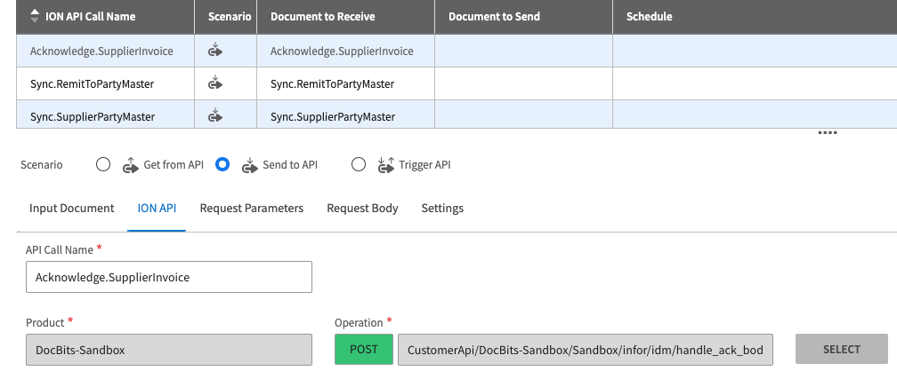<figcaption></figcaption></figure>

4. **Configure the Request Body**:
  Add the following values in the **Request Body** section:

    * For **idm_doc_type**, set **Value** = `M3_SupplierInvoice`
    * For **idm_bod_id_field_name**, set **Value** = `BOD_AlternateDocumentID_1`
    * For **attributes_map**, set **Value** =

        ```
        {"Export": "Success"}
        ```
    * For **acl_from**, set **Value** = `Public`
    * For **acl_to**, set **Value** = `Private`
    * For **set_to_error_on_rejected**, set **Value** = `True`
    * For **delete_from_idm_on_rejected**, set **Value** = `True`
    * For **File**, set **Input Document = No Compression**.
    * For **ionapi_json**: Add the content of the ionapi file.


<figure>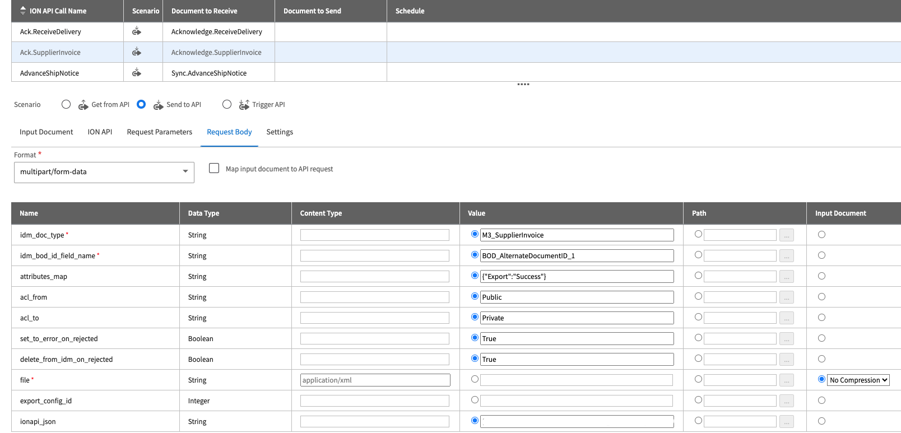<figcaption></figcaption></figure>

## Sync.PurchaseOrder

1. Navigate to the **Documents** tab in the API Connection Point.

<figure><figcaption></figcaption></figure>

2. **Click Add New Document** and fill in the following details:

    * **Scenario**: `Send to API`
    * **Documents**: `Sync.PurchaseOrder`


<figure>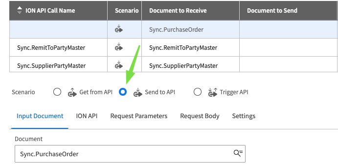<figcaption></figcaption></figure>

3. **Configure the ION API**:

    * **API Call Name**: `Sync.PurchaseOrder`
    * **Click on Select**
    * For **Product**, select the API endpoint created in **Step 1: Create an API**.
    * Locate and select:

        ```
        CustomerApi/DocBits-Sandbox/Sandbox/import/purchase_order_bod
        ```
    * **Click OK** to confirm the configuration.


<figure>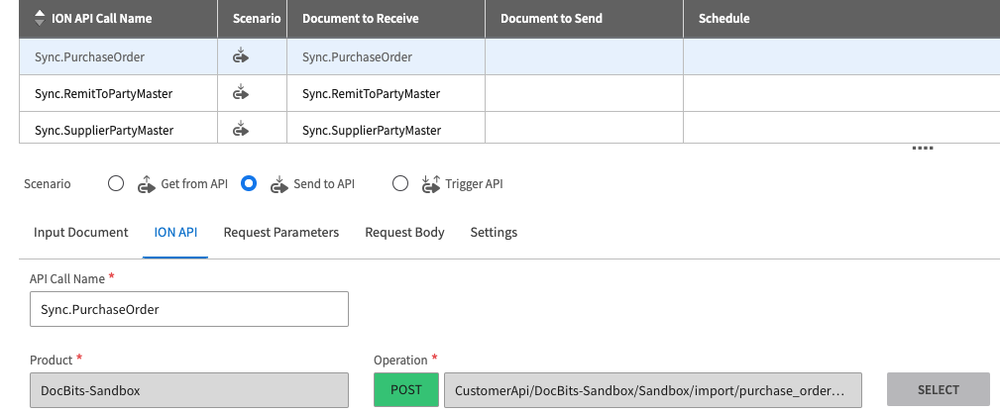<figcaption></figcaption></figure>

4. **Configure the Request Body**:

    * For **File**, set **Input Document = No Compression**.


<figure>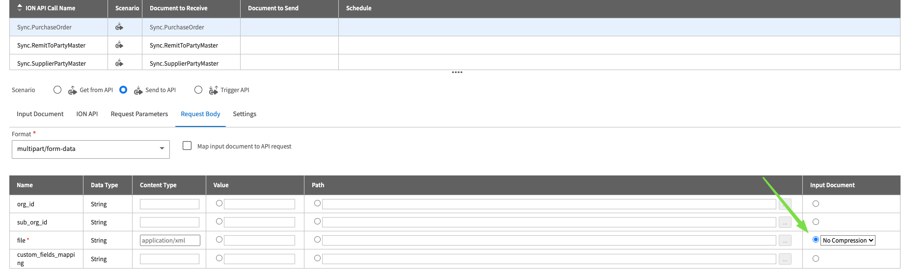<figcaption></figcaption></figure>

## Sync.ReceiveDelivery

1. Navigate to the **Documents** tab in the API Connection Point.

<figure><figcaption></figcaption></figure>

2. **Click Add New Document** and fill in the following details:

    * **Scenario**: `Send to API`
    * **Documents**: `Sync.ReceiveDelivery`


<figure>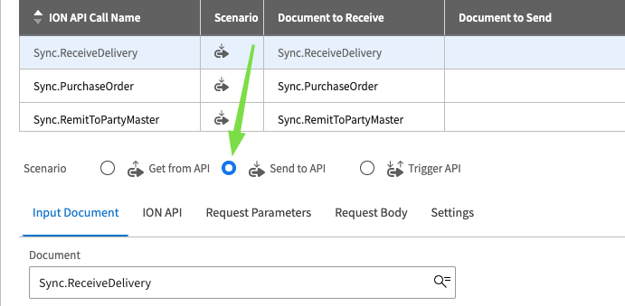<figcaption></figcaption></figure>

3. **Configure the ION API**:

    * **API Call Name**: `Sync.ReceiveDelivery`
    * **Click on Select**
    * For **Product**, select the API endpoint created in **Step 1: Create an API**.
    * Locate and select:

        ```
        CustomerApi/DocBits-Sandbox/Sandbox/import/receive_delivery_bod
        ```
    * **Click OK** to confirm the configuration.


<figure>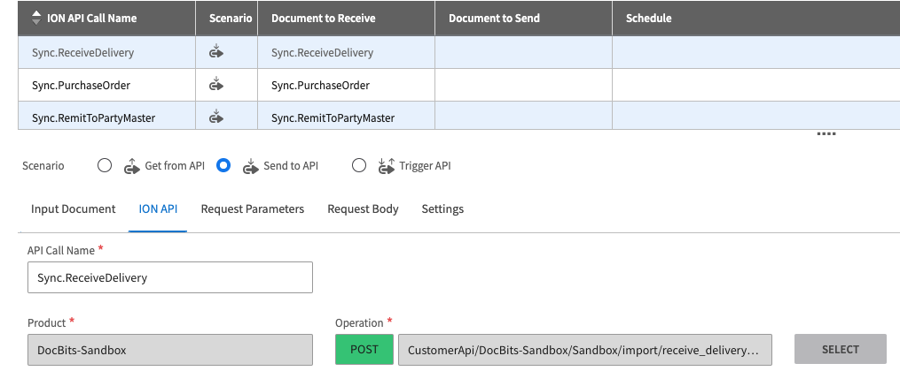<figcaption></figcaption></figure>


4. **Configure the Request Body**:

    * For **File**, set **Input Document = No Compression**.


<figure>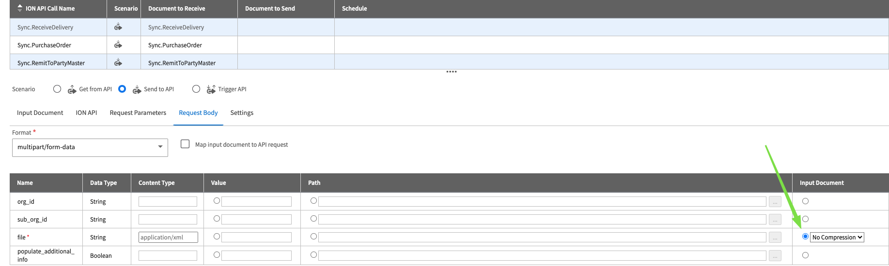<figcaption></figcaption></figure>

2. **Click Add New Document** and fill in the following details:

    * **Scenario**: `Send to API`
    * **Documents**: `Sync.AdvanceShipNotice`


<figure>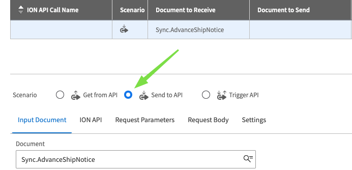<figcaption></figcaption></figure>

3. **Configure the ION API**:

    * **API Call Name**: `Sync.AdvanceShipNotice`
    * For **Product**, select the API endpoint created in **Step 1: Create an API**.
    * Locate and select:

        ```
        CustomerApi/DocBits-Sandbox/Sandbox/master_data_lookup/xml/import_xml_file
        ```
    * **Click OK** to confirm the configuration.


<figure>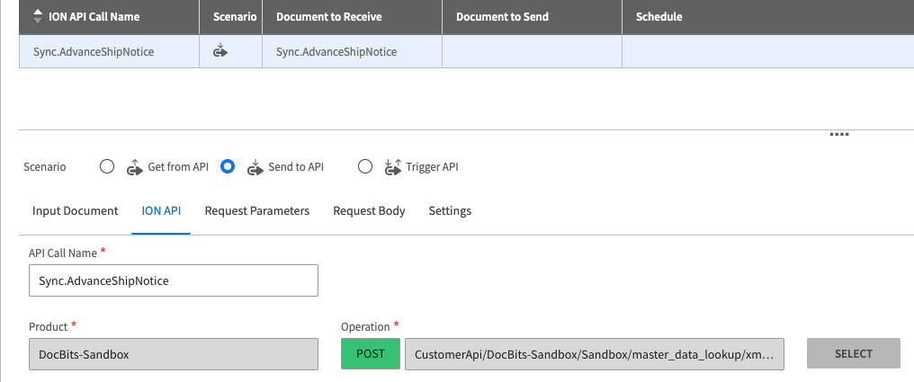<figcaption></figcaption></figure>

4. **Configure the Request Body**:

    * For **data_type**, set **Value** = `AdvanceShipNotice`
    * For **field_mappings**, set **Value** =

        ```
        { "ID": "//DataArea/LnTaxCode/DocumentID/ID" }
        ```
    * For **File**, set **Input Document = No Compression**.


<figure>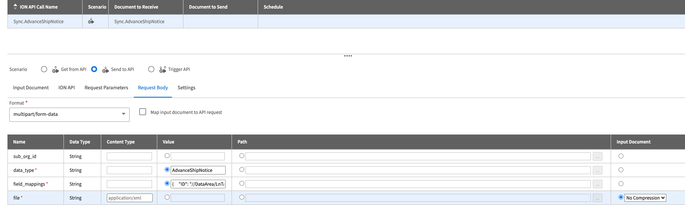<figcaption></figcaption></figure>

## Sync.ChartOfAccounts

1. Navigate to the **Documents** tab in the API Connection Point.

<figure><figcaption></figcaption></figure>

2. **Click Add New Document** and fill in the following details:

    * **Scenario**: `Send to API`
    * **Documents**: `Sync.ChartOfAccounts`


<figure>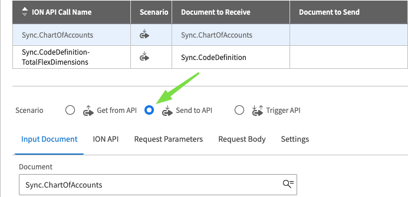<figcaption></figcaption></figure>

3. **Configure the ION API**:

    * **API Call Name**: `Sync.ChartOfAccounts`
    * For **Product**, select the API endpoint created in **Step 1: Create an API**.
    * Locate and select:

        ```
        CustomerApi/DocBits-Sandbox/Sandbox/master_data_lookup/xml/import_xml_file
        ```
    * **Click OK** to confirm the configuration.


<figure>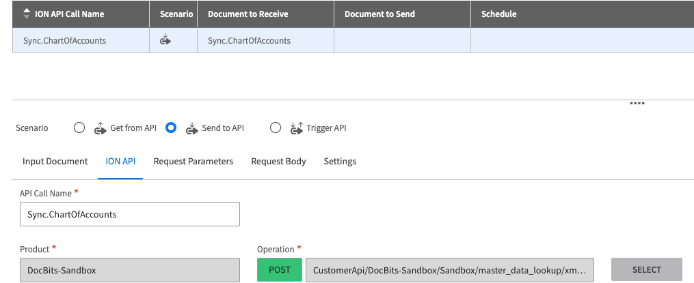<figcaption></figcaption></figure>

4. **Configure the Request Body**:

    * For **data_type**, set Value = `ChartOfAccounts`
    * For **field_mappings**, set Value =

        ```
        {
            "ID": "//DataArea/ChartOfAccounts/IDs/ID",
            "NominalAccount": "//DataArea/ChartOfAccounts/BaseChartOfAccounts/GLNominalAccount",
            "AccountType": "//DataArea/ChartOfAccounts/BaseChartOfAccounts/AccountType",
            "Description": "//DataArea/ChartOfAccounts/BaseChartOfAccounts/Description",
            "DimensionProfile": "//DataArea/ChartOfAccounts/DimensionProfileSet/DimensionProfile/ID",
            "Dimension1": "//DataArea/ChartOfAccounts/DimensionProfileSet/DimensionProfile/DimensionUsage[0]/ListID",
            "Usage1": "//DataArea/ChartOfAccounts/DimensionProfileSet/DimensionProfile/DimensionUsage[0]/Usage",
            "Dimension2": "//DataArea/ChartOfAccounts/DimensionProfileSet/DimensionProfile/DimensionUsage[1]/ListID",
            "Usage2": "//DataArea/ChartOfAccounts/DimensionProfileSet/DimensionProfile/DimensionUsage[1]/Usage",
            "Dimension3": "//DataArea/ChartOfAccounts/DimensionProfileSet/DimensionProfile/DimensionUsage[2]/ListID",
            "Usage3": "//DataArea/ChartOfAccounts/DimensionProfileSet/DimensionProfile/DimensionUsage[2]/Usage",
            "Dimension4": "//DataArea/ChartOfAccounts/DimensionProfileSet/DimensionProfile/DimensionUsage[3]/ListID",
            "Usage4": "//DataArea/ChartOfAccounts/DimensionProfileSet/DimensionProfile/DimensionUsage[3]/Usage",
            "Dimension5": "//DataArea/ChartOfAccounts/DimensionProfileSet/DimensionProfile/DimensionUsage[4]/ListID",
            "Usage5": "//DataArea/ChartOfAccounts/DimensionProfileSet/DimensionProfile/DimensionUsage[4]/Usage",
            "Dimension6": "//DataArea/ChartOfAccounts/DimensionProfileSet/DimensionProfile/DimensionUsage[5]/ListID",
            "Usage6": "//DataArea/ChartOfAccounts/DimensionProfileSet/DimensionProfile/DimensionUsage[5]/Usage",
            "Dimension7": "//DataArea/ChartOfAccounts/DimensionProfileSet/DimensionProfile/DimensionUsage[6]/ListID",
            "Usage7": "//DataArea/ChartOfAccounts/DimensionProfileSet/DimensionProfile/DimensionUsage[6]/Usage"
        }
        ```
    * For **File**, set **Input Document = No Compression**.


<figure>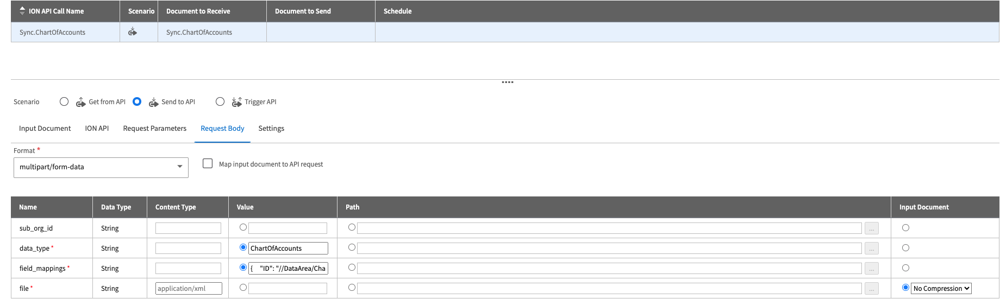<figcaption></figcaption></figure>

## Sync.CodeDefinition-AccountingDimension

1. Navigate to the **Documents** tab in the API Connection Point.

<figure><figcaption></figcaption></figure>

2. **Click Add New Document** and fill in the following details:

    * **Scenario**: `Send to API`
    * **Documents**: `Sync.CodeDefinition`


<figure><figcaption></figcaption></figure>

3. **Configure the ION API**:

    * **API Call Name**: `Sync.CodeDefinition-AccountingDimension`
    * For **Product**, select the API endpoint created in **Step 1: Create an API**.
    * Locate and select:

        ```
        CustomerApi/DocBits-Sandbox/Sandbox/master_data_lookup/xml/import_xml_file
        ```
    * **Click OK** to confirm the configuration.


<figure>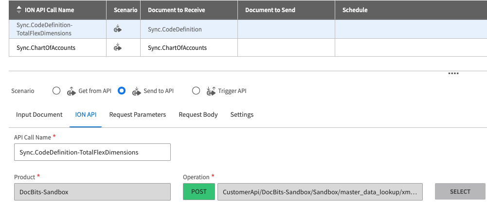<figcaption></figcaption></figure>

4. **Configure the Request Body**:

    * For **data_type**, set Value = `M3Dimension`
    * For **field_mappings**, set Value =

        ```
        {
            "ID": "//DataArea/CodeDefinition/DocumentID/ID",
            "Dimension": "substring(//DataArea/CodeDefinition/CodeValue/@listID,21)",
            "ListID": "//DataArea/CodeDefinition/ListID",
            "CodeValue": "//DataArea/CodeDefinition/CodeValue",
            "Description": "//DataArea/CodeDefinition/Description"
        }
        ```
    * For **File**, set **Input Document = No Compression**


<figure>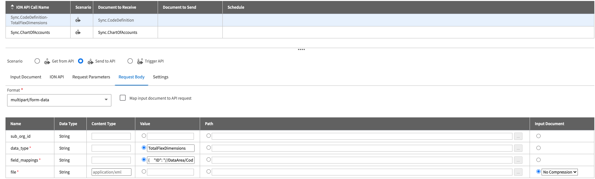<figcaption></figcaption></figure>

## Step 3: Create the Document Flow

1. Navigate to **OS** > **ION** > **Connect** > **Data Flows**.
2. Click **Add** and select **Document Flow**.
3. Fill in the required fields:

    * **Name**: Use a name specific to your environment, such as `M3-to-DocBits-Stage-Import-API`
    * for stage, `M3-to-DocBits-Sandbox-Import-API` for sandbox, or `M3-to-DocBits-Prod-Import-API` for production.
    * **Description**: Same as the name above.

4. Configure the Application Node:

    * Under **Application**, set the **Name** to `M3`.


<figure>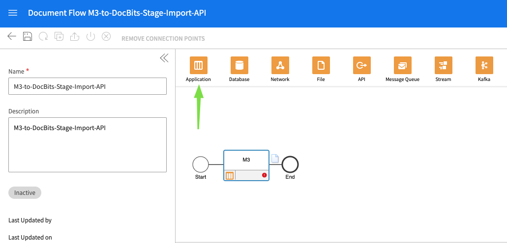<figcaption></figcaption></figure>


    * Click the **+** button and select the customer's connection point.


<figure>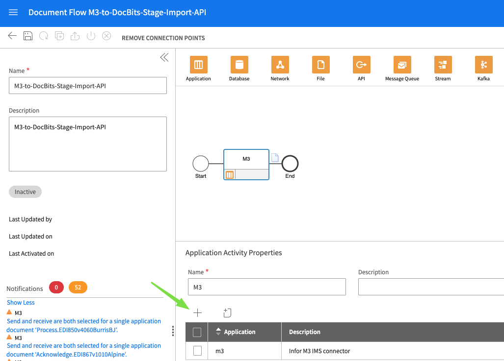<figcaption></figcaption></figure>


    * Click on the **Document** icon next to the application node.

        * Select all the documents you want to export/sync from LN to DocBits.
        * Ensure these documents match the ones selected in **Step 2: Create an API Connection Point**.
        * If any documents are missing, they must be added to the customer's connection point.


<figure>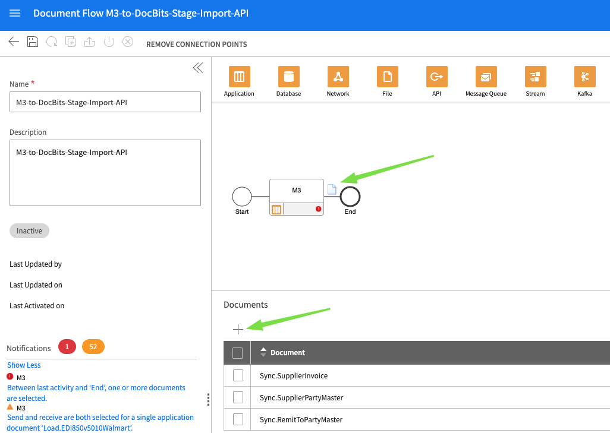<figcaption></figcaption></figure>


5. Configure the API Node:

    * Add a **API** node and position it to the right of the application node.
    * Fill in the required fields:

        * **Name**: `DocBits-API`
        * **Description**: `DocBits-API`
        * **ION API Connector**: Use the connection point created in **Step 2: Create an API Connection Point**.

    * Click the **Document** icon next to the stream node. This should be empty.

<figure>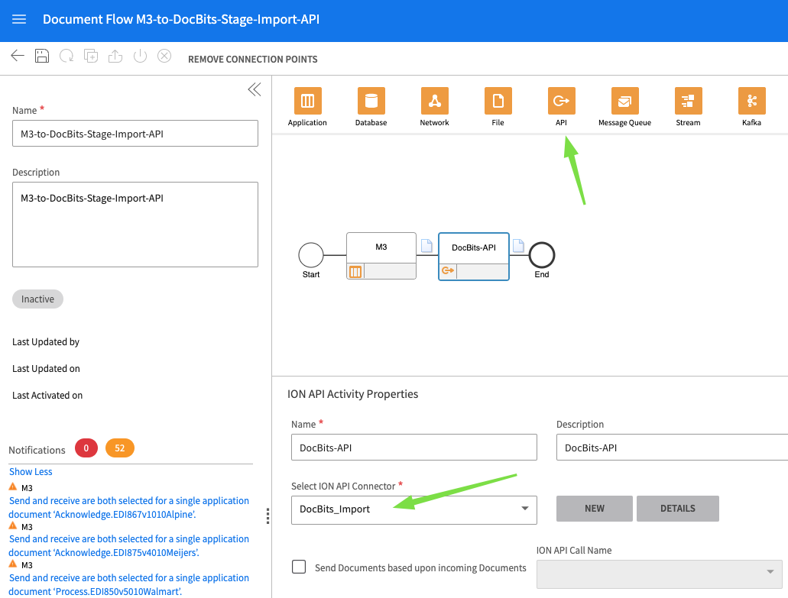<figcaption></figcaption></figure>

6. Finalize the Setup:

    * Save the configuration.
    * Click **Activate** to complete the setup.

<figure>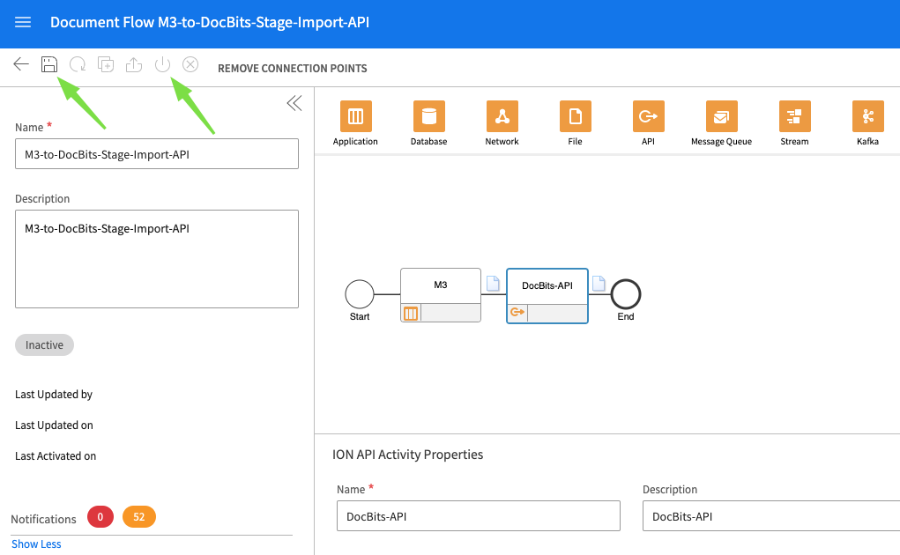<figcaption></figcaption></figure>


