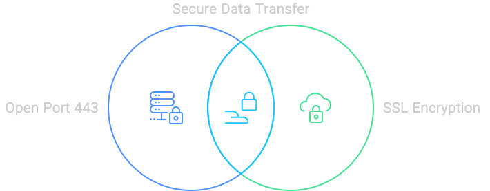

# Infraestructura de Infor

### Puerto 443 Abierto y Comunicación Segura

Entendemos la importancia de la transferencia de datos segura. Por eso utilizamos el puerto 443 abierto, el puerto estándar para HTTPS, asegurando que todos los datos transferidos estén encriptados y sean seguros. Nuestras conexiones aseguradas por SSL garantizan que sus datos estén seguros en cada paso del proceso.

<figure><figcaption></figcaption></figure>

### Comunicación Con La Base de Datos

Cuando se trata de comunicación con la base de datos, no tomamos riesgos. Nuestra configuración de Kubernetes y las bases de datos residen dentro de la misma Nube Privada Virtual (VPC). Esto significa que solo accedemos a la base de datos a través de IP local, asegurando que los datos transmitidos nunca salgan de la red local. Es como tener una carretera privada solo para sus datos.

### Espacios

El manejo de documentos es muy sencillo con Docbits. Todos los documentos subidos se almacenan de forma segura en un ‘Espacio’ dedicado. Utilizamos encriptación SSL para el tráfico de datos y requerimos múltiples claves para el acceso a archivos, asegurando que sus documentos estén tan seguros como una bóveda.

### Traffic Security

Solo permitimos conexiones aseguradas por HTTPS para comunicarnos con nuestros servidores. Esto asegura que todos los datos transferidos estén encriptados, manteniendo su información sensible segura y protegida. Es como tener un guardia de seguridad para sus datos, 24/7.

### Infor Cloud

### Infor On-Prem

La flexibilidad es clave, y ofrecemos tanto soluciones en la nube como en las instalaciones. Con nuestra opción en las instalaciones, no es necesario abrir ningún puerto, asegurando que la seguridad de su red permanezca intacta. Ya sea que esté en la nube o manteniendo las cosas internas, lo tenemos cubierto.
