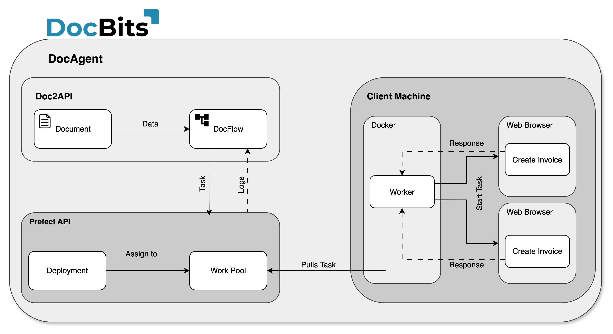

# Architecture

**DocBits Cloud customer:**

<figure><figcaption></figcaption></figure>

### DocBits On premise:

<figure><figcaption></figcaption></figure>

Doc**Bits** seamlessly integrates with Infor LN/M3 through ION API, ION Desk, and Infor Standard BODs. Our API integration allows us to export data to Infor and perform master data validation in Doc**Bits**.

## **DocBits Operator Architecture:**

All connections between components are secured using industry-standard encryption protocols. SSH, HTTPS, and other secure channels ensure data integrity and confidentiality throughout the system.

**On Premise:**&#x20;

<figure><figcaption></figcaption></figure>


[prefect-local-setup-requirements.md](prefect-local-setup-requirements.md)


**Cloud**:

<figure><figcaption></figcaption></figure>

## Exporting Data to Infor

We use the ION API to send the PDF with attributes to IDM and the BOD Sync.CaptureDocument to ION Desk. In ION Desk, we transform the [Sync.CaptureDocument](../../infor-integration-and-configuration/exporting-in-docbits/) to the desired target BODs based on the document type being processed. These transformed Infor BODs are then automatically imported to LN or M3.


Export to [Infor](../../infor-integration-and-configuration/exporting-to-infor/)


## Master Data Validation in DocBits

To identify the supplier or compare/match purchase order lines, we activate a trigger in LN/M3 that sends the Sync.RemitToPartyMaster, Sync.SupplierPartyMaster, and Sync.PurchaseOrder BODs to Doc**Bits**. We configure this process in ION Desk by defining the dataflow to a specific connection point to Doc**Bits**.

<figure><figcaption></figcaption></figure>


[Master Data Validation](../../infor-integration-and-configuration/importing-customer-master-data/)

