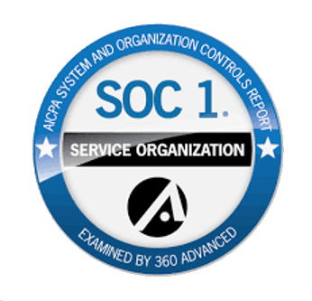
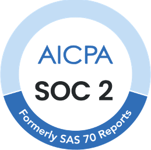
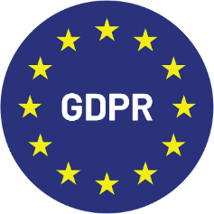

# Certifications

## 1. ISO/IEC 27001

\

<figure><figcaption></figcaption></figure>

This international standard defines the requirements for establishing, implementing, maintaining, and continually improving an Information Security Management System (ISMS). It helps organizations protect data in a systematic and cost-effective way, including processes for risk management and information security controls.

Impact for Clients: Ensures that DocBits adheres to the highest standards of information security, providing confidence that sensitive data is well-protected.

\

## 2. SOC 1 (Service Organization Control 1)

\

<figure><figcaption></figcaption></figure>

SOC 1 reports are designed for organizations that need to demonstrate the effectiveness of internal controls over financial reporting. It is particularly relevant for service providers that affect their clients’ financial reporting.

Relevance to DocBits: Demonstrates our commitment to maintaining stringent internal controls over financial data, providing assurance to clients about the reliability of our processes.

\

## 3. SOC 2 (Service Organization Control 2)

\

<figure><figcaption></figcaption></figure>

SOC 2 focuses on a service organization’s controls relevant to security, availability, processing integrity, confidentiality, and privacy of data. It is crucial for technology and cloud computing companies that handle sensitive information.

Value for Clients: Provides an independent validation that DocBits has implemented effective controls to protect client data, ensuring trustworthiness in our software and services.

\

## 4. GDPR (General Data Protection Regulation) Compliance

\

<figure><figcaption></figcaption></figure>

The GDPR is a regulation in EU law on data protection and privacy in the European Union and the European Economic Area. It also addresses the transfer of personal data outside the EU and EEA areas.

Client Assurance: Compliance with GDPR ensures that DocBits processes personal data in line with EU regulations, protecting user privacy and adhering to strict data handling guidelines.
