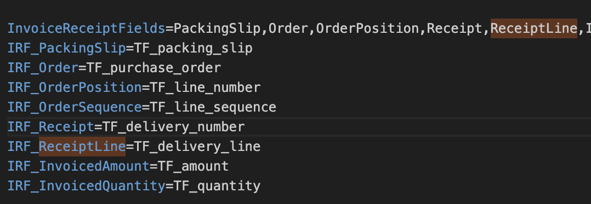

# la valeur doit être numérique.

## **Étape 1: Examiner la commande d'achat**

**1. Vérifier la commande d'achat depuis le tableau de bord**

* Si le statut du document est **Erreur d'exportation**:
  1. Localisez le document sur le tableau de bord.
  2. Cliquez dessus, puis sélectionnez le bouton **Validation des champs** pour revenir à l'écran de validation des champs.
* Si le statut du document est **Prêt pour validation**:
  1. Cliquez sur le document pour accéder directement à l'écran de **Validation des champs**.
* Si le document est en statut **En attente d'approbation**:
  1. Accédez à l'écran **Approbation**.
  2. À côté des **Articles de ligne de facture**, localisez la **Table de commande d'achat**.
  3. Passez à l'étape 3. Vérifiez le numéro de livraison.

**2. Vérifier la commande d'achat**

1. Sur l'écran de **Validation des champs**, assurez-vous que la bonne commande d'achat est sélectionnée.
2. Une fois que la bonne commande d'achat est confirmée, cliquez sur la commande d'achat à côté du tableau extrait, pour ouvrir la vue de la **Table de commande d'achat**.

**3. Vérifier le numéro de livraison**

* Dans la Table de commande d'achat, recherchez la colonne **Numéro de livraison**:
  * **Si un numéro de livraison est présent**, passez à l'écran **Approbation** et vérifiez à nouveau s'il est présent, lorsque présent, passez à l'**Étape 3**.
  * **Si aucun numéro de livraison n'est présent**, suivez l'**Étape 2** pour résoudre ce problème.

## Étape 2: Vérifier la commande d'achat dans LN

Avant d'envoyer la commande d'achat à DocBits, vérifiez que le **Numéro de livraison** est correctement attribué dans **LN**. Vérifiez les détails de la **Commande d'achat** dans **LN** pour vous assurer qu'elle est complète et précise. Si le **Numéro de livraison** est manquant ou incorrect, cela pourrait être la cause de l'erreur d'exportation.

Si la **Commande d'achat** semble correcte et contient les détails nécessaires, vous pouvez passer à l'étape suivante.

## **Étape 3: Ouvrir les paramètres de DocBits**

1. Ouvrez **DocBits** et accédez à la section **Paramètres**.
2. Naviguez jusqu'à **Traitement des documents**.
3. Sélectionnez **Export**.
4. Dans la section **Export**, cliquez sur l'icône des **trois points** à côté de l'export qui ne fonctionne pas et sélectionnez **Modifier**.
5. Dans le menu **Modifier les paramètres d'export**, cliquez sur **Télécharger le fichier de mappage LN**.

## **Étape 3: Modifier le fichier de mappage LN**

1. Ouvrez le fichier de mappage LN téléchargé.
2. Recherchez le champ **IRF\_ReceiptLine**.
   * Si le champ **IRF\_ReceiptLine** est présent et défini sur **rien** (vide), mettez à jour avec **TF\_delivery\_line**.
   * Si le champ **IRF\_ReceiptLine** n'est **pas présent**, ajoutez-le au fichier et définissez sa valeur sur **TF\_delivery\_line**.
3. Pour le champ **Champs de réception de facture**, ajoutez **ReceiptLine** aux valeurs.

Il devrait ressembler à ceci:

<figure><figcaption></figcaption></figure>

## **Étape 4: Ajouter le fichier mis à jour à DocBits**

1. Retournez à la section **Export** dans DocBits où vous avez précédemment téléchargé le fichier de mappage LN.
2. Téléchargez le fichier de mappage LN modifié avec les nouvelles mises à jour.

## Étape 5: Réessayer l'export

Après avoir confirmé que la **Commande d'achat** a un **Numéro de livraison** et avoir vérifié que le **fichier d'exportation est correct**, suivez ces étapes pour réessayer l'exportation:

1. **Retour au tableau de bord:**
   * Retournez au tableau de bord et trouvez le document avec l'erreur d'exportation.
2. **Réessayer le processus d'exportation:**
   * Cliquez sur le document avec l'erreur d'exportation.
   * Si la **Commande d'achat** a un **Numéro de livraison** valide et que le **fichier d'exportation** est correct, procédez à la nouvelle tentative d'exportation.
3. **Vérifier le résultat de l'exportation:**
   * Après la nouvelle tentative, vérifiez à nouveau le processus d'exportation pour voir si le problème a été résolu et si le document n'apparaît plus comme une erreur d'exportation.
   * Si l'exportation est réussie, le problème devrait être résolu.
4. **Investigation supplémentaire (si le problème persiste):**
   * Si le problème persiste après la nouvelle tentative d'exportation, contactez le support pour une investigation supplémentaire sur d'éventuelles configurations ou problèmes système.
