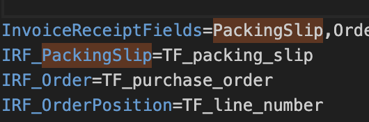

# nicht gefunden im Lastschriftverfahren

## **Schritt 1: Überprüfen der LN-Konfiguration**

1. Melden Sie sich bei **LN CE** an.
2. Navigieren Sie zum **Optionen**-Menü und wählen Sie **Programm ausführen**.
3. Geben Sie im Eingabefeld **ACP-Parameter** ein und drücken Sie die Eingabetaste, um das Programm zu öffnen.
4. Klicken Sie auf den Pfeil neben dem Feld **Aktuelle Einstellung**, um die Einstellungen zu erweitern.
5. Gehen Sie zum Abschnitt **Abgleich**.
   * **Überprüfen der automatischen Abgleicheinstellung:**
     * Wenn der **Automatische Abgleich** auf **Mit Wareneingangsschein abgleichen** eingestellt ist, fahren Sie mit dem nächsten Schritt fort.
     * Wenn er **nicht** auf **Mit Wareneingangsschein abgleichen** eingestellt ist, aber Sie trotzdem diesen Fehler erhalten haben, kontaktieren Sie uns bitte.

## **Schritt 2: Öffnen der DocBits-Einstellungen**

Wenn der **Automatische Abgleich** auf **Mit Wareneingangsschein abgleichen** eingestellt ist, fahren Sie mit den folgenden Schritten in DocBits fort:

1. Öffnen Sie **DocBits** und gehen Sie zum Abschnitt **Einstellungen**.
2. Navigieren Sie zu **Dokumentenverarbeitung**.
3. Wählen Sie **Export** aus.
4. Klicken Sie im **Export**-Abschnitt auf das **Drei-Punkte**-Symbol neben dem Export, der nicht funktioniert, und wählen Sie **Bearbeiten**.
5. Klicken Sie im Menü **Exporteinstellungen bearbeiten** auf **LN-Mapping-Datei herunterladen**.

## **Schritt 3: Bearbeiten der LN-Mapping-Datei**

1. Öffnen Sie die heruntergeladene **LN-Mapping**-Datei.
2. Suchen Sie nach dem Feld **IRF\_PackingSlip**.
   * Wenn das Feld **IRF\_PackingSlip** vorhanden ist und auf **nichts** (leer) eingestellt ist, aktualisieren Sie es auf **TF\_packing\_slip**.
   * Wenn das Feld **IRF\_PackingSlip** **nicht vorhanden** ist, fügen Sie es der Datei hinzu und setzen Sie seinen Wert auf **TF\_packing\_slip**.
3. Fügen Sie für das Feld **InvoiceReceiptFields** **PackingSlip** zu den Werten hinzu.

Es sollte wie folgt aussehen:

<figure><figcaption></figcaption></figure>

## **Schritt 4: Die aktualisierte Datei wieder zu DocBits hinzufügen**

1. Gehen Sie zurück zum **Export**-Abschnitt in DocBits, wo Sie die **LN-Mapping**-Datei zuvor heruntergeladen haben.
2. Laden Sie die bearbeitete **LN-Mapping**-Datei mit den neuen Updates hoch.

## Wenn Sie immer noch den Fehler **Dokument kann nicht in LN exportiert werden** mit dem Statuscode **500** erhalten, kontaktieren Sie uns bitte
