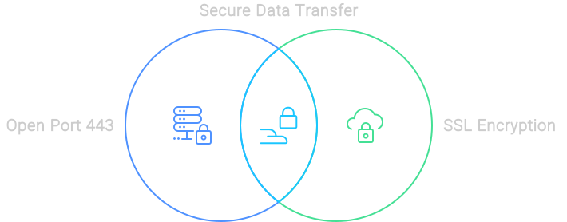
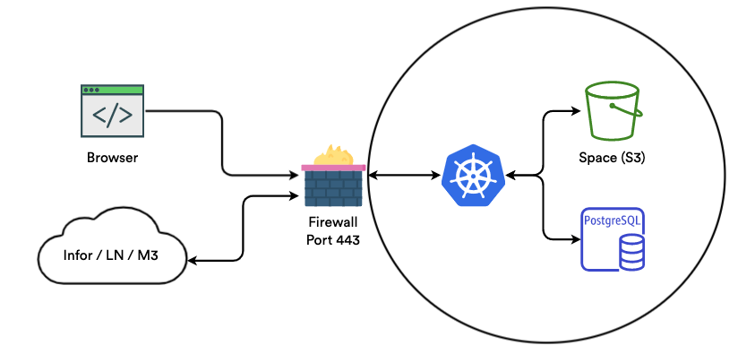
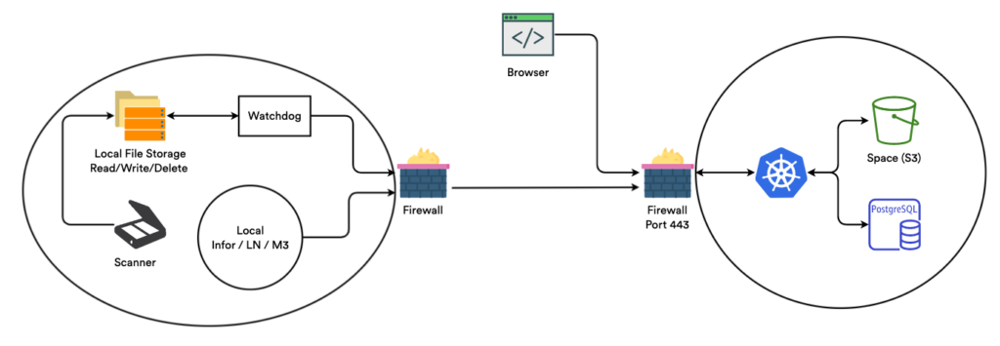

# Infraestrutura Infor

### Porta 443 Aberta & Comunicação Segura

Entendemos a importância da transferência segura de dados. É por isso que usamos a porta 443 aberta, a porta padrão para HTTPS, garantindo que todos os dados transferidos sejam criptografados e seguros. Nossas conexões seguras por SSL garantem que seus dados estejam seguros em cada etapa do processo.

<figure><figcaption></figcaption></figure>

### Comunicação Com O Banco de Dados

Quando se trata de comunicação com o banco de dados, não corremos riscos. Nossa configuração de Kubernetes e bancos de dados residem dentro da mesma Nuvem Privada Virtual (VPC). Isso significa que acessamos o banco de dados apenas via IP local, garantindo que os dados transmitidos nunca deixem a rede local. É como ter uma rodovia privada apenas para seus dados.

### Espaços

O manuseio de documentos é fácil com o Docbits. Todos os documentos enviados são armazenados com segurança em um ‘Espaço’ dedicado. Usamos criptografia SSL para o tráfego de dados e exigimos várias chaves para acesso aos arquivos, garantindo que seus documentos estejam tão seguros quanto um cofre.

### Traffic Security

Permitimos apenas conexões seguras por HTTPS para comunicar com nossos servidores. Isso garante que todos os dados transferidos sejam criptografados, mantendo suas informações sensíveis seguras e protegidas. É como ter um segurança para seus dados, 24 horas por dia, 7 dias por semana.

### Infor Cloud

<figure><figcaption></figcaption></figure>

### Infor On-Prem

A flexibilidade é fundamental, e oferecemos soluções tanto em nuvem quanto on-premise. Com nossa opção on-premise, não há necessidade de abrir portas, garantindo que a segurança da sua rede permaneça intacta. Seja na nuvem ou mantendo as coisas internas, estamos aqui para ajudar.

<figure><figcaption></figcaption></figure>
