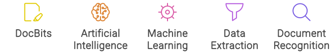

# Principais Recursos do DocBits

DocBits é uma solução de captura de documentos baseada em nuvem que aproveita o poder da Inteligência Artificial (IA) e Aprendizado de Máquina (ML) para reconhecer, classificar, analisar e extrair informações de vários tipos de documentos, independentemente de seu formato. Aqui está uma visão mais detalhada de seus principais recursos:

<figure><figcaption></figcaption></figure>

* Reconhecimento de Documentos: O DocBits utiliza algoritmos de IA para identificar e reconhecer com precisão documentos, seja em formato físico ou arquivos eletrônicos.
* Classificação de Documentos: Classifica os documentos em categorias relevantes, facilitando a organização e recuperação fácil.
* Extração de Dados: Extrai dados críticos dos documentos, transformando informações não estruturadas em dados estruturados que podem ser integrados ao seu fluxo de trabalho.
* Aprendizado de Máquina: O sistema aprende continuamente e melhora sua precisão de reconhecimento com cada documento processado, tornando-se mais eficiente ao longo do tempo.
* Inteligência de Enxame: O DocBits utiliza inteligência de enxame para aprimorar suas capacidades de aprendizado, criando um sistema autoaperfeiçoável.
