# Release Notes

## Release Spring Bloom – 23rd April 2025

### DocBits enhancements:

* **Filter Option for Email Import Log:**\
  Users now have the ability to filter the import logs and sort the table for a clearer, more efficient overview. This enhancement streamlines the process of identifying and managing email entries, improving troubleshooting and overall log management.
* **Multi-Language Support for List of Values :**\
  We've expanded multi-language capabilities to the List of Values feature. Administrators can now define labels in multiple languages, ensuring that the correct label is automatically displayed based on the user's system language settings. This enhancement promotes greater accessibility and localization, making it easier for users worldwide to interact with the platform in their native language.
* **User Detail Enhancements in Settings:**\
  The settings interface now displays comprehensive user information. Administrators can easily view group affiliations, sub-organization details, and additional key data, enabling better management of user roles and a clearer understanding of team structures.
* **Auto Accounting Information on the Approval Screen:**\
  The approval screen now presents auto accounting details alongside invoice information. This improvement provides deeper insight into transaction data, facilitating smoother review processes and more informed decision-making regarding invoices.
* **Task Counter for Documents on the Dashboard View:**\
  Documents on the dashboard can now indicate open tasks associated with them and display the total number of pending tasks. This feature provides users with a quick overview of outstanding actions, improving task management and workflow efficiency.
* **Supplier-Based AI Model Selection:**\
  Users can now select the AI model used for data extraction on a per-supplier basis. This enhancement allows for fine-tuned optimization, ensuring better extraction accuracy for different suppliers and improving overall data processing results. [Learn more](https://docs.docbits.com/end-user-and-partner-section/end-user-section/validation-screen#supplier-based-ai-model)
* **Enhanced Workflow Logs for Decision Tree Cards:**\
  The logs now display the output of the decision tree, making it easier to track and understand how decisions were made within workflows.
*   **Introduction of New Auto-Testing Setup to Enhance System Functionality and Stability:**

    We are excited to announce the implementation of a new automated testing system designed to improve the overall functionality and reliability of our platform. This new setup will run consistent, thorough checks on our system to identify any issues before they impact your experience. By automating these tests, we can ensure faster responses to potential problems and maintain the highest standards of quality for our system.

### Bug Fixes

* Resolved an issue where tasks were not appearing on the validation/approval screen.
* Fixed the positioning of the Next/Previous button so that it remains static.
* Fixed scrolling issues in the script and decision tree views, ensuring that action buttons remain stationary during scroll.
* Removed the origin country field from e-invoices.
* Fixed an issue with the task counter displaying an inaccurate number of tasks.
* Added missing translations.
* Corrected custom fields to display descriptive names instead of IDs.
* Resolved an issue where documents were downloaded with an incorrect file name.
* Fixed sorting inconsistencies in the invoice line table within PO matching.
* Fixed an issue affecting task creation functionality.
* Fixed an issue in PO matching where the invoice table sorting would reset when matching a line.
* Resolved auto accounting issues by ensuring booking references split correctly when an amount is divided.
* Updated the ClickHouse host information.
* Resolved an issue where duplicate documents were not recognized as duplicates.
* Fixed export issues caused by booking references that were too long.
* Resolved an issue where readonly checkboxes where not readonly&#x20;
* Fixed an issue where Users can be added to a sub-organization twice&#x20;
* Fixed an issue where changing the sub-organization for a document caused to reset the assigned user or group

## Release Hot Fix Winter Frost  17th March 2025

### Bug Fixes

* Improved the shortcuts.

## Release Hot Fix Winter Frost  11th March 2025

### DocBits enhancements:

* **Improved Data Extraction:** Added an option to extract the **Purchase Order** or **Item Number** from a line above or below.
* **Expanded Cross Sub-Organizations Access:** Non-admin users can now also access the **Cross Sub-Organizations** feature. [Learn more](https://docs.docbits.com/administration-and-setup/settings/global-settings/groups-users-and-permissions/sub-organizations#cross-sub-organisations-access)

### **Bug Fixes:**

* Fixed an issue where users could not be added to a group.
* Fixed an issue with email import failures.
* Resolved an issue with the field training on documents with more than page&#x20;
* Fixed an issue where scripts didn’t work properly.
* Resolved an issue where document data didn't get displayed correctly&#x20;
* Fixed an issue with the auto update purchase order setting&#x20;
* Fixed an issue where the subscription tokens got displayed wrong&#x20;
* Resolved an issue where the task screen displayed an outdated document version&#x20;
* Fixed an issue that caused documents to not change their status &#x20;

## Release Hot Fix Winter Frost  3rd February 2025

### **DocBits Enhancements:**

* **Support for ISO-8859-1 for ZUGFeRD:** Improved compatibility for invoices using ISO-8859-1 character encoding.
* **Optimized Logging System:** Enhanced tracking and diagnostics for quicker issue identification and resolution.

## Release Winter Frost 22nd January 2025

#### New Features

### Support for ZUGFeRD 2.1 and Newer

DocBits now includes full support for ZUGFeRD versions 2.1 and above, enabling seamless handling and processing of ZUGFeRD-compliant electronic invoices. The integration ensures:

* **Compatibility**: DocBits is capable of managing ZUGFeRD invoices in both their structured (XML) and unstructured (PDF) formats, maintaining compliance with EU standards such as EN 16931 for e-invoicing.
* &#x20;**Efficiency**: Users can effortlessly import, validate, and extract data from ZUGFeRD e-invoices, minimizing manual data entry and reducing processing time.&#x20;
* **Flexibility**: Whether you're working with basic, comfort, or extended profiles within the ZUGFeRD standard, DocBits provides tools to manage each level of invoice complexity.&#x20;
* **Future-Proofing**: With support for newer versions, DocBits ensures that businesses remain compliant with evolving e-invoicing regulations across EU member states and beyond.

By incorporating ZUGFeRD 2.1 and newer standards, DocBits simplifies cross-border transactions and aligns with modern business needs, making it an essential tool for organizations prioritizing digital transformation and regulatory compliance. [Learn more](https://docs.docbits.com/administration-and-setup/settings/global-settings/document-types/edi/zugferd-1.0-2.1-and-2.3)

### External API Integration for Enhanced Document Processing

DocBits introduces an advanced capability to leverage external APIs during document processing, enhancing the completeness and accuracy of extracted data. This feature significantly reduces manual input by populating missing fields with accurate, up-to-date information retrieved in real time from trusted sources. It ensures that documents are processed faster and with greater consistency.

### Cross Sub-Organizations Access

For organizations with multiple sub-organizations enabled, DocBits now introduces the Cross Sub-Organizations feature. This enhancement empowers administrative users to streamline their document management across all sub-organizations under a single umbrella. Admin users can now access and view all documents from every sub-organisation without needing to switch sub-organization. This centralized visibility enables admins to see all the documents for all the sub-organisations, making it easy to locate specific files while still maintaining a bird’s-eye view. [Learn more](https://docs.docbits.com/administration-and-setup/settings/global-settings/groups-users-and-permissions/sub-organizations#cross-sub-organisations-access)

<figure>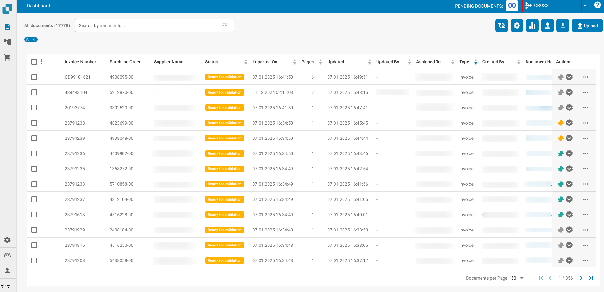<figcaption></figcaption></figure>

### Document Visibility Based on Group Permissions

DocBits introduces enhanced document visibility controls, enabling more precise access management for non-admin users through group-based permissions. This feature allows administrators to define which documents are visible to specific users or groups, ensuring streamlined workflows and improved data security. Admin users can assign documents to specific groups, granting visibility only to users within those groups. This ensures that users see only the documents relevant to their role or team, reducing clutter and enhancing focus. [Learn more](https://docs.docbits.com/administration-and-setup/settings/global-settings/groups-users-and-permissions/groups-and-permissions)

<figure><figcaption></figcaption></figure>

### Sequential Workflow and Approval History

DocBits introduces a powerful Sequential Workflow and Approval History feature, designed to enhance document processing efficiency and accountability. By enabling documents to follow a predefined decision tree, this feature ensures orderly review and approval while maintaining a complete record of actions taken. Sequential Workflow Management:

* Documents can be assigned to multiple users in a predefined sequence, ensuring that each stage of review or validation occurs in the correct order.
* Each user in the workflow is notified when it's their turn to act on the document, reducing confusion and delays.
* Workflows can be customized to match specific business processes

**Approval History:**

* A complete log of all actions taken on the document is available in the Validation and Approval views. This includes:&#x20;
  * User actions (e.g., "approved" "rejected")&#x20;
  * Timestamps for each action
  * Comments or notes added by users during review
* The history ensures transparency and provides an audit trail for compliance and troubleshooting. [Learn more](https://docs.docbits.com/administration-and-setup/settings/global-settings/document-types/more-settings/approval-history)

<figure><figcaption></figcaption></figure>

### SFTP/FTP Documents Archive Enhancement

The SFTP/FTP Documents Archive enhancement in DocBits builds on the existing import functionality, introducing a seamless method for archiving files after they’ve been processed. A new setting in the FTP import configuration allows users to enable or disable file archiving. Once files are successfully ingested and processed in DocBits, they will be automatically archived to a designated folder on the SFTP/FTP server if the option is enabled. This ensures processed files are preserved for record-keeping without cluttering the active import directories. [Learn more](https://docs.docbits.com/end-user-and-partner-section/end-user-section/how-to-import-documents/ftp)

<figure>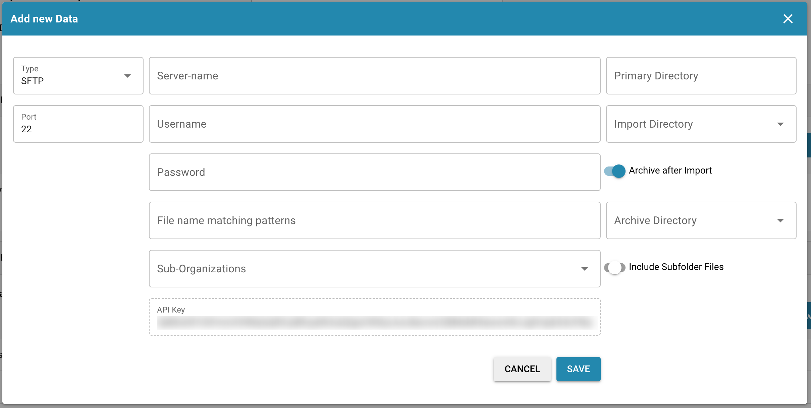<figcaption></figcaption></figure>

### Multiple Tax Section for Tax Type and Export to LN

This feature enhances tax handling capabilities by enabling detailed classification and export of tax information to Infor LN (Full Tax, Reduced Tax, Tax Free). This allows for better alignment with complex tax structures and ensures seamless integration with accounting systems.

**Multiple Tax Sections per Type**:

* DocBits now supports the addition of multiple tax sections under each tax type, such as:
  * Full Tax: Standard VAT or sales tax rates.
  * Reduced Tax: Lower rates for specific goods or services (e.g., essential items).&#x20;
  * Tax-Free: Exemptions for eligible transactions.&#x20;
* These sections allow precise categorization of tax amounts, ensuring compliance with tax regulations and accounting standards.

**Dynamic Auto Accounting Integration**:

* Based on the data extracted during document processing, the relevant tax sections are automatically displayed on the Auto Accounting Screen.
* This ensures that users can validate and adjust tax entries quickly without manual calculation or re-entry, streamlining the workflow.

**Export to Infor LN**:

* The tax data, including all relevant sections and classifications, is seamlessly exported to Infor LN, ensuring consistency between document processing in - DocBits and the enterprise resource planning (ERP) system.
* Exported data is linked to the respective cost lines in Infor LN, maintaining clear traceability and accurate financial reporting.

<figure>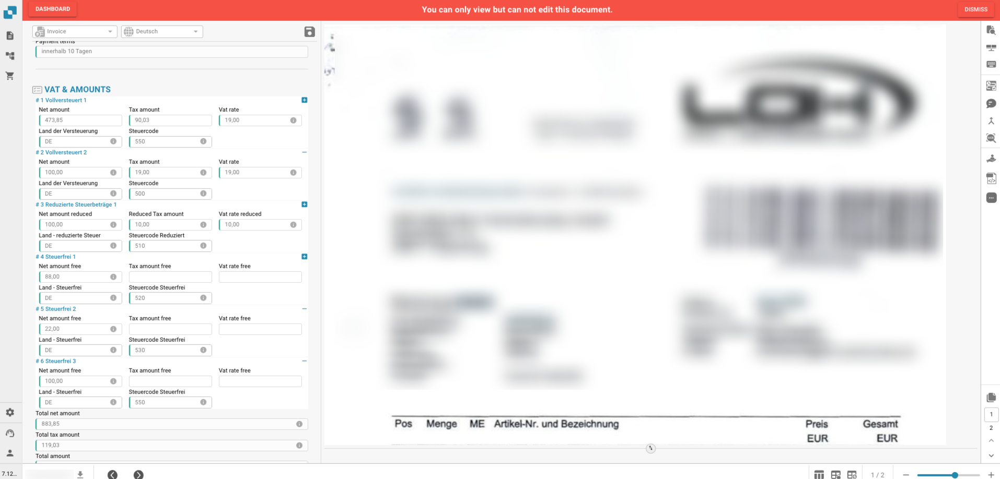<figcaption></figcaption></figure>

<figure><figcaption></figcaption></figure>

### Dashboard Enhancements

DocBits has introduced significant updates to the dashboard, focusing on usability, efficiency, and improved data visibility. These enhancements include a new "Assigned To Group" filter and an optimized UI for Document Logs, making it easier for users to interact with and manage their documents.

### PO Matching Enhancements

DocBits introduces several usability improvements to the PO Matching Screen, designed to streamline the process of matching purchase order (PO) lines with invoices. These enhancements offer more intuitive controls for multi-line selection and provide clear visual indicators for handling outdated PO data.

**Ctrl + Click for Individual Line Selection**:

* Users can now hold the Ctrl key and click on specific lines to select multiple, non-contiguous rows on the PO matching screen.

**Shift + Click for Range Selection**:

* Users can select a range of rows by holding the Shift key, clicking on the first row, and then clicking on the last row. All rows in between the first and last selection will be automatically selected.

**Automatic Outdated Data Detection**:

* If the PO data associated with an invoice is old (based on system settings), an icon will be displayed to notify the user. This visual indicator ensures that users are aware of stale data that may not reflect the latest updates in the purchase order.

### Bug Fixes

* Resolved an issue to ensure all possible values are displayed correctly during auto-accounting processes
* Improved the user interface of Workflow Logs to make navigation and usability more intuitive
* Updated the document fields to display additional information, such as required and hidden flags, directly in the user interface
* Added visibility of group descriptions in the group settings
* Displayed length restrictions for group names during creation to prevent errors
* Addressed issues in the decision tree testing functionality and resolved translation inconsistencies
* Improved the search functionality in Workflow Logs for more accurate and effective search results
* Fixed an issue to prevent users from inadvertently deleting e-document drafts
* Resolved bugs in the email import process to ensure seamless integration and data handling
* Fixed issues with saving AI-generated tags, ensuring consistent data retention
* Corrected a sorting issue that occurred when applying sorting across different pages of the dashboard
* Enhanced the document counter to accurately display the number of documents processed by DocBits
* Improved translations throughout the application to enhance usability for different languages

## Release Hot Fix Feast 17th December 2024

### **DocBits Enhancements:**&#x20;

#### Email Import Enhancements

* Users can now seamlessly import XML and EDI files through the Email Import feature.

## Release Hot Fix Feast 27th November 2024

### DocBits Enhancements:

#### Enhanced PO Optimisation

* **Optimised Saving Mechanism**: The saving process has been streamlined to occur only after the user completes the matching, reducing redundant saves and improving efficiency.
* **Enhanced Asynchronous Export**: Export functionality now runs asynchronously, ensuring smoother operations and an improved overall user experience.

#### Workflow Enhancements

The workflow functionality has been upgraded to provide a better user experience:

* **Improved Logs**: Workflow logs now feature a cleaner, more intuitive interface, making it easier to review and understand process details.
* **Enhanced Responsiveness**: Workflow execution processes are optimized for faster and more reliable performance, enabling quicker task completion and reduced delays.

#### Improved Application Caching

We’ve implemented advanced caching strategies across the application to optimize data retrieval and reduce load times. These improvements enhance overall usability by ensuring smoother navigation and a more responsive user experience, particularly for frequently accessed features.

#### Dashboard and UI Upgrades

* **Dashboard Enhancements**: The dashboard has been revamped with an improved layout and additional features to simplify navigation and enhance visibility of key metrics.
* **UI Improvements**: The user interface across the application has been refined for a more modern, intuitive, and user-friendly experience, making it easier for users to accomplish their tasks with minimal effort.

### Bug Fixes:

1. Enhanced the fuzzy logic to ensure more accurate and reliable data population following extraction.
2. Fixed known bugs affecting groups and permissions, ensuring seamless access management and role functionality.
3. Addressed inconsistencies in translations across the application, improving clarity and localization.
4. Resolved layout-related issues, ensuring a consistent and optimized user interface across all configurations.
5. Corrected errors in master data lookup functionality, ensuring accurate and reliable data retrieval.
6. Resolved issues with email import functionality across all available options, ensuring smooth and error-free operations.

## Release Feast 4th November 2024

### New Features:

#### Email Import Enhancements

Configured IMAP email settings to automatically send notifications for import results. Successful import notifications will confirm the files processed, while failure alerts will include the filenames and specific error details for prompt troubleshooting.

<figure>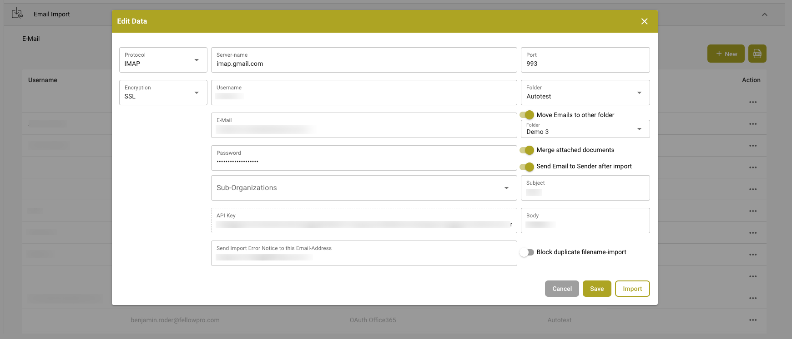<figcaption>
Email Import Configurations
</figcaption></figure>

#### Master Data Lookup Revamping

Revamped the master data lookup settings with refined categorization, enabling faster and more precise retrieval of diverse master data types. This improvement streamlines data access by organizing master data into distinct categories, significantly boosting search efficiency and accuracy. Users can now locate the relevant data more quickly, enhancing productivity and decision-making across the application

<figure>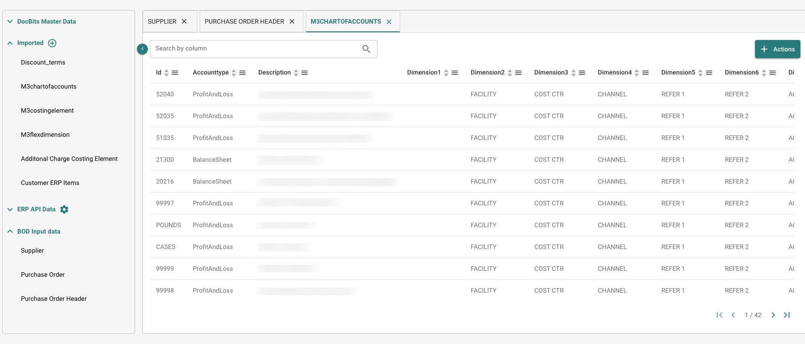<figcaption>
Master Data
</figcaption></figure>

#### Performance Improvements

Implemented a robust caching mechanism to significantly boost application performance, especially under high request loads. This improvement reduces server processing time by temporarily storing frequently accessed data, enabling faster response times and a smoother user experience. The new caching system efficiently manages increased traffic, ensuring reliable and scalable performance even during peak usage periods

#### Document Lock Feature Enhancement

Upgraded the document locking functionality to prevent simultaneous edits, ensuring data integrity and minimising conflicts. Now, documents are automatically locked during active editing, providing users with clear indicators when a document is in use and preventing others from making changes until the edit session is complete. This enhancement streamlines collaborative workflows and reduces the risk of data overwrites.

#### Navigation and User Experience Improvements

* **Breadcrumb Navigation**: Added breadcrumb trails across application pages to enhance navigation, allowing users to easily track and return to previous sections for a more intuitive browsing experience.
* **Streamlined User Interface**: Removed the "new version" pop-up notification to create a smoother, uninterrupted workflow, reducing distractions and improving overall usability.

### Bug Fixes:

* Resolved user-specific problems, such as attachment failures from encrypted or signed emails.
* Fixed card display and flow problems.
* Corrected routing issues with Next/Previous buttons.
* Addressed bugs related to decision tree tables.
* Updated UI for the password field to improve usability.
* Fixed issues with the task counter not displaying correctly.
* Corrected a user interface problem with the AI table.
* Resolved errors with document extraction during table training.
* Added a warning when a PO is matched during reformatting, and ensured matched rows are removed.
* Fixed date formatting, ensuring data loads correctly by day and week filters, and ensured document types are properly displayed.
* Corrected the display of documents on dual monitors.
* Fixed a problem where unlinking one PO line would remove all lines.
* Resolved incorrect translations across the application.
* Fixed the issue where lengthy descriptions in rule management caused scrolling on the list.
* FeastRestored missing "Assign-To" functionality for non-admin users.

## Release Harvest 9th September 2024

#### New Features

### Duplicate Invoice handling

This feature allows users to identify if documents are duplicated across their system. This feature works by analyzing document fields that can be configured by the user. By selecting specific fields, users can customize the detection criteria to suit their needs, ensuring that only relevant duplicates are flagged. This helps to maintain data integrity and reduces the clutter of redundant documents, streamlining document management processes.



### Decision Tree

The decision tree is a tool used to automate decision-making in a workflow by mapping out choices and their outcomes. By integrating decision trees, you can ensure consistent decisions based on specific criteria, streamline processes, and reduce errors. This approach enhances efficiency by automating complex decision points within the workflow.



### Choosing AI Models

DocBits now allows users to switch between different AI models to better suit their needs. You can choose the AI model that best fits your specific use case, whether it's for document analysis, data extraction, or text classification. This flexibility enables you to optimize performance and achieve more accurate results, tailoring the AI's capabilities to your organization's unique requirements.



### Choosing OCR Version

DocBits now offers the ability to change the OCR (Optical Character Recognition) version used within the platform. Users can select different OCR versions based on their specific needs, ensuring better accuracy and compatibility with various document types. This feature allows for more precise text extraction from images and scanned documents, improving overall data quality and workflow efficiency.



## Release Sunset 12th August 2024

### New Features:

## Rule Manager

[rule-manager](../../administration-and-setup/settings/document-processing/rule-manager/ "mention") provides the flexibility to create and edit conflict resolution rules tialored for DocBits invoicing system. These rules are designed to automatically handle discrepancies between invoice details and purchase order (PO) data, ensuring accurate financial reconciliation. The system applies these rules to process invoice lines, charges, and taxes, and generates appropriate adjustments or notes when necessary.

<figure>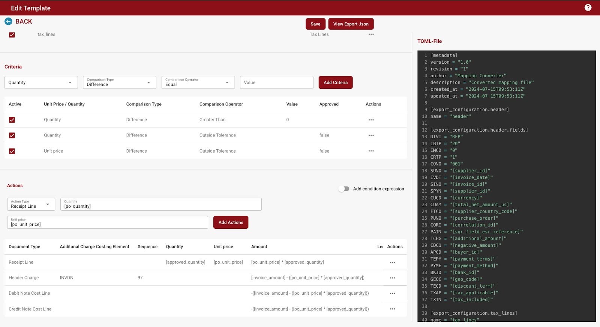<figcaption>
Rule Manager
</figcaption></figure>

### Syncing Data Using Stream

BOD syncing from Infor utilizes AWS Stream for real-time data processing, enhancing efficiency and significantly reducing data syncing time.

### XRechnung

DocBits now processes XRechnung (electronic invoices) seamlessly by first creating a user-friendly PDF, streamlining and simplifying the invoice processing workflow.

<figure>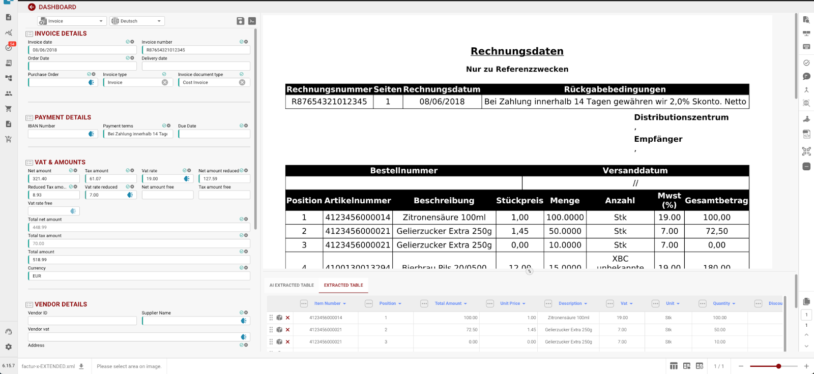<figcaption></figcaption></figure>

### Bug Fixes:

1. PO Match Button Visibility\
   Issue: PO Match button is available when there is no table or the table is deleted.\
   Status: On field validation, PO Match will be hidden if there is no table or the table is deleted
2. Table Drag & Drop Sorting\
   Issue: Table Drag & drop for sorting on all Lists/Dashboards\
   Resolution: User can now drag and drop to sort the table
3. Validation Screen Toolbar\
   Issue: Validation screen: toolbar right side not scrollable\
   Resolution: Fixed
4. Horizontal Scroll\
   Issue: Horizontal Scroll on Approval Screen\
   Resolution: Fixed
5. Approval Screen Decision Clearing\
   Issue: Ability to clear the approve/reject decision on approval screen\
   Resolution: Fixed
6. Task Display on Approval Screen\
   Issue: Task shown on the Approval Screen\
   Resolution: Toolbar is available which shows the tasks count of open/in progress
7. PO Match Table Size\
   Issue: PO Match table gets smaller after matching a line\
   Resolution: Fixed
8. Task Assignment based on Item Procurement Group\
   Issue: Translation for procurement group assignment\
   Resolution: Fixed
9. Supplier Name and Id in Task Creation\
   Issue: Adding Supplier Name and Id in Task creation\
   Resolution: Supplier Name and Id will be picked from the document
10. Document Subtype Copy\
    Issue: Click on Copy Document Subtype from sub document type setting was not working\
    Resolution: Fixed
11. New Label Field\
    Issue: New Label field in list of values to add label along with value and synonym\
    Resolution: Fixed
12. Country Origin Card in Workflow\
    Issue: New Card in workflow that checks country origin of a supplier and create a task or continue porcessing docuemtn accordingly\
    Resolution: Fixed
13. Dark Mode Fix on settings searchbar\
    Issue: This issue was previously identified\
    Resolution: Fixed
14. Extracted Table Column Visibility Indicator\
    Issue: Indicator if Columns are hidden in extracted table on Field validation\
    Resolution: Fixed
15. Dashboard Assignment for Admins\
    Issue: Make Assign to on the dashboard only for admins\
    Resolution: Fixed
16. Document Split Visibility\
    Issue: Show Document split only when more pages\
    Resolution: Fixed
17. Invoice Dashboard Columns\
    Issue: Additional columns on invoice dashboard\
    Resolution: Fixed
18. Field Validation Script Deactivation\
    Issue: Field Validation- Deactivate script was not working correctly\
    Resolution: Fixed
19. Approval Layout Button Customization\
    Issue: Cannot change the button type and style on approval layout builder\
    Resolution: Fixed
20. Data Sync Table\
    Issue: Data Sync Table in settings\
    Resolution: Fixed
21. Dashboard Analytics Total Display\
    Issue: Dashboard Analytics- display wrong total number\
    Resolution: Fixed

## Release Firework Juli 8th, 2024

### New Features

**Line Charges Export to M3**

• Export line charges to M3 with appropriate costing elements as per your business needs.

**PO & Invoice Discrepancy Handling**

• Smart handling of discrepancies in quantity, prices, charges, and tax.

### Key Bug Resolutions

#### 1. PO Search Functionality

• Issue: PO search was not working.&#x20;

• Status: This issue has been identified and will not be addressed in this release.

#### 2. PO Matching Connection

• Issue: PO matching connection was not removing as expected.

• Resolution: Fixed to ensure seamless PO matching operations.

#### 3. Exported Document Alerts

• Issue: Exported documents had alerts for costing elements even when the system was not set up for it.

• Resolution: Corrected to prevent unnecessary alerts, ensuring accurate document exports.

#### 4. Advance Shipment EDI View

• Issue: Advance shipment EDI view showed IDs in the title.

• Resolution: Titles now display correctly, improving data readability.

#### 5. Calculation Errors in Split by Total Issue

• Issue: Calculation errors occurred when lines were split further.

• Resolution: Fixed to ensure accurate calculations in all scenarios.

#### 6. PO Screen Table Display

• Issue: No table was showing on the PO screen.

• Resolution: Display issue resolved to ensure tables appear correctly.

#### 7. Auto Export on Order Confirmation

• Issue: Auto export was not working.

• Resolution: Functionality restored to ensure automatic exports operate smoothly.

#### 8. Mismatch Issue on PO

• Issue: Mismatch issue on PO showed despite everything being identical on the Delivery Note.

• Resolution: Resolved to ensure accurate mismatch detection.

#### 9. Report Download Issues

• Issue: Reports were not downloading.

• Resolution: Fixed to enable seamless report downloads.

#### 10. Incorrect Total and Net Amounts

• Issue: Total and Net amounts were showing incorrect values.

• Resolution: Values corrected to ensure financial accuracy.

#### 11. Invoice Date Format on Dashboard

• Issue: Invoice Date column had wrong format values.

• Resolution: Dates now display in the correct format, enhancing usability.

#### 12. Workflow Delays at “Ready for Validation”

• Issue: Workflow delays occurred at “Ready for Validation” until feedback from Doc2flow.

• Resolution: Workflow timing improved for faster validation processes.

## Next Release Firework Juli 8th, 2024

### Problem:

The existing system lacks automated rules for accurately matching and processing invoice charges against purchase orders (POs). This manual process can lead to discrepancies, as illustrated in the screenshots, where invoice charges and POs need reconciliation for correct invoicing.

<figure><figcaption></figcaption></figure> <figure><figcaption>
Rule Manager DocBits
</figcaption></figure>

### Solution:

With the new Rule Manager in DocBits, launching in July, you can automate this process:

#### 1. Create Rules:

Define criteria (e.g., Quantity > PO Quantity) for invoice line items.

#### 2. Set Actions:

Map fields and actions to export data seamlessly to Infor.

#### 3. Test Rules:

Validate rules with sample data to ensure accuracy.

## Junebug Release Notes - June 10th, 2024

This update brings exciting new features and bug fixes to Junebug:

**New Features:**

* **Automated Charge Extraction:** Junebug now automatically extracts and maps charges within your Docbit documents. This eliminates manual data entry and streamlines your workflow.
* **Portal Export to Infor IDM:** The new Portal allows you to effortlessly export supplier documents directly to Infor IDM. This simplifies shipment processing and reduces manual intervention.
* **Origin Identification (AI):** Junebug introduces a powerful AI feature that automatically learns the origin of documents. This saves you time and effort in document classification.
*

    
<figure>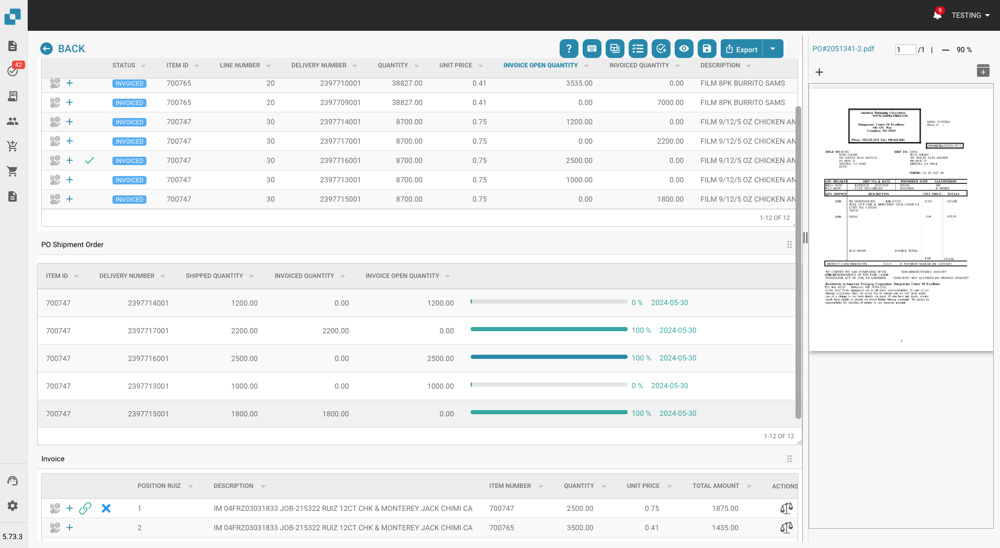<figcaption></figcaption></figure> <figure>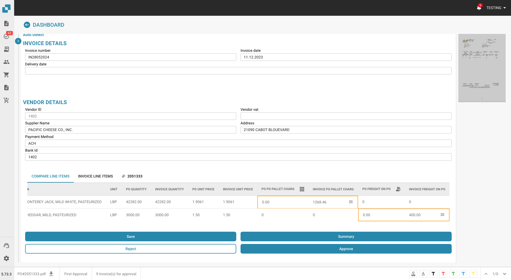<figcaption></figcaption></figure> <figure>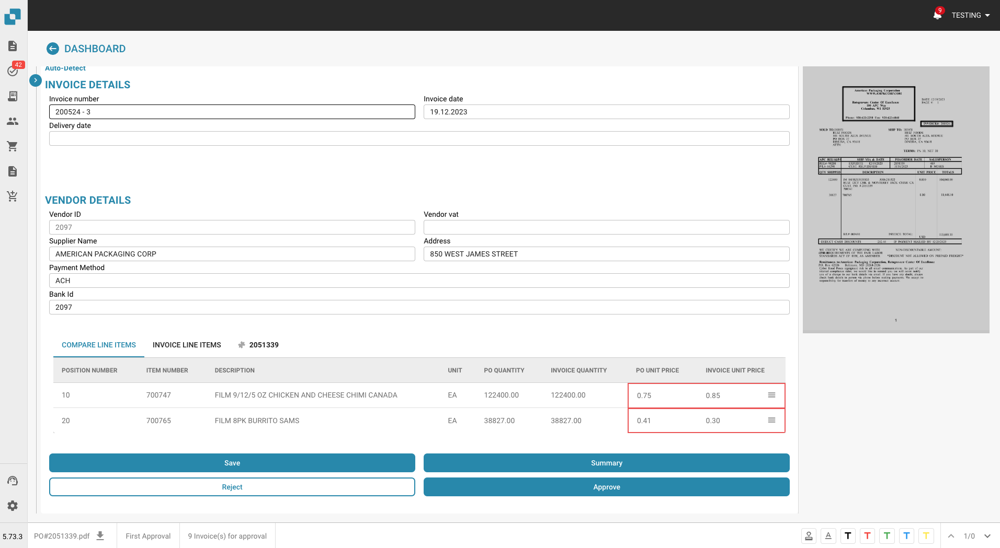<figcaption></figcaption></figure>

**Bug Fixes:**

* **QR Code Fix:** An issue that previously caused problems with QR code processing has been resolved.
* **Non-EDI Document Handling:** Junebug now handles non-EDI documents more effectively.

<figure>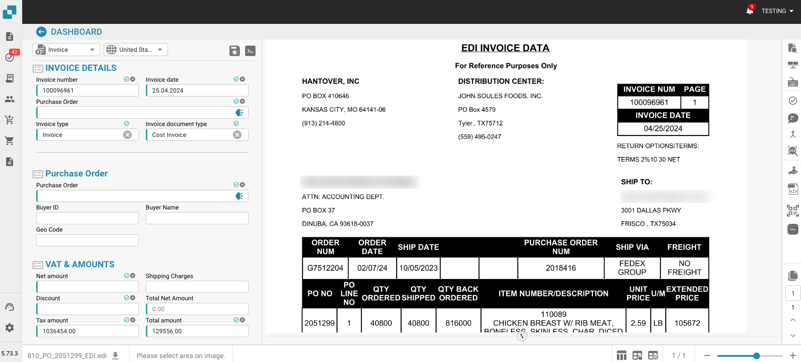<figcaption></figcaption></figure>

Hotfix - 5 Juni [**Priority System**](../../end-user-and-partner-section/end-user-section/our-document-priority-system.md)

## Next Release - Junebug Release 10th June 2024

Sandbox Freeze - 3th June 2024

<figure><figcaption></figcaption></figure>

In the upcoming release, a significant enhancement to the classification and extraction capabilities will be introduced, specifically aimed at table lines within documents. This new feature allows users to define whether a line in a table represents a charge. This functionality is particularly useful in detailed financial documents, such as invoices, where distinguishing between different types of transactions—such as charges, taxes, or fees—is crucial for accurate processing and record-keeping.

**Key Points for Release Notes:**

* **Enhanced Table Line Classification**: Users can now specify if a particular line in a document table is a charge, improving the accuracy and granularity of data extraction.

## Maypole Release 5.55.8.10 - ( 17th May )

### Release Notes - Web App

#### New Features:

▪ Workflow Card Translation: Enhancements in the workflow, including card translation for better localization support.

▪ Email Import Logging: Added detailed logging for email imports to enhance troubleshooting and monitoring.

▪ Broken Fuzzy Screen Fix: Resolved an issue with broken fuzzy screen display across various interfaces.

▪ Accounting Updates: Enhanced the accounting process by removing outdated accounting methods and integrating charges more efficiently.

#### Improvements:

▪ Ruiz Workflow Enhancements: Fixed bugs related to workflow navigation, particularly involving hidden steps.

▪ User Interface Adjustments: Improved user interface elements such as cash discount terms under payment terms for better clarity and user experience.

▪ Performance Enhancements: Various backend improvements to enhance system performance and stability.

#### Bug Fixes:

▪ Approval Stamp Issue: Fixed critical issues surrounding the approval stamp process to ensure compliance and correct functionality.

▪ Key Addition: Added necessary keys back to the system to ensure data integrity and system functionality.

▪ Master Data Field Adjustment: Addressed an issue in the master data field to align with user requirements.

#### Technical:

▪ Version Updates: Routine updates to various system components to align with current standards and technologies.

▪ Merge Activities: Numerous merges to integrate features, fixes, and enhancements from multiple development branches into the main branch.

### What's New - API

▪ Cache Management Enhancements: Updated the get\_receive\_delivery\_cache to improve performance and reliability.

▪ New Features for Sales Orders: Introduced a preview feature for sales orders, enhancing the visualization and management of order data.

▪ Document Handling Improvements: Added automated test jobs for demotesting and sandbox environments to ensure robustness.

▪ Enhanced Cache Functionality: Added field\_id to further enhance the caching mechanisms.

#### Fixes and Improvements

▪ Office Email Import Adjustments: Made necessary adjustments to the Office Email Import feature to enhance functionality.

▪ Development Enhancements: Multiple merges from dev to main branches ensuring synchronization and stability across environments.

#### Miscellaneous

▪ Configuration Updates: Various updates to the configuration files improving the system setup and parameters.

### Release Notes - Workflow

#### Enhancements:

▪ Implemented a new workflow test that can now be enabled during import, allowing for more flexible testing scenarios.

▪ Enhanced the logging functionality for action cards, making debugging and monitoring more efficient.

▪ Improved compatibility for field comparison cards with date and enum types, ensuring smoother comparisons and validations.

▪ Updated the tax card and modified the return processes for action cards to streamline operations.

#### Fixes:

▪ Addressed issues with the document status updates, ensuring they are accurately reflected in the system.

▪ Fixed the calculation for the comparison card involving unit price and quantity to correctly handle discrepancies.

▪ Resolved multiple minor bugs and made stability improvements.

#### Operational Changes:

▪ Merged multiple development stages into the sandbox and stage branches, reflecting a significant integration of new features and fixes.
