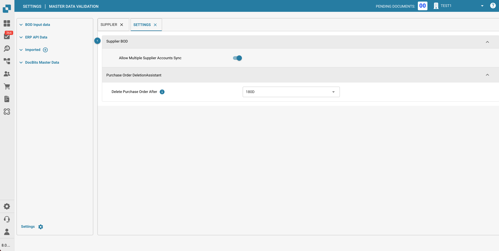
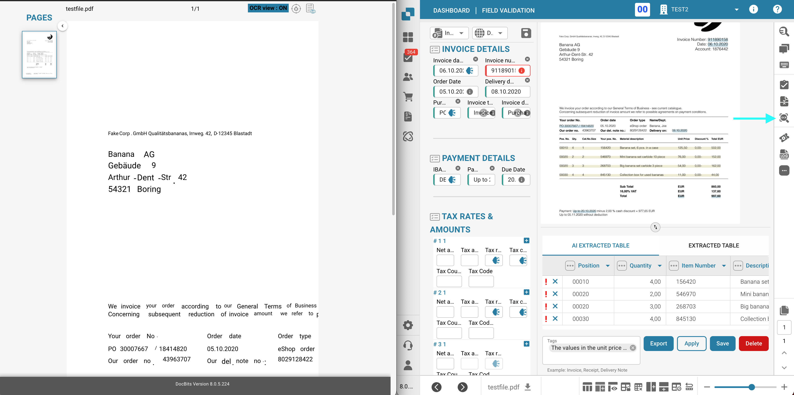

# Notes de version

## Release Winter 10 décembre 2025

### Améliorations de DocBits:

* **Personnalisation Améliorée des Règles de Rapprochement de Commandes:**\
  DocBits offre désormais un contrôle granulaire sur les règles de rapprochement des bons de commande. Vous pouvez configurer exactement quelles colonnes doivent être rapprochées pour chaque type de document, définir des tolérances par colonne et choisir si chaque règle s'applique au rapprochement manuel, automatique ou aux deux. Ces améliorations donnent aux utilisateurs la flexibilité d'ajuster le processus de rapprochement selon leurs besoins opérationnels spécifiques.
*   **Support de Plusieurs Comptes Financiers Fournisseurs:**\
    DocBits prend désormais en charge plusieurs comptes financiers pour les fournisseurs via le BOD RemitToPartyMaster d'Infor. Un nouveau paramètre de configuration est disponible pour activer cette fonctionnalité.

    <figure><figcaption></figcaption></figure>
*   **Ajouter l'Accès Utilisateur aux Résultats d'Extraction OCR:**\
    Le bouton Vue OCR sur l'écran de Validation des Champs est désormais accessible à tous les utilisateurs avec accès à la validation, pas seulement aux administrateurs, permettant à tous les utilisateurs de consulter les résultats d'extraction OCR et de rechercher du contenu spécifique dans les documents.

    <figure><figcaption></figcaption></figure>
* **Rendu Dynamique des Colonnes dans les Écrans d'Approbation:**\
  Amélioration des vues d'approbation pour afficher dynamiquement uniquement les colonnes configurées pour la comparaison dans les préférences de base de données de chaque organisation. Auparavant, des colonnes comme Code Unité et Date de Livraison Promise apparaissaient vides lorsqu'elles n'étaient pas configurées pour la comparaison, causant de la confusion. Désormais, les vues d'approbation n'affichent que les champs activement comparés. Cela fournit des écrans d'approbation plus clairs et spécifiques à l'organisation sans colonnes vides ou non pertinentes.
* **Champ Type de Commande Ajouté à la Recherche de Données de Base**:\
  La liste d'en-têtes de bons de commande inclut désormais une colonne "Type de Commande" (type\_code) dans la recherche de données de base, offrant des capacités de catégorisation supplémentaires.
* **Améliorations du Tableau de Bord avec Filtres Personnalisés:**\
  Amélioration de la fonctionnalité de partage de tableau de bord en permettant aux utilisateurs partagés de modifier les filtres du tableau de bord. Les utilisateurs qui ont des tableaux de bord partagés avec eux peuvent désormais modifier les filtres pour une vue plus flexible et personnalisée.
* **Préfixes Personnalisables pour les Colonnes d'Écran d'Approbation:**\
  Ajout d'une option configurable pour afficher des préfixes avant les colonnes de documents sur les écrans d'approbation. Le préfixe peut être défini dans le générateur de mise en page, permettant aux utilisateurs de choisir si les préfixes apparaissent et à quels types de documents ils s'appliquent.\

### Améliorations Générales

* Amélioration de la journalisation des erreurs pour les tableaux mal formés dans l'extraction de tableaux.
* Ajout d'une limite de partage pour les tableaux de bord jusqu'à 10 utilisateurs ou 5 groupes, accompagnée d'un message d'erreur clair lorsque la limite est atteinte.
* Amélioration de la gestion des erreurs pour les tableaux de bord personnalisés lorsqu'un utilisateur tente de créer un tableau de bord avec un nom déjà existant.

### Corrections de Bugs:

* Correction d'un problème où les e-mails semblaient envoyés avec succès depuis la section Détails du Fournisseur mais n'étaient pas livrés aux destinataires.
* Correction d'un problème où les champs déroulants ajoutés aux écrans d'approbation/rejet ne s'affichaient pas.
* Correction d'un problème où tous les documents exportés étaient marqués comme dernièrement mis à jour par le mauvais utilisateur.
* Correction d'un problème où les importations FTP ne récupéraient pas les documents.
* Correction d'un problème où les documents affichaient le statut "Flux de travail en cours" mais aucun flux de travail ne s'exécutait et le journal restait vide.
* Correction d'un problème où des utilisateurs non concernés étaient assignés aux documents au moment de l'exportation sans avoir effectué de travail dessus.
* Correction d'un problème où les utilisateurs avec les permissions correctes ne pouvaient pas rejeter les documents assignés et recevaient des erreurs.
* Correction d'un problème où les icônes de flux de documents ne s'affichaient pas pour certaines organisations.
* Correction d'un problème où une fenêtre contextuelle apparaissait lors du téléchargement de documents par glisser-déposer sur le tableau de bord.
* Correction d'un problème où les drapeaux E-TEXT s'affichaient comme activés dans l'interface utilisateur alors que la réponse de l'API montrait toutes les valeurs comme fausses.
* Correction d'un problème où une erreur se produisait lors du téléchargement de documents contenant des pages vierges.
* Correction d'un problème où les hyperliens de tâches dans les notifications par e-mail utilisaient l'URL d'approbation v2 au lieu de v3.
* Correction d'un problème où la Recherche de Données de Base n'affichait aucun fournisseur lorsque la sous-organisation "Cross" était sélectionnée, empêchant les utilisateurs de voir les données de fournisseurs inter-organisationnelles.
* Correction d'un problème où les documents téléchargés dans Cross n'étaient pas assignés à un identifiant de sous-organisation.
* Correction d'un problème où les importations d'e-mails entrants échouaient pour les expéditeurs avec des lettres majuscules dans leurs adresses e-mail en raison d'une comparaison d'e-mails sensible à la casse.

## Release Autumn Summit 22 octobre 2025

### Améliorations de DocBits:

*   #### Améliorations de la conception des modèles d'e-mails:

    L'éditeur de modèles d'e-mails a été repensé pour offrir une structure plus claire et une expérience plus fluide. La sélection des champs de document est désormais plus intuitive, et les pièces jointes peuvent être incluses directement dans les modèles. Ces améliorations permettent de créer des e-mails professionnels et personnalisés plus rapidement et plus facilement.

    
*   #### Améliorations du tableau de bord:

    Le tableau de bord a été étendu pour améliorer la navigation et la personnalisation. Avec de nouveaux onglets, les utilisateurs peuvent passer plus rapidement entre différents types de documents, réduisant ainsi le temps passé à rechercher la vue appropriée.

    
*   #### Tableaux de bord de filtres personnalisés:

    De plus, les tableaux de bord peuvent désormais être personnalisés et filtrés selon les préférences individuelles. Ces tableaux de bord personnalisés peuvent également être partagés avec des collègues, facilitant la création de vues de rapports cohérentes pour toute l'équipe.

    
*   #### Journaux de notifications par e-mail:

    Une nouvelle fonctionnalité de journalisation est disponible pour toutes les notifications par e-mail. Les utilisateurs peuvent désormais consulter l'historique des notifications envoyées, ce qui facilite la vérification des livraisons et le dépannage en cas de non-réception des e-mails.
*   #### Support de la facturation électronique: e-SLOG 1.6 & 2.0:

    Le support de formats de facturation électronique supplémentaires a été introduit. Le système peut désormais traiter et générer les versions e-SLOG 1.6 et 2.0, élargissant la compatibilité avec les partenaires et les exigences réglementaires.
*   #### Améliorations de la détection des doublons:

    La détection des doublons a été améliorée avec deux options de configuration puissantes. L'**Intervalle de détection des doublons** vous permet de définir une plage de temps pour vérifier les doublons de manière plus précise, tandis que le paramètre **Interdire l'exportation des doublons** empêche automatiquement l'exportation des documents détectés comme des doublons. Ensemble, ces améliorations offrent plus de contrôle et garantissent une plus grande précision des données.

    
*   #### Améliorations de l'arbre de décision:

    Les arbres de décision sont désormais plus polyvalents, avec la capacité de renvoyer les valeurs des champs de document. Cela permet une logique d'automatisation plus avancée, permettant aux workflows de prendre des décisions basées sur les données réelles des documents.
*   #### Nouvelles cartes de workflow:

    Deux nouvelles cartes de workflow étendent les capacités d'automatisation. La première vous permet de vérifier si un document appartient à une sous-organisation spécifique, facilitant la gestion des configurations multi-entités. La seconde introduit une vérification de tolérance de la date de livraison, qui compare les dates de livraison à la date actuelle en jours ouvrables pour aider à gérer et à appliquer plus efficacement les exigences de livraison.
*   #### Améliorations de l'export CSV:

    La fonctionnalité d'export CSV a été considérablement améliorée. Au lieu d'exporter uniquement les documents affichés sur la page actuelle, le système exporte désormais tous les documents d'un ensemble de données. Chaque export crée une entrée de journal, et le CSV résultant est automatiquement envoyé par e-mail, offrant un processus d'export plus complet et fiable.
*   #### Délai de suppression des bons de commande:

    Une nouvelle option de configuration permet aux administrateurs de définir un délai de suppression des bons de commande. Cette amélioration ajoute de la flexibilité et du contrôle sur les politiques de conservation des données, garantissant que les bons de commande ne sont supprimés que lorsque c'est approprié.

### Corrections de bugs

* Correction d'un problème où d'anciennes données étaient incluses lors de l'exportation de documents.
* Correction du filtre pour les erreurs d'exportation, qui montrait précédemment d'autres statuts également.
* Résolution d'un désaccord de validation de tableau où "Prix unitaire" déclenchait des erreurs mais "Prix unitaire par" ne le faisait pas, malgré des valeurs correctes.
* Correction d'un problème où l'ajout d'une nouvelle colonne au tableau de bord échouait.
* Correction d'un problème où les tâches n'étaient pas visibles dans la colonne des tâches du tableau de bord.
* Correction du comportement de tri aléatoire pour que les listes suivent désormais un ordre cohérent.
* Résolution d'un problème où l'arrêt de la modification de la taille de la colonne était impossible.
* Correction d'un bogue empêchant l'appariement manuel des lignes dans l'écran d'appariement des bons de commande.
* Correction d'un problème où l'option de pièce jointe par e-mail était réinitialisée après l'enregistrement.
* Correction d'un problème où la comptabilité automatique affichait initialement des identifiants de base de données lors de l'ouverture pour la première fois.
* Correction du comportement flou des champs pour que les valeurs ne soient plus écrasées incorrectement.
* Correction d'un problème où les champs dans le compte automatique disparaissaient après la suppression du contenu.
* Correction d'un bogue où l'utilisateur ne pouvait pas renommer "Prénom" et "Nom" dans la fenêtre contextuelle des paramètres.
* Résolution d'un problème où les documents pouvaient rester bloqués dans "workflow en cours."
* Correction d'un problème de couleur d'icône de menu où les couleurs d'organisation sélectionnées n'étaient pas appliquées correctement.
* Correction d'un problème où les codes QR n'étaient parfois pas reconnus.
* Correction d'un problème où les comptes ne pouvaient pas être supprimés avec la touche de retour pour en saisir un différent.
* Résolution d'un mélange de langues après la connexion suivant la mise en production.

## Release Spring Bloom – 23 avril 2025

### Améliorations de DocBits :

* **Option de filtre pour le journal d'importation des e-mails :** Les utilisateurs ont désormais la possibilité de filtrer les journaux d'importation et de trier le tableau pour une vue d'ensemble plus claire et plus efficace. Cette amélioration simplifie le processus d'identification et de gestion des entrées d'e-mails, améliorant le dépannage et la gestion globale des journaux.
* **Support multilingue pour la liste de valeurs :** Nous avons élargi les capacités multilingues de la fonctionnalité Liste de valeurs. Les administrateurs peuvent désormais définir des étiquettes dans plusieurs langues, garantissant que l'étiquette correcte est automatiquement affichée en fonction des paramètres de langue du système de l'utilisateur. Cette amélioration favorise une plus grande accessibilité et localisation, facilitant l'interaction des utilisateurs du monde entier avec la plateforme dans leur langue maternelle.
* **Améliorations des détails utilisateur dans les paramètres :** L'interface des paramètres affiche désormais des informations utilisateur complètes. Les administrateurs peuvent facilement voir les affiliations de groupe, les détails de sous-organisation et d'autres données clés, permettant une meilleure gestion des rôles des utilisateurs et une compréhension plus claire des structures d'équipe.
* **Informations comptables automatiques sur l'écran d'approbation :** L'écran d'approbation présente désormais des détails comptables automatiques aux côtés des informations de facturation. Cette amélioration offre un aperçu plus approfondi des données de transaction, facilitant des processus de révision plus fluides et une prise de décision plus éclairée concernant les factures.
* **Compteur de Tâches pour les Documents dans la Vue du Tableau de Bord :** Les documents sur le tableau de bord peuvent désormais indiquer les tâches ouvertes qui leur sont associées et afficher le nombre total de tâches en attente. Cette fonctionnalité offre aux utilisateurs un aperçu rapide des actions en cours, améliorant la gestion des tâches et l'efficacité des flux de travail.
* **Sélection du Modèle AI Basé sur le Fournisseur :** Les utilisateurs peuvent désormais sélectionner le modèle AI utilisé pour l'extraction de données sur une base par fournisseur. Cette amélioration permet une optimisation fine, garantissant une meilleure précision d'extraction pour différents fournisseurs et améliorant les résultats globaux du traitement des données.
* **Journaux de Flux de Travail Améliorés pour les Cartes d'Arbre de Décision :** Les journaux affichent désormais la sortie de l'arbre de décision, facilitant le suivi et la compréhension de la manière dont les décisions ont été prises dans les flux de travail.
*   **Introduction d'un nouveau système de test automatique pour améliorer la fonctionnalité et la stabilité du système :**

    Nous sommes ravis d'annoncer la mise en œuvre d'un nouveau système de test automatisé conçu pour améliorer la fonctionnalité et la fiabilité globales de notre plateforme. Ce nouveau système effectuera des vérifications constantes et approfondies de notre système pour identifier tout problème avant qu'il n'affecte votre expérience. En automatisant ces tests, nous pouvons garantir des réponses plus rapides aux problèmes potentiels et maintenir les normes de qualité les plus élevées pour notre système.

    ​

### Corrections de bugs

* Résolu un problème où les tâches n'apparaissaient pas sur l'écran de validation/approbation.
* Corrigé le positionnement du bouton Suivant/Précédent afin qu'il reste statique.
* Corrigé les problèmes de défilement dans les vues de script et d'arbre de décision, garantissant que les boutons d'action restent fixes pendant le défilement.
* Supprimé le champ pays d'origine des e-factures.
* Corrigé un problème avec le compteur de tâches affichant un nombre inexact de tâches.
* Ajouté des traductions manquantes.
* Corrigé les champs personnalisés pour afficher des noms descriptifs au lieu d'ID.
* Mis à jour la liste des raccourcis pour l'écran de correspondance des commandes d'achat.
* Résolu un problème où les documents étaient téléchargés avec un nom de fichier incorrect.
* Corrigé les incohérences de tri dans le tableau des lignes de factures au sein de la correspondance des commandes d'achat.
* Corrigé un problème affectant la fonctionnalité de création de tâches.
* Corrigé un problème dans la correspondance des commandes d'achat où le tri du tableau des factures se réinitialisait lors de la correspondance d'une ligne.
* Résolu des problèmes de comptabilité automatique en s'assurant que les références de réservation se divisent correctement lorsque le montant est divisé.
* Mis à jour les informations d'hôte ClickHouse.
* Résolu un problème où les documents en double n'étaient pas reconnus comme des doublons.
* Corrigé des problèmes d'exportation causés par des références de réservation trop longues.
* Résolu un problème où les cases à cocher en lecture seule n'étaient pas en lecture seule.
* Correction d'un problème où les utilisateurs pouvaient être ajoutés à une sous-organisation deux fois.
* Correction d'un problème où le changement de la sous-organisation pour un document entraînait la réinitialisation de l'utilisateur ou du groupe assigné.

​

## Correctif de version Winter Frost 10 avril 2025

### Améliorations de DocBits :

* **Amélioration de la fonction de script** **`set_column_date_value` :** La fonction `set_column_date_value` inclut désormais le support de l'option `skip_weekend`, permettant aux valeurs de date de sauter automatiquement les week-ends lorsqu'elles sont appliquées.
* **Amélioration du support de téléchargement de fichiers :** Les fichiers PNG et JPEG peuvent désormais être téléchargés directement et sont automatiquement convertis en format PDF pour une gestion simplifiée des documents.
* **Améliorations de la fonctionnalité Watchdog :**
  * Prend désormais en charge l'exportation vers **Enaio** pour une meilleure intégration système.
  * Capacités de parsing améliorées pour extraire des informations des structures XML `Sync.ContentDocument`, permettant un traitement des données plus efficace.

### Corrections de bogues

* Correction d'un problème sur une fonction de script.
* Résolution d'un problème où les commandes d'achat avaient un statut incorrect après leur mise à jour.

## Release Hot Fix Winter Frost 11 mars 2025

### Améliorations de DocBits :

* **Extraction de données améliorée :** Ajouté une option pour extraire le **Bon de commande** ou le **Numéro d'article** d'une ligne au-dessus ou en dessous.
* **Accès élargi aux sous-organisations croisées :** Les utilisateurs non administrateurs peuvent désormais également accéder à la fonctionnalité **Sous-organisations croisées**.

### **Corrections de bugs :**

* Corrigé un problème où les utilisateurs ne pouvaient pas être ajoutés à un groupe.
* Corrigé un problème avec les échecs d'importation d'e-mails.
* Résolu un problème avec la formation sur les documents de plus d'une page
* Corrigé un problème où les scripts ne fonctionnaient pas correctement.
* Résolu un problème où les données du document n'étaient pas affichées correctement
* Corrigé un problème avec le paramètre de mise à jour automatique des commandes d'achat
* Correction d'un problème où les jetons d'abonnement étaient affichés de manière incorrecte
* Résolution d'un problème où l'écran de tâche affichait une version de document obsolète
* Correction d'un problème qui empêchait les documents de changer leur statut
