# Beleške o izdanju

> **Najnovije izdanje hitnog popravka:** [Hotfixes 8 September 2026](incremental-updates-8-september-2026.md): usklađivanje narudžbenica — usklađivanje opstaje nakon čuvanja, usklađivanje se ponovo pokreće pri čuvanju, ekran prikazuje zašto nema usklađivanja, PO jedinčna cena iz neto iznosa. Prethodno: [Hotfixes 12–25 August 2026](incremental-updates-12-25-august-2026.md). Sve stranice sa hitnim popravkama su navedene u navigaciji pod Release Notes.

## **Izdanje R1.0 13/14. jun 2026.**

> **Dostupnost na Sandbox-u:** 28. april 2026.

### Nove funkcije:

* **Beleženje aktivnosti / Revizija pristupa:**\
  Detaljno beleženje aktivnosti i revizioni trag pristupa u celoj aplikaciji za usklađenost i praćenje. Različiti tipovi beleženja za sve mikroservise i na osnovu vremenskog opsega.

* **Globalna brza pretraga:**\
  Pritisnite Cmd+K / Ctrl+K sa bilo kog mesta u aplikaciji za pretragu preko 200+ ruta i 40+ funkcija unutar stranica. Prikazuje najboljih 8 rezultata sa fuzzy podudaranjem, navigacijom strelicama i vezama ka kompletnoj stranici App Index.

* **Mapa sajta (App Index Page):**\
  Pretraživa indeksna stranica koja katalogizuje svaku stranicu za navigaciju i svaku funkciju unutar stranica (dijaloge, bočne trake, panele) u celom DocBits-u. Organizovana u 18 kategorija sa filterima po tipu, oznakama kategorija, pretragom sinhronizovanom sa URL-om i unosima sa dozvolama prikazanim kao zaključani za korisnike koji nisu administratori.

* **Kontrolna tabla za analitiku:**\
  Sveobuhvatna analitika obrade dokumenata sa Izvršnim pregledom, API metrikama, Metrikama kvaliteta, Performansama obrade, Analitikom toka dokumenata, Dnevnikom aktivnosti, Dnevnikom događaja i Revizionim tragom.

* **Funkcija izvoza kontrolne table:**\
  Nova funkcija izvoza kontrolne table koja omogućava izvoz liste u CSV ili XLSX formatu.

* **Pretraga celog teksta / DocSearch:**\
  AI vektorska pretraga preko svih indeksiranih dokumenata sa filtriranjem dobavljača u realnom vremenu, funkcijom „Pronađi slično" i podesivim podešavanjima indeksiranja.

* **Statistika isporuka dobavljača:**\
  Novi prikazi koji pružaju uvid u metrike obrade dokumenata vezane za dobavljače.

* **Debug Collector:**\
  Pritisnite Ctrl+Shift+P za snimanje kompletnog debug snimka koji uključuje API pozive, stanje WebSocket-a, greške, dnevnike konzole, metrike performansi i informacije o okruženju. Snimci se mogu kopirati u privremenu memoriju ili poslati direktno kao tiket podrške sa izveštajem u HTML formatu i priloženom JSON datotekom.

* **AI agenti (DocNet):**\
  Autonomni pozadinski agenti koji automatski obrađuju pristigle e-poruke — klasifikuju, ekstrahuju i usmeravaju dokumente bez ručne intervencije. Agenti samostalno obrađuju dodeljene zadatke i eskaliraju ka korisnicima putem zahteva za odobravanje kada je potrebna ljudska procena. Uključuje namensku kontrolnu tablu agenata za praćenje aktivnosti i performansi.

* **Novi elektronski dokumenti:**\
  Preko 80 novih globalnih tipova e-faktura i 40+ novih formata uključujući XRechnung 3.0.2, ZUGFeRD 2.2/2.3.2, Factur-X varijante i Asia-Pacific PINT Credit Notes. 100% pokrivenost klasifikacije i ekstrakcije.

* **AI Script Chat:**\
  AI asistent za razgovor za osnovni razvoj skripti sa odgovorima u realnom vremenu.

* **Verzionisanje skripti:**\
  Kompletna istorija verzija za skripte sa praćenjem promena, poređenjem i mogućnostima vraćanja. Pruža upravljanje verzijama skripti slično načinu na koji se održavaju verzije elektronskih dokumenata (eDocs).

* **Istorija izvoza u akcijama kontrolne table:**\
  Pristupite istoriji izvoza za dokument direktno iz menija akcija na kontrolnoj tabli.

* **Generički API izvoznik (APS450, GLS840):**\
  Podesiva generička ciljna tačka za API izvoz putem konfiguracije Mapping-File, za fleksibilnu integraciju sa spoljnim sistemima. Implementirana je podrška za APS450 i GLS840.

* **Više konfiguracija izvoza:**\
  Podrška za više aktivnih konfiguracija izvoza po tipu dokumenta sa redosledom izvršavanja i dugmetom za ponovni izvoz radi ponavljanja od koraka koji nije uspeo.

* **Nova verzija Watchdog-a:**\
  Kompletna prerada stranice WatchDog Settings. Dodate su nove funkcije za udobnost korišćenja, uključujući trenutni WatchDog Status, vodič i komande za instalaciju, konfiguraciju XSLT-šablona i podešavanje za automatsko ažuriranje. Takođe je implementirana funkcionalnost da WatchDog istovremeno obrađuje više konfiguracija.

* **Vertex integracija:**\
  Integracija Consumer Use Tax putem Vertex-a za automatski obračun poreza i usklađenost tokom obrade dokumenata.

* **Redizajn korisničkog interfejsa i prerada podešavanja:**\
  Sveobuhvatno osvežavanje korisničkog interfejsa u celoj aplikaciji. Redizajnirane stranice za prijavu i autentifikaciju. Redizajnirana oblast podešavanja sa sklopivom bočnom trakom, organizovanim podkategorijama, navigacijom na osnovu sidra, kontekstualnim panelom pomoći i oznakama za praćenje statusa. Izmene korisničkog interfejsa skripti dokumenata. Novi korisnički interfejs toka dokumenata. Poboljšan korisnički interfejs za List of Values.

* **Idea Board:**\
  Tabla za zahteve funkcija na kojoj korisnici mogu da podnose, diskutuju i glasaju o novim funkcijama, poboljšanjima, potrebnim ispravkama grešaka itd. sa uređivačem obogaćenog teksta i podrškom za slike.

* **Upravljanje API ključevima:**\
  Namenska stranica podešavanja za kreiranje, pregled i upravljanje sa više API ključeva.

* **Funkcija pretrage matičnih podataka:**\
  Poboljšana mogućnost pretrage matičnih podataka pružanjem odgovarajućih opcija pretrage na osnovu izabranih polja.

* **Grafikon aktivnosti korisnika:**\
  Vizuelni grafikon koji prikazuje obrasce aktivnosti korisnika i metrike angažovanja. Kontrolna tabla za aktivnost prijava sa grafikonima poređenja trendova, dnevnom/nedeljnom agregacijom i geolokacijom na osnovu GeoLite2.

* **Istorija prijava korisnika:**\
  Detaljan prikaz korisnika sa istorijom prijava.

* **Prilagodljiva bočna traka:**\
  Prevlačenje i puštanje za promenu redosleda, prekidač za prikaz/skrivanje i prikačivanje na vrh stavki menija bočne trake. Podešavanja se čuvaju po korisniku uz opciju „Vrati na podrazumevano". Poštuje feature flags.

* **Video karusel:**\
  Video karusel sa automatskim reprodukovanjem na stranici prepare-dashboard koji prikazuje kratke animirane video snimke sa savetima o proizvodu (Globalna pretraga, Prečice na tastaturi, Otpremanje dokumenata, Prilagođavanje tabela). Raspored u dve kolone sa video snimcima levo i pripremom kontrolne table desno. Automatsko preusmeravanje se pauzira dok korisnici pregledaju video snimke.

* **Advanced Workflow Designer:**\
  Vizuelni alat za automatizaciju zasnovan na čvorovima sa platnom za prevlačenje i puštanje za višekoračne procese obrade. Podržava korake čekanja, paralelne putanje, ponovno upotrebljive šablone, Or kartice uslova, dugme za ručni test/pokretanje, delimično izvršavanje „Test from Here" i dnevnike izvršavanja po čvoru sa vizuelnim isticanjem toka koje tačno prikazuje koji čvorovi su izvršeni.

* **Kontrolna tabla KPI za radne tokove:**\
  Kontrolna tabla ključnih metrika za praćenje izvršavanja radnih tokova.

* **Workflow Partner Card SDK:**\
  SDK za nezavisne programere za izradu prilagođenih kartica radnog toka, sa AI pregledom, validacijom u sandbox okruženju i dokumentacijom za početak rada.

* **Workflow Test Manager:**\
  Automatizovani menadžer testova za radne tokove, koji omogućava administratorima da kreiraju i pokreću testove pojedinačno ili grupno.

### Poboljšanja:

* **Baza podataka (svi moduli) — Migracija ID kolona:**\
  Sve DocBits „ID" kolone baze podataka su interno migrirane iz stringova u namenski ID-tip (UUID7). Osnovna Postgres baza podataka je migrirana na V18 kako bi podržala ovo poboljšanje.

* **Obrada dokumenata — dalja poboljšanja:**\
  Menja se logika izvoza vezana za maksimalan broj stranica koje se uzimaju u obzir — sada će ceo dokument biti izvezen. Tokom validacije dokumenta korisnik će imati opciju da nadjača podrazumevano ograničenje maksimalnog broja stranica za taj konkretni dokument. Poboljšan je obračun brojača dokumenata na čekanju.

* **Verzije servisa, status i datum primene:**\
  Status dostupnosti servisa dostupan u iskačućem prozoru „Service Versions".

* **Proširenje jezika:**\
  Podrška proširena na 22 jezika sa ažuriranim biračem jezika.

* **Dizajn kontrole pristupa na nivou polja:**\
  Redizajnirana/poboljšana kontrola pristupa sa jasnijim stanjem aktivacije, pristupom na nivou polja, doslednim rukovanjem pravilima i pojednostavljenim dozvolama zasnovanim na grupama. Ispravlja konfliktna pravila između kontrole pristupa i dozvola za pregled, prikazuje vlasnika uvoza u korisničkom interfejsu i dosledno primenjuje kontrolu pristupa kroz validaciju polja, AI-ekstrahovane tabele i sve prikaze.

* **Stream aktivnosti za sve ekrane:**\
  Stream aktivnosti sada dostupan na svim ekranima obrade dokumenata (Ready for Validation, PO Matching, Accounting, Quote Details, Reject) — ne samo Pending Approval. Premešten na dosledan položaj u desnom panelu na svim ekranima.

* **Stranica toka dokumenata:**\
  Namenska stranica za vizuelizaciju i praćenje toka obrade dokumenata, koja prikazuje prelaze statusa i napredak kroz proces.

* **Režim dvostrukog monitora (globalno korisničko podešavanje):**\
  Režim dvostrukog monitora premešten u globalno korisničko podešavanje, trajno kroz sesije.

* **Poboljšanja Layout Builder-a:**\
  Podrška za skrivena polja i polja samo za čitanje sa vizuelnim indikatorima, promenljivim razdelnikom panela i podešavanjima dužine polja. Primenite podrazumevani raspored na više porekala bez posećivanja svakog pojedinačno.

## **Izdanje HotFix 3 16. april 2026.**

### DocBits poboljšanja:

* **Ekstrakcija QR koda za poljske fakture:**\
  DocBits sada podržava ekstrakciju QR koda specifično za poljske fakture, poboljšavajući automatsko preuzimanje podataka za dokumente poreklom iz Poljske.

### Ispravke grešaka:

* Ispravljen problem gde automatski izvoz nije uspevao kada je PO podudaranje već obavljeno, ali porudžbina nije bila povezana sa dokumentom.
* Ispravljen problem gde su jedinične cene bile nepravilno zaokruživane za fakture sa jedinicama pakovanja (Verpackungseinheiten / VPE).
* Ispravljen problem gde poruke o grešci izvoza iz ION/MEC (npr. Acknowledge.PurchaseOrder greške) nisu bile prikazane u DocBits-u, prikazujući status „Exported" iako izvoz nije uspeo.
* Ispravljen problem gde je jedinična cena na ekranu za odobravanje bila netačna kada je korišćena AI ekstrakcija tabele.
* Ispravljen problem gde je skripta Total Matching izbacivala grešku na ekranu za validaciju.
* Ispravljen problem gde obrada dokumenata nije uspevala uz grešku („UserAuthentication object has no setter for 'org_id'").
* Ispravljen problem gde obuka tabela nije funkcionisala za određene dobavljače, sa kolonama koje su završavale u skrivenim kolonama umesto u mapiranim poljima.
* Ispravljen problem gde PO podudaranje nije uspevalo na velikim fakturama (10+ stranica) zbog prekoračenja ograničenja veličine multipart zahteva.
* Ispravljen problem gde vrednosti kolona popunjene skriptom nisu bile sačuvane nakon ponovnog pokretanja dokumenta.
* Ispravljen problem gde se prekidač „Ignore Table Validation" prikazivao kao aktivan (zeleno) u korisničkom interfejsu, ali je zapravo bio deaktiviran u pozadini.
* Ispravljen problem gde je kvalitet dokumenta bio značajno umanjen nakon uvoza.
* Ispravljen problem gde su verzije mikroservisa i datumi primene prikazani u aplikaciji bili neskladni između okruženja nakon kompletnog objavljivanja.
* Ispravljen problem gde ekstrakcija barkoda nije uspevala zbog greške pri izgradnji objekta za autentifikaciju korisnika iz podataka zadatka.
* Ispravljen problem gde su kontakt podaci dobavljača bili izbrisani prilikom čuvanja u portalu za dobavljače.
* Ispravljen problem gde su dokumenti nailazili na NoneType grešku pri izvozu.
* Ispravljen problem gde telo e-poruke nije bilo uključeno kada je prva priložena datoteka bila PNG ili JPEG slika.
* Ispravljen problem gde je telo e-poruke nedostajalo za nekoliko dokumenata.
* Ispravljen problem gde DocBits Operator „ai-exporting" nije proizvodio rezultate izvoza u ciljnim sistemima (LN/D3).

## **Izdanje HotFix 2 31. mart 2026.**

### DocBits poboljšanja:

* **Hibridna obrada PDF-a — ekstrakcija XML-a pod kontrolom korisnika:**\
  Kada PDF sadrži ugrađene XML podatke, korisnici sada mogu da izaberu da li DocBits treba da koristi ugrađeni XML za ekstrakciju ili da obradi dokument kao standardni PDF. Ovo organizacijama daje potpunu kontrolu nad načinom rukovanja hibridnim dokumentima, obezbeđujući da se primeni metoda ekstrakcije najprikladnija njihovom radnom toku.

* **AP Assignment Code na ekranu za odobravanje:**\
  Stranica AP Manager Approval sada uključuje polje AP Assignment Code, integrisano sa Infor M3 CRS620. Ovo omogućava odobravačima da pregledaju i potvrde šifre dodele direktno tokom procesa odobravanja bez prelaska na spoljne sisteme.

* **PO Total Matching sa ukupnim iznosom dokumenta:**\
  DocBits sada podržava podudaranje ukupnog iznosa porudžbine sa ukupnim iznosom na dokumentu, pružajući dodatni sloj validacije tokom PO podudaranja radi ranijeg otkrivanja neslaganja u procesu.

* **Ažuriranje broja artikla dobavljača i VPE:**\
  DocBits sada podržava ažuriranje polja Supplier Item Number i VPE (Verpackungseinheit / jedinica pakovanja) tokom obrade dokumenata, sa vrednostima koje se sinhronizuju nazad u M3 prilikom izvoza.

* **Poboljšana klasifikacija rasporeda dokumenta:**\
  ID rasporeda dokumenta (tfidf_id) sada se generiše samo na osnovu teksta zaglavlja, isključujući tekst podnožja. Ovo poboljšava tačnost klasifikacije sprečavajući da sadržaj podnožja utiče na otkrivanje tipa dokumenta.

* **Dugme Export & Next:**\
  Dodato je novo dugme „Export & Next", koje omogućava korisnicima da izvezu trenutni dokument i odmah pređu na sledeći u redu, pojednostavljujući radni tok pregleda i izvoza.

* **Proces odobravanja za fakture troškova:**\
  Proces odobravanja za fakture troškova je poboljšan sa unapređenom logikom usmeravanja i validacije.

### Ispravke grešaka:

* Ispravljen problem gde Infor SFTP izvoz nije uspevao uz grešku zbog netačne komande biblioteke.
* Ispravljen problem gde bulean polja za potvrdu nisu mogla da se prikažu na ekranu za odobravanje.
* Ispravljen problem gde su UNMU poruke slate čak i kada nije bilo neslaganja u jedinici kupovine.
* Ispravljen problem gde je porez na promet bio nepravilno klasifikovan kao trošak na ekranu PO podudaranja, što je rezultovalo negativnim nenamirenim iznosom.
* Ispravljen problem gde izvoz nije uspevao kada jedinica kupovine nije bila postavljena u potvrdi porudžbine, ali je bila prisutna u porudžbini.
* Ispravljen problem gde je telo e-poruke nedostajalo za nekoliko dokumenata.
* Ispravljen problem gde broj artikla dobavljača nije bio vidljiv na ekranu za odobravanje i ažuriranja nisu slata u M3.
* Ispravljen problem gde je izvoz dobavljača u Infor vraćao grešku.
* Ispravljen problem gde je PO podudaranje proizvodilo greške tokom obrade.
* Ispravljen problem gde funkcija `findAll` nije radila ispravno u skriptama dokumenata.
* Ispravljen problem gde je kolona Watchdog „Updated By" nepravilno prikazivala korisnika Fellow Admin umesto stvarnog korisnika.
* Ispravljen problem gde BOD-Mapping nije mogao da se konfiguriše u Watchdog korisničkom interfejsu.
* Ispravljen problem gde su troškovi bili nepravilno prikazani kao nenamireni iznosi umesto da budu prikazani kao troškovi.
* Ispravljen problem gde automatsko podudaranje nije radilo za fakture sa više stavki uprkos postojanju konfiguracije podudaranja.
* Ispravljen problem gde je crtica („-") u broju artikla uzimana u obzir tokom PO podudaranja za porudžbinu, ali ignorisana na fakturi, izazivajući lažno neslaganje.
* Ispravljen problem gde su i PDF i XML datoteke otpremane u folder za izvoz čak i kada je prekidač „Export PDF" bio isključen.
* Ispravljen problem gde je nedostajući status na kartici radnog toka sprečavao napredovanje dokumenata kroz radni tok.
* Ispravljen problem gde je kvalitet dokumenta bio značajno umanjen nakon uvoza.
* Ispravljen problem gde je ekran PO Match izbacivao grešku („Cannot read properties of null").
* Ispravljen problem gde podrazumevani list of values nije mogao da se uređuje.
* Ispravljen problem gde radni tok nije mogao pravilno da pročita status polja, izazivajući netačno usmeravanje.
* Ispravljen problem gde uvozi dolaznih e-poruka nisu uspevali uz grešku.
* Ispravljen problem gde nedostajuće stavke nisu ispravno stizale u M3 tokom izvoza.
* Ispravljen problem gde kodirane i odobrene fakture povremeno nisu ažurirane na status „approved" u M3 preko APS110 API-ja.
* Ispravljen problem sa konfiguracijom Multi Banking koja nije radila ispravno.
* Ispravljeno više problema sa prikazom i ponašanjem čuvanja deljene kontrolne table.
* Ispravljen problem gde je polje Supplier Item Number bilo ograničeno na 30 karaktera, sprečavajući čuvanje dužih vrednosti.
* Ispravljen problem gde su vrednosti jedinične cene i jedinične cene po vrednosti izazivale grešku tokom izvoza.
* Ispravljen problem gde su PO stavke sa isključenim statusom (npr. „Closed") i dalje mogle da se prevlače i podudaraju na ekranu PO podudaranja uprkos tome što su bile isključene pravilima podudaranja.

### Izmene konfiguracije:

* Ažurirani šabloni e-poruka radi uklanjanja dugmeta „Go to Task".
* Prilagođene skripte i podešavanja obaveznih polja na elementima troškova.

## **Izdanje HotFix 1 16. mart 2026.**

### DocBits poboljšanja:

* **Istorija dokumenta u SFTP izvozu:**\
  DocBits sada podržava uključivanje kompletne istorije dokumenta kao dela izvezenog XML sadržaja prilikom izvoza na SFTP. Ova funkcija je podesiva preko Export Settings i pruža sistemima nizvodno kompletan revizioni trag svake promene statusa i akcije preduzete nad dokumentom unutar DocBits-a — uključujući ko je izvršio promenu, kada se dogodila i koji su bili prethodni i trenutni statusi. Ovo je posebno vredno za usklađenost, sledljivost i operativnu analizu.
* **Ažuriranje troškova na potvrdi porudžbine za Infor On Premise:**\
  Infor On Premise korisnici sada mogu da obrađuju potvrde porudžbina koje uključuju troškove direktno unutar DocBits-a. Troškovi se u potpunosti ažuriraju kroz izvoz, čineći kompletan proces potvrde porudžbine besprekornim i uklanjajući potrebu za ručnim prilagođavanjima nizvodno.
*   **Primeni podrazumevani raspored na sva porekla:**\
    Novo dugme **Apply Default Layout to Origins** uvedeno je na ekranu za konfiguraciju rasporeda. Administratori sada mogu da primene podrazumevani raspored na sva porekla unutar organizacije u jednoj akciji, eliminišući dugotrajan ručni proces kopiranja i lepljenja JSON-a rasporeda kroz svako poreklo pojedinačno. Ovo je posebno korisno tokom uvođenja novog korisnika gde je potrebno dosledno konfigurisati više porekala.

    <figure><figcaption></figcaption></figure>
*   **Izbor tipa dokumenta za FTP uvoz:**\
    Konfiguracije FTP uvoza sada podržavaju dodelu tipa dokumenta po folderu. Prilikom konfigurisanja FTP uvoza, korisnici mogu da odrede koji tip dokumenta — kao što je Invoice ili Order Confirmation — treba da se primeni na sve dokumente uvezene iz tog foldera. Dokumenti se automatski klasifikuju prilikom uvoza, uklanjajući potrebu za ručnom dodelom tipa dokumenta nakon prijema. Ovo podržava organizacije koje upravljaju sa više tipova dokumenata kroz različite pod-organizacije i foldere.

    <figure><figcaption></figcaption></figure>
* **Izvoz u GLS840 za Infor On Premise**:\
  DocBits sada podržava izvoz dokumenata u program GLS840 za Infor On Premise korisnike, proširujući opseg podržanih ciljeva izvoza za on-premise okruženja.
*   **Poboljšanja korisničkog interfejsa za Watchdog i konfiguraciju izvoza:**\
    Ekrani za konfiguraciju Watchdog-a i konfiguraciju izvoza osveženi su poboljšanim korisničkim interfejsom, nudeći čistiji raspored i intuitivnije iskustvo za administratore koji upravljaju ovim podešavanjima.

    <figure><figcaption></figcaption></figure>


    <figure><figcaption></figcaption></figure>

### Ispravke grešaka:

* Ispravljen problem gde korisnici sa važećim pravima pregleda nisu mogli da pregledaju dokumente — logika dozvola je prerađena uz proveru nivoa pristupa koja zamenjuje prethodni pristup filtriranja zasnovanog na grupama.
* Poboljšano rukovanje izuzecima u više oblasti aplikacije radi veće stabilnosti.
* Rešen problem gde bulean tipovi kolona nisu bili ispravno obrađeni tokom ekstrakcije polja.
* Ispravljen problem asinhrone autentifikacije u krajnjoj tački za otpremanje datoteka.
* Rešeni problemi sa prikazom korisničkog interfejsa za PO tabelu na ekranu za validaciju.
* Ažuriran šablon skripte radi uključivanja komentara za praćenje promena za bolju mogućnost revizije.
* Ispravljen problem sa poljima padajućeg menija koja se nisu ponašala ispravno na ekranu za validaciju.
* Ispravljen problem gde polje pod-organizacije nije bilo unapred popunjeno prilikom ažuriranja dodela dokumenata sa kontrolne table.

## **Izdanje Winter Summit 10. decembar 2025.**

### DocBits poboljšanja:

*   **Poboljšano prilagođavanje pravila PO podudaranja:**\
    DocBits sada pruža detaljniju i prilagodljiviju kontrolu nad pravilima podudaranja porudžbina. Administratori mogu precizno da konfigurišu koje kolone treba da se procenjuju tokom procesa podudaranja za svaki tip dokumenta, obezbeđujući da se uzimaju u obzir samo najrelevantnija polja. Pored toga, tolerancije se mogu definisati na nivou kolone, omogućavajući veću fleksibilnost pri rukovanju manjim neslaganjima. Svako pravilo se takođe može konfigurisati da se primenjuje na ručno podudaranje, automatsko podudaranje ili oboje, dajući timovima mogućnost da prilagode radni tok podudaranja svojim tačnim operativnim zahtevima. Ova poboljšanja značajno unapređuju prilagodljivost i preciznost procesa podudaranja porudžbina.

    <figure>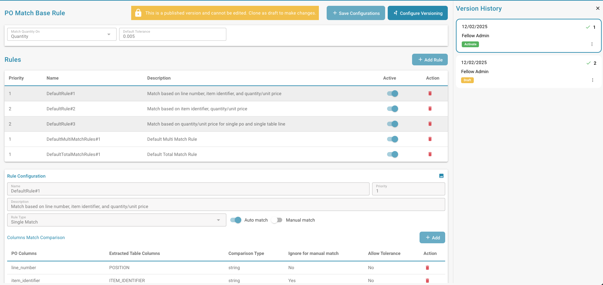<figcaption></figcaption></figure>
*   **Podrška za više finansijskih računa dobavljača:**\
    DocBits sada podržava upravljanje sa više finansijskih računa za dobavljače putem RemitToPartyMaster BOD-a koji obezbeđuje Infor. Ovo poboljšanje omogućava organizacijama da održavaju nekoliko remit-to zapisa računa za jednog dobavljača, poboljšavajući fleksibilnost i tačnost u obradi plaćanja. Uvedeno je novo podešavanje konfiguracije za omogućavanje ili onemogućavanje ove mogućnosti, dozvoljavajući administratorima da aktiviraju funkciju na osnovu svojih operativnih potreba.

    <figure>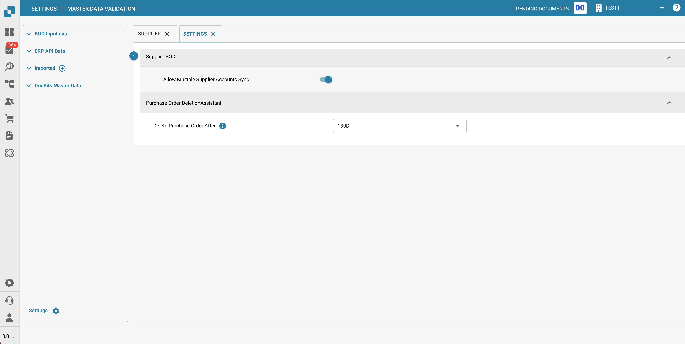<figcaption></figcaption></figure>
*   **Dodavanje korisničkog pristupa rezultatima OCR ekstrakcije:**\
    Dugme **OCR View** na ekranu Field Validation sada je dostupno svim korisnicima koji imaju pristup validaciji, umesto da bude ograničeno na administratore. Uz ovo ažuriranje, svaki ovlašćeni korisnik može direktno da pregleda rezultate OCR ekstrakcije, olakšavajući validaciju tačnosti podataka i praćenje ukupnih OCR performansi. Ovo poboljšanje promoviše veću transparentnost i poboljšava efikasnost radnog toka validacije.

    <figure>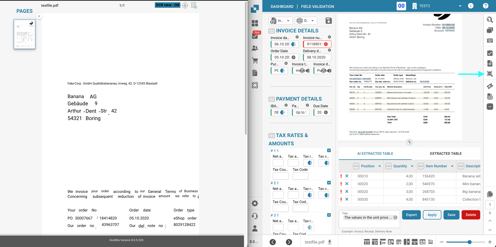<figcaption></figcaption></figure>
* **Dinamičko prikazivanje kolona na ekranima za odobravanje:**\
  Poboljšani prikazi za odobravanje da dinamički prikazuju samo kolone konfigurisane za poređenje u podešavanjima baze podataka svake organizacije. Ranije bi se neke kolone specifične za organizaciju pojavljivale prazne kada nisu konfigurisane za poređenje, izazivajući zabunu. Sada prikazi za odobravanje prikazuju samo polja koja se aktivno porede. Ovo pruža jasnije ekrane za odobravanje specifične za organizaciju bez praznih ili irelevantnih kolona.
* **Polje Order Type dodato u pretragu matičnih podataka**:\
  Lista zaglavlja porudžbina sada uključuje kolonu „Order Type" u pretrazi matičnih podataka, pružajući dodatne mogućnosti kategorizacije.
* **Poboljšanja kontrolne table sa prilagođenim filterima:**\
  Funkcija deljenja kontrolne table je poboljšana kako bi pružila veću fleksibilnost korisnicima sa kojima se deli. Pojedinci sa kojima su kontrolne table podeljene sada mogu da prilagode i uređuju filtere kontrolne table, omogućavajući im da prilagode prikazane informacije svojim specifičnim potrebama. Ovo poboljšanje podržava personalizovanije i interaktivnije iskustvo pregleda, obezbeđujući da korisnici mogu lako da preciziraju uvide u podatke koji su najrelevantniji za njihove zadatke.
* **Prilagodljivi prefiksi za kolone ekrana za odobravanje:**\
  Uvedena je nova podesiva opcija za prikazivanje prefiksa ispred kolona dokumenta na ekranima za odobravanje. Ovom funkcijom se može upravljati direktno unutar Layout Builder-a, dajući administratorima potpunu kontrolu nad tim da li se prefiksi prikazuju i na koje tipove dokumenata se primenjuju. Omogućavanjem ove opcije, korisnici dobijaju jasniji kontekst i poboljšanu čitljivost prilikom pregleda dokumenata tokom procesa odobravanja.

### Opšta poboljšanja

* Poboljšano beleženje grešaka za loše obučene tabele u ekstrakciji tabela.
* Dodato ograničenje deljenja za kontrolne table na do 10 korisnika ili 5 grupa, uz jasnu poruku o grešci kada se dostigne ograničenje.
* Poboljšano rukovanje greškama za prilagođene kontrolne table kada korisnik pokuša da kreira kontrolnu tablu sa imenom koje već postoji.

### Ispravke grešaka:

* Ispravljen problem gde su se e-poruke naizgled uspešno slale iz odeljka Supplier Details, ali nisu bile isporučene primaocima.
* Ispravljen problem gde polja padajućeg menija dodata na ekrane za odobravanje/odbijanje nisu bila prikazana.
* Ispravljen problem gde su svi izvezeni dokumenti bili označeni kao poslednji ažurirani od strane pogrešnog korisnika.
* Ispravljen problem gde su dokumenti prikazivali status „Workflow in Progress", ali nijedan radni tok nije izvršen i dnevnik je ostajao prazan.
* Ispravljen problem gde su nepovezani korisnici bili dodeljivani dokumentima u trenutku izvoza bez obavljanja bilo kakvog rada na njima.
* Ispravljen problem gde korisnici sa ispravnim dozvolama nisu mogli da odbiju dodeljene dokumente i dobijali su greške.
* Ispravljen problem gde se ikone toka dokumenata nisu prikazivale za neke organizacije.
* Ispravljen problem gde se iskačući prozor pojavljivao prilikom otpremanja dokumenata prevlačenjem i puštanjem na kontrolnu tablu.
* Ispravljen problem gde su se E-TEXT oznake prikazivale kao omogućene u korisničkom interfejsu iako je API odgovor prikazivao sve vrednosti kao false.
* Ispravljen problem gde je dolazilo do greške prilikom otpremanja dokumenata koji sadrže prazne stranice.
* Rešen problem gde hiperveze zadataka u e-obaveštenjima nisu preusmeravale korisnike na ispravan ekran za odobravanje.
* Rešen problem gde je izbor unakrsne pod-organizacije izazivao da pretraga matičnih podataka ne prikaže nijednog dobavljača. Korisnici sada mogu ispravno da pregledaju unakrsne organizacione podatke dobavljača.

## Izdanje Autumn Summit 22. oktobar 2025.

### DocBits poboljšanja:

*   **Poboljšanja dizajna šablona e-poruka:**

    Uređivač šablona e-poruka je redizajniran kako bi pružio jasniju strukturu i lakše iskustvo. Izbor polja dokumenta je sada intuitivniji, a prilozi se mogu uključiti direktno unutar šablona. Ova poboljšanja čine kreiranje profesionalnih, prilagođenih e-poruka bržim i lakšim.

    <figure><figcaption></figcaption></figure>
*   **Poboljšanja kontrolne table:**

    Kontrolna tabla je proširena radi poboljšanja navigacije i prilagođavanja. Uz nove kartice, korisnici mogu brže da prelaze između različitih tipova dokumenata, smanjujući vreme utrošeno na traženje pravog prikaza.

    <figure><figcaption></figcaption></figure>
*   **Prilagođene kontrolne table sa filterima:**\
    Pored toga, kontrolne table sada mogu da se prilagode i filtriraju prema individualnim preferencijama. Ove prilagođene kontrolne table takođe se mogu deliti sa kolegama, olakšavajući\
    kreiranje doslednih prikaza za izveštavanje na nivou celog tima.

    <figure><figcaption></figcaption></figure>
*   **Dnevnici e-obaveštenja:**

    Nova funkcija beleženja dostupna je za sva e-obaveštenja. Korisnici sada mogu da pregledaju istoriju poslatih obaveštenja, olakšavajući proveru isporuka i otklanjanje problema ako e-poruke nisu primljene.
*   **Podrška za e-fakture: e-SLOG 1.6 i 2.0:**

    Uvedena je podrška za dodatne formate e-faktura. Sistem sada može da obrađuje i generiše e-SLOG verzije 1.6 i 2.0, proširujući kompatibilnost sa partnerima i regulatornim zahtevima.
*   **Poboljšanja detekcije duplikata:**

    Detekcija duplikata je unapređena sa dve moćne opcije konfiguracije. **Duplicate Detection Interval** vam omogućava da definišete vremenski opseg za precizniju proveru duplikata, dok podešavanje **Disallow Export of Duplicates** automatski sprečava izvoz dokumenata koji su otkriveni kao duplikati. Zajedno, ova poboljšanja pružaju veću kontrolu i obezbeđuju višu tačnost podataka.

    <figure><figcaption></figcaption></figure>
*   **Poboljšanja stabla odlučivanja:**

    Stabla odlučivanja su sada svestranija, sa mogućnošću vraćanja vrednosti polja dokumenta. Ovo omogućava napredniju logiku automatizacije, dozvoljavajući radnim tokovima da donose odluke na osnovu stvarnih podataka dokumenta.
*   **Nove kartice radnog toka:**

    Dve nove kartice radnog toka proširuju mogućnosti automatizacije. Prva vam omogućava da proverite da li dokument pripada određenoj pod-organizaciji, olakšavajući rukovanje postavkama sa više entiteta. Druga uvodi proveru tolerancije datuma isporuke, koja poredi datume isporuke sa trenutnim datumom u radnim danima kako bi pomogla da se efikasnije upravlja i sprovode zahtevi isporuke.
*   **Poboljšanja CSV izvoza:**

    Funkcija CSV izvoza je značajno poboljšana. Umesto da izvozi samo dokumente prikazane na trenutnoj stranici, sistem sada izvozi sve dokumente u skupu podataka. Svaki izvoz kreira unos u dnevniku, a rezultujući CSV se automatski šalje putem e-pošte, pružajući potpuniji i pouzdaniji proces izvoza.
*   **Vremenski okvir za brisanje porudžbina:**

    Nova opcija konfiguracije omogućava administratorima da definišu vremenski okvir za brisanje porudžbina. Ovo poboljšanje dodaje fleksibilnost i kontrolu nad politikama zadržavanja podataka, obezbeđujući da se porudžbine uklanjaju samo kada je to prikladno.

### Ispravke grešaka

* Ispravljen problem gde su stari podaci bili uključeni prilikom izvoza dokumenata.
* Ispravljen filter za Export Errors, koji je ranije prikazivao i druge statuse.
* Rešeno neslaganje pri validaciji tabele gde je „Unit Price" izazivao greške, ali „Unit Price Per" nije, iako su vrednosti bile ispravne.
* Ispravljen problem gde dodavanje nove kolone na kontrolnu tablu nije uspevalo.
* Ispravljen problem gde zadaci nisu bili vidljivi u koloni zadataka na kontrolnoj tabli.
* Ispravljeno nasumično ponašanje sortiranja tako da liste sada slede dosledan redosled.
* Rešen problem gde promena veličine kolone nije mogla da se zaustavi.
* Ispravljena greška koja je sprečavala ručno podudaranje stavki na ekranu PO podudaranja.
* Ispravljen problem gde je opcija priloga e-poruke bila resetovana nakon čuvanja.
* Ispravljen problem gde je auto accounting prvo prikazivao ID-jeve baze podataka kada se otvori po prvi put.
* Ispravljeno ponašanje fuzzy polja tako da se vrednosti više ne prepisuju nepravilno.
* Ispravljen problem gde su polja u auto account nestajala nakon brisanja sadržaja.
* Ispravljena greška gde korisnik nije mogao da preimenuje „First Name" i „Last Name" u iskačućem prozoru podešavanja.
* Rešen problem gde su dokumenti mogli da zaglave u statusu „workflow in progress".
* Ispravljen problem sa bojom ikone menija gde boje izabrane organizacije nisu bile pravilno primenjene.
* Ispravljen problem gde QR kodovi ponekad nisu bili prepoznati.
* Ispravljen problem gde računi nisu mogli da se uklone tasterom backspace radi unosa drugog.
* Rešen problem sa mešanjem jezika nakon prijave posle objavljivanja u produkciju.

## Izdanje **Summer Bloom** jul 2025.

### DocBits poboljšanja:

* **Opcija filtera za dnevnik uvoza e-pošte:**\
  Korisnici sada imaju mogućnost da filtriraju dnevnike uvoza i sortiraju tabelu radi jasnijeg, efikasnijeg pregleda. Ovo poboljšanje pojednostavljuje proces identifikacije i upravljanja unosima e-pošte, poboljšavajući otklanjanje problema i ukupno upravljanje dnevnicima.
*   **Podrška za više jezika za List of Values :**\
    Proširili smo mogućnosti za više jezika na funkciju List of Values. Administratori sada mogu da definišu oznake na više jezika, obezbeđujući da se ispravna oznaka automatski prikaže na osnovu podešavanja sistemskog jezika korisnika. Ovo poboljšanje promoviše veću pristupačnost i lokalizaciju, olakšavajući korisnicima širom sveta da koriste platformu na svom maternjem jeziku.

    <figure><figcaption></figcaption></figure>
* **Poboljšanja detalja korisnika u podešavanjima:**\
  Interfejs podešavanja sada prikazuje sveobuhvatne informacije o korisniku. Administratori mogu lako da pregledaju grupne pripadnosti, detalje pod-organizacije i dodatne ključne podatke, omogućavajući bolje upravljanje korisničkim ulogama i jasnije razumevanje struktura tima. Pored toga, administratori sada mogu da kreiraju System Admin za organizaciju.
* **Informacije o auto accounting-u na ekranu za odobravanje:**\
  Ekran za odobravanje sada prikazuje detalje auto accounting-a zajedno sa informacijama o fakturi. Ovo poboljšanje pruža dublji uvid u podatke o transakcijama, olakšavajući lakše procese pregleda i informisanije donošenje odluka u vezi sa fakturama.
* **Brojač zadataka za dokumente u prikazu kontrolne table:**\
  Dokumenti na kontrolnoj tabli sada mogu da ukazuju na otvorene zadatke povezane sa njima i prikazuju ukupan broj zadataka na čekanju. Ova funkcija pruža korisnicima brzi pregled preostalih akcija, poboljšavajući upravljanje zadacima i efikasnost radnog toka.
* **Izbor AI modela na osnovu dobavljača:**\
  Korisnici sada mogu da izaberu AI model korišćen za ekstrakciju podataka na osnovu svakog dobavljača pojedinačno. Ovo poboljšanje omogućava fino optimizovano podešavanje, obezbeđujući bolju tačnost ekstrakcije za različite dobavljače i poboljšavajući ukupne rezultate obrade podataka. [Saznajte više](https://docs.docbits.com/end-user-and-partner-section/end-user-section/validation-screen#supplier-based-ai-model)
* **Poboljšani dnevnici radnog toka za kartice stabla odlučivanja:**\
  Dnevnici sada prikazuju izlaz stabla odlučivanja, olakšavajući praćenje i razumevanje kako su odluke donete unutar radnih tokova.
*   **Uvođenje nove postavke za automatsko testiranje radi poboljšanja funkcionalnosti i stabilnosti sistema:**

    Sa zadovoljstvom najavljujemo implementaciju novog automatizovanog sistema testiranja dizajniranog da poboljša ukupnu funkcionalnost i pouzdanost naše platforme. Ova nova postavka će sprovoditi dosledne, temeljne provere našeg sistema kako bi identifikovala bilo kakve probleme pre nego što utiču na vaše iskustvo. Automatizacijom ovih testova, možemo da obezbedimo brže odgovore na potencijalne probleme i održimo najviše standarde kvaliteta za naš sistem.
* **Implementacija arhitekture mikroservisa:**\
  Restrukturirali smo platformu razdvajanjem osnovnih komponenti u namenske mikroservise. Ovaj arhitektonski pomak poboljšava skalabilnost, poboljšava performanse sistema i omogućava brže, modularnije cikluse razvoja i primene.
*   **Vodič kroz aplikaciju:**\
    Vođeni vodič je sada dostupan kako bi pomogao korisnicima da lakše navigiraju i razumeju različite delove aplikacije. Ovo je posebno korisno za uvođenje novih korisnika ili istraživanje nepoznatih funkcija.

    <figure><figcaption></figcaption></figure>
* **Poboljšanja stabla odlučivanja:**\
  Napravljena su poboljšanja interfejsa stabla odlučivanja, uključujući intuitivniju funkciju dodavanja redova — sada smeštenu na vrhu stabla — radi pojednostavljenja održavanja i uređivanja.
* **DocOperator**\
  Novi AI alati kao što je DocOperator pomažu u automatizaciji ponavljajućih zadataka, poboljšavajući efikasnost i smanjujući ručni napor kroz radne tokove dokumenata.
*   **Opcija pregleda elektronskih dokumenata:**\
    Dodata je funkcija pregleda za elektronske dokumente (eDocs), omogućavajući korisnicima da testiraju i pregledaju promene direktno unutar podešavanja pre njihove primene.\\

    <figure><figcaption></figcaption></figure>
* **Podrška za novi jezik – kineski:**\
  DocBits sada podržava kineski jezik, proširujući opcije pristupačnosti i lokalizacije za korisnike na globalnim tržištima.
* **Poboljšana kontrolna tabla zadataka:**\
  Kontrolna tabla zadataka je poboljšana da prikazuje veći broj zadataka odjednom, dajući korisnicima jasniji pregled i poboljšavajući praćenje zadataka.
*   **Poboljšanja PO podudaranja:**

    Dodati vizuelni indikatori za različita stanja podudaranja

    Novo podešavanje za ignorisanje već podudarenih PO stavki po tipu dokumenta

    Poboljšana automatska provera za ažuriranja porudžbina radi obezbeđivanja doslednosti
* **Poboljšanja Layout Builder-a:**\
  Sada možete da pretražujete i imena polja i naslove polja, čineći konfigurisanje i pronalaženje komponenti rasporeda bržim i lakšim.
* **Dugme Export and Next na ekranu za odobravanje:**\
  Dodato je novo dugme na ekran za odobravanje koje omogućava korisnicima da izvezu dokument i automatski pređu na sledeći u redu „Ready for Validation".
* **Nove kartice radnog toka:**\
  Uvedene su nove kartice radnog toka, uključujući one za pokretanje radnih tokova na novim porudžbinama i događajima vezanim za ponude. Ove pružaju više opcija automatizacije.
*   **Poboljšanja Watchdog-a:**\
    Konfiguracija Watchdog-a premeštena je u glavni korisnički interfejs aplikacije, čineći je lakšom za upravljanje. Takođe su uvedene dodatne funkcionalnosti za bolje praćenje i kontrolu.\\

    <figure><figcaption></figcaption></figure>
* **Poboljšanja odbijanja stavki:**\
  Odbijanje stavke sada zahteva od korisnika da navedu razlog, obezbeđujući bolju sledljivost i odgovornost u radnim tokovima pregleda.
* **Lista AI modela dobavljača u podešavanjima:**\
  Novi prikaz podešavanja prikazuje AI modele dodeljene određenim dobavljačima, zajedno sa opcijom za njihovo resetovanje. Ovo poboljšava transparentnost i mogućnost upravljanja AI konfiguracijama zasnovanim na dobavljačima.
*   **Poboljšanja dnevnika dokumenata:**\
    Dnevnici dokumenata sada uključuju detaljnije informacije radi podrške boljoj reviziji i otklanjanju problema.

    <figure><figcaption></figcaption></figure>
* **Podrška za PNG i JPG:**\
  Sada možete da otpremate PNG i JPG datoteke, koje će automatski biti konvertovane u PDF format za obradu.
* **Konfiguracija formata dokumenta za IDM izvoz:**\
  Format izvoza za PDF-ove u IDM-u sada se može konfigurisati, dajući korisnicima veću kontrolu nad načinom generisanja dokumenata.
* **Novi eDoc tip – EDIFACT INVOIC02:**\
  Sada podržavamo elektronski tip dokumenta EDIFACT INVOIC02, proširujući kompatibilnost sa standardizovanim formatima faktura.
*   **Opcije e-obaveštenja i šablona**

    DocBits sada nudi poboljšanu kontrolu nad e-obaveštenjima, uključujući:

    * **Timed Resend:** Automatski ponovo šalje e-obaveštenja nakon definisanog perioda ako se ne preduzme nijedna akcija, obezbeđujući da se zadaci ne propuste.
    * **Resend on Reassignment:** Obaveštenja se takođe mogu pokrenuti kada se zadaci ponovo dodele, održavajući korisnike u toku sa promenama u odgovornosti.
    * **Prilagođeni šabloni e-poruka:** Administratori sada mogu da kreiraju i upravljaju šablonima e-poruka radi prilagođavanja naslova, sadržaja poruke i formatiranja. Ovo omogućava personalizovana, kontekstualna obaveštenja koja odgovaraju stilu komunikacije vaše organizacije.

    Ovi dodaci poboljšavaju efikasnost komunikacije i smanjuju kašnjenja u radnim tokovima rukovanja dokumentima.
*   **Status PO na kontrolnoj tabli**

    Kontrolna tabla sada uključuje opciju za prikazivanje **statusa povezanih porudžbina (PO)** direktno unutar pregleda dokumenata. Ovo poboljšanje pruža korisnicima uvid na prvi pogled u napredak PO — kao što je primljeno ili fakturisano — omogućavajući brže donošenje odluka i bolje usklađivanje između dokumenata i procesa nabavke.

### Ispravke grešaka

* Rešen problem gde se zadaci nisu pojavljivali na ekranu za validaciju/odobravanje.
* Ispravljen položaj dugmeta Next/Previous tako da ostaje statičan.
* Ispravljeni problemi sa skrolovanjem u prikazima skripti i stabla odlučivanja, obezbeđujući da dugmad akcija ostaju nepokretna tokom skrolovanja.
* Uklonjeno polje zemlje porekla iz e-faktura.
* Ispravljen problem sa brojačem zadataka koji je prikazivao netačan broj zadataka.
* Dodati nedostajući prevodi.
* Ispravljena prilagođena polja da prikazuju opisna imena umesto ID-jeva.
* Rešen problem gde su dokumenti preuzimani sa netačnim imenom datoteke.
* Ispravljene nedoslednosti sortiranja u tabeli stavki fakture unutar PO podudaranja.
* Ispravljen problem koji je uticao na funkcionalnost kreiranja zadataka.
* Ispravljen problem u PO podudaranju gde bi se sortiranje tabele fakture resetovalo prilikom podudaranja stavke.
* Rešeni problemi sa auto accounting-om obezbeđivanjem da se knjigovodstvene reference ispravno dele kada se iznos podeli.
* Ažurirane informacije o ClickHouse host-u.
* Rešen problem gde dokumenti duplikati nisu bili prepoznati kao duplikati.
* Ispravljeni problemi izvoza izazvani knjigovodstvenim referencama koje su bile predugačke.
* Ispravljene predikcije date za auto accounting.
* Rešen problem gde polja za potvrdu samo za čitanje nisu bila samo za čitanje.
* Ispravljen problem gde korisnici mogu biti dodati u pod-organizaciju dva puta.
* Ispravljen problem gde je promena pod-organizacije za dokument izazivala resetovanje dodeljenog korisnika ili grupe.
* Rešeni neki problemi sa ekranom auto.accounting.
* Ispravljen problem gde korisnici nisu mogli da dodaju FTP konfiguraciju.
* Ispravljen problem sa SSO prijavom.
* Ispravljeni neki problemi vezani za dolazne e-poruke.
* Ispravljen problem sa dokumentima koji dobijaju pogrešno ime prilikom preuzimanja.
* Ispravljen problem gde stablo odlučivanja vraća netačan rezultat.

## Izdanje Hot Fix Winter Frost 10. april 2025.

### DocBits poboljšanja:

* **Poboljšana skriptna funkcija `set_column_date_value`:**\
  Funkcija `set_column_date_value` sada uključuje podršku za opciju `skip_weekend`, omogućavajući vrednostima datuma da automatski preskaču vikende kada se primene.
* **Poboljšana podrška za otpremanje datoteka:**\
  PNG i JPEG datoteke sada se mogu direktno otpremati i automatski se konvertuju u PDF format za pojednostavljeno rukovanje dokumentima.
* **Nadogradnje funkcionalnosti Watchdog-a:**
  * Sada podržava izvoz u **Enaio** za bolju integraciju sistema.
  * Poboljšane mogućnosti parsiranja za ekstrakciju informacija iz `Sync.ContentDocument` XML struktura, omogućavajući efikasniju obradu podataka.

### Ispravke grešaka

* Ispravljen problem na skriptnoj funkciji.
* Rešen problem gde su porudžbine imale pogrešan status nakon što su ažurirane.

## Izdanje Hot Fix Winter Frost 17. mart 2025.

### Ispravke grešaka

* Poboljšane prečice.

## Izdanje Hot Fix Winter Frost 11. mart 2025.

### DocBits poboljšanja:

* **Poboljšana ekstrakcija podataka:** Dodata opcija za ekstrakciju **porudžbine** ili **broja artikla** iz stavke iznad ili ispod.
* **Prošireni pristup unakrsnim pod-organizacijama:** Korisnici koji nisu administratori sada takođe mogu da pristupe funkciji **Cross Sub-Organizations**. [Saznajte više](https://docs.docbits.com/administration-and-setup/settings/global-settings/groups-users-and-permissions/sub-organizations#cross-sub-organisations-access)

### **Ispravke grešaka:**

* Ispravljen problem gde korisnici nisu mogli da budu dodati u grupu.
* Ispravljen problem sa neuspesima uvoza e-pošte.
* Rešen problem sa obukom polja na dokumentima sa više stranica.
* Ispravljen problem gde skripte nisu radile ispravno.
* Rešen problem gde se podaci dokumenta nisu prikazivali ispravno.
* Ispravljen problem sa podešavanjem automatskog ažuriranja porudžbina.
* Ispravljen problem gde su se tokeni pretplate prikazivali pogrešno.
* Rešen problem gde je ekran zadataka prikazivao zastarelu verziju dokumenta.
* Ispravljen problem koji je izazivao da dokumenti ne menjaju svoj status.

## Izdanje Hot Fix Winter Frost 3. februar 2025.

### **DocBits poboljšanja:**

* **Podrška za ISO-8859-1 za ZUGFeRD:** Poboljšana kompatibilnost za fakture koje koriste ISO-8859-1 kodiranje karaktera.
* **Optimizovan sistem beleženja:** Poboljšano praćenje i dijagnostika za bržu identifikaciju i rešavanje problema.

## Izdanje Winter Frost 22. januar 2025.

#### Nove funkcije

### Podrška za ZUGFeRD 2.1 i noviji

DocBits sada uključuje potpunu podršku za ZUGFeRD verzije 2.1 i novije, omogućavajući besprekorno rukovanje i obradu ZUGFeRD-usklađenih elektronskih faktura. Integracija obezbeđuje:

* **Kompatibilnost**: DocBits je sposoban da upravlja ZUGFeRD fakturama u njihovim strukturiranim (XML) i nestrukturiranim (PDF) formatima, održavajući usklađenost sa EU standardima kao što je EN 16931 za e-fakturisanje.
* **Efikasnost**: Korisnici mogu bez napora da uvoze, validiraju i ekstrahuju podatke iz ZUGFeRD e-faktura, minimizujući ručni unos podataka i smanjujući vreme obrade.
* **Fleksibilnost**: Bilo da radite sa basic, comfort ili extended profilima unutar ZUGFeRD standarda, DocBits pruža alate za upravljanje svakim nivoom složenosti fakture.
* **Prilagođenost budućnosti**: Uz podršku za novije verzije, DocBits obezbeđuje da preduzeća ostanu usklađena sa evoluirajućim propisima e-fakturisanja u državama članicama EU i šire.

Uključivanjem ZUGFeRD 2.1 i novijih standarda, DocBits pojednostavljuje prekogranične transakcije i usklađuje se sa modernim poslovnim potrebama, čineći ga bitnim alatom za organizacije koje daju prioritet digitalnoj transformaciji i regulatornoj usklađenosti. [Saznajte više](https://docs.docbits.com/administration-and-setup/settings/global-settings/document-types/edi/zugferd-1.0-2.1-and-2.3)

### Integracija spoljnog API-ja za poboljšanu obradu dokumenata

DocBits uvodi naprednu mogućnost korišćenja spoljnih API-ja tokom obrade dokumenata, poboljšavajući potpunost i tačnost ekstrahovanih podataka. Ova funkcija značajno smanjuje ručni unos popunjavanjem nedostajućih polja tačnim, ažurnim informacijama preuzetim u realnom vremenu iz pouzdanih izvora. Obezbeđuje da se dokumenti obrađuju brže i sa većom doslednošću.

### Pristup unakrsnim pod-organizacijama

Za organizacije sa omogućenim više pod-organizacija, DocBits sada uvodi funkciju Cross Sub-Organizations. Ovo poboljšanje osnažuje administrativne korisnike da pojednostave upravljanje dokumentima kroz sve pod-organizacije pod jednim okriljem. Administratori sada mogu da pristupe i pregledaju sve dokumente iz svake pod-organizacije bez potrebe za prebacivanjem pod-organizacije. Ova centralizovana vidljivost omogućava administratorima da vide sve dokumente za sve pod-organizacije, olakšavajući pronalaženje određenih datoteka uz istovremeno održavanje pregleda iz ptičje perspektive. [Saznajte više](https://docs.docbits.com/administration-and-setup/settings/global-settings/groups-users-and-permissions/sub-organizations#cross-sub-organisations-access)

<figure>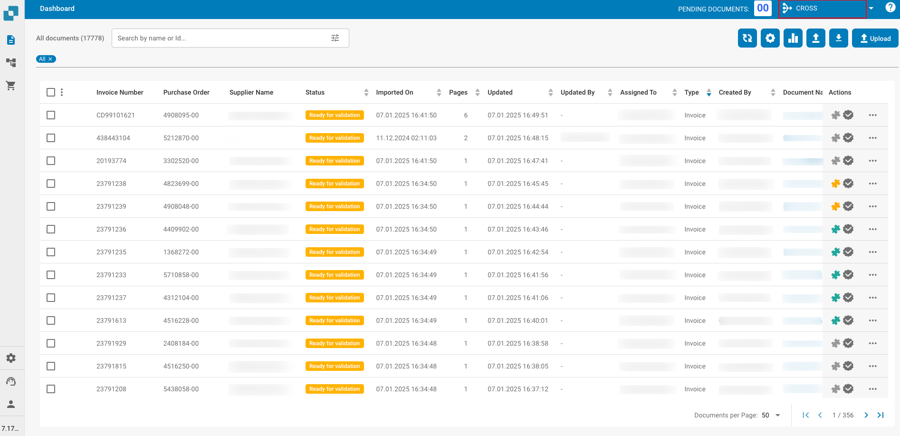<figcaption></figcaption></figure>

### Vidljivost dokumenata na osnovu dozvola grupa

DocBits uvodi poboljšane kontrole vidljivosti dokumenata, omogućavajući precizniije upravljanje pristupom za korisnike koji nisu administratori putem dozvola zasnovanih na grupama. Ova funkcija omogućava administratorima da definišu koji dokumenti su vidljivi određenim korisnicima ili grupama, obezbeđujući pojednostavljene radne tokove i poboljšanu sigurnost podataka. Administratori mogu da dodele dokumente određenim grupama, dajući vidljivost samo korisnicima unutar tih grupa. Ovo obezbeđuje da korisnici vide samo dokumente relevantne za njihovu ulogu ili tim, smanjujući nered i poboljšavajući fokus. [Saznajte više](https://docs.docbits.com/administration-and-setup/settings/global-settings/groups-users-and-permissions/groups-and-permissions)

<figure><figcaption></figcaption></figure>

### Sekvencijalni radni tok i istorija odobravanja

DocBits uvodi moćnu funkciju sekvencijalnog radnog toka i istorije odobravanja, dizajniranu da poboljša efikasnost obrade dokumenata i odgovornost. Omogućavajući dokumentima da prate unapred definisano stablo odlučivanja, ova funkcija obezbeđuje uredan pregled i odobravanje uz održavanje kompletnog zapisa preduzetih akcija. Upravljanje sekvencijalnim radnim tokom:

* Dokumenti se mogu dodeliti većem broju korisnika u unapred definisanom redosledu, obezbeđujući da se svaka faza pregleda ili validacije odvija u ispravnom redosledu.
* Svaki korisnik u radnom toku se obaveštava kada je red na njega da postupi po dokumentu, smanjujući zabunu i kašnjenja.
* Radni tokovi se mogu prilagoditi da odgovaraju specifičnim poslovnim procesima

**Istorija odobravanja:**

* Kompletan dnevnik svih akcija preduzetih nad dokumentom dostupan je u prikazima Validation i Approval. Ovo uključuje:
  * Akcije korisnika (npr. „approved" „rejected")
  * Vremenske oznake za svaku akciju
  * Komentare ili napomene koje su korisnici dodali tokom pregleda
* Istorija obezbeđuje transparentnost i pruža revizioni trag za usklađenost i otklanjanje problema. [Saznajte više](https://docs.docbits.com/administration-and-setup/settings/global-settings/document-types/more-settings/approval-history)

<figure><figcaption></figcaption></figure>

### Poboljšanje arhive SFTP/FTP dokumenata

Poboljšanje arhive SFTP/FTP dokumenata u DocBits-u nadograđuje postojeću funkciju uvoza, uvodeći besprekoran metod za arhiviranje datoteka nakon što su obrađene. Novo podešavanje u konfiguraciji FTP uvoza omogućava korisnicima da omoguće ili onemoguće arhiviranje datoteka. Kada se datoteke uspešno prime i obrade u DocBits-u, one će automatski biti arhivirane u određeni folder na SFTP/FTP serveru ako je opcija omogućena. Ovo obezbeđuje da se obrađene datoteke sačuvaju za vođenje evidencije bez zatrpavanja aktivnih direktorijuma za uvoz. [Saznajte više](https://docs.docbits.com/end-user-and-partner-section/end-user-section/how-to-import-documents/ftp)

<figure>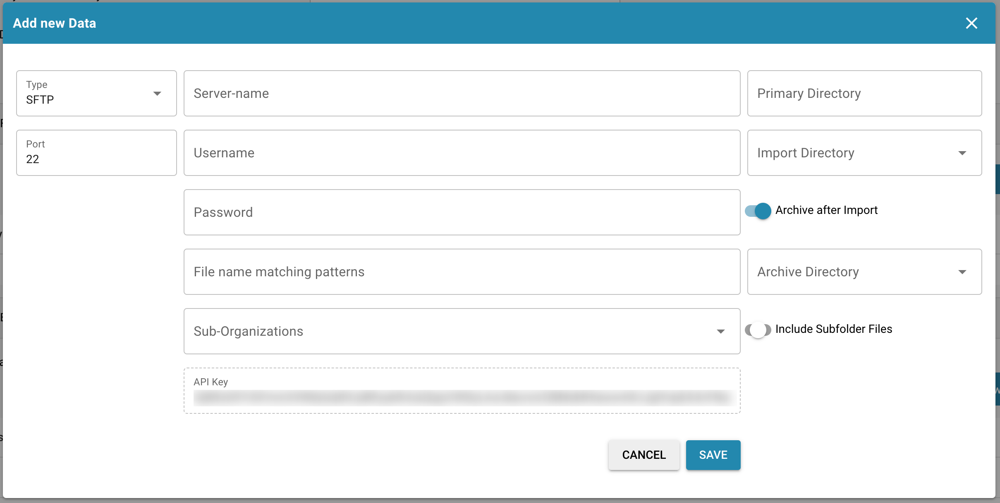<figcaption></figcaption></figure>

### Više poreskih sekcija za tip poreza i izvoz u LN

Ova funkcija poboljšava mogućnosti rukovanja porezom omogućavanjem detaljne klasifikacije i izvoza poreskih informacija u Infor LN (Full Tax, Reduced Tax, Tax Free). Ovo omogućava bolje usklađivanje sa složenim poreskim strukturama i obezbeđuje besprekornu integraciju sa računovodstvenim sistemima.

**Više poreskih sekcija po tipu**:

* DocBits sada podržava dodavanje više poreskih sekcija pod svakim tipom poreza, kao što su:
  * Full Tax: Standardne stope PDV-a ili poreza na promet.
  * Reduced Tax: Niže stope za određene robe ili usluge (npr. osnovni artikli).
  * Tax-Free: Izuzeća za kvalifikovane transakcije.
* Ove sekcije omogućavaju preciznu kategorizaciju poreskih iznosa, obezbeđujući usklađenost sa poreskim propisima i računovodstvenim standardima.

**Dinamička integracija auto accounting-a**:

* Na osnovu podataka ekstrahovanih tokom obrade dokumenata, relevantne poreske sekcije se automatski prikazuju na ekranu Auto Accounting.
* Ovo obezbeđuje da korisnici mogu brzo da validiraju i prilagode poreske unose bez ručnog obračuna ili ponovnog unosa, pojednostavljujući radni tok.

**Izvoz u Infor LN**:

* Poreski podaci, uključujući sve relevantne sekcije i klasifikacije, besprekorno se izvoze u Infor LN, obezbeđujući doslednost između obrade dokumenata u DocBits-u i sistema za planiranje resursa preduzeća (ERP).
* Izvezeni podaci su povezani sa odgovarajućim stavkama troškova u Infor LN, održavajući jasnu sledljivost i tačno finansijsko izveštavanje.

<figure>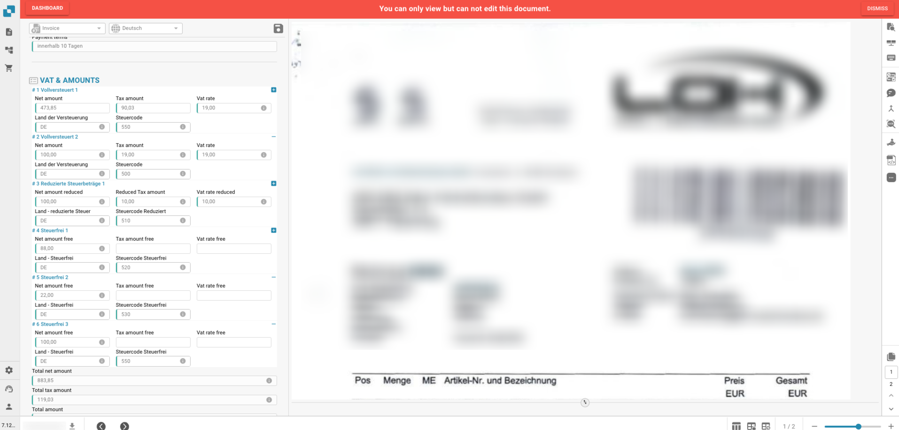<figcaption></figcaption></figure>

<figure><figcaption></figcaption></figure>

### Poboljšanja kontrolne table

DocBits je uveo značajna ažuriranja kontrolne table, fokusirajući se na upotrebljivost, efikasnost i poboljšanu vidljivost podataka. Ova poboljšanja uključuju novi filter „Assigned To Group" i optimizovan korisnički interfejs za Document Logs, olakšavajući korisnicima interakciju sa svojim dokumentima i upravljanje njima.

### Poboljšanja PO podudaranja

DocBits uvodi nekoliko poboljšanja upotrebljivosti na ekran PO podudaranja, dizajniranih da pojednostave proces podudaranja stavki porudžbina (PO) sa fakturama. Ova poboljšanja nude intuitivnije kontrole za izbor više stavki i pružaju jasne vizuelne indikatore za rukovanje zastarelim PO podacima.

**Ctrl + Click za izbor pojedinačne stavke**:

* Korisnici sada mogu da drže taster Ctrl i kliknu na određene stavke da izaberu više, nepovezanih redova na ekranu PO podudaranja.

**Shift + Click za izbor opsega**:

* Korisnici mogu da izaberu opseg redova držanjem tastera Shift, klikom na prvi red, a zatim klikom na poslednji red. Svi redovi između prvog i poslednjeg izbora biće automatski izabrani.

**Automatska detekcija zastarelih podataka**:

* Ako su PO podaci povezani sa fakturom stari (na osnovu sistemskih podešavanja), biće prikazana ikona za obaveštenje korisnika. Ovaj vizuelni indikator obezbeđuje da su korisnici svesni zastarelih podataka koji možda ne odražavaju najnovija ažuriranja porudžbine.

### Ispravke grešaka

* Rešen problem kako bi se obezbedilo da se sve moguće vrednosti ispravno prikazuju tokom procesa auto accounting-a.
* Poboljšan korisnički interfejs Workflow Logs kako bi navigacija i upotrebljivost bili intuitivniji.
* Ažurirana polja dokumenta da prikazuju dodatne informacije, kao što su oznake obaveznog i skrivenog, direktno u korisničkom interfejsu.
* Dodata vidljivost opisa grupa u podešavanjima grupa.
* Prikazana ograničenja dužine za imena grupa tokom kreiranja radi sprečavanja grešaka.
* Rešeni problemi u funkciji testiranja stabla odlučivanja i rešene nedoslednosti prevoda.
* Poboljšana funkcija pretrage u Workflow Logs za tačnije i efikasnije rezultate pretrage.
* Ispravljen problem kako bi se sprečilo da korisnici nenamerno brišu radne verzije elektronskih dokumenata.
* Rešene greške u procesu uvoza e-pošte kako bi se obezbedila besprekorna integracija i rukovanje podacima.
* Ispravljeni problemi sa čuvanjem AI-generisanih oznaka, obezbeđujući doslednu retenciju podataka.
* Ispravljen problem sortiranja koji se javljao pri primeni sortiranja preko različitih stranica kontrolne table.
* Poboljšan brojač dokumenata da tačno prikazuje broj dokumenata koje je obradio DocBits.
* Poboljšani prevodi širom aplikacije radi poboljšanja upotrebljivosti za različite jezike.

## Izdanje Hot Fix Feast 17. decembar 2024.

### **DocBits poboljšanja:**

#### Poboljšanja uvoza e-pošte

* Korisnici sada mogu besprekorno da uvoze XML i EDI datoteke putem funkcije Email Import.

## Izdanje Hot Fix Feast 27. novembar 2024.

### DocBits poboljšanja:

#### Poboljšana PO optimizacija

* **Optimizovan mehanizam čuvanja**: Proces čuvanja je pojednostavljen da se odvija tek nakon što korisnik završi podudaranje, smanjujući suvišna čuvanja i poboljšavajući efikasnost.
* **Poboljšan asinhroni izvoz**: Funkcija izvoza sada radi asinhrono, obezbeđujući lakše operacije i poboljšano ukupno korisničko iskustvo.

#### Poboljšanja radnog toka

Funkcija radnog toka je nadograđena da pruži bolje korisničko iskustvo:

* **Poboljšani dnevnici**: Dnevnici radnog toka sada imaju čistiji, intuitivniji interfejs, olakšavajući pregled i razumevanje detalja procesa.
* **Poboljšana odzivnost**: Procesi izvršavanja radnog toka su optimizovani za bržih i pouzdanijih performansi, omogućavajući brže završavanje zadataka i smanjena kašnjenja.

#### Poboljšano keširanje aplikacije

Implementirali smo napredne strategije keširanja širom aplikacije za optimizaciju preuzimanja podataka i smanjenje vremena učitavanja. Ova poboljšanja unapređuju ukupnu upotrebljivost obezbeđivanjem lakše navigacije i odzivnijeg korisničkog iskustva, posebno za često korišćene funkcije.

#### Nadogradnje kontrolne table i korisničkog interfejsa

* **Poboljšanja kontrolne table**: Kontrolna tabla je preuređena sa poboljšanim rasporedom i dodatnim funkcijama radi pojednostavljenja navigacije i poboljšanja vidljivosti ključnih metrika.
* **Poboljšanja korisničkog interfejsa**: Korisnički interfejs širom aplikacije je unapređen za moderniji, intuitivniji i korisniku prijateljski doživljaj, olakšavajući korisnicima da obave svoje zadatke uz minimalan napor.

### Ispravke grešaka:

1. Poboljšana fuzzy logika kako bi se obezbedilo tačnije i pouzdanije popunjavanje podataka nakon ekstrakcije.
2. Ispravljene poznate greške koje utiču na grupe i dozvole, obezbeđujući besprekorno upravljanje pristupom i funkcionalnost uloga.
3. Rešene nedoslednosti u prevodima širom aplikacije, poboljšavajući jasnoću i lokalizaciju.
4. Rešeni problemi vezani za raspored, obezbeđujući dosledan i optimizovan korisnički interfejs kroz sve konfiguracije.
5. Ispravljene greške u funkciji pretrage matičnih podataka, obezbeđujući tačno i pouzdano preuzimanje podataka.
6. Rešeni problemi sa funkcijom uvoza e-pošte kroz sve dostupne opcije, obezbeđujući nesmetane operacije bez grešaka.

## Izdanje Feast 4. novembar 2024.

### Nove funkcije:

#### Poboljšanja uvoza e-pošte

Konfigurisana IMAP podešavanja e-pošte za automatsko slanje obaveštenja o rezultatima uvoza. Obaveštenja o uspešnom uvozu će potvrditi obrađene datoteke, dok će upozorenja o neuspehu uključivati imena datoteka i specifične detalje greške za brzo otklanjanje problema.

<figure>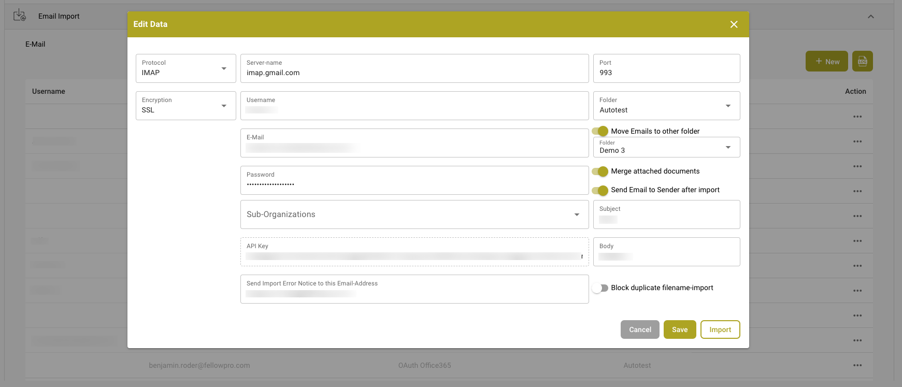<figcaption><p>Email Import Configurations</p></figcaption></figure>

#### Prerada pretrage matičnih podataka

Preuređena podešavanja pretrage matičnih podataka sa preciziranom kategorizacijom, omogućavajući brže i preciznije preuzimanje raznovrsnih tipova matičnih podataka. Ovo poboljšanje pojednostavljuje pristup podacima organizovanjem matičnih podataka u različite kategorije, značajno povećavajući efikasnost i tačnost pretrage. Korisnici sada mogu brže da pronađu relevantne podatke, poboljšavajući produktivnost i donošenje odluka širom aplikacije

<figure>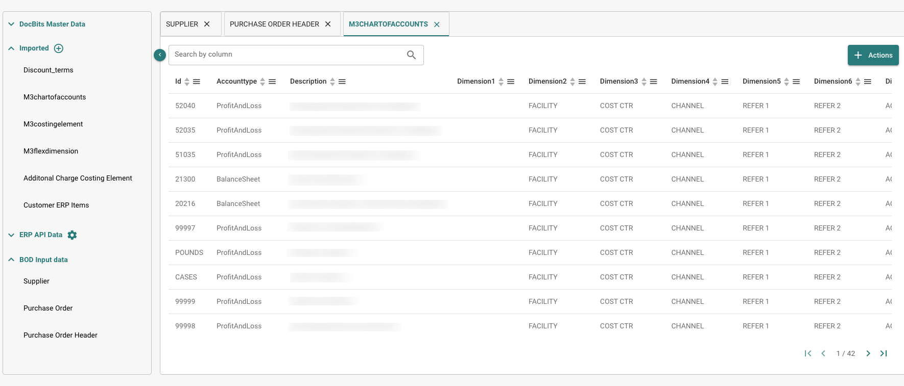<figcaption><p>Master Data</p></figcaption></figure>

#### Poboljšanja performansi

Implementiran robustan mehanizam keširanja za značajno povećanje performansi aplikacije, posebno pod velikim opterećenjem zahteva. Ovo poboljšanje smanjuje vreme obrade servera privremenim čuvanjem često korišćenih podataka, omogućavajući brže vreme odgovora i lakše korisničko iskustvo. Novi sistem keširanja efikasno upravlja povećanim saobraćajem, obezbeđujući pouzdane i skalabilne performanse čak i tokom perioda vršne upotrebe

#### Poboljšanje funkcije zaključavanja dokumenata

Nadograđena funkcionalnost zaključavanja dokumenata radi sprečavanja istovremenih izmena, obezbeđujući integritet podataka i minimizujući konflikte. Sada se dokumenti automatski zaključavaju tokom aktivnog uređivanja, pružajući korisnicima jasne indikatore kada je dokument u upotrebi i sprečavajući druge da vrše izmene dok se sesija uređivanja ne završi. Ovo poboljšanje pojednostavljuje kolaborativne radne tokove i smanjuje rizik od prepisivanja podataka.

#### Poboljšanja navigacije i korisničkog iskustva

* **Breadcrumb navigacija**: Dodati breadcrumb tragovi kroz stranice aplikacije radi poboljšanja navigacije, omogućavajući korisnicima da lako prate i vrate se na prethodne odeljke za intuitivnije iskustvo pregledanja.
* **Pojednostavljen korisnički interfejs**: Uklonjeno iskačuće obaveštenje „new version" radi kreiranja lakšeg, neprekinutog radnog toka, smanjujući ometanja i poboljšavajući ukupnu upotrebljivost.

### Ispravke grešaka:

* Rešeni problemi specifični za korisnike, kao što su neuspesi priloga iz šifrovanih ili potpisanih e-poruka.
* Ispravljeni problemi sa prikazom i tokom kartica.
* Ispravljeni problemi usmeravanja sa dugmadima Next/Previous.
* Rešene greške vezane za tabele stabla odlučivanja.
* Ažuriran korisnički interfejs za polje lozinke radi poboljšanja upotrebljivosti.
* Ispravljeni problemi sa brojačem zadataka koji se nije ispravno prikazivao.
* Ispravljen problem korisničkog interfejsa sa AI tabelom.
* Rešene greške sa ekstrakcijom dokumenata tokom obuke tabela.
* Dodato upozorenje kada se PO podudari tokom reformatiranja i obezbeđeno da se podudareni redovi uklone.
* Ispravljeno formatiranje datuma, obezbeđujući da se podaci ispravno učitavaju po filterima dana i nedelje, i obezbeđeno da se tipovi dokumenata pravilno prikazuju.
* Ispravljen prikaz dokumenata na dvostrukim monitorima.
* Ispravljen problem gde bi razdvajanje jedne PO stavke uklonilo sve stavke.
* Rešeni netačni prevodi širom aplikacije.
* Ispravljen problem gde su dugački opisi u rule management-u izazivali skrolovanje na listi.
* FeastVraćena nedostajuća funkcionalnost „Assign-To" za korisnike koji nisu administratori.

## Izdanje Harvest 9. septembar 2024.

#### Nove funkcije

### Rukovanje duplikatima faktura

Ova funkcija omogućava korisnicima da identifikuju da li su dokumenti duplirani u njihovom sistemu. Ova funkcija radi analizom polja dokumenta koja korisnik može da konfiguriše. Izborom određenih polja, korisnici mogu da prilagode kriterijume detekcije svojim potrebama, obezbeđujući da se označavaju samo relevantni duplikati. Ovo pomaže u održavanju integriteta podataka i smanjuje nered suvišnih dokumenata, pojednostavljujući procese upravljanja dokumentima.



### Stablo odlučivanja

Stablo odlučivanja je alat koji se koristi za automatizaciju donošenja odluka u radnom toku mapiranjem izbora i njihovih ishoda. Integracijom stabala odlučivanja, možete obezbediti dosledne odluke na osnovu specifičnih kriterijuma, pojednostaviti procese i smanjiti greške. Ovaj pristup poboljšava efikasnost automatizacijom složenih tačaka odlučivanja unutar radnog toka.



### Izbor AI modela

DocBits sada omogućava korisnicima da prelaze između različitih AI modela kako bi bolje odgovarali njihovim potrebama. Možete izabrati AI model koji najbolje odgovara vašem specifičnom slučaju upotrebe, bilo da je to za analizu dokumenata, ekstrakciju podataka ili klasifikaciju teksta. Ova fleksibilnost vam omogućava da optimizujete performanse i postignete tačnije rezultate, prilagođavajući mogućnosti AI-ja jedinstvenim zahtevima vaše organizacije.



### Izbor OCR verzije

DocBits sada nudi mogućnost promene OCR (Optical Character Recognition) verzije korišćene unutar platforme. Korisnici mogu da izaberu različite OCR verzije na osnovu svojih specifičnih potreba, obezbeđujući bolju tačnost i kompatibilnost sa različitim tipovima dokumenata. Ova funkcija omogućava precizniju ekstrakciju teksta iz slika i skeniranih dokumenata, poboljšavajući ukupan kvalitet podataka i efikasnost radnog toka.



## Izdanje Sunset 12. avgust 2024.

### Nove funkcije:

## Rule Manager

[rule-manager](../../administration-and-setup/settings/document-processing/rule-manager/ "mention") pruža fleksibilnost za kreiranje i uređivanje pravila za rešavanje konflikata prilagođenih DocBits sistemu fakturisanja. Ova pravila su dizajnirana da automatski rukuju neslaganjima između detalja fakture i podataka porudžbine (PO), obezbeđujući tačno finansijsko usaglašavanje. Sistem primenjuje ova pravila za obradu stavki faktura, troškova i poreza, i generiše odgovarajuća prilagođavanja ili napomene kada je to potrebno.

<figure>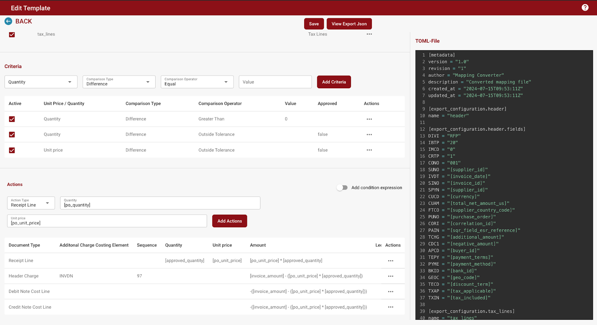<figcaption><p>Rule Manager</p></figcaption></figure>

### Sinhronizacija podataka pomoću Stream-a

BOD sinhronizacija iz Infor-a koristi AWS Stream za obradu podataka u realnom vremenu, poboljšavajući efikasnost i značajno smanjujući vreme sinhronizacije podataka.

### XRechnung

DocBits sada besprekorno obrađuje XRechnung (elektronske fakture) tako što prvo kreira PDF prilagođen korisniku, pojednostavljujući radni tok obrade faktura.

<figure>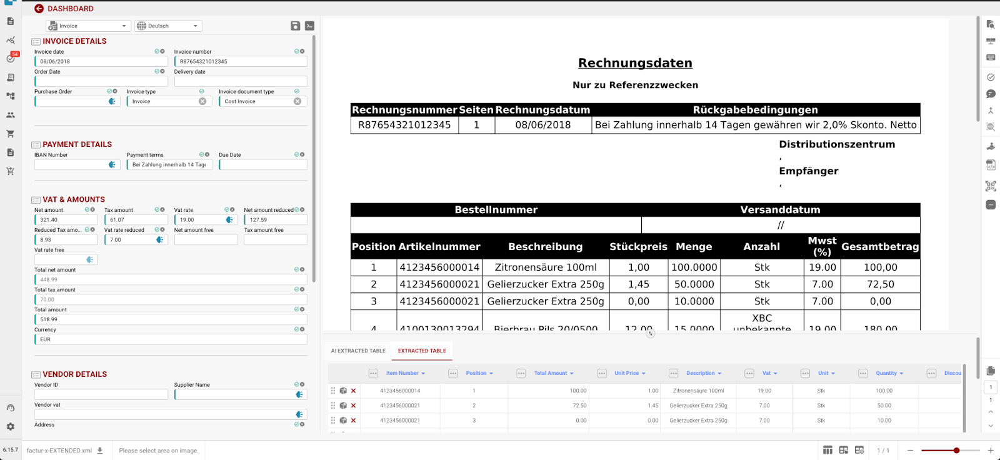<figcaption></figcaption></figure>

### Ispravke grešaka:

1. Vidljivost dugmeta PO Match\
   Problem: Dugme PO Match je dostupno kada nema tabele ili je tabela obrisana.\
   Status: Pri validaciji polja, PO Match će biti sakriveno ako nema tabele ili je tabela obrisana
2. Sortiranje tabele prevlačenjem i puštanjem\
   Problem: Prevlačenje i puštanje tabele za sortiranje na svim listama/kontrolnim tablama\
   Rešenje: Korisnik sada može da prevlači i pušta radi sortiranja tabele
3. Traka sa alatkama ekrana za validaciju\
   Problem: Ekran za validaciju: desna strana trake sa alatkama nije skrolabilna\
   Rešenje: Ispravljeno
4. Horizontalno skrolovanje\
   Problem: Horizontalno skrolovanje na ekranu za odobravanje\
   Rešenje: Ispravljeno
5. Brisanje odluke na ekranu za odobravanje\
   Problem: Mogućnost brisanja odluke odobri/odbij na ekranu za odobravanje\
   Rešenje: Ispravljeno
6. Prikaz zadataka na ekranu za odobravanje\
   Problem: Zadatak prikazan na ekranu za odobravanje\
   Rešenje: Dostupna je traka sa alatkama koja prikazuje broj zadataka otvorenih/u toku
7. Veličina tabele PO Match\
   Problem: Tabela PO Match postaje manja nakon podudaranja stavke\
   Rešenje: Ispravljeno
8. Dodela zadataka na osnovu grupe nabavke artikla\
   Problem: Prevod za dodelu grupe nabavke\
   Rešenje: Ispravljeno
9. Ime i Id dobavljača u kreiranju zadatka\
   Problem: Dodavanje imena i Id-a dobavljača u kreiranje zadatka\
   Rešenje: Ime i Id dobavljača će biti preuzeti iz dokumenta
10. Kopiranje podtipa dokumenta\
    Problem: Klik na Copy Document Subtype iz podešavanja podtipa dokumenta nije radio\
    Rešenje: Ispravljeno
11. Polje New Label\
    Problem: Novo polje Label u list of values za dodavanje oznake zajedno sa vrednošću i sinonimom\
    Rešenje: Ispravljeno
12. Kartica Country Origin u radnom toku\
    Problem: Nova kartica u radnom toku koja proverava zemlju porekla dobavljača i kreira zadatak ili nastavlja obradu dokumenta u skladu s tim\
    Rešenje: Ispravljeno
13. Ispravka tamnog režima na traci za pretragu podešavanja\
    Problem: Ovaj problem je ranije identifikovan\
    Rešenje: Ispravljeno
14. Indikator vidljivosti kolone ekstrahovane tabele\
    Problem: Indikator ako su kolone skrivene u ekstrahovanoj tabeli pri validaciji polja\
    Rešenje: Ispravljeno
15. Dodela na kontrolnoj tabli za administratore\
    Problem: Učiniti Assign to na kontrolnoj tabli samo za administratore\
    Rešenje: Ispravljeno
16. Vidljivost razdvajanja dokumenta\
    Problem: Prikazati Document split samo kada ima više stranica\
    Rešenje: Ispravljeno
17. Kolone kontrolne table faktura\
    Problem: Dodatne kolone na kontrolnoj tabli faktura\
    Rešenje: Ispravljeno
18. Deaktivacija skripte pri validaciji polja\
    Problem: Field Validation- Deaktiviranje skripte nije radilo ispravno\
    Rešenje: Ispravljeno
19. Prilagođavanje dugmeta u rasporedu za odobravanje\
    Problem: Nije moguće promeniti tip i stil dugmeta u Layout Builder-u za odobravanje\
    Rešenje: Ispravljeno
20. Tabela Data Sync\
    Problem: Tabela Data Sync u podešavanjima\
    Rešenje: Ispravljeno
21. Prikaz ukupnog broja u analitici kontrolne table\
    Problem: Dashboard Analytics- prikazuje pogrešan ukupan broj\
    Rešenje: Ispravljeno

## Izdanje Firework Juli 8th, 2024

### Nove funkcije

**Izvoz troškova stavki u M3**

• Izvezite troškove stavki u M3 sa odgovarajućim elementima troškova prema vašim poslovnim potrebama.

**Rukovanje neslaganjima PO i fakture**

• Pametno rukovanje neslaganjima u količini, cenama, troškovima i porezu.

### Ključne ispravke grešaka:

#### 1. Funkcija pretrage PO

• Problem: Pretraga PO nije radila.

• Status: Ovaj problem je identifikovan i neće biti rešen u ovom izdanju.

#### 2. Veza PO podudaranja

• Problem: Veza PO podudaranja se nije uklanjala kako je očekivano.

• Rešenje: Ispravljeno kako bi se obezbedile besprekorne operacije PO podudaranja.

#### 3. Upozorenja za izvezene dokumente

• Problem: Izvezeni dokumenti su imali upozorenja za elemente troškova čak i kada sistem nije bio podešen za to.

• Rešenje: Ispravljeno radi sprečavanja nepotrebnih upozorenja, obezbeđujući tačne izvoze dokumenata.

#### 4. Prikaz EDI za Advance Shipment

• Problem: Prikaz EDI za Advance shipment je prikazivao ID-jeve u naslovu.

• Rešenje: Naslovi se sada ispravno prikazuju, poboljšavajući čitljivost podataka.

#### 5. Greške u obračunu u problemu Split by Total

• Problem: Greške u obračunu su se javljale kada su stavke dalje deljene.

• Rešenje: Ispravljeno kako bi se obezbedili tačni obračuni u svim scenarijima.

#### 6. Prikaz tabele na ekranu PO

• Problem: Nijedna tabela se nije prikazivala na ekranu PO.

• Rešenje: Problem prikaza rešen kako bi se obezbedilo da se tabele ispravno pojavljuju.

#### 7. Automatski izvoz pri potvrdi porudžbine

• Problem: Automatski izvoz nije radio.

• Rešenje: Funkcionalnost vraćena kako bi se obezbedilo nesmetano funkcionisanje automatskih izvoza.

#### 8. Problem neslaganja na PO

• Problem: Problem neslaganja na PO se prikazivao iako je sve bilo identično na otpremnici.

• Rešenje: Rešeno kako bi se obezbedila tačna detekcija neslaganja.

#### 9. Problemi sa preuzimanjem izveštaja

• Problem: Izveštaji se nisu preuzimali.

• Rešenje: Ispravljeno kako bi se omogućila besprekorna preuzimanja izveštaja.

#### 10. Netačni ukupni i neto iznosi

• Problem: Ukupni i neto iznosi su prikazivali netačne vrednosti.

• Rešenje: Vrednosti ispravljene kako bi se obezbedila finansijska tačnost.

#### 11. Format datuma fakture na kontrolnoj tabli

• Problem: Kolona Invoice Date je imala pogrešne vrednosti formata.

• Rešenje: Datumi se sada prikazuju u ispravnom formatu, poboljšavajući upotrebljivost.

#### 12. Kašnjenja radnog toka na „Ready for Validation"

• Problem: Kašnjenja radnog toka su se javljala na „Ready for Validation" do povratne informacije od Doc2flow.

• Rešenje: Vreme radnog toka poboljšano za brže procese validacije.

## Sledeće izdanje Firework Juli 8th, 2024

### Problem:

Postojećem sistemu nedostaju automatizovana pravila za tačno podudaranje i obradu troškova faktura u odnosu na porudžbine (PO). Ovaj ručni proces može dovesti do neslaganja, kao što je ilustrovano na snimcima ekrana, gde troškovi faktura i PO zahtevaju usaglašavanje za ispravno fakturisanje.

<div><figure><figcaption></figcaption></figure> <figure><figcaption><p>Rule Manager DocBits</p></figcaption></figure></div>

### Rešenje:

Sa novim Rule Manager-om u DocBits-u, koji se pokreće u julu, možete automatizovati ovaj proces:

#### 1. Kreiranje pravila:

Definišite kriterijume (npr. Quantity > PO Quantity) za stavke fakture.

#### 2. Postavljanje akcija:

Mapirajte polja i akcije za besprekoran izvoz podataka u Infor.

#### 3. Testiranje pravila:

Validirajte pravila sa uzorkom podataka radi obezbeđivanja tačnosti.

## Junebug beleške o izdanju - 10. jun 2024.

Ovo ažuriranje donosi uzbudljive nove funkcije i ispravke grešaka za Junebug:

**Nove funkcije:**

* **Automatska ekstrakcija troškova:** Junebug sada automatski ekstrahuje i mapira troškove unutar vaših Docbit dokumenata. Ovo eliminiše ručni unos podataka i pojednostavljuje vaš radni tok.
* **Portal izvoz u Infor IDM:** Novi Portal vam omogućava da bez napora izvezete dokumente dobavljača direktno u Infor IDM. Ovo pojednostavljuje obradu isporuka i smanjuje ručnu intervenciju.
* **Identifikacija porekla (AI):** Junebug uvodi moćnu AI funkciju koja automatski uči poreklo dokumenata. Ovo vam štedi vreme i napor u klasifikaciji dokumenata.
*

```
<div><figure>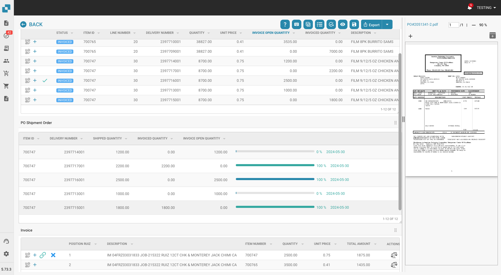<figcaption></figcaption></figure> <figure>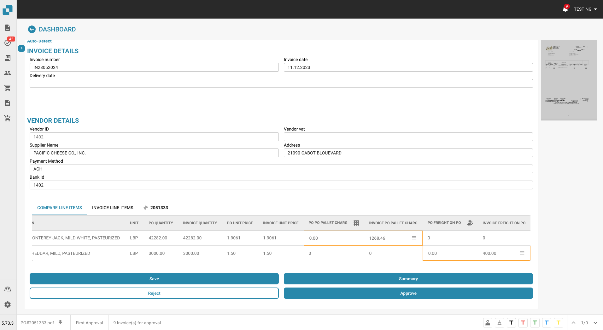<figcaption></figcaption></figure> <figure>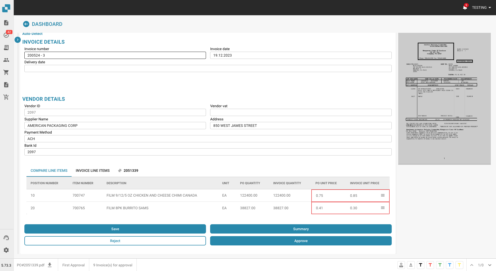<figcaption></figcaption></figure></div>
```

**Ispravke grešaka:**

* **Ispravka QR koda:** Problem koji je ranije izazivao probleme sa obradom QR koda je rešen.
* **Rukovanje ne-EDI dokumentima:** Junebug sada efikasnije rukuje ne-EDI dokumentima.

<figure>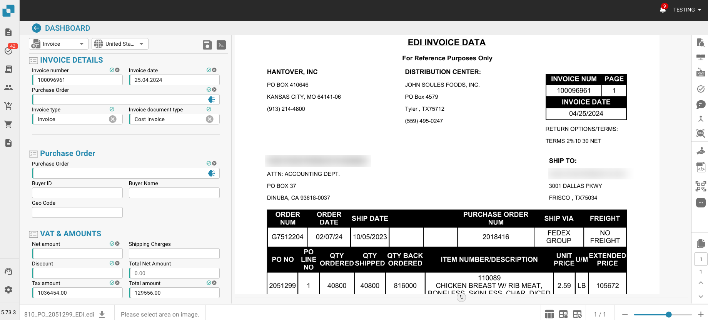<figcaption></figcaption></figure>

Hotfix - 5 Juni [**Priority System**](../../end-user-and-partner-section/end-user-section/our-document-priority-system.md)

## Sledeće izdanje - Junebug izdanje 10. jun 2024.

Sandbox Freeze - 3th June 2024

<figure><figcaption></figcaption></figure>

U predstojećem izdanju biće uvedeno značajno poboljšanje mogućnosti klasifikacije i ekstrakcije, posebno usmereno na stavke tabela unutar dokumenata. Ova nova funkcija omogućava korisnicima da definišu da li stavka u tabeli predstavlja trošak. Ova funkcionalnost je posebno korisna u detaljnim finansijskim dokumentima, kao što su fakture, gde je razlikovanje između različitih tipova transakcija — kao što su troškovi, porezi ili naknade — ključno za tačnu obradu i vođenje evidencije.

**Ključne tačke za beleške o izdanju:**

* **Poboljšana klasifikacija stavki tabele**: Korisnici sada mogu da odrede da li je određena stavka u tabeli dokumenta trošak, poboljšavajući tačnost i granularnost ekstrakcije podataka.

## Maypole izdanje 5.55.8.10 - ( 17. maj )

### Beleške o izdanju - Web App

#### Nove funkcije:

▪ Prevod kartica radnog toka: Poboljšanja u radnom toku, uključujući prevod kartica za bolju podršku lokalizaciji.

▪ Beleženje uvoza e-pošte: Dodato detaljno beleženje za uvoze e-pošte radi poboljšanja otklanjanja problema i praćenja.

▪ Ispravka pokvarenog fuzzy ekrana: Rešen problem sa pokvarenim prikazom fuzzy ekrana kroz različite interfejse.

▪ Ažuriranja računovodstva: Poboljšan proces računovodstva uklanjanjem zastarelih računovodstvenih metoda i efikasnijom integracijom troškova.

#### Poboljšanja:

▪ Poboljšanja Ruiz radnog toka: Ispravljene greške vezane za navigaciju radnog toka, posebno one koje uključuju skrivene korake.

▪ Prilagođavanja korisničkog interfejsa: Poboljšani elementi korisničkog interfejsa kao što su uslovi kasa-skonto pod uslovima plaćanja radi bolje jasnoće i korisničkog iskustva.

▪ Poboljšanja performansi: Različita pozadinska poboljšanja radi poboljšanja performansi i stabilnosti sistema.

#### Ispravke grešaka:

▪ Problem sa pečatom odobravanja: Ispravljeni kritični problemi oko procesa pečata odobravanja radi obezbeđivanja usklađenosti i ispravne funkcionalnosti.

▪ Dodavanje ključa: Dodati potrebni ključevi nazad u sistem radi obezbeđivanja integriteta podataka i funkcionalnosti sistema.

▪ Prilagođavanje polja matičnih podataka: Rešen problem u polju matičnih podataka radi usklađivanja sa zahtevima korisnika.

#### Tehnički:

▪ Ažuriranja verzija: Rutinska ažuriranja različitih komponenti sistema radi usklađivanja sa trenutnim standardima i tehnologijama.

▪ Aktivnosti spajanja: Brojna spajanja radi integracije funkcija, ispravki i poboljšanja iz više razvojnih grana u glavnu granu.

### Šta je novo - API

▪ Poboljšanja upravljanja kešom: Ažuriran get\_receive\_delivery\_cache radi poboljšanja performansi i pouzdanosti.

▪ Nove funkcije za prodajne naloge: Uvedena funkcija pregleda za prodajne naloge, poboljšavajući vizuelizaciju i upravljanje podacima naloga.

▪ Poboljšanja rukovanja dokumentima: Dodati automatizovani testni zadaci za demotesting i sandbox okruženja radi obezbeđivanja robustnosti.

▪ Poboljšana funkcionalnost keša: Dodat field\_id radi daljeg poboljšanja mehanizama keširanja.

#### Ispravke i poboljšanja

▪ Prilagođavanja Office uvoza e-pošte: Napravljena potrebna prilagođavanja funkciji Office Email Import radi poboljšanja funkcionalnosti.

▪ Razvojna poboljšanja: Više spajanja iz dev u main grane obezbeđujući sinhronizaciju i stabilnost kroz okruženja.

#### Razno

▪ Ažuriranja konfiguracije: Različita ažuriranja konfiguracionih datoteka radi poboljšanja postavke sistema i parametara.

### Beleške o izdanju - Radni tok

#### Poboljšanja:

▪ Implementiran novi test radnog toka koji sada može biti omogućen tokom uvoza, omogućavajući fleksibilnije scenarije testiranja.

▪ Poboljšana funkcionalnost beleženja za action kartice, čineći otklanjanje grešaka i praćenje efikasnijim.

▪ Poboljšana kompatibilnost za kartice poređenja polja sa tipovima datuma i enum, obezbeđujući lakša poređenja i validacije.

▪ Ažurirana tax kartica i modifikovani procesi vraćanja za action kartice radi pojednostavljenja operacija.

#### Ispravke:

▪ Rešeni problemi sa ažuriranjima statusa dokumenta, obezbeđujući da se tačno odražavaju u sistemu.

▪ Ispravljen obračun za karticu poređenja koja uključuje jediničnu cenu i količinu radi ispravnog rukovanja neslaganjima.

▪ Rešeno više manjih grešaka i napravljena poboljšanja stabilnosti.

#### Operativne izmene:

▪ Spojeno više razvojnih faza u sandbox i stage grane, odražavajući značajnu integraciju novih funkcija i ispravki.
