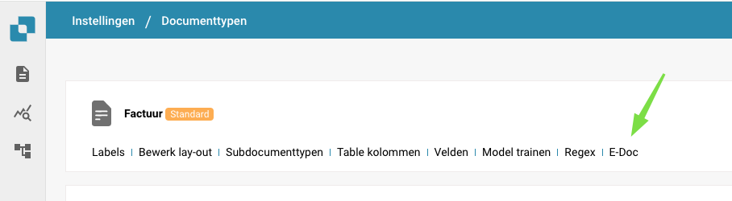

# Registro degli Import

Se desideri visualizzare un registro dettagliato di tutti i documenti importati nel tuo ambiente DocBits, segui questi passaggi.

Dal tuo Dashboard DocBits, seleziona l'opzione Impostazioni Avanzate.

<figure><figcaption></figcaption></figure>

Dopo che compare la barra Impostazioni Avanzate, seleziona il pulsante Registro Importazioni.

<figure><figcaption></figcaption></figure>

Verrà quindi visualizzata una tabella con tutti i documenti importati di recente e altre informazioni rilevanti su di essi.

<figure><figcaption></figcaption></figure>
