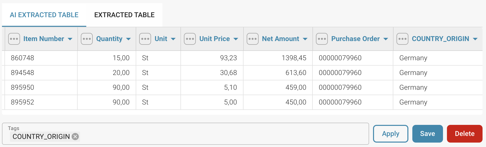

# Tagowanie tabeli AI

### Instrukcje krok po kroku, jak dodać tagi do tabeli:

**Krok 1:** Wybierz nazwy kolumn (tagi)

* **Wybierz nazwy kolumn:** Przejrzyj nazwy kolumn w swojej tabeli i zdecyduj, które tagi dodać.

<figure><figcaption></figcaption></figure>

**Krok 2:** Naciśnij przycisk "Zastosuj"

* **Naciśnij przycisk:** Po wybraniu odpowiedniego tagu dla kolumny, naciśnij przycisk "Zastosuj" obok wybranej kolumny i tagu.

**Krok 3:** Dodaj tag do tabeli

* **Dodaj tag:** Wybrany tag zostanie dodany do tabeli jako dodatkowa kolumna obok odpowiedniej kolumny.

<figure><figcaption></figcaption></figure>

**Krok 4:** Zapisz lub usuń tag

* **Zapisz tag:** Naciśnij przycisk Zapisz, aby zapisać wybrany tag
* **Usuń tag:** Aby usunąć wybrany tag, naciśnij przycisk Usuń

### Oto szczegółowe wyjaśnienie każdej kolumny i możliwych tagów:

<figure><figcaption></figcaption></figure>

### **Pozycja:**

**Opis:** Pozycja lub kolejność przedmiotu w zamówieniu.

**Tag:** Liczba całkowita

**Przykład:** 1, 2, 3...

### **Opis:**

**Opis:** Krótki opis przedmiotu.

**Tag:** Tekst

**Przykład:** Śruba, Nakrętka, Widget...

### Zamówienie zakupu:

**Opis:** Numer powiązanego zamówienia.

**Tag:** Alfanumeryczny

**Przykład:** PO12345, PO98765...

### Ilość:

**Opis:** Liczba zamówionych jednostek.

**Tag:** Liczba

**Przykład:** 100, 50, 200...

### Jednostka:

**Opis:** Jednostka miary (np. sztuka, kilogram).

**Tag:** Tekst

**Przykład:** Szt., kg, l...

### Cena jednostkowa:

**Opis:** Cena za jednostkę przedmiotu.

**Tag:** Waluta

**Przykład:** €10.00, €5.50, €100.00...

### Kwota netto:

**Opis:** Całkowita cena przed odliczeniami i podatkami (obliczana jako ilość \* cena jednostkowa).

**Tag:** Waluta

**Przykład:** €1,000.00, €275.00, €10,000.00...

### Rabat:

**Opis:** Kwota rabatu stosowana do kwoty netto.

**Tag:** Waluta

**Przykład:** €50.00, €20.00, €500.00...

### Procent rabatu:

**Opis:** Procent rabatu stosowany do kwoty netto.

**Tag:** Procent

**Przykład:** 5%, 10%, 15%...

### VAT:

**Opis:** Kwota VAT stosowana do przedmiotu.

**Tag:** Waluta

**Przykład:** €200.00, €55.00, €1,900.00...

### Kwota całkowita:

**Opis**: Ostateczna kwota po odliczeniu rabatu i dodaniu VAT.

**Tag:** Waluta

**Przykład:** €1,150.00, €310.00, €11,400.00...

### Kraj pochodzenia:

**Opis:** Kraj, w którym przedmiot został wyprodukowany lub wysłany.

**Tag:** Tekst

**Przykład:** USA, Niemcy, Chiny...

### Numer przedmiotu:

**Opis:** Unikalny identyfikator lub SKU dla przedmiotu.

**Tag:** Alfanumeryczny

**Przykład:** 987654, A12345, Z98765...

### Numer dokumentu dostawy:

**Opis:** Numer powiązanego dokumentu dostawy.

**Tag:** Alfanumeryczny

**Przykład:** DN56789, DN12345...

### Zdanie (dodatkowe informacje):

**Opis:** Dodatkowe uwagi, kody lub istotne informacje.

**Tag:** Tekst

**Przykład:** Komentarz, Specyfikacja...

Dzięki tej strukturze i tagom tabela jest bardziej klarownie zdefiniowana, a informacje mogą być lepiej kategoryzowane i przetwarzane.
