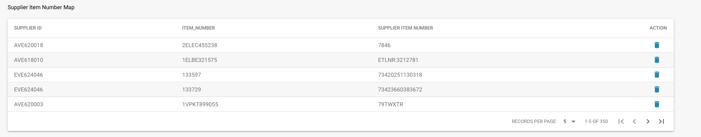

# Mapa de Número de Item do Fornecedor

## **Visão Geral**

Este recurso ajuda você a gerenciar e reconciliar números de itens entre seu sistema e seus fornecedores. Muitas vezes, os números de itens que você usa internamente podem não corresponder aos números de itens que seus fornecedores usam. O Docbits facilita o tratamento dessas discrepâncias criando um mapeamento entre seus números de itens e os de seus fornecedores.

<figure><figcaption></figcaption></figure>

## **Como Funciona**

1. **Correspondência Manual:**
   * A primeira vez que você encontrar uma discrepância entre seu número de item e o número de item do seu fornecedor, você precisará correspondê-los manualmente.
   * Você pode fazer isso inserindo o número de item do fornecedor correto correspondente ao seu número de item interno.
2. **Correspondência Automática:**
   * Uma vez que você tenha correspondido manualmente um número de item com o número de item do fornecedor, o Docbits memoriza esse mapeamento.
   * Na próxima vez que o mesmo item aparecer, o Docbits irá correspondê-lo automaticamente com base no mapeamento armazenado, economizando seu tempo e reduzindo erros.

## **Desmembramento da Interface**

* **ID do Fornecedor:** O identificador único para o fornecedor.
* **Número do Item:** Seu número de item interno para o produto.
* **Número do Item do Fornecedor:** O número de item correspondente usado pelo fornecedor.
* **Ação:** Opções para gerenciar os mapeamentos, como excluir mapeamentos incorretos.


Veja também a [Seção de Administração](../../admin-section/)


## **Benefícios**

* **Eficiência:** Reduz a necessidade de entrada manual repetida, tornando o processo mais rápido.
* **Precisão:** Minimiza erros garantindo que os números de itens sejam correspondidos corretamente.
* **Conveniência:** Simplifica o fluxo de trabalho automatizando o processo de correspondência após a entrada manual inicial.
