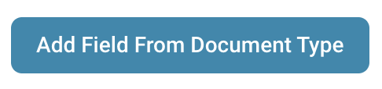
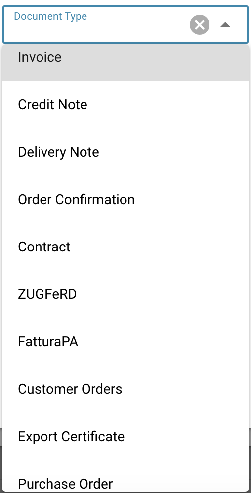

# Modifier les colonnes de document

Depuis le tableau de bord, cliquez sur l'icône Paramètres avancés comme indiqué ci-dessous:

<figure><figcaption></figcaption></figure>

Le menu suivant sera alors affiché:

Sélectionnez le bouton intitulé « Définir les colonnes du tableau de bord pour l'organisation » et une liste de tous les noms de colonnes sera affichée.

Depuis ce menu, vous pouvez sélectionner les noms de colonnes et utiliser les flèches pour ajouter et supprimer les colonnes souhaitées.

<figure><figcaption></figcaption></figure>

Vous pouvez définir l'ordre des colonnes en cliquant sur les points à côté du nom de la colonne et en les faisant glisser à la position appropriée.

Une autre option vous permet également d'ajouter des champs d'un type de document:

<figure><figcaption></figcaption></figure>

<figure><figcaption></figcaption></figure>

Ici, vous pouvez choisir parmi les différents types de documents:

<figure><figcaption></figcaption></figure>

Pour chaque type de document, il existe différents champs que vous pouvez ajouter:

<figure><figcaption></figcaption></figure>

Sélectionnez les champs dont vous avez besoin et cliquez sur "Ajouter aux colonnes visibles", ils apparaîtront alors dans les paramètres de colonne.

<figure><figcaption></figcaption></figure>
