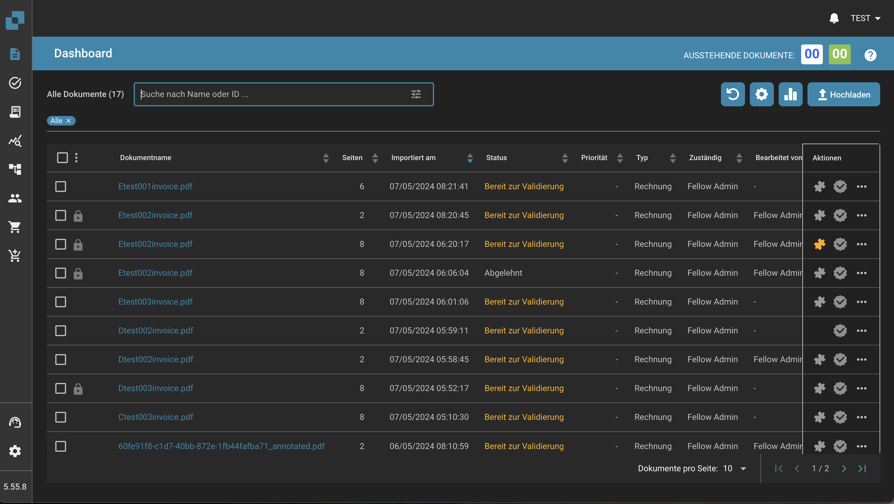

# Ferramentas do Painel

À direita da barra de pesquisa, você encontrará outras ferramentas do painel.

<figure><figcaption></figcaption></figure>

* Atualizar Lista: Isso é usado para atualizar o painel sem precisar atualizar a aba do seu navegador.
* Configurações Avançadas: Mais informações sobre este tópico estão disponíveis mais adiante nesta página.
* Análises: Isso fornece mais informações sobre os documentos que você carregou no DocBits.
* Carregar: Mais informações sobre este tópico na próxima seção.

<figure><figcaption></figcaption></figure>
