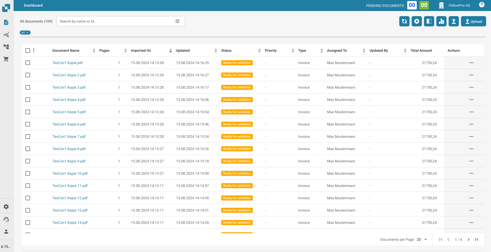
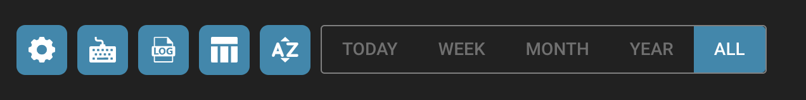

# Strumenti del Dashboard

Alla destra della barra di ricerca, troverai altri strumenti dashboard.

<figure><figcaption></figcaption></figure>

* Aggiorna Elenco: Questo viene utilizzato per aggiornare il dashboard senza dover aggiornare la scheda del browser.
* Impostazioni Avanzate: Ulteriori informazioni su questo argomento sono disponibili più avanti in questa pagina.
* Analisi: Questo ti fornisce ulteriori dettagli sui documenti che hai caricato su DocBits.
* Carica: Ulteriori informazioni su questo argomento nella sezione successiva.

<figure><figcaption></figcaption></figure>

Le impostazioni avanzate contengono spesso opzioni di configurazione e funzioni aggiuntive che consentono regolazioni e affinamenti più specifici.

<figure><figcaption></figcaption></figure>

* Maggiori impostazioni
* Scorciatoie da tastiera
* Importa registro
* Imposta colonne della tabella PO per organizzazione
* Imposta ordinamento della dashboard per organizzazione
* Filtra documenti per giorno, settimana, mese, anno o tutti. Il filtro si riferisce al momento in cui il documento viene importato

Nelle prossime pagine troverai ulteriori informazioni sulle singole impostazioni.

<figure><figcaption></figcaption></figure>
