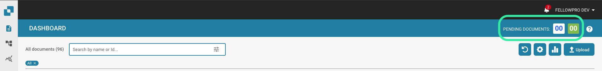
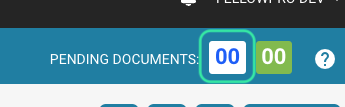
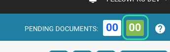

# Task Counter

The task counter is located in the upper-right corner of the Dashboard home page.

<figure><figcaption></figcaption></figure>

This is where you can see how many documents are in your queue for processing

<figure><figcaption></figcaption></figure>

and how many documents are now ready for validation.

<figure><figcaption></figcaption></figure>

