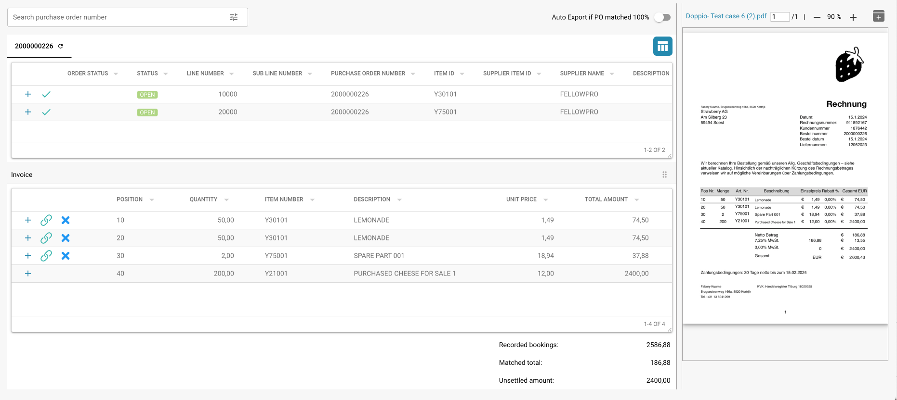

# Dopasowywanie Zamówień Zakupu

## Wprowadzenie

Ten dokument zawiera kompleksowy przewodnik dotyczący korzystania z systemu Dopasowywania Zamówień Zakupu w ramach platformy ERP. System Dopasowywania Zamówień Zakupu automatyzuje uzgadnianie zamówień zakupu z przychodzącymi fakturami, zapewniając, że transakcje finansowe są dokładne, a rozbieżności są szybko rozwiązywane.

## Pierwsze Kroki

Aby rozpocząć korzystanie z systemu Dopasowywania Zamówień Zakupu, upewnij się, że masz odpowiednie uprawnienia skonfigurowane przez administratora systemu. Będziesz potrzebować dostępu zarówno do danych zamówień zakupu, jak i odpowiadających im danych faktur w systemie.

## Wymagania Systemowe

* Dostęp do modułów zamówień zakupu i faktur w systemie ERP.
* Odpowiednie uprawnienia użytkownika do przeglądania i dopasowywania dokumentów finansowych.

## Kluczowe Funkcje

* **Automatyczne Wydobywanie Danych:** Automatycznie wydobywa i interpretuje dane z cyfrowych faktur.
* **Porównanie Danych:** Porównuje wydobyte dane faktury z istniejącymi danymi zamówienia zakupu.
* **Weryfikacja Dopasowania:** Weryfikuje dopasowania na podstawie zdefiniowanych reguł i tolerancji.
* **Raportowanie Rozbieżności:** Identyfikuje i raportuje wszelkie rozbieżności między fakturami a zamówieniami zakupu.
* **Ścieżka Audytu:** Utrzymuje log wszystkich działań dla zgodności i przeglądu.

<figure><figcaption></figcaption></figure>

## Interfejs Użytkownika

Interfejs systemu Dopasowywania Zamówień Zakupu zazwyczaj obejmuje następujące komponenty:

* **Pulpit nawigacyjny:** Przegląd statusu dopasowania i ostatnich działań.
* **Narzędzia wyszukiwania i filtrowania:** Możliwości wyszukiwania i filtrowania zamówień zakupu i faktur.
* **Dopasowane Rekordy:** Sekcja wyświetlająca pomyślnie dopasowane rekordy.
* **Rozbieżności:** Sekcja pokazująca rekordy z rozbieżnościami wymagającymi przeglądu lub działania.
* **Raporty:** Dostęp do szczegółowych raportów i opcji eksportu.

## Przewodnik Krok po Kroku dotyczący Korzystania z Dopasowywania Zamówień Zakupu

### 1. Dostęp do Modułu Dopasowywania Zamówień Zakupu

Przejdź do modułu Dopasowywania Zamówień Zakupu z głównego menu systemu ERP.

### 2. Import lub Dostęp do Faktur

* **Automatyczny Import:** Jeśli system jest skonfigurowany do automatycznego przechwytywania danych, faktury będą automatycznie importowane do systemu.
* **Ręczne Przesyłanie:** W razie potrzeby ręcznie przesyłaj pliki faktur do systemu za pomocą udostępnionego interfejsu.

### 3. Przegląd Automatycznie Dopasowanych Faktur

* Przeglądaj faktury, które zostały automatycznie dopasowane do zamówień zakupu.
* Zweryfikuj szczegóły dopasowania, w tym numery pozycji, ilości i ceny.

### 4. Obsługa Rozbieżności

* Przejdź do sekcji Rozbieżności, aby przejrzeć wszelkie faktury, które nie mogły zostać automatycznie dopasowane.
* Ręcznie dostosuj ilości lub ceny w razie potrzeby lub oznacz fakturę do dalszego przeglądu.

### 5. Ręczne Dopasowywanie

Dla faktur, które nie zostały automatycznie dopasowane:

* Użyj narzędzi wyszukiwania i filtrowania, aby znaleźć odpowiadające zamówienie zakupu.
* Ręcznie zweryfikuj i dopasuj fakturę do zamówienia zakupu.
