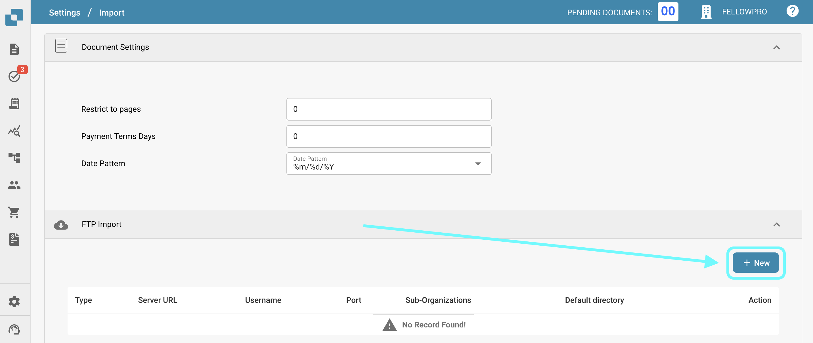

# FTP

If you would like to integrate your SFTP with DocBits in order to import documents.

Requirements

* Correctly configured, Linux compatible SFTP Server
* SFTP Hostname, Username and Password
* Dedicated Import folder

**Import Configuration**

From the Dashboard, open Settings and navigate to Import. Under FTP Import, select to add a new configuration.

<figure><figcaption></figcaption></figure>

Enter SFTP credentials in the given spaces and select save (The API Key field will automatically be filled with the API Key of the environment you are working on).

Once you have entered all the necessary details of your SFTP, click SAVE.
