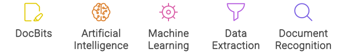

# Hauptmerkmale von DocBits

DocBits ist eine cloudbasierte Lösung zur Dokumentenerfassung, die die Leistung von Künstlicher Intelligenz (KI) und maschinellem Lernen (ML) nutzt, um Informationen aus verschiedenen Arten von Dokumenten unabhängig von ihrem Format effektiv zu erkennen, zu klassifizieren, zu analysieren und zu extrahieren. Hier sind die wichtigsten Merkmale im Detail:

<figure><figcaption></figcaption></figure>

* Dokumentenerkennung: DocBits verwendet KI-Algorithmen, um Dokumente genau zu identifizieren und zu erkennen, unabhängig davon, ob sie in Papierform oder als elektronische Dateien vorliegen.
* Dokumentenklassifizierung: Es klassifiziert Dokumente in relevante Kategorien, um eine einfache Organisation und Wiederherstellung zu ermöglichen.
* Datenextraktion: DocBits extrahiert wichtige Daten aus Dokumenten und wandelt unstrukturierte Informationen in strukturierte Daten um, die in Ihren Arbeitsablauf integriert werden können.
* Maschinelles Lernen: Das System lernt kontinuierlich dazu und verbessert seine Erkennungsgenauigkeit mit jedem verarbeiteten Dokument, was es im Laufe der Zeit effizienter macht.
* Schwarmintelligenz: DocBits nutzt Schwarmintelligenz, um seine Lernfähigkeiten zu verbessern und ein selbstverbesserndes System zu schaffen.
