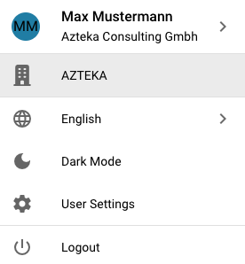

# Opcje Konfiguracji Użytkownika

Aby skonfigurować swoje ustawienia, kliknij ikonę Użytkownika znajdującą się w lewym dolnym rogu ekranu. Tutaj możesz dostosować kilka opcji:

<figure><figcaption></figcaption></figure>

<figure><figcaption></figcaption></figure>

**Język**

* **Wybierz Preferowany Język:** Wybierz swój preferowany język z dostępnych opcji.

**Tryb Ciemny**

* **Przełącz na Tryb Ciemny:** Włącz lub wyłącz Tryb Ciemny dla bardziej komfortowego doświadczenia podczas przeglądania.

**Ustawienia Użytkownika**

W tej sekcji możesz dostosować następujące preferencje:

* **Wzór Daty:** Dostosuj sposób wyświetlania dat.
* **Formatowanie Kwot:** Ustaw preferowany format dla wartości liczbowych.
* **Imię:** Zaktualizuj swoje imię.
* **Hasło:** Zmień swoje hasło dla bezpieczeństwa konta.
* **Rozmiar Czcionki:** Dostosuj rozmiar tekstu dla lepszej czytelności.
* **Tryb Podwójnego Monitora:** Włącz tę funkcję, jeśli używasz dwóch monitorów.

<figure><figcaption></figcaption></figure>

**Wyloguj się**

* **Wyloguj się:** Kliknij tutaj, aby bezpiecznie wylogować się ze swojego konta.
