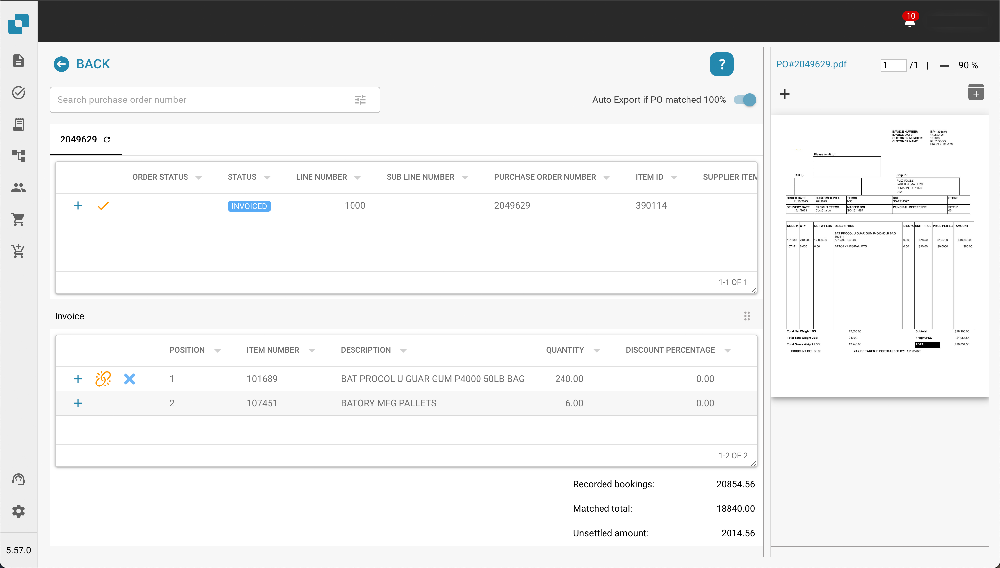

# Correspondência de Ordem de Compra

## Introdução

Este documento fornece um guia abrangente sobre como usar o sistema de Correspondência de Ordem de Compra dentro da sua plataforma ERP. O sistema de Correspondência de OC automatiza a reconciliação de ordens de compra com faturas recebidas, garantindo que as transações financeiras sejam precisas e que discrepâncias sejam tratadas prontamente.

## Começando

Para começar a usar o sistema de Correspondência de OC, certifique-se de que possui as permissões necessárias configuradas pelo seu administrador de sistema. Você precisará de acesso aos dados de ordens de compra e às faturas correspondentes dentro do sistema.

## Requisitos do Sistema

* Acesso aos módulos de ordem de compra e fatura dentro do sistema ERP.
* Permissões de usuário apropriadas para visualização e correspondência de documentos financeiros.

## Principais Recursos

* **Extração Automática de Dados:** Extrai e interpreta automaticamente dados de faturas digitais.
* **Comparação de Dados:** Compara os dados da fatura extraídos com os dados existentes da ordem de compra.
* **Verificação de Correspondência:** Verifica correspondências com base em regras e tolerâncias predefinidas.
* **Relatório de Discrepâncias:** Identifica e relata quaisquer discrepâncias entre faturas e ordens de compra.
* **Trilha de Auditoria:** Mantém um registro de todas as ações para conformidade e revisão.

<figure><figcaption></figcaption></figure>

## Interface do Usuário

A interface do sistema de Correspondência de OC geralmente inclui os seguintes componentes:

* **Painel:** Visão geral do status de correspondência e atividade recente.
* **Ferramentas de Busca e Filtro:** Capacidades para buscar e filtrar ordens de compra e faturas.
* **Registros Correspondentes:** Seção exibindo registros correspondentes com sucesso.
* **Discrepâncias:** Seção mostrando registros com discrepâncias que precisam de revisão ou ação.
* **Relatórios:** Acesso a relatórios detalhados e opções de exportação.

### Guia Passo a Passo para Usar a Correspondência de OC

#### 1. Acesse o Módulo de Correspondência de OC

Navegue até o módulo de Correspondência de OC no menu principal do seu sistema ERP.

#### 2. Importe ou Acesse Faturas

* **Importação Automática:** Se o seu sistema estiver configurado para captura automática de dados, as faturas serão importadas automaticamente para o sistema.
* **Upload Manual:** Se necessário, faça o upload manual de arquivos de fatura no sistema usando a interface fornecida.

#### 3. Revise Faturas Correspondentes Automaticamente

* Revise as faturas que foram correspondidas automaticamente com ordens de compra.
* Verifique os detalhes da correspondência, incluindo números de item, quantidades e preços.

#### 4. Lidar com Discrepâncias

* Acesse a seção de Discrepâncias para revisar quaisquer faturas que não puderam ser correspondidas automaticamente.
* Ajuste manualmente quantidades ou preços conforme necessário, ou sinalize a fatura para revisão adicional.

#### 5. Correspondência Manual

Para faturas não correspondidas automaticamente:

* Use as ferramentas de busca e filtro para encontrar a ordem de compra correspondente.
* Verifique e corresponda manualmente a fatura à ordem de compra.
