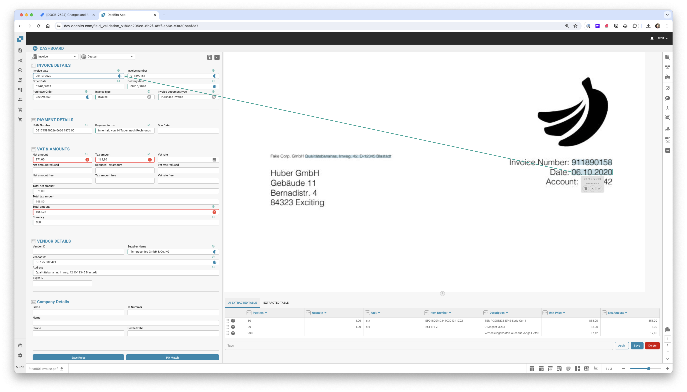
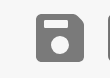
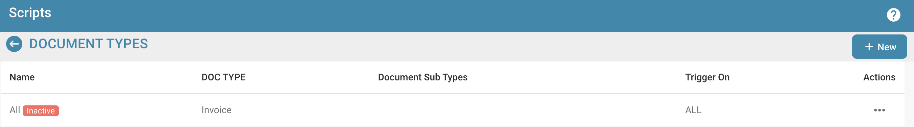
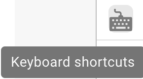
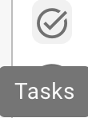

# Schermo di validazione



## Panoramica

<figure><figcaption></figcaption></figure>

### **Pulsante Salva:**

<figure><figcaption></figcaption></figure>

* **Pulsante Salva:**
  * **Scopo:** Salva lo stato attuale del documento o script su cui si sta lavorando.
  * **Caso d'uso:** Dopo aver apportato modifiche o annotazioni a un documento, utilizzare questo pulsante per assicurarsi che tutte le modifiche siano salvate.

### **Aggiungi regole speciali:**

<figure><figcaption></figcaption></figure>

<figure><figcaption></figcaption></figure>

* **Aggiungi Regole Speciali / Aggiungi Script in DocBits:**
  * **Scopo:** Consente agli utenti di implementare regole o script specifici che personalizzano il modo in cui i documenti vengono elaborati.
  * **Caso d'uso:** Utilizzare questa funzione per automatizzare attività come l'estrazione di dati o la convalida del formato, migliorando l'efficienza del flusso di lavoro.


Vedi qui aggiungi [Script in DocBits](../setup/scripting-in-docbits/)


### **Campi Fuzzy:**

<figure><figcaption></figcaption></figure>

* **Campi Fuzzy:**
  * **Scopo:** Aiuta a identificare e correggere i campi in cui i dati potrebbero non corrispondere perfettamente ma sono abbastanza vicini.
  * **Caso d'uso:** Utile nei processi di convalida dei dati in cui le corrispondenze esatte non sono sempre possibili, come nomi o indirizzi leggermente errati.

### **Campi obbligatori:**

<figure><figcaption></figcaption></figure>

Ci sono campi che sono richiesti per ulteriori modifiche, questi possono essere modificati nelle impostazioni.

Usa il suggerimento per scoprire se:

* È un campo obbligatorio (richiesto)
* Convalida richiesta
* Bassa fiducia
* Mismatch dell'importo totale delle tasse

**Campi Obbligatori:**

* **Scopo:** Identifica i campi obbligatori all'interno dei documenti che devono essere compilati o corretti prima di ulteriori elaborazioni.
* **Caso d'uso:** Garantisce che i dati essenziali siano catturati accuratamente, mantenendo l'integrità dei dati e la conformità con le regole aziendali.

<figure><figcaption></figcaption></figure>

### **Lente d'ingrandimento:**

<figure><figcaption></figcaption></figure>

* **Lente d'ingrandimento (Magnify Glass):**
  * **Scopo:** Fornisce una vista ingrandita di un'area selezionata del documento.
  * **Caso d'uso:** Aiuta a esaminare dettagli fini o testo piccolo nei documenti, garantendo accuratezza nell'inserimento o revisione dei dati.

<figure><figcaption></figcaption></figure>

### **Apri nuova finestra:**

<figure><figcaption></figcaption></figure>

* **Apri Nuova Finestra:**
  * **Scopo:** Apre una nuova finestra per il confronto affiancato dei documenti o il multitasking.
  * **Caso d'uso:** Utile quando si confrontano due documenti o si fa riferimento a informazioni aggiuntive senza lasciare il documento corrente.

### **Scorciatoie da tastiera:**

<figure><figcaption></figcaption></figure>

* **Scorciatoie da Tastiera:**
  * **Scopo:** Consente agli utenti di eseguire azioni rapidamente utilizzando combinazioni di tasti.
  * **Caso d'uso:** Migliora la velocità e l'efficienza nella navigazione e nell'elaborazione dei documenti riducendo al minimo la dipendenza dalla navigazione con il mouse.

<figure><figcaption></figcaption></figure>

### **Compiti:**

<figure><figcaption></figcaption></figure>

Per condividere informazioni interne, puoi creare compiti e assegnarli a un dipendente specifico o a un gruppo all'interno dell'azienda.

* **Compiti:**
  * **Scopo:** Consente agli utenti di creare compiti relativi ai documenti e assegnarli ai membri del team.
  * **Caso d'uso:** Facilita la collaborazione e la gestione dei compiti all'interno dei team, assicurando che tutti conoscano le loro responsabilità.

<figure><figcaption></figcaption></figure>

### **Modalità annotazione:**

<figure><figcaption></figcaption></figure>

<figure><figcaption></figcaption></figure>

Puoi lasciare annotazioni su un documento. Questo può essere utile per lasciare informazioni per altri utenti che modificheranno ulteriormente questo documento.

* **Modalità Annotazione:**
  * **Scopo:** Consente agli utenti di lasciare note o annotazioni direttamente sul documento.
  * **Caso d'uso:** Utile per fornire feedback, istruzioni o note importanti ad altri membri del team che lavoreranno sul documento in seguito.

### **Unisci:**

<figure><figcaption></figcaption></figure>

I documenti possono essere uniti qui, ad esempio se mancava una pagina di una fattura, queste pagine possono essere unite in seguito in questo modo senza dover eliminare o ricaricare l'intero documento.

* **Unisci Documenti:**
  * **Scopo:** Combina più documenti in un unico file.
  * **Caso d'uso:** Utile in scenari in cui parti di un documento sono scansionate separatamente e devono essere consolidate.

### **Vista OCR:**

<figure><figcaption></figcaption></figure>

Nella vista OCR, il testo viene automaticamente filtrato dal documento. Questo viene utilizzato per riconoscere caratteristiche rilevanti, come il codice postale, il numero di contratto, il numero di fattura e l'ordinamento di un documento.

* **Vista OCR:**
  * **Scopo:** Riconosce automaticamente il testo all'interno dei documenti utilizzando la tecnologia di riconoscimento ottico dei caratteri.
  * **Caso d'uso:** Semplifica il processo di digitalizzazione di testi stampati o scritti a mano, rendendoli ricercabili e modificabili.

<figure><figcaption></figcaption></figure>

### **Crea ticket:**

<figure><figcaption></figcaption></figure>

A differenza dei compiti che vengono trasmessi internamente all'interno dell'azienda, questo ticket di supporto è importante per notificarci e creare immediatamente un ticket in caso di errori e/o discrepanze. Questo rende il processo molto più semplice perché puoi inviare immediatamente il bug con il documento appropriato. C'è anche l'opzione di impostare la priorità, fare uno screenshot del documento o caricarne uno.

* **Crea Ticket:**
  * **Scopo:** Consente agli utenti di segnalare problemi o discrepanze creando un ticket di supporto.
  * **Caso d'uso:** Essenziale per la rapida risoluzione dei problemi e dei bug, aiutando a mantenere l'integrità e il corretto funzionamento del sistema.

<figure><figcaption></figcaption></figure>

### **Log script documento:**

<figure><figcaption></figcaption></figure>

Gli script possono essere creati nelle impostazioni sotto Tipi di Documento; queste informazioni verranno quindi visualizzate qui.

* **Log Script Documento:**
  * **Scopo:** Visualizza i log relativi agli script che sono stati implementati per diversi tipi di documenti.
  * **Caso d'uso:** Utile per tracciare e debugare le azioni degli script sui documenti, aiutando gli utenti a comprendere i processi automatizzati e correggere eventuali problemi.

<figure><figcaption></figcaption></figure>

### **Altre impostazioni:**

<figure><figcaption></figcaption></figure>

### **Dividi documento:**

* Qui puoi dividere il documento e tagliare o eliminare le pagine che non sono necessarie
* **Dividi Documento:**
  * **Scopo:** Consente agli utenti di dividere un documento in parti separate, rimuovendo o isolando le pagine che non sono necessarie.
  * **Caso d'uso:** Ideale quando si trattano documenti multipagina in cui solo alcune sezioni sono necessarie per l'elaborazione o la revisione.

### **Migliora documento:**

* Il documento verrà riavviato
* **Migliora Documento:**
  * **Scopo:** Reimposta il documento al suo stato iniziale per una nuova valutazione o ulteriori modifiche.
  * **Caso d'uso:** Utile quando è necessario annullare le modifiche iniziali o il documento deve essere aggiornato per un altro giro di modifiche. Qui abbiamo bisogno di una visione ML extra per migliorare la qualità del documento.

### **Flusso del documento:**

Lì troverai il flusso del documento

* **Scopo:** Mostra la sequenza e la progressione dell'elaborazione del documento all'interno del sistema.
* **Caso d'uso:** Aiuta a tracciare lo stato del documento attraverso diverse fasi, assicurando che tutti i passaggi di elaborazione necessari siano seguiti.

### **Vai al modello di layout:**

* Con questa opzione verrai reindirizzato e potrai modificare il tuo layout o utilizzare il modello predefinito
* **Vai al Modello di Layout:**
  * **Scopo:** Reindirizza gli utenti a un editor di layout dove possono modificare i modelli esistenti o applicarne uno predefinito.
  * **Caso d'uso:** Consente la personalizzazione dei layout dei documenti per soddisfare esigenze o preferenze aziendali specifiche, migliorando l'allineamento visivo e funzionale del documento con gli standard aziendali.
