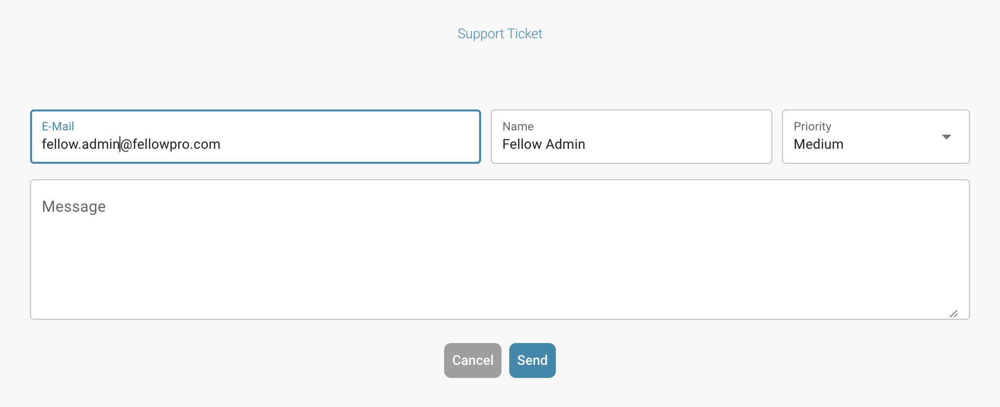
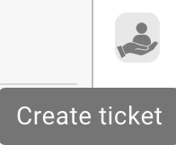
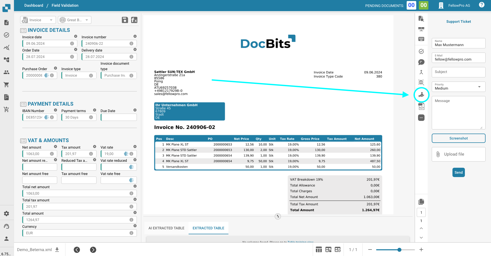

# Soporte para usuarios

### Soporte al Usuario 

Si enfrentas algún desafío o tienes consultas al usar DocBits, por favor consulta este manual del usuario o ponte en contacto con nuestro equipo de soporte para obtener ayuda. Nuestro compromiso radica en proporcionar una experiencia fluida para todos los usuarios. Simplemente haz clic en el botón de soporte en tu aplicación DocBits y podrás crear un ticket de soporte.

<figure><figcaption></figcaption></figure>

<figure><figcaption></figcaption></figure>

También puedes contactarnos a través de nuestra página de FELLOWPRO:



Dentro de la Pantalla de Validación puedes crear directamente un ticket e incluir una captura de pantalla del problema.

<figure><figcaption></figcaption></figure>

<figure><figcaption></figcaption></figure>
