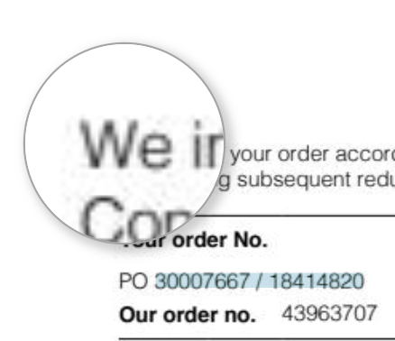
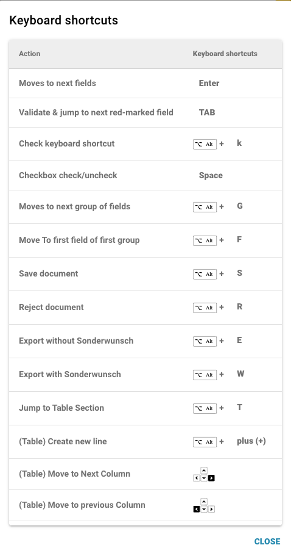
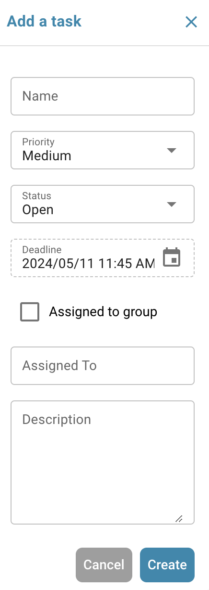
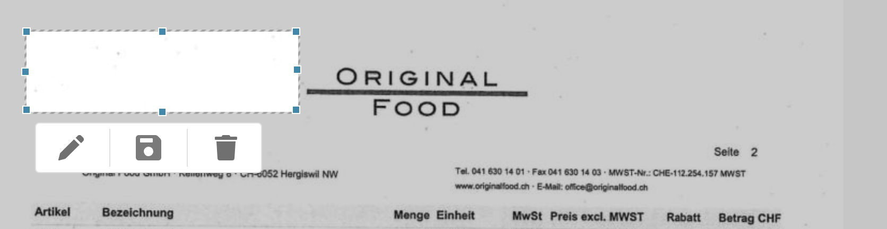

# Validierungsbildschirm


dfg


## Übersicht

<figure><figcaption></figcaption></figure>

### **Speichern-Button:**

<figure><figcaption></figcaption></figure>

* **Speichern-Button:**
  * **Zweck:** Speichert den aktuellen Zustand des Dokuments oder Skripts, an dem gearbeitet wird.
  * **Anwendungsfall:** Nach Änderungen oder Anmerkungen an einem Dokument verwenden Sie diesen Button, um sicherzustellen, dass alle Änderungen gespeichert werden.

### **Spezielle Regeln hinzufügen:**

<figure><figcaption></figcaption></figure>

<figure><figcaption></figcaption></figure>

* **Spezielle Regeln hinzufügen / Skript in DocBits hinzufügen:**
  * **Zweck:** Ermöglicht es Benutzern, spezifische Regeln oder Skripte zu implementieren, die anpassen, wie Dokumente verarbeitet werden.
  * **Anwendungsfall:** Verwenden Sie diese Funktion, um Aufgaben wie die Datenextraktion oder Formatvalidierung zu automatisieren und die Workflow-Effizienz zu steigern.


Siehe hier [Scripting in DocBits](../../setup/scripting-in-docbits/)


### **Unscharfe Felder:**

<figure><figcaption></figcaption></figure>

* **Unscharfe Felder:**
  * **Zweck:** Hilft bei der Identifizierung und Korrektur von Feldern, bei denen die Daten möglicherweise nicht perfekt übereinstimmen, aber nah genug sind.
  * **Anwendungsfall:** Nützlich in Datenvalidierungsprozessen, bei denen exakte Übereinstimmungen nicht immer möglich sind, wie z.B. leicht falsch geschriebene Namen oder Adressen.

### **Erforderliche Felder:**

<figure><figcaption></figcaption></figure>

Es gibt Felder, die für die weitere Bearbeitung erforderlich sind; diese können in den Einstellungen bearbeitet werden.

Verwenden Sie den Tooltip, um herauszufinden, ob:

* Ist es ein Pflichtfeld (erforderlich)
* Validierung erforderlich
* Geringes Vertrauen
* Volle Steuerbetragsabweichung

**Erforderliche Felder:**

* **Zweck:** Identifiziert Pflichtfelder innerhalb von Dokumenten, die ausgefüllt oder korrigiert werden müssen, bevor eine weitere Verarbeitung erfolgt.
* **Anwendungsfall:** Stellt sicher, dass wesentliche Daten genau erfasst werden, um die Datenintegrität und die Einhaltung von Geschäftsregeln zu gewährleisten.

### **Lupe:**

<figure><figcaption></figcaption></figure>

* **Lupe:**
  * **Zweck:** Bietet eine vergrößerte Ansicht eines ausgewählten Bereichs des Dokuments.
  * **Anwendungsfall:** Hilft beim Untersuchen feiner Details oder kleiner Texte in Dokumenten, um Genauigkeit bei der Dateneingabe oder -überprüfung zu gewährleisten.

<figure><figcaption></figcaption></figure>

### **Neues Fenster öffnen:**

<figure><figcaption></figcaption></figure>

* **Neues Fenster öffnen:**
  * **Zweck:** Öffnet ein neues Fenster für den Vergleich von Dokumenten nebeneinander oder für Multitasking.
  * **Anwendungsfall:** Nützlich beim Vergleich von zwei Dokumenten oder beim Nachschlagen zusätzlicher Informationen, ohne das aktuelle Dokument zu verlassen.

### **Tastenkombinationen:**

<figure><figcaption></figcaption></figure>

* **Tastenkombinationen:**
  * **Zweck:** Ermöglicht es Benutzern, Aktionen schnell mit Tastenkombinationen auszuführen.
  * **Anwendungsfall:** Erhöht die Geschwindigkeit und Effizienz bei der Dokumentennavigation und -verarbeitung, indem die Abhängigkeit von der Mausnavigation minimiert wird.

<figure><figcaption></figcaption></figure>

### **Aufgaben:**

<figure><figcaption></figcaption></figure>

Um interne Informationen zu teilen, können Sie Aufgaben erstellen und sie einem bestimmten Mitarbeiter oder einer Gruppe innerhalb des Unternehmens zuweisen.

* **Aufgaben:**
  * **Zweck:** Ermöglicht es Benutzern, auf Dokumente bezogene Aufgaben zu erstellen und sie Teammitgliedern zuzuweisen.
  * **Anwendungsfall:** Erleichtert die Zusammenarbeit und das Aufgabenmanagement innerhalb von Teams, sodass jeder seine Verantwortlichkeiten kennt.

<figure><figcaption></figcaption></figure>

### **Anmerkungsmodus:**

<figure><figcaption></figcaption></figure>

<figure><figcaption></figcaption></figure>

Sie können Anmerkungen zu einem Dokument hinterlassen. Dies kann hilfreich sein, um Informationen für andere Benutzer zu hinterlassen, die dieses Dokument weiter bearbeiten.

* **Anmerkungsmodus:**
  * **Zweck:** Ermöglicht es Benutzern, Notizen oder Anmerkungen direkt im Dokument zu hinterlassen.
  * **Anwendungsfall:** Nützlich, um Feedback, Anweisungen oder wichtige Notizen für andere Teammitglieder bereitzustellen, die später am Dokument arbeiten.

### **Zusammenführen:**

<figure><figcaption></figcaption></figure>

Dokumente können hier zusammengeführt werden, zum Beispiel wenn eine Seite einer Rechnung fehlte, können diese Seiten später auf diese Weise zusammengeführt werden, ohne dass das gesamte Dokument gelöscht oder erneut hochgeladen werden muss.

* **Dokumente zusammenführen:**
  * **Zweck:** Kombiniert mehrere Dokumente zu einer einzigen Datei.
  * **Anwendungsfall:** Praktisch in Szenarien, in denen Teile eines Dokuments separat gescannt wurden und konsolidiert werden müssen.

### **OCR-Ansicht:**

<figure><figcaption></figcaption></figure>

In der OCR-Ansicht wird der Text automatisch aus dem Dokument gefiltert. Dies wird verwendet, um relevante Merkmale zu erkennen, wie z.B. die Postleitzahl, Vertragsnummer, Rechnungsnummer und die Sortierung eines Dokuments.

* **OCR-Ansicht:**
  * **Zweck:** Erkennt automatisch Text innerhalb von Dokumenten mit Hilfe der optischen Zeichenerkennungstechnologie.
  * **Anwendungsfall:** Vereinfacht den Prozess der Digitalisierung von gedruckten oder handgeschriebenen Texten, sodass sie durchsuchbar und bearbeitbar werden.

<figure><figcaption></figcaption></figure>

### **Ticket erstellen:**

<figure><figcaption></figcaption></figure>

Im Gegensatz zu Aufgaben, die intern innerhalb des Unternehmens weitergegeben werden, ist dieses Support-Ticket wichtig, um uns zu benachrichtigen und sofort ein Ticket im Falle von Fehlern und/oder Unstimmigkeiten zu erstellen. Dies erleichtert den Prozess erheblich, da Sie den Fehler sofort mit dem entsprechenden Dokument senden können. Es gibt auch die Möglichkeit, die Priorität festzulegen, einen Screenshot des Dokuments zu machen oder einen hochzuladen.

* **Ticket erstellen:**
  * **Zweck:** Ermöglicht es Benutzern, Probleme oder Unstimmigkeiten zu melden, indem sie ein Support-Ticket erstellen.
  * **Anwendungsfall:** Wesentlich für die schnelle Lösung von Problemen und Fehlern, um die Integrität und das reibungslose Funktionieren des Systems zu gewährleisten.

<figure><figcaption></figcaption></figure>

### **Dokumentenskriptprotokolle:**

<figure><figcaption></figcaption></figure>

Skripte können in den Einstellungen unter Dokumenttypen erstellt werden; diese Informationen werden dann hier angezeigt.

* **Dokumentenskriptprotokolle:**
  * **Zweck:** Zeigt Protokolle zu Skripten an, die für verschiedene Dokumenttypen implementiert wurden.
  * **Anwendungsfall:** Nützlich zur Verfolgung und Fehlerbehebung von Skriptaktionen auf Dokumenten, um Benutzern zu helfen, die automatisierten Prozesse zu verstehen und eventuelle Probleme zu beheben.

<figure><figcaption></figcaption></figure>

### **Weitere Einstellungen:**

<figure><figcaption></figcaption></figure>

### **Dokument teilen:**

* Hier können Sie das Dokument teilen und Seiten, die nicht benötigt werden, ausschneiden oder löschen
* **Dokument teilen:**
  * **Zweck:** Ermöglicht es Benutzern, ein Dokument in separate Teile zu teilen und Seiten zu entfernen oder zu isolieren, die nicht benötigt werden.
  * **Anwendungsfall:** Ideal, wenn es sich um mehrseitige Dokumente handelt, bei denen nur bestimmte Abschnitte für die Verarbeitung oder Überprüfung erforderlich sind.

### **Dokument verbessern:**

* Das Dokument wird neu gestartet
* **Dokument verbessern:**
  * **Zweck:** Setzt das Dokument in seinen ursprünglichen Zustand zurück, um es neu zu bewerten oder weitere Änderungen vorzunehmen.
  * **Anwendungsfall:** Nützlich, wenn anfängliche Änderungen rückgängig gemacht werden müssen oder das Dokument für eine weitere Bearbeitungsrunde aktualisiert werden muss. Hier benötigen wir einige zusätzliche ML Vision, um die Dokumentqualität zu verbessern.

### **Dokumentenfluss:**

Dort finden Sie den Fluss des Dokuments

* **Zweck:** Zeigt die Sequenz und den Fortschritt der Dokumentenverarbeitung innerhalb des Systems.
* **Anwendungsfall:** Hilft bei der Verfolgung des Dokumentenstatus durch verschiedene Phasen, um sicherzustellen, dass alle notwendigen Verarbeitungsschritte eingehalten werden.

### **Zum Layout-Template gehen:**

* Mit dieser Option werden Sie weitergeleitet und können Ihr Layout bearbeiten oder das Standard-Template verwenden
* **Zum Layout-Template gehen:**
  * **Zweck:** Leitet Benutzer zu einem Layout-Editor weiter, in dem sie bestehende Templates bearbeiten oder ein Standard-Template anwenden können.
  * **Anwendungsfall:** Ermöglicht die Anpassung von Dokumentlayouts, um spezifische Geschäftsanforderungen oder Präferenzen zu erfüllen und die visuelle und funktionale Ausrichtung des Dokuments an Unternehmensstandards zu verbessern.
