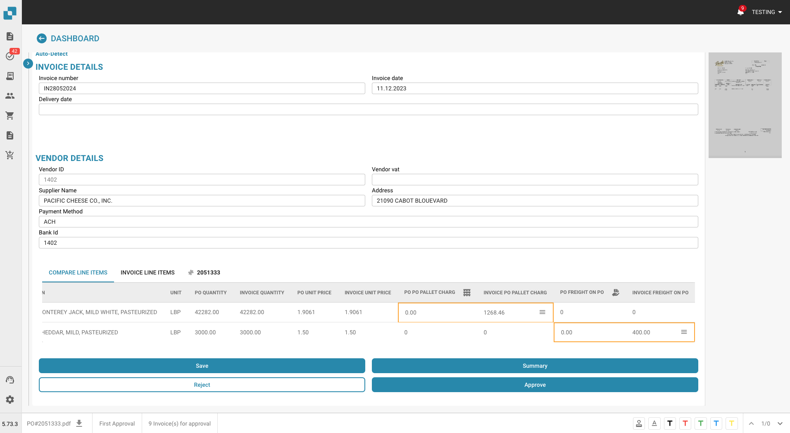
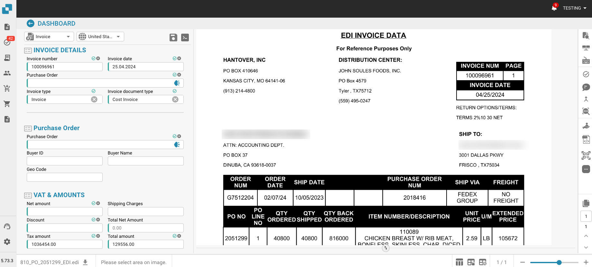

# Release

## Release Firework Juli 8th, 2024

### New Features

**Line Charges Export to M3**

• Export line charges to M3 with appropriate costing elements as per your business needs.

**PO & Invoice Discrepancy Handling**

• Smart handling of discrepancies in quantity, prices, charges, and tax.

### Key Bug Resolutions

#### 1. PO Search Functionality

• Issue: PO search was not working.&#x20;

• Status: This issue has been identified and will not be addressed in this release.

#### 2. PO Matching Connection

• Issue: PO matching connection was not removing as expected.

• Resolution: Fixed to ensure seamless PO matching operations.

#### 3. Exported Document Alerts

• Issue: Exported documents had alerts for costing elements even when the system was not set up for it.

• Resolution: Corrected to prevent unnecessary alerts, ensuring accurate document exports.

#### 4. Advance Shipment EDI View

• Issue: Advance shipment EDI view showed IDs in the title.

• Resolution: Titles now display correctly, improving data readability.

#### 5. Calculation Errors in Split by Total Issue

• Issue: Calculation errors occurred when lines were split further.

• Resolution: Fixed to ensure accurate calculations in all scenarios.

#### 6. PO Screen Table Display

• Issue: No table was showing on the PO screen.

• Resolution: Display issue resolved to ensure tables appear correctly.

#### 7. Auto Export on Order Confirmation

• Issue: Auto export was not working.

• Resolution: Functionality restored to ensure automatic exports operate smoothly.

#### 8. Mismatch Issue on PO

• Issue: Mismatch issue on PO showed despite everything being identical on the Delivery Note.

• Resolution: Resolved to ensure accurate mismatch detection.

#### 9. Report Download Issues

• Issue: Reports were not downloading.

• Resolution: Fixed to enable seamless report downloads.

#### 10. Incorrect Total and Net Amounts

• Issue: Total and Net amounts were showing incorrect values.

• Resolution: Values corrected to ensure financial accuracy.

#### 11. Invoice Date Format on Dashboard

• Issue: Invoice Date column had wrong format values.

• Resolution: Dates now display in the correct format, enhancing usability.

#### 12. Workflow Delays at “Ready for Validation”

• Issue: Workflow delays occurred at “Ready for Validation” until feedback from Doc2flow.

• Resolution: Workflow timing improved for faster validation processes.

## Next Release Firework Juli 8th, 2024

### Problem:

The existing system lacks automated rules for accurately matching and processing invoice charges against purchase orders (POs). This manual process can lead to discrepancies, as illustrated in the screenshots, where invoice charges and POs need reconciliation for correct invoicing.

<figure><figcaption></figcaption></figure>

 

<figure><figcaption>
Rule Manager DocBits
</figcaption></figure>

### Solution:

With the new Rule Manager in DocBits, launching in July, you can automate this process:

#### 1. Create Rules:

Define criteria (e.g., Quantity > PO Quantity) for invoice line items.

#### 2. Set Actions:

Map fields and actions to export data seamlessly to Infor.

#### 3. Test Rules:

Validate rules with sample data to ensure accuracy.

## Junebug Release Notes - June 10th, 2024

This update brings exciting new features and bug fixes to Junebug:

**New Features:**

* **Automated Charge Extraction:** Junebug now automatically extracts and maps charges within your Docbit documents. This eliminates manual data entry and streamlines your workflow.
* **Portal Export to Infor IDM:** The new Portal allows you to effortlessly export supplier documents directly to Infor IDM. This simplifies shipment processing and reduces manual intervention.
* **Origin Identification (AI):** Junebug introduces a powerful AI feature that automatically learns the origin of documents. This saves you time and effort in document classification.
*

    

    <figure><figcaption></figcaption></figure>

     

    <figure><figcaption></figcaption></figure>

     

    <figure><figcaption></figcaption></figure>

    

**Bug Fixes:**

* **QR Code Fix:** An issue that previously caused problems with QR code processing has been resolved.
* **Non-EDI Document Handling:** Junebug now handles non-EDI documents more effectively.

<figure><figcaption></figcaption></figure>

Hotfix - 5 Juni [**Priority System**](readme-1/our-document-priority-system.md)

## Next Release - Junebug Release 10th June 2024

Sandbox Freeze - 3th June 2024

<figure><figcaption></figcaption></figure>

In the upcoming release, a significant enhancement to the classification and extraction capabilities will be introduced, specifically aimed at table lines within documents. This new feature allows users to define whether a line in a table represents a charge. This functionality is particularly useful in detailed financial documents, such as invoices, where distinguishing between different types of transactions—such as charges, taxes, or fees—is crucial for accurate processing and record-keeping.

**Key Points for Release Notes:**

* **Enhanced Table Line Classification**: Users can now specify if a particular line in a document table is a charge, improving the accuracy and granularity of data extraction.

## Maypole Release 5.55.8.10 - ( 17th May )

### Release Notes - Web App

#### New Features:

▪ Workflow Card Translation: Enhancements in the workflow, including card translation for better localization support.

▪ Email Import Logging: Added detailed logging for email imports to enhance troubleshooting and monitoring.

▪ Broken Fuzzy Screen Fix: Resolved an issue with broken fuzzy screen display across various interfaces.

▪ Accounting Updates: Enhanced the accounting process by removing outdated accounting methods and integrating charges more efficiently.

#### Improvements:

▪ Ruiz Workflow Enhancements: Fixed bugs related to workflow navigation, particularly involving hidden steps.

▪ User Interface Adjustments: Improved user interface elements such as cash discount terms under payment terms for better clarity and user experience.

▪ Performance Enhancements: Various backend improvements to enhance system performance and stability.

#### Bug Fixes:

▪ Approval Stamp Issue: Fixed critical issues surrounding the approval stamp process to ensure compliance and correct functionality.

▪ Key Addition: Added necessary keys back to the system to ensure data integrity and system functionality.

▪ Master Data Field Adjustment: Addressed an issue in the master data field to align with user requirements.

#### Technical:

▪ Version Updates: Routine updates to various system components to align with current standards and technologies.

▪ Merge Activities: Numerous merges to integrate features, fixes, and enhancements from multiple development branches into the main branch.

### What's New - API

▪ Cache Management Enhancements: Updated the get\_receive\_delivery\_cache to improve performance and reliability.

▪ New Features for Sales Orders: Introduced a preview feature for sales orders, enhancing the visualization and management of order data.

▪ Document Handling Improvements: Added automated test jobs for demotesting and sandbox environments to ensure robustness.

▪ Enhanced Cache Functionality: Added field\_id to further enhance the caching mechanisms.

#### Fixes and Improvements

▪ Office Email Import Adjustments: Made necessary adjustments to the Office Email Import feature to enhance functionality.

▪ Development Enhancements: Multiple merges from dev to main branches ensuring synchronization and stability across environments.

#### Miscellaneous

▪ Configuration Updates: Various updates to the configuration files improving the system setup and parameters.

### Release Notes - Workflow

#### Enhancements:

▪ Implemented a new workflow test that can now be enabled during import, allowing for more flexible testing scenarios.

▪ Enhanced the logging functionality for action cards, making debugging and monitoring more efficient.

▪ Improved compatibility for field comparison cards with date and enum types, ensuring smoother comparisons and validations.

▪ Updated the tax card and modified the return processes for action cards to streamline operations.

#### Fixes:

▪ Addressed issues with the document status updates, ensuring they are accurately reflected in the system.

▪ Fixed the calculation for the comparison card involving unit price and quantity to correctly handle discrepancies.

▪ Resolved multiple minor bugs and made stability improvements.

#### Operational Changes:

▪ Merged multiple development stages into the sandbox and stage branches, reflecting a significant integration of new features and fixes.
