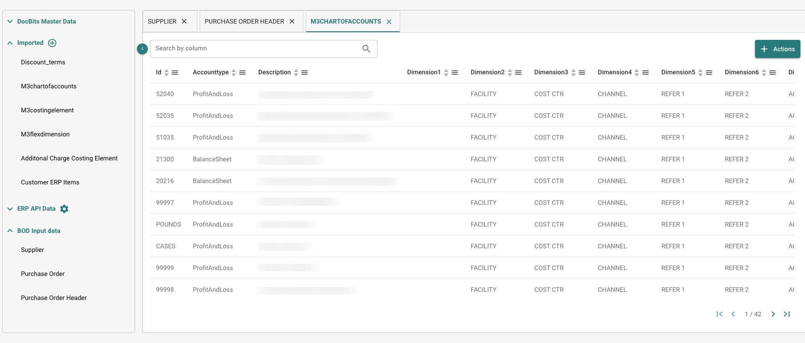

# Version

## Änderungen

Release Winter Frost – 22. Januar 2025\

### Neue Funktionen

#### Unterstützung für ZUGFeRD 2.1 und neuer

DocBits unterstützt nun vollständig die ZUGFeRD-Versionen 2.1 und höher, was eine nahtlose Handhabung und Verarbeitung elektronischer ZUGFeRD-konformer Rechnungen ermöglicht. Die Integration stellt Folgendes sicher:

* **Kompatibilität:** DocBits kann ZUGFeRD-Rechnungen sowohl in ihrer strukturierten (XML) als auch unstrukturierten (PDF) Form verwalten und erfüllt dabei EU-Standards wie EN 16931 für E-Rechnungen.
* **Effizienz:** Benutzer können ZUGFeRD-E-Rechnungen mühelos importieren, validieren und Daten extrahieren. Dadurch werden manuelle Dateneingaben minimiert und die Bearbeitungszeit verkürzt.
* **Flexibilität:** Egal ob Basis-, Komfort- oder Extended-Profil innerhalb des ZUGFeRD-Standards – DocBits bietet die passenden Werkzeuge für jede Komplexitätsstufe von Rechnungen.
* **Zukunftssicherheit:** Durch die Unterstützung neuerer ZUGFeRD-Versionen bleibt DocBits stets konform mit den sich ändernden E-Rechnungsrichtlinien in den EU-Mitgliedstaaten und darüber hinaus.

### Externe API-Integration zur verbesserten Dokumentenverarbeitung

DocBits bietet nun die Möglichkeit, externe APIs bei der Dokumentenverarbeitung einzubinden, um Vollständigkeit und Genauigkeit der extrahierten Daten zu erhöhen. Diese Erweiterung reduziert den manuellen Aufwand erheblich, indem fehlende Felder in Echtzeit mit aktuellen Informationen aus vertrauenswürdigen Quellen gefüllt werden. So können Dokumente schneller und konsistenter verarbeitet werden.

### Cross Sub-Organisations Access (Zugriff auf mehrere Unterorganisationen)

Für Organisationen, die mit mehreren Unterorganisationen arbeiten, führt DocBits eine neue Funktion namens Cross Sub-Organisations ein. Damit können Administratoren die Dokumentenverwaltung für alle Unterorganisationen unter einem Dach vereinheitlichen.

* &#x20;Admin-Benutzer können Dokumente aus allen Unterorganisationen einsehen, ohne zwischen ihnen wechseln zu müssen.
* Diese zentrale Sicht erlaubt es Administratoren, alle Dokumente zugleich zu überblicken und schnell zu finden, was sie benötigen.

<figure><figcaption></figcaption></figure>

### Dokumentensichtbarkeit basierend auf Gruppenberechtigungen

DocBits erweitert die Steuerung der Dokumentensichtbarkeit, um den Zugriff für Nicht-Admin-Benutzer präziser zu regeln. Dank gruppenbasierter Berechtigungen können Administratoren festlegen, welche Dokumente für welche Benutzer bzw. Gruppen sichtbar sind.

• Admin-Benutzer können Dokumente bestimmten Gruppen zuweisen.

• Nur Mitglieder der jeweiligen Gruppe sehen die zugeordneten Dokumente.

<figure><figcaption></figcaption></figure>

### Sequentieller Workflow und Freigabehistorie 

Mit der neuen Funktion Sequentieller Workflow und Freigabehistorie steigert DocBits die Effizienz bei der Dokumentenverarbeitung und fördert die Nachverfolgbarkeit von Aktionen.

#### Sequentielle Workflow-Steuerung:

* &#x20;Dokumente können in einer festgelegten Reihenfolge an mehrere Benutzer zur Prüfung oder Freigabe übergeben werden.
* &#x20;Jeder beteiligte Benutzer erhält eine Benachrichtigung, sobald er an der Reihe ist, was Missverständnisse und Verzögerungen reduziert.
* Workflows lassen sich individuell an die Geschäftsprozesse anpassen.\

Dadurch erhalten Benutzer nur die für ihre Aufgaben relevanten Dokumente, was für einen fokussierten und sicheren Workflow sorgt.

#### Freigabehistorie:

* Ein vollständiges Protokoll aller Aktionen steht in den Ansichten „Validierung“ und „Freigabe“ zur Verfügung.
  * Es enthält Benutzeraktionen (z. B. „freigegeben“, „abgelehnt“)
  * Zeitstempel&#x20;
  * Kommentare/Notizen.
* Die Historie erhöht die Transparenz und dient als Prüfpfad für Compliance und Fehlersuche.

<figure><figcaption></figcaption></figure>

#### SFTP/FTP-Dokumentenarchiv-Erweiterung

Diese Neuerung baut auf der bestehenden Importfunktionalität von DocBits auf und bietet eine unkomplizierte Methode, Dateien nach ihrer Verarbeitung zu archivieren.

• Eine neue Einstellung in der FTP-Importkonfiguration ermöglicht es, das Archivieren von Dateien zu aktivieren oder zu deaktivieren.

• Nach erfolgreicher Verarbeitung werden die Dateien automatisch in einem definierten Ordner auf dem SFTP/FTP-Server abgelegt (falls die Option aktiviert ist).

So bleiben verarbeitete Dateien archiviert, ohne die aktiven Importverzeichnisse zu überfüllen.

Mehrere Steuerbereiche für Steuertypen und Export zu Infor LN

Mit dieser Funktion erweitert DocBits die Handhabung von Steuerinformationen, indem sie detaillierte Klassifizierung und den Export der Daten an Infor LN ermöglicht (z. B. volle Steuer, reduzierte Steuer, steuerfrei). Dies unterstützt komplexe Steuerstrukturen und verbessert die Integration in Buchhaltungssysteme.

\

<figure><figcaption></figcaption></figure>

### Mehrfache Steuerbereiche pro Steuertyp:

* DocBits unterstützt jetzt mehrere Steuerbereiche unter jedem Steuertyp wie:
  * Voller Steuersatz (z. B. Standard-Mehrwertsteuer).
  * Reduzierter Steuersatz (z. B. für bestimmte Güter oder Dienstleistungen).
  * Steuerfrei (z. B. Ausnahmen für bestimmte Transaktionen).
* &#x20;Diese Unterteilung ermöglicht eine präzise Kategorisierung von Steuerbeträgen und gewährleistet die Einhaltung von Vorschriften und Buchhaltungsstandards.

#### Dynamische Auto-Accounting-Integration:

* Die relevanten Steuerbereiche werden auf dem Auto-Accounting-Bildschirm automatisch anhand der während der Dokumentenverarbeitung extrahierten Daten angezeigt.
* Benutzer können Steuerbuchungen ohne manuelle Nachberechnung oder erneute Eingabe schnell validieren und anpassen.

#### Export zu Infor LN:

* Steuerdaten einschließlich aller relevanten Bereiche und Klassifizierungen werden nahtlos an Infor LN exportiert, um die Konsistenz zwischen DocBits und dem ERP-System sicherzustellen.
* Exportierte Daten werden mit den entsprechenden Kostenzeilen in Infor LN verknüpft, was eine klare Nachverfolgbarkeit und genaue Finanzberichterstattung ermöglicht.

<figure><figcaption></figcaption></figure>

<figure><figcaption></figcaption></figure>

### Dashboard-Verbesserungen

DocBits hat wesentliche Aktualisierungen im Dashboard vorgenommen, die sich auf Benutzerfreundlichkeit, Effizienz und bessere Datenübersicht konzentrieren. Zu den Verbesserungen gehören ein neuer “Assigned To Group”-Filter und ein optimiertes UI für Dokumentenprotokolle (Document Logs), damit Benutzer einfacher interagieren und Dokumente verwalten können.

### PO Matching-Verbesserungen

Um den Prozess des Abgleichs von Bestellpositionen (PO) mit Rechnungen zu vereinfachen, hat DocBits zahlreiche Verbesserungen in der PO-Matching-Ansicht implementiert.

**Strg + Klick für einzelne Zeilenauswahl:**

* &#x20;Benutzer können mit gedrückter Strg-Taste auf spezifische Zeilen klicken, um mehrere, nicht zusammenhängende Zeilen auszuwählen.

**Shift + Klick für Bereichsauswahl:**

* Wird die Shift-Taste gedrückt gehalten, so kann über den Klick auf eine erste und eine letzte Zeile ein zusammenhängender Bereich ausgewählt werden.

**Automatische Erkennung veralteter Daten:**

* &#x20;Ist die zu einer Rechnung gehörige Bestellinformation veraltet (basierend auf den Systemeinstellungen), wird ein Symbol angezeigt, um den Benutzer darauf hinzuweisen. So erkennen Anwender schnell, ob es sich um veraltete Daten handelt, die eventuell nicht den neuesten Stand wiedergeben.

### Bug-Fixes

* Ein Problem wurde behoben, um sicherzustellen, dass bei den Auto-Accounting-Prozessen alle möglichen Werte korrekt angezeigt werden.
* &#x20;Das Benutzerinterface der Workflow-Logs wurde verbessert, um die Navigation und Bedienung intuitiver zu gestalten.
* Die Dokumentenfelder zeigen nun weitere Informationen wie erforderliche oder ausgeblendete Flags direkt in der Benutzeroberfläche an.
* Die Beschreibungen von Gruppen sind in den Gruppeneinstellungen nun sichtbar.
* Die Zeichenlängenbeschränkung für Gruppennamen wird beim Erstellen angezeigt, um Fehler zu vermeiden.
* Probleme mit der Testfunktion im Entscheidungsbaum und Übersetzungsinkonsistenzen wurden beseitigt.
* Die Suchfunktion in den Workflow-Logs wurde verbessert, um präzisere und effektivere Ergebnisse zu liefern.
* Ein Fehler wurde behoben, der verhinderte, dass Benutzer versehentlich E-Dokument-Entwürfe löschen konnten.
* Verschiedene Fehler im E-Mail-Importprozess wurden korrigiert, um eine reibungslose Integration und Datenverarbeitung zu gewährleisten.
* Probleme beim Speichern von KI-generierten Tags wurden behoben, sodass die Daten konsistent erhalten bleiben.
* Ein Sortierfehler, der beim Seitenwechsel im Dashboard auftrat, wurde behoben.
* Der Dokumentenzähler zeigt nun korrekt die Anzahl der von DocBits verarbeiteten Dokumente an.
* Verbesserte Übersetzungen in der gesamten Anwendung steigern die Benutzerfreundlichkeit in verschiedenen Sprachen.

## Release Hot Fix Feast 17. Dezember 2024

DocBits-Verbesserungen:

Erweiterungen beim E-Mail-Import

Benutzer können jetzt XML- und EDI-Dateien nahtlos über die E-Mail-Importfunktion importieren.

Release Hot Fix Feast 27. November 2024

### DocBits-Verbesserungen:

• Erweiterte PO-Optimierung

• Optimierter Speichervorgang: Der Speichervorgang findet jetzt nur statt, nachdem der Benutzer den Abgleich abgeschlossen hat, um redundante Speicherungen zu reduzieren und die Effizienz zu steigern.

• Erweiterter asynchroner Export

Die Exportfunktionalität wird nun asynchron ausgeführt, was für reibungslosere Abläufe und ein insgesamt verbessertes Benutzererlebnis sorgt.

\

#### Workflow-Verbesserungen

Die Workflow-Funktionalität wurde aktualisiert, um ein besseres Nutzererlebnis zu bieten:

• Verbesserte Protokolle: Die Workflow-Protokolle verfügen jetzt über eine übersichtlichere und intuitivere Oberfläche, die das Überprüfen und Verstehen von Prozessdetails erleichtert.

• Optimierte Reaktionsfähigkeit: Die Workflow-Ausführungsprozesse wurden für schnellere und zuverlässigere Performance optimiert, um Aufgaben zügiger abzuschließen und Verzögerungen zu minimieren.

#### Verbessertes Anwendungs-Caching

Wir haben erweiterte Caching-Strategien im gesamten System implementiert, um Daten schneller abzurufen und Ladezeiten zu verkürzen. Diese Verbesserungen sorgen für eine flüssigere Navigation und ein noch reaktionsschnelleres Benutzererlebnis, insbesondere bei häufig genutzten Funktionen.

#### Dashboard- und UI-Upgrades

• Dashboard-Verbesserungen: Das Dashboard wurde mit einem optimierten Layout und zusätzlichen Funktionen überarbeitet, um die Navigation zu vereinfachen und die Sichtbarkeit wichtiger Kennzahlen zu erhöhen.

• UI-Verbesserungen: Die Benutzeroberfläche der gesamten Anwendung wurde moderner und intuitiver gestaltet, sodass Benutzer ihre Aufgaben mit minimalem Aufwand erledigen können.

### Fehlerbehebungen:

• Die Fuzzy-Logik wurde optimiert, um eine genauere und zuverlässigere Datenbefüllung nach der Extraktion zu gewährleisten.

• Bekannte Probleme im Zusammenhang mit Gruppen und Berechtigungen wurden behoben, was ein reibungsloses Zugriffsmanagement und eine funktionierende Rollenzuweisung sicherstellt.

• Inkonsistenzen in Übersetzungen wurden beseitigt, sodass die Anwendung klarer und lokalisierter ist.

• Layout-Probleme wurden behoben, um eine konsistente und optimierte Benutzeroberfläche in allen Konfigurationen zu gewährleisten.

• Fehler in der Stammdatensuche wurden korrigiert, was eine genaue und zuverlässige Datenabfrage sicherstellt.

• Störungen bei der E-Mail-Import-Funktion in allen verfügbaren Optionen wurden behoben, um einen fehlerfreien Betrieb zu ermöglichen.

## Änderungen vom  4. November 2024

## Neue Funktionen:

## Verbesserungen beim E-Mail-Import

IMAP-E-Mail-Einstellungen wurden so konfiguriert, um Benachrichtigungen über Importergebnisse automatisch zu senden. Erfolgreiche Importbenachrichtigungen bestätigen die erfolgreiche Verarbeitung von Dateien, während Fehlermeldungen die Dateinamen und spezifische Fehlerdetails für eine schnelle Fehlersuche enthalten.

<figure><figcaption></figcaption></figure>

## Überarbeitung der Stammdatenabfrage

Die Einstellungen zur Stammdatenabfrage wurden überarbeitet und verfeinert, um eine schnellere und genauere Abfrage verschiedener Stammdatentypen zu ermöglichen. Diese Verbesserung optimiert den Datenzugriff, indem Stammdaten in unterschiedliche Kategorien organisiert werden, was die Sucheffizienz und -genauigkeit erheblich steigert. Benutzer können nun die relevanten Daten schneller finden, was die Produktivität in der Anwendung verbessert.

<figure><figcaption></figcaption></figure>

## Leistungsverbesserungen

Ein robustes Caching-System wurde implementiert, um die Anwendungsleistung erheblich zu steigern, insbesondere bei hohen Anfragen. Diese Verbesserung reduziert die Serververarbeitungszeit, indem häufig abgerufene Daten vorübergehend gespeichert werden, was schnellere Antwortzeiten und ein reibungsloseres Benutzererlebnis ermöglicht. Das neue Caching-System verwaltet den erhöhten Datenverkehr effizient und sorgt für zuverlässige und konstante Leistung, selbst in Spitzenlastzeiten.

## Verbesserung der Dokumentensperrfunktion

Die Funktionalität zum Sperren von Dokumenten wurde verbessert, um gleichzeitige Bearbeitung zu verhindern, die Datenintegrität zu gewährleisten und Konflikte zu minimieren. Dokumente werden nun während der aktiven Bearbeitung automatisch gesperrt, wobei den Benutzern klare Hinweise gegeben werden, wenn ein Dokument in Verwendung ist, und andere daran gehindert werden, Änderungen vorzunehmen, bis die Bearbeitung abgeschlossen ist. Diese Verbesserung optimiert die kollaborativen Arbeitsabläufe und verringert das Risiko von Datenüberschreibungen.

## Verbesserungen bei Navigation und Benutzererfahrung

* **Breadcrumb-Navigation**: Breadcrumbs wurden auf den Seiten der Anwendung hinzugefügt, um die Navigation zu verbessern, sodass Benutzer leicht zurückverfolgen und zu vorherigen Abschnitten zurückkehren können. Dies ermöglicht ein intuitiveres Surferlebnis.
* **Optimierte Benutzeroberfläche**: Die Pop-up-Benachrichtigung "neue Version" wurde entfernt, um einen reibungsloseren, ununterbrochenen Arbeitsablauf zu schaffen. Ablenkungen werden reduziert und die allgemeine Benutzerfreundlichkeit verbessert.

## Fehlerbehebungen:

* Benutzerbezogene Probleme, wie z.B. Anhangsfehler von verschlüsselten oder signierten E-Mails, wurden behoben.
* Probleme mit der Kartenanzeige und dem Ablauf wurden behoben.
* Routing-Probleme mit den Schaltflächen "Nächste/Vorherige" wurden behoben.
* Fehler im Zusammenhang mit Entscheidungstabellen wurden behoben.
* Die Benutzeroberfläche für das Passwortfeld wurde überarbeitet, um die Benutzerfreundlichkeit zu verbessern.
* Probleme mit nicht korrekt angezeigten Aufgabenzähler wurden behoben
* Benutzeroberflächenproblem mit der KI-Tabelle wurde behoben.
* Fehler bei der Dokumentenextraktion während des Tabellentrainings wurden behoben.
* Warnung wurde hinzugefügt, wenn ein PO während der Umformatierung übereinstimmt. Es wird sichergestellt, dass übereinstimmende Zeilen entfernt werden.
* Das Datumsformat wurde korrigiert, um sicherzustellen, dass Daten korrekt nach Tages- und Wochenfiltern geladen, und Dokumenttypen ordnungsgemäß angezeigt werden.
* Die Anzeige von Dokumenten auf Dual-Monitoren wurde korrigiert.
* Problem, bei dem das Trennen einer PO-Zeile alle Zeilen entfernt hat, wurde behoben.
* Falsche Übersetzungen in der gesamten Anwendung wurden behoben.
* Problem, bei dem lange Beschreibungen im Regelmanagement Scrollen in der Liste verursachte, wurde behoben.
* Fehlende "Zuweisen"-Funktionalität für Nicht-Admin-Benutzer wurde wiederhergestellt.
